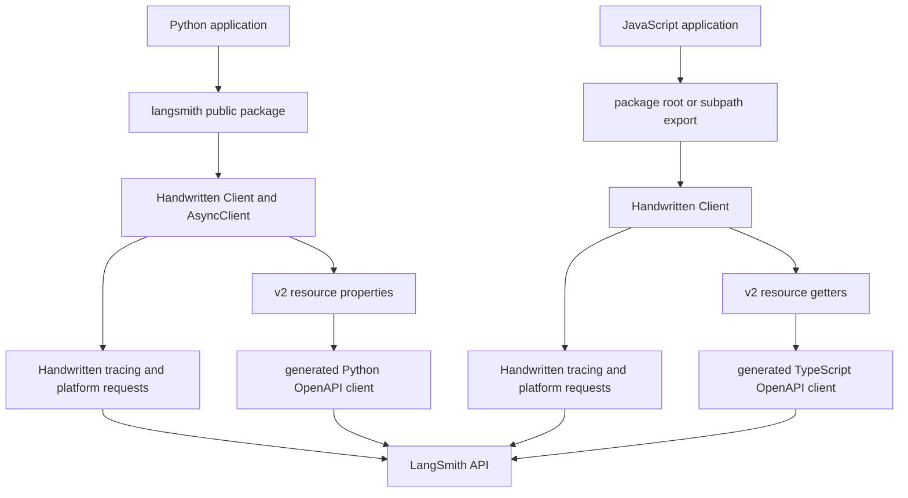

# Dual-SDK Architecture and Public Surfaces

The repository ships two implementations of the same product-facing SDK: the Python `langsmith` package and the JavaScript/TypeScript `langsmith` package. They target the same LangSmith platform concepts—traces and runs, datasets, evaluation, prompt caching, provider wrappers, and sandboxes—but they are independent runtime implementations rather than bindings over a shared library. Each owns its version in its package facade or manifest, and separate release workflows publish Python when `python/langsmith/__init__.py` changes and JavaScript when `js/package.json` changes; release bumps therefore belong in separate PRs.

Treat **capability parity as an architectural goal, not an exact API contract**. The matching `Client`, run-tree, schema, evaluation, wrapper, and generated resource families make the intended parallel clear. Naming, typing, lifecycle, packaging, and even sync/async behavior remain language-specific. A feature must therefore be checked in both implementations before documenting or changing it as “shared.”

## Layered shape

*The public clients preserve handwritten behavior while routing selected resource families through generated OpenAPI transports.*

The key maintenance boundary is absolute: **`python/langsmith/_openapi_client/` and `js/src/_openapi_client/` are generated by Stainless and must not be edited manually.** Their own entry files identify them as generated, and CI rejects changes unless they arrive from the authorized `sync/langsmith-api` automation. Handwritten compatibility, configuration adaptation, migration logic, and higher-level behavior belong outside those directories.

The checked-in `openapi/openapi.yaml` illustrates the contract style with `/runs` creation and `/runs/{run_id}` update operations and referenced request schemas. Operationally, however, generation is owned by the external spec-sync workflow described in `CONTRIBUTING.md`; do not assume that manually changing generated output is a valid way to change the SDK contract.

## The handwritten client is the composition root

Both languages keep mature handwritten clients because a platform SDK does more than serialize an OpenAPI operation. These clients own environment/profile configuration, authentication and workspace headers, retries and timeouts, tracing-specific preprocessing, batching, masking/anonymization, runtime metadata, and compatibility methods. Generated resources are mounted into that state rather than replacing it wholesale.

### TypeScript

`Client` is the single main client class. JavaScript network operations are promise-based, so there is no separate exported `AsyncClient`; methods such as `createRun` and `flush` are asynchronous on the same object. `createRun` also demonstrates why the handwritten layer remains: it applies sampling, defaults and preprocessing, chooses queued batch ingestion when trace ordering fields are present, and otherwise sends the legacy `/runs` request itself.

The generated client is created lazily by the private `openAPIClient` getter. The bridge:

- removes trailing `/api/v1` or `/api` from the configured API URL before supplying the generated base URL;
- supplies the SDK's API key, workspace/tenant ID, timeout, fetch implementation, fetch options, and merged default headers;
- fingerprints authentication and default headers, rebuilding the generated client when that snapshot changes; and
- exposes only selected generated resources through `Client` getters: `evaluators`, `runs`, `sandboxes`, `datasets`, `annotationQueues`, `threads`, `traces`, and `public`.

This rebuilding matters because the handwritten path computes headers per request while the generated client captures constructor defaults. Tests specifically protect forwarding custom headers, preventing custom values from overriding the API key, keeping the same SDK user agent on both paths, and picking up headers changed after construction.

Resource access also performs a backend compatibility check. Most generated families require backend `0.16.0`; annotation-queue items require `0.16.14`. The check is tied to access rather than package import, so merely installing the SDK does not probe the server.

### Python

Python intentionally has two public classes:

- `Client` is the feature-rich synchronous and tracing-oriented client. It owns a `requests.Session`, trace queues and buffering, masking/anonymization controls, optional multi-endpoint writes, OpenTelemetry state, and explicit `flush()`/`close()` behavior.
- `AsyncClient` owns an `httpx.AsyncClient`, asynchronous request/retry methods, async prompt-cache lifecycle, and `async with` support. Entering starts its cache; `aclose()` stops the cache and closes the handwritten HTTP client.

They are not mechanical mirrors. For example, `Client.__init__` accepts tracing batching, masking, OpenTelemetry, sampling, and buffering controls that are absent from the narrower `AsyncClient.__init__`. Conversely, async usage has its own context-manager lifecycle and nonblocking retry path. Preserve those differences unless a change deliberately establishes parity.

There is a second, easily missed distinction: the public v2 properties on **both** Python classes return generated **async** resources. `Client.runs`, for example, is typed as `AsyncRunsResource`, while internal migration paths that need blocking behavior use the private `_get_langsmith_api_sync()` and its generated synchronous client. Thus `Client`'s legacy handwritten methods are synchronous, but calls made through public generated resource properties must be awaited. `AsyncClient` naturally exposes the same async resource style.

`Client` lazily constructs both generated transports. If the caller supplied a `requests.Session`, selected portable settings—headers, cookies, TLS verification/certificates, proxies, and `trust_env`—are translated to an `httpx` wrapper; mounted adapters, `session.auth`, and hooks cannot be carried across. `AsyncClient` constructs its generated `AsyncLangsmith` during initialization using the resolved key, workspace, stripped OpenAPI base URL, timeout, and headers.

The version-check timing differs by runtime:

- `Client` checks the cached server version synchronously when a v2 property is accessed.
- `AsyncClient` cannot await from a property, so it schedules one background check per minimum version when an event loop is running and retains the task until completion.

Tests pin both behaviors and the warning threshold. This is an implementation difference, not a difference in the backend requirement.

## Public surfaces

### Python package root

`python/langsmith/__init__.py` is a curated, mostly lazy facade. `TYPE_CHECKING` imports provide static visibility, while module `__getattr__` imports expensive implementation modules only when names such as `Client`, `AsyncClient`, `RunTree`, tracing helpers, evaluators, caches, or testing helpers are requested. `__all__` records the supported root surface. Small metadata values are eager: the package version and `LS_MESSAGE_VIEW_EXCLUDE` are defined directly in the facade.

Generated exception classes are deliberately promoted through the lazy mechanism. Before return, their `__module__` is rewritten to `langsmith`, giving users stable root-level exception names even though implementation comes from `_openapi_client`. By contrast, generated clients, models, and resources remain internal implementation details; callers reach selected resources through `Client` and `AsyncClient` properties.

Python schemas are handwritten runtime models. They use Pydantic models for validation and conversion, plus `TypedDict`, protocols, enums, UUIDs, datetimes, and Python-specific attachment forms such as `bytes` and `Path`. They should not be assumed to be aliases of generated OpenAPI models.

### TypeScript package root and subpaths

`js/src/index.ts` deliberately exports a compact root: `Client` and its configuration/interface types, selected schema types, `RunTree`, focused fetch/project/tracing utilities, prompt-cache and UUID APIs, generated error classes, `__version__`, and `LS_MESSAGE_VIEW_EXCLUDE`. The metadata constant has the same value and purpose as the Python root constant: callers can mark a traced run to be hidden from LangSmith's Messages View. This is a verified point of root-level parity, not evidence that the roots are otherwise interchangeable.

Broader capabilities are reached through explicit package subpaths such as `langsmith/client`, `langsmith/traceable`, `langsmith/evaluation`, `langsmith/schemas`, provider wrappers, test-runner integrations, experimental OpenTelemetry modules, and `langsmith/sandbox`. These are public package boundaries even though they are absent from the curated root; generated `_openapi_client` modules are neither root exports nor package subpaths.

Those subpaths are assembled by `js/scripts/create-entrypoints.js`, not by hand-editing a set of wrapper files. The script is the source list for entrypoints; it generates ESM, CommonJS, and declaration shims and rewrites `package.json` `exports` and `files`. The build compiles ESM and CommonJS, then creates these entrypoints. Package exports provide separate `import`, `require`, and type declaration targets, while the `browser` map substitutes browser implementations for filesystem and worker-thread utilities.

TypeScript's handwritten schemas are structural compile-time interfaces and aliases. For example, attachments use `Uint8Array` or `ArrayBuffer`, and run IDs/timestamps are string/number-shaped. Unlike Python's Pydantic models, these declarations do not perform runtime validation. Generated request/response types live separately under `_openapi_client` and are not exported as package subpaths.

## Change rules and extension points

When extending a capability, decide which layer owns it:

1. **Cross-cutting SDK behavior**—tracing queues, masking, environment resolution, compatibility shims, evaluation orchestration, or runtime-specific integration—belongs in handwritten code.
2. **A generated endpoint/resource shape** belongs in the upstream OpenAPI/Stainless sync. Never patch either `_openapi_client` directory manually.
3. **Mounting a generated resource** requires a handwritten accessor plus correct base URL, auth/workspace, headers, timeout, and backend-version policy. Add focused tests for that bridge.
4. **A public import** requires deliberate facade work: update Python's lazy imports and `__all__`, or update the TypeScript entrypoint source list/root exports and regenerate package metadata.
5. **A parity claim** requires checking both implementations. Equivalent concepts may use `snake_case` versus `camelCase`, Pydantic models versus interfaces, separate sync/async classes versus promises, and runtime-native binary or transport types.

Failures at the boundary are intentionally visible through stable SDK errors and compatibility warnings. Generated resources apply their generated HTTP error hierarchy; both package roots expose that hierarchy in language-appropriate form. An older backend produces a migration warning at resource access, while malformed authentication, transport failures, timeouts, and endpoint responses continue through the configured client transport.

## Focused verification

For architecture changes, the highest-value checks are narrower than the full integration suite:

- Python `tests/unit_tests/test_client.py`: synchronous resource version checks, generated sync migration routing, and deprecation paths toward generated resources.
- Python `tests/unit_tests/test_async_client.py`: one-per-version background compatibility checks and async client lifecycle/request behavior.
- TypeScript `src/tests/client_headers.test.ts`: header/auth/user-agent consistency and generated-client rebuilding.
- TypeScript `src/tests/client.test.ts`: generated resource mounting and concrete annotation-queue URL/auth behavior.
- Python `tests/unit_tests/test_run_helpers.py` and TypeScript `src/tests/traceable.test.ts`: root import/value checks for `LS_MESSAGE_VIEW_EXCLUDE` and propagation through traced-run metadata.
- Package build/type checks: `pnpm build` validates dual-module entrypoint generation and declarations; Python lint and type configuration explicitly exclude or suppress generated-client diagnostics, reinforcing that fixes belong upstream.

See [Platform Client](/openwiki/concepts/platform-client.md) for user-facing client behavior, [Run Tree and Context](/openwiki/concepts/run-tree-and-context.md) for tracing composition, [Provider Wrappers and OpenTelemetry](/openwiki/integrations/provider-wrappers-and-opentelemetry.md) for integration boundaries, and [Development and Release](/openwiki/operations/development-and-release.md) for the generated sync and independent package release processes.
