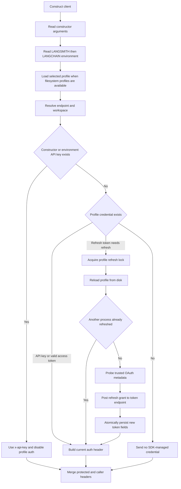

The Python `Client` and `AsyncClient`, and the JavaScript `Client`, turn several configuration channels into one API base URL, one workspace context, and one effective authentication mechanism. This layer is shared by the higher-level operations described in [Platform Client](./platform-client.md), while tracing and sandbox code build on the same endpoint and credential conventions.

## Resolution order

For the main endpoint and workspace, the effective order is:

1. Constructor argument: `api_url` / `apiUrl`, `workspace_id` / `workspaceId`.
2. `LANGSMITH_ENDPOINT` or `LANGSMITH_WORKSPACE_ID`.
3. The legacy `LANGCHAIN_ENDPOINT` or `LANGCHAIN_WORKSPACE_ID` alias.
4. The selected profile's `api_url` or `workspace_id`.
5. For the API URL only, `https://api.smith.langchain.com`.

The environment helper checks the `LANGSMITH_` namespace before `LANGCHAIN_`; blank environment values are ignored in Python, while JavaScript uses the first truthy value. Values are trimmed and outer quotes removed when the client stores them. Constructor values therefore provide the cleanest way to target a self-hosted deployment for one client without changing process-wide state. [Python resolution](repo://python/langsmith/client.py#L1261-L1287) [JavaScript resolution](repo://js/src/client.ts#L1376-L1401) [environment aliases](repo://js/src/utils/env.ts#L175-L195)

Authentication has an additional gate. An explicit constructor API key wins over an environment key, and either one disables **all profile-managed authentication**. The profile can still supply its endpoint and workspace in that case. Only when neither constructor nor environment supplies an API key does the selected profile provide authentication. A workspace ID is not itself a credential: it becomes `X-Tenant-Id` / `x-tenant-id`, and is required when the server reports that an organization-scoped key needs a workspace. [Python auth gate](repo://python/langsmith/client.py#L1263-L1327) [JavaScript auth gate](repo://js/src/client.ts#L1500-L1529) [workspace failure](repo://js/src/utils/error.ts#L147-L176)

There is one cross-language profile nuance worth preserving:

- Python profile auth prefers `api_key` over an OAuth access token when both are present.
- JavaScript profile auth prefers the OAuth access token over `api_key`.

This is profile-internal ordering only; explicit and environment API keys still win in both SDKs. [Python profile header selection](repo://python/langsmith/_internal/_profiles.py#L456-L467) [JavaScript profile header selection](repo://js/src/utils/profiles.ts#L485-L509)

*Configuration and authentication resolution, including the coordinated OAuth refresh path used before a request.*

## Profiles and OAuth lifecycle

Profiles live at `LANGSMITH_CONFIG_FILE` when set, otherwise `~/.langsmith/config.json`. `LANGSMITH_PROFILE` selects a named profile; absent that, the loader tries `current_profile`, then `default`. Missing files, malformed JSON, or missing profile entries are treated as “no profile” rather than construction failures. JavaScript deliberately skips profile filesystem access in browser and web-worker runtimes. [Python profile selection](repo://python/langsmith/_internal/_profiles.py#L71-L102) [JavaScript profile loading](repo://js/src/utils/profiles.ts#L52-L107)

A profile may contain `api_key`, `api_url`, `workspace_id`, and an `oauth` object with `access_token`, `refresh_token`, and `expires_at`. Refresh is attempted only when a refresh token exists and the access token is absent or expires within one minute. Missing or malformed expiry data does not by itself force refresh. Refresh is best effort: transport, discovery, lock, non-success response, malformed token response, and persistence failures leave the current profile credential in use rather than failing client construction. [refresh predicate](repo://python/langsmith/_internal/_profiles.py#L238-L264) [refresh implementation](repo://python/langsmith/_internal/_profiles.py#L421-L454)

Refresh coordination has two levels. A process-local lock or shared promise coalesces concurrent requests, and a filesystem lock serializes processes sharing the same config file. After taking the filesystem lock, the refresher reloads the profile and skips the network if another process already wrote a fresh token. Python uses `flock` on POSIX and an atomic directory lock elsewhere; JavaScript uses the atomic directory form. The fallback lock has stale-lock recovery and owner-checked release. Successful refresh updates only recognized token fields and writes the profile atomically; Python also applies restrictive file modes. [Python lock](repo://python/langsmith/_internal/_oauth_refresh_lock.py#L95-L160) [JavaScript lock](repo://js/src/utils/profile-lock.ts#L64-L118) [token persistence](repo://python/langsmith/_internal/_profiles.py#L297-L324)

### OAuth discovery security boundary

The SDK probes both SaaS-root and self-hosted `/api` issuer locations, including the RFC 8414 path-inserted well-known form. If discovery is unavailable, it falls back to `<normalized-profile-api-url>/oauth/token`; normalization strips `/api/v1` but deliberately retains `/api` because self-hosted authorization servers may be mounted there.

**Discovery metadata is trusted only when its `issuer` exactly matches the issuer base that was probed, ignoring trailing slashes, and both the device and token endpoints have the issuer's scheme and host.** A mismatched issuer, off-origin endpoint, HTML SPA response, invalid JSON, or failed request is ignored. This is a credential-exfiltration boundary: a refresh token must never be posted to a location merely advertised by an untrusted document. [Python validation and discovery](repo://python/langsmith/_internal/_profiles.py#L141-L235) [JavaScript validation and discovery](repo://js/src/utils/profiles.ts#L152-L282) [focused rejection tests](repo://python/tests/unit_tests/test_profiles_oauth_discovery.py#L115-L160)

Refresh always uses the profile's `api_url`, not a constructor endpoint override. This keeps the refresh token bound to the deployment that issued the profile even when API traffic from that client is temporarily redirected. [JavaScript behavior test](repo://js/src/tests/client.test.ts#L785-L842)

## Endpoint composition and self-hosting

The configured API URL is a base, not a promise that it is a bare origin. It may already end in `/api` or `/api/v1`. The generated OpenAPI clients remove an existing `/api` or `/api/v1` suffix before applying their generated `/api/v1/...` routes. Handwritten platform calls use `_getPlatformEndpointPath` in JavaScript and `_platform_path` in Python; those helpers omit another `/v1` when the configured base already ends in `/v1`. [JavaScript base normalization and helper](repo://js/src/client.ts#L1693-L1699) [JavaScript platform helper](repo://js/src/client.ts#L1745-L1750) [Python platform helper](repo://python/langsmith/client.py#L11775-L11787)

> **Repository invariant:** never hardcode a leading `/v1` when adding a platform operation. Use the platform path helper (or the generated resource route). A self-hosted endpoint such as `https://host/api/v1` would otherwise become an invalid doubled path such as `/api/v1/v1/platform/...`.

A trailing slash is removed from the configured API URL. The optional web-app URL is separate; when absent, each SDK infers it from localhost, known hosted regions, or API suffixes. Supply `web_url` / `webUrl` explicitly when a self-hosted API and UI do not follow those conventions. [JavaScript URL normalization and inference](repo://js/src/client.ts#L1379-L1392) [JavaScript host inference](repo://js/src/client.ts#L1532-L1565)

## Header ownership and request overrides

Client-wide `headers` carry proxy, tenant-routing, or observability metadata. JavaScript also accepts `fetchOptions.headers`; collisions are case-insensitive and that channel wins over `config.headers`. In both languages, client-level custom headers are merged *under* SDK-required authentication and workspace headers, so they cannot replace a configured `x-api-key` or tenant ID. Changing the `headers` property recomputes or rebuilds request state; JavaScript additionally detects mutation through the getter before generated-client calls. [JavaScript header merge](repo://js/src/client.ts#L1568-L1721) [Python header merge](repo://python/langsmith/client.py#L1822-L1880)

Per-request headers are intentionally more flexible. Python's handwritten request path merges `request_kwargs.headers` and direct `headers` after client defaults, then asks profile auth to remove stale profile-managed values. A truly explicit `Authorization` or `x-api-key` survives profile refresh. JavaScript's fetch wrapper likewise does not refresh over an explicit request auth header when no constructor or environment key is configured. Conversely, a configured client API key remains SDK-owned: JavaScript removes `Authorization` and supplies that key. This makes per-request auth useful for delegation, but only when client-level API-key authentication was not selected. [Python request merge](repo://python/langsmith/client.py#L1945-L1998) [Python profile override handling](repo://python/langsmith/_internal/_profiles.py#L368-L381) [JavaScript request auth handling](repo://js/src/client.ts#L1116-L1240)

Malformed JavaScript header names fail eagerly at construction or assignment. Focused tests also verify that required auth and workspace headers survive custom header channels and that generated and handwritten paths agree. [JavaScript header tests](repo://js/src/tests/client_headers.test.ts#L34-L108) [Python header tests](repo://python/tests/unit_tests/test_custom_headers.py#L20-L78)

## Retries, timeouts, and failures

JavaScript routes calls through `AsyncCaller`. The ordinary caller fixes `maxRetries` at four; for the trace-ingest caller, `callerOptions` is spread after that default and can override it. Retryable statuses are `408`, `425`, `429`, `500`, `502`, `503`, and `504`, with randomized exponential backoff. Cancellation and timeout/abort errors are not retried, nor are ordinary non-retryable HTTP statuses. The trace-ingest caller also applies its rate-limit hook and concurrency or queue-byte limits. [client caller setup](repo://js/src/client.ts#L1396-L1433) [retry policy](repo://js/src/utils/async_caller.ts#L5-L13) [retry control flow](repo://js/src/utils/async_caller.ts#L119-L206)

Python's synchronous client mounts a urllib3 retry policy with three retries, the same status force-list, `Retry-After` support, and all HTTP methods on compatible urllib3 versions. Individual handwritten operations also control `stop_after_attempt` and exception retry classes. `AsyncClient` defaults to three configured attempts and retries connection, timeout, and server API errors, with selected call sites able to add exception types. Timeouts are independently configurable: Python sync accepts one value or connect/read values, Python async accepts one value or the httpx timeout tuple, and JavaScript uses `timeout_ms` with a 90-second default. [Python adapter policy](repo://python/langsmith/client.py#L664-L693) [Python sync request retries](repo://python/langsmith/client.py#L1945-L2017) [Python async retries](repo://python/langsmith/async_client.py#L450-L507)

Operationally, distinguish authentication failures from retryable availability failures. A `401` is an auth error; an organization-scoped-key `403` gives the workspace-ID remediation; `400`, `404`, and conflicts are not generic transient failures. JavaScript tests specifically establish retry on `408` and `429`, but no retry for an actual fetch timeout or `400`. [JavaScript retry tests](repo://js/src/tests/client_retry.test.ts#L76-L160)

## Runtime constraints and safe configuration

- Browser and web-worker JavaScript clients cannot discover local profiles: pass `apiUrl`, credentials, workspace, and any custom `fetchImplementation` explicitly. Environment access is guarded because `process` may be absent and some Deno configurations throw on environment reads. [runtime detection](repo://js/src/utils/env.ts#L5-L50) [guarded environment reads](repo://js/src/utils/env.ts#L175-L185)
- Browser bundles replace filesystem support with safe no-op stubs, reinforcing that profile refresh and on-disk token persistence are server/runtime features, not browser credential storage. [browser filesystem shim](repo://js/src/utils/fs.browser.ts#L1-L66)
- Do not embed long-lived API keys or refresh tokens in browser-delivered code. If a browser must call directly, provide a narrowly scoped explicit token/header and enforce endpoint CORS and server-side authorization.
- A custom Python `requests.Session` affects handwritten v1 calls. Generated v2 calls translate selected session settings but cannot carry custom mounted adapters, `session.auth`, or hooks; treat the generated client as a distinct transport boundary. [Python session boundary](repo://python/langsmith/client.py#L1083-L1091)
