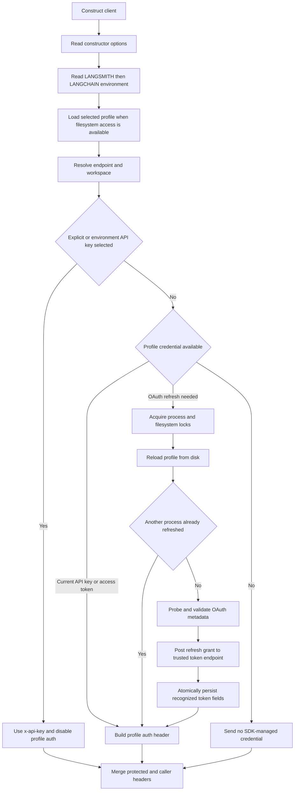

The Python `Client` and `AsyncClient`, and the JavaScript `Client`, collapse constructor options, environment variables, and an optional local profile into an API base URL, workspace context, and effective authentication mechanism. Higher-level platform operations use this state, while tracing and sandbox code follow the same endpoint and credential conventions. See also [Platform Client](./platform-client.md).

## Configuration resolution

For the main endpoint and workspace, both SDKs use this order:

1. Constructor argument: `api_url` / `apiUrl` or `workspace_id` / `workspaceId`.
2. `LANGSMITH_ENDPOINT` or `LANGSMITH_WORKSPACE_ID`.
3. The legacy `LANGCHAIN_ENDPOINT` or `LANGCHAIN_WORKSPACE_ID` alias.
4. The selected profile's `api_url` or `workspace_id`.
5. For the API URL only, `https://api.smith.langchain.com`.

The environment helpers check `LANGSMITH_` before `LANGCHAIN_`. Python ignores blank environment values; JavaScript selects the first truthy environment value. Both trim stored values and remove surrounding quotes. Constructor selection is based on whether an argument is nullish (`undefined` in JavaScript, `None` in Python), not whether it is non-empty. Consequently, an explicitly empty constructor credential can suppress a non-empty environment credential and then normalize to no credential; do not use blank values to mean “unset.” [JavaScript constructor and defaults](repo://js/src/client.ts#L1377-L1402) [JavaScript default resolution](repo://js/src/client.ts#L1506-L1542) [environment aliases](repo://js/src/utils/env.ts#L175-L195) [Python resolution](repo://python/langsmith/client.py#L1278-L1302)

Authentication adds a gate:

- A non-empty constructor API key overrides an environment key.
- A constructor or environment API key disables profile-managed authentication, but does **not** prevent the profile from supplying endpoint and workspace configuration.
- Only when neither explicit nor environment authentication is selected can the profile supply its API key or OAuth credentials.
- A workspace ID is routing context, not a credential. It is emitted as `X-Tenant-Id` / `x-tenant-id`. The JavaScript error path gives specific remediation when a `403` reports `org_scoped_key_requires_workspace`.

JavaScript deliberately keeps a profile API key inside `ProfileAuth` rather than copying it to `client.apiKey`; this lets request-time profile state and OAuth refresh remain profile-managed. Tests therefore expect `client.apiKey` to be `undefined` even when requests carry the profile's `x-api-key`. [JavaScript auth gate](repo://js/src/client.ts#L1386-L1389) [JavaScript profile default](repo://js/src/client.ts#L1506-L1542) [profile-key behavior test](repo://js/src/tests/client.test.ts#L575-L596) [Python auth gate](repo://python/langsmith/client.py#L1281-L1330) [workspace failure](repo://js/src/utils/error.ts#L154-L167)

Profile-internal credential ordering differs by language:

- Python prefers profile `api_key` over an OAuth access token and does not refresh OAuth while that API key is available.
- JavaScript prefers a profile OAuth access token over `api_key`; if only a refresh token is currently usable, it refreshes before falling back to the profile API key.

Explicit and environment API keys still take precedence over the whole profile mechanism in both SDKs. [Python profile selection](repo://python/langsmith/_internal/_profiles.py#L248-L264) [Python profile headers](repo://python/langsmith/_internal/_profiles.py#L456-L467) [JavaScript profile headers](repo://js/src/utils/profiles.ts#L485-L509)

*Configuration and authentication resolution, including coordinated OAuth refresh before a request.*

## Profiles and OAuth lifecycle

Profiles are read from `LANGSMITH_CONFIG_FILE` when set, otherwise `~/.langsmith/config.json`. `LANGSMITH_PROFILE` selects a named profile; absent that, selection falls back to `current_profile`, then `default`. Missing files, malformed JSON, missing profile maps, and missing selected entries are treated as no profile rather than construction failures. JavaScript skips profile filesystem access in browser and web-worker runtimes. [Python loading](repo://python/langsmith/_internal/_profiles.py#L71-L129) [JavaScript loading](repo://js/src/utils/profiles.ts#L52-L107)

A profile may contain `api_key`, `api_url`, `workspace_id`, and an `oauth` object with `access_token`, `refresh_token`, and `expires_at`. With the Python API-key exception described above, refresh is needed only when a refresh token exists and the access token is absent or expires within one minute. Missing or malformed expiry data does not itself force refresh. Refresh is lazy: construction snapshots the current header, and the request path checks whether refresh is needed. [Python refresh predicate](repo://python/langsmith/_internal/_profiles.py#L238-L264) [Python request trigger](repo://python/langsmith/client.py#L1865-L1873) [JavaScript refresh predicate](repo://js/src/utils/profiles.ts#L117-L133) [JavaScript request trigger](repo://js/src/client.ts#L1117-L1142)

Refresh is best effort. Discovery, transport, lock acquisition, non-success responses, malformed token responses, or persistence failures leave the available profile credential in use rather than failing client construction. A per-profile process lock (`threading.Lock` in Python, a shared refresh promise in JavaScript) coalesces concurrent requests. A filesystem lock serializes processes sharing a config file. Once locked, the refresher reloads the profile and skips the network if another process has already written a fresh token. [Python refresh](repo://python/langsmith/_internal/_profiles.py#L388-L454) [JavaScript refresh](repo://js/src/utils/profiles.ts#L378-L475)

Python uses `flock` on POSIX and an atomic directory lock elsewhere; JavaScript uses the atomic directory form. The directory fallback breaks stale locks and releases only locks owned by the releaser. A successful refresh updates only recognized token fields and atomically rewrites the profile. Python creates restrictive directories and applies mode `0600` to token-bearing files. [Python lock](repo://python/langsmith/_internal/_oauth_refresh_lock.py#L95-L160) [JavaScript lock](repo://js/src/utils/profile-lock.ts#L64-L118) [Python persistence](repo://python/langsmith/_internal/_profiles.py#L297-L324) [JavaScript persistence](repo://js/src/utils/profiles.ts#L455-L469)

### OAuth discovery security boundary

The SDK probes the configured mount, self-hosted `/api`, and origin issuer locations, including the RFC 8414 path-inserted well-known form. If no usable metadata is available, it falls back to `<normalized-profile-api-url>/oauth/token`. Normalization strips `/api/v1` but deliberately retains `/api`, because a self-hosted authorization server may be mounted there.

**Metadata is trusted only when its `issuer` exactly matches the issuer base that was probed, ignoring trailing slashes, and both the device and token endpoints have the issuer's scheme and host.** A mismatched issuer, off-origin endpoint, HTML SPA response, invalid JSON, or failed request is ignored. This is a credential-exfiltration boundary: never relax validation so a refresh token can be posted to an endpoint merely advertised by an untrusted document. [Python validation and discovery](repo://python/langsmith/_internal/_profiles.py#L141-L235) [JavaScript validation and discovery](repo://js/src/utils/profiles.ts#L152-L282) [Python rejection tests](repo://python/tests/unit_tests/test_profiles_oauth_discovery.py#L115-L160) [JavaScript rejection tests](repo://js/src/tests/profile-oauth-discovery.test.ts#L119-L179)

Refresh always derives its destination from the profile's own `api_url`, not a constructor endpoint override. This binds the refresh token to the deployment that issued the profile even when API traffic for one client is redirected. [Python behavior test](repo://python/tests/unit_tests/test_client.py#L621-L678) [JavaScript behavior test](repo://js/src/tests/client.test.ts#L817-L870)

## Endpoint composition and self-hosting

The configured endpoint is a base and may already end in `/api` or `/api/v1`. Generated OpenAPI clients remove either suffix before applying generated routes. Handwritten platform calls use `_getPlatformEndpointPath` in JavaScript and `_platform_path` in Python; each omits another `/v1` when the configured base already ends in `/v1`. [JavaScript generated base](repo://js/src/client.ts#L1706-L1711) [JavaScript platform helper](repo://js/src/client.ts#L1758-L1762) [Python generated base](repo://python/langsmith/client.py#L169-L175) [Python platform helper](repo://python/langsmith/client.py#L11818-L11823)

> **Repository invariant:** do not hardcode a leading `/v1` when adding a handwritten platform operation. Use the platform path helper or a generated resource route. Otherwise a self-hosted base such as `https://host/api/v1` can become an invalid doubled path.

Clients remove a trailing slash from the API base. The web-app URL is separate; when omitted, each SDK infers it from localhost, known hosted regions, or API suffixes. Supply `web_url` / `webUrl` explicitly when a self-hosted API and UI do not follow those conventions. [JavaScript normalization and inference](repo://js/src/client.ts#L1381-L1392) [JavaScript host inference](repo://js/src/client.ts#L1545-L1577) [Python URL normalization](repo://python/langsmith/utils.py#L835-L846)

## Header ownership and overrides

Client-wide `headers` carry proxy, routing, or observability metadata. JavaScript also accepts `fetchOptions.headers`; collisions are case-insensitive and `fetchOptions.headers` wins. Both SDKs merge client custom headers beneath SDK-owned authentication and workspace headers, so they cannot replace a configured API key or tenant ID. JavaScript validates header names and values eagerly, recomputes handwritten headers per request, and rebuilds its generated client whenever effective headers or profile auth change. [JavaScript merge](repo://js/src/client.ts#L832-L908) [JavaScript ownership and rebuild](repo://js/src/client.ts#L1581-L1734) [Python merge](repo://python/langsmith/client.py#L1842-L1900) [focused JavaScript tests](repo://js/src/tests/client_headers.test.ts#L34-L108)

Per-request headers are intentionally more flexible. Python's handwritten request path merges `request_kwargs.headers` and direct `headers` after client defaults, then asks profile auth to remove stale profile-managed values. A genuinely explicit `Authorization` or `x-api-key` survives profile refresh. JavaScript likewise avoids refreshing over an explicit request credential when no constructor or environment key is configured. Conversely, a configured JavaScript API key remains SDK-owned: it removes `Authorization` and supplies the configured key. Delegated per-request authentication is therefore supported only when client-level API-key authentication was not selected. [Python request merge](repo://python/langsmith/client.py#L2004-L2018) [Python profile override handling](repo://python/langsmith/_internal/_profiles.py#L368-L381) [JavaScript request auth](repo://js/src/client.ts#L1117-L1300)

## Retries, timeouts, and failures

JavaScript routes calls through `AsyncCaller`, whose retryable statuses are `408`, `425`, `429`, `500`, `502`, `503`, and `504`. It uses randomized exponential backoff, rejects an ordinary non-retryable HTTP status immediately, and does not retry cancellation or timeout/abort errors. A standalone `AsyncCaller` defaults to six retries, but client construction deliberately changes this:

- The ordinary caller spreads `callerOptions` **before** `maxRetries: 4`, so four retries are enforced even if `callerOptions.maxRetries` is supplied.
- The trace-ingest caller sets `maxRetries: 4`, concurrency, and queue-byte defaults **before** spreading `callerOptions`, so those caller options can override the batch defaults. Its rate-limit hook and final `debug` setting remain enforced because they are assigned after the spread.

This asymmetric spread order is intentional behavior to preserve when changing constructor configuration. [caller construction](repo://js/src/client.ts#L1397-L1402) [trace-ingest caller construction](repo://js/src/client.ts#L1429-L1439) [retry policy](repo://js/src/utils/async_caller.ts#L5-L13) [retry flow](repo://js/src/utils/async_caller.ts#L119-L206) [focused behavior tests](repo://js/src/tests/client_retry.test.ts#L76-L160)

Python's synchronous client mounts a urllib3 policy with three retries, the same status force-list, `Retry-After` support, and all HTTP methods on compatible urllib3 versions. Handwritten operations can additionally choose `stop_after_attempt` and retry exception classes. `AsyncClient` defaults to three attempts for connection, timeout, and server API errors; selected call sites can add exception types. Timeouts are independent: Python sync accepts one value or connect/read values, Python async accepts one value or the httpx timeout tuple, and JavaScript defaults `timeout_ms` to 90 seconds. [Python adapter policy](repo://python/langsmith/client.py#L664-L693) [Python sync request policy](repo://python/langsmith/client.py#L1965-L2038) [Python async retries](repo://python/langsmith/async_client.py#L454-L507) [JavaScript timeout](repo://js/src/client.ts#L1394-L1397)

Operationally, separate authentication failures from transient availability failures. A `401` is an authentication error. An organization-scoped-key `403` can require a workspace ID. `400`, `404`, and conflicts are not generic transient failures. JavaScript tests establish retries for `408` and `429`, but no retry for an actual fetch timeout or `400`. [JavaScript retry tests](repo://js/src/tests/client_retry.test.ts#L76-L160)

## Runtime and transport boundaries

- Browser and web-worker JavaScript clients do not load local profiles. Pass `apiUrl`, credentials, workspace, and any `fetchImplementation` explicitly. Environment reads are guarded because `process` may be absent and some Deno configurations throw on access. [runtime detection](repo://js/src/utils/env.ts#L5-L50) [guarded reads](repo://js/src/utils/env.ts#L175-L185)
- Browser bundles replace filesystem support with no-op safe defaults. Profile refresh and on-disk token persistence are server-runtime features, not browser credential storage. Do not embed long-lived API keys or refresh tokens in browser-delivered code. [browser filesystem shim](repo://js/src/utils/fs.browser.ts#L1-L66)
- A custom Python `requests.Session` directly affects handwritten calls. Generated v2 calls use an httpx transport and translate user headers, cookies, TLS verification, certificates, proxies, and `trust_env`; they do not inherit custom mounted adapters, `session.auth`, hooks, adapter pool bounds, or adapter retry policy. Treat generated and handwritten calls as distinct transport boundaries. [session translation](repo://python/langsmith/client.py#L178-L226) [constructor boundary](repo://python/langsmith/client.py#L1102-L1106)

## Focused change checklist

When modifying this layer, keep tests centered on behavioral boundaries rather than implementation shape:

- constructor versus `LANGSMITH_`, `LANGCHAIN_`, and profile precedence;
- profile API-key versus OAuth ordering in each language;
- suppression of all profile auth by explicit or environment API keys while retaining profile endpoint/workspace values;
- refresh coalescing, disk reload after locking, atomic persistence, and profile-bound refresh destinations;
- rejection of mismatched issuers and off-origin OAuth endpoints;
- protected tenant/auth headers across handwritten and generated transports;
- `/api` and `/api/v1` base normalization; and
- the asymmetric ordinary versus trace-ingest `callerOptions` spread order.
