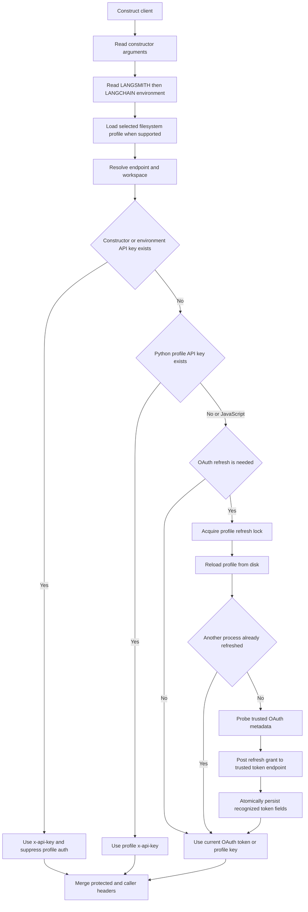

The Python `Client` and `AsyncClient`, and the JavaScript `Client`, turn several configuration channels into effective transport state: an API base URL, workspace context, authentication mechanism, default headers, timeout and retry policy, and tracing behavior. Higher-level operations in [Platform Client](./platform-client.md), [Sandbox Lifecycle and Execution](../workflows/sandbox-lifecycle-and-execution.md), and [Trace Capture and Ingestion](../workflows/trace-capture-and-ingestion.md) build on these rules.

## Resolution order

For the main endpoint and workspace, the effective order is:

1. Constructor argument: `api_url` / `apiUrl`, `workspace_id` / `workspaceId`.
2. `LANGSMITH_ENDPOINT` or `LANGSMITH_WORKSPACE_ID`.
3. The legacy `LANGCHAIN_ENDPOINT` or `LANGCHAIN_WORKSPACE_ID` alias.
4. The selected profile's `api_url` or `workspace_id`.
5. For the API URL only, `https://api.smith.langchain.com`.

The environment helpers check `LANGSMITH_` before `LANGCHAIN_`. Python ignores blank environment values; JavaScript selects the first truthy alias. Stored endpoint, key, and workspace values are trimmed and stripped of outer quotes, and the endpoint loses its trailing slash. Constructor values therefore isolate a client from process-wide endpoint configuration. [Python resolution](repo://python/langsmith/client.py#L1281-L1307) [JavaScript constructor](repo://js/src/client.ts#L1377-L1402) [JavaScript defaults](repo://js/src/client.ts#L1506-L1542) [environment aliases](repo://js/src/utils/env.ts#L175-L195)

Authentication adds a separate gate:

- A nonblank constructor API key overrides an environment key. If either constructor or environment supplies the API-key channel, profile-managed authentication is disabled; the profile may still provide the endpoint and workspace.
- Only without those channels can the selected profile authenticate. A `default` profile is a real fallback profile when neither `LANGSMITH_PROFILE` nor `current_profile` selects another entry.
- A workspace ID is routing context, not a credential. It becomes `X-Tenant-Id` / `x-tenant-id` and is required when the server reports that an organization-scoped API key needs a workspace.

[Python auth gate](repo://python/langsmith/client.py#L1283-L1335) [JavaScript auth gate](repo://js/src/client.ts#L1386-L1389) [JavaScript default gate](repo://js/src/client.ts#L1506-L1542) [workspace failure](repo://js/src/utils/error.ts#L147-L176)

Profile-internal credential ordering differs by SDK:

- Python prefers profile `api_key`. If it is present, the API key is the effective profile credential and OAuth is not refreshed.
- JavaScript prefers an OAuth access token. If refresh is needed, it attempts OAuth before falling back to the profile API key; an available access token becomes `Authorization: Bearer ...`.

Explicit and environment API keys still suppress both forms of profile authentication in both SDKs. [Python selection and refresh predicate](repo://python/langsmith/_internal/_profiles.py#L238-L264) [Python profile headers](repo://python/langsmith/_internal/_profiles.py#L456-L467) [JavaScript profile headers](repo://js/src/utils/profiles.ts#L485-L509) [focused JavaScript tests](repo://js/src/tests/client.test.ts#L630-L710)

```mermaid
flowchart TD
    Start["Construct client"] --> Args["Read constructor arguments"]
    Args --> Env["Read LANGSMITH then LANGCHAIN environment"]
    Env --> Profile["Load selected filesystem profile when supported"]
    Profile --> Endpoint["Resolve endpoint and workspace"]
    Endpoint --> Key{"Constructor or environment API key exists"}
    Key -->|Yes| ApiKey["Use x-api-key and suppress profile auth"]
    Key -->|No| PyKey{"Python profile API key exists"}
    PyKey -->|Yes| ProfileKey["Use profile x-api-key"]
    PyKey -->|No or JavaScript| Refresh{"OAuth refresh is needed"}
    Refresh -->|No| Current["Use current OAuth token or profile key"]
    Refresh -->|Yes| Lock["Acquire profile refresh lock"]
    Lock --> Reload["Reload profile from disk"]
    Reload --> Fresh{"Another process already refreshed"}
    Fresh -->|Yes| Current
    Fresh -->|No| Discover["Probe trusted OAuth metadata"]
    Discover --> Token["Post refresh grant to trusted token endpoint"]
    Token --> Save["Atomically persist recognized token fields"]
    Save --> Current
    ApiKey --> Request["Merge protected and caller headers"]
    ProfileKey --> Request
    Current --> Request
```

*Configuration and authentication resolution, including the language-specific profile credential choice and coordinated OAuth refresh path.*

## Profiles and OAuth lifecycle

Profiles live at `LANGSMITH_CONFIG_FILE` when set, otherwise `~/.langsmith/config.json`. `LANGSMITH_PROFILE` selects a named profile; absent that, loaders try `current_profile`, then `default`. A missing file, malformed JSON, missing profile map, or missing selected entry is treated as no profile rather than a construction failure. JavaScript deliberately skips filesystem profile loading in browser and web-worker runtimes. [Python profile selection](repo://python/langsmith/_internal/_profiles.py#L71-L129) [JavaScript profile loading](repo://js/src/utils/profiles.ts#L52-L107)

A profile may contain `api_key`, `api_url`, `workspace_id`, and an `oauth` object with `access_token`, `refresh_token`, and `expires_at`. In JavaScript, a refresh token triggers refresh when the access token is absent or expires within one minute. Python uses the same time predicate only when no profile API key is present. Missing or malformed expiry data does not itself force refresh. Refresh is best effort: discovery, lock, transport, non-success response, malformed token response, and persistence failures leave the currently available profile credential in use rather than failing client construction. [JavaScript predicate](repo://js/src/utils/profiles.ts#L117-L133) [JavaScript refresh](repo://js/src/utils/profiles.ts#L418-L475) [Python predicate](repo://python/langsmith/_internal/_profiles.py#L238-L264) [Python refresh](repo://python/langsmith/_internal/_profiles.py#L421-L454)

Refresh coordination has two levels. A process-local lock or shared promise coalesces concurrent requests, and a filesystem lock serializes processes sharing one config file. After taking the filesystem lock, the refresher reloads the profile and skips the network if another process already wrote a fresh token. Python uses `flock` on POSIX and an atomic directory lock elsewhere; JavaScript uses the atomic directory form. The fallback lock recovers stale locks and checks ownership before release. A successful refresh updates only recognized token fields and atomically replaces the profile file; Python also applies restrictive file modes. [Python lock](repo://python/langsmith/_internal/_oauth_refresh_lock.py#L95-L160) [JavaScript lock](repo://js/src/utils/profile-lock.ts#L64-L118) [Python persistence](repo://python/langsmith/_internal/_profiles.py#L297-L324)

### OAuth discovery security boundary

The SDKs probe the configured mount, self-hosted `/api`, and root issuer locations, including the RFC 8414 path-inserted well-known form. If discovery is unavailable, they fall back to `<normalized-profile-api-url>/oauth/token`; normalization strips `/api/v1` but deliberately retains `/api`, because a self-hosted authorization server may be mounted there.

**Discovery metadata is trusted only when its `issuer` exactly matches the issuer base that was probed, ignoring trailing slashes, and both the device and token endpoints share the issuer's scheme and host.** A mismatched issuer, off-origin endpoint, HTML SPA response, invalid JSON, or failed request is ignored. This is a credential-exfiltration boundary: never relax validation so that a refresh token can be posted to a location merely advertised by an untrusted document. [Python validation and discovery](repo://python/langsmith/_internal/_profiles.py#L141-L235) [JavaScript validation and discovery](repo://js/src/utils/profiles.ts#L152-L282) [rejection tests](repo://python/tests/unit_tests/test_profiles_oauth_discovery.py#L115-L160)

Refresh always uses the profile's `api_url`, not a constructor endpoint override. This binds the refresh token to the deployment that issued the profile even when that client sends API traffic elsewhere. [implementation](repo://js/src/utils/profiles.ts#L418-L443) [behavior test](repo://js/src/tests/client.test.ts#L817-L870)

## Endpoint composition and generated transports

The configured API URL is a base and may already end in `/api` or `/api/v1`. Generated OpenAPI clients remove either suffix before their generated routes add it. Handwritten platform calls use `_getPlatformEndpointPath` in JavaScript and `_platform_path` in Python; those helpers avoid adding another `/v1` when the configured base already ends there. [JavaScript normalization and construction](repo://js/src/client.ts#L1706-L1755) [JavaScript platform helper](repo://js/src/client.ts#L1758-L1762) [Python generated base](repo://python/langsmith/client.py#L174-L180)

> **Repository invariant:** do not hardcode a leading `/v1` when adding a platform operation. Use the platform path helper or generated resource route. With a self-hosted base such as `https://host/api/v1`, another prefix would produce an invalid doubled path.

The web-app URL is separate from the API URL. When absent, each SDK infers it from localhost, known hosted regions, or API suffixes. Set `web_url` / `webUrl` explicitly when a self-hosted API and UI do not follow those conventions. [JavaScript inference](repo://js/src/client.ts#L1545-L1578)

Python synchronous `api_urls` is mutually exclusive with `api_url`; when configured, the write-endpoint map supplies each endpoint's key and profile OAuth is disabled. Environment configuration also rejects combining a single `LANGSMITH_ENDPOINT` / `LANGCHAIN_ENDPOINT` with `LANGSMITH_RUNS_ENDPOINTS`. [validation and state](repo://python/langsmith/client.py#L1268-L1279) [write-map selection](repo://python/langsmith/client.py#L1320-L1327)

Generated clients are a transport adaptation boundary, not a second source of configuration. JavaScript passes its wrapped `fetch`, normalized base, timeout, tenant, authentication, and filtered default headers to the generated client; because the generator captures headers, the SDK rebuilds it when the effective auth/header signature changes. Python cannot pass a `requests.Session` directly to an httpx-based generated client, so it translates compatible custom session settings such as TLS, proxy, cookie, and nondefault headers. Custom adapters, `session.auth`, hooks, pool bounds, and adapter retries do not cross that boundary. [JavaScript adaptation](repo://js/src/client.ts#L1642-L1755) [Python session translation](repo://python/langsmith/client.py#L183-L230) [Python generated construction](repo://python/langsmith/client.py#L1622-L1662)

## Header ownership and request overrides

Client-wide `headers` carry proxy, tenant-routing, or observability metadata. JavaScript also accepts `fetchOptions.headers`; collisions are case-insensitive and that channel wins over `config.headers`. Both SDKs merge client custom headers *under* SDK-owned authentication and workspace headers, so client configuration cannot replace a configured `x-api-key` or tenant ID. JavaScript validates malformed header names eagerly at construction or assignment, but also normalizes again because callers can mutate the object returned by `client.headers`. [JavaScript merge](repo://js/src/client.ts#L1457-L1466) [JavaScript effective headers](repo://js/src/client.ts#L1581-L1639) [Python effective headers](repo://python/langsmith/client.py#L1848-L1906)

Generated transports need special handling to preserve this precedence. The JavaScript generated client applies default headers after its own auth, so the wrapper removes protected names first, adapts a caller-provided `x-api-key` into the generator's `apiKey` option, and uses the wrapped fetch for profile or explicit `Authorization`. Handwritten and generated calls use the same package `User-Agent`. [generated-header adaptation](repo://js/src/client.ts#L1642-L1689) [focused tests](repo://js/src/tests/client_headers.test.ts#L34-L164)

Per-request headers are intentionally more flexible. Python merges `request_kwargs.headers` and direct `headers` after client defaults, then asks profile auth to remove stale profile-managed values; a genuinely explicit `Authorization` or `x-api-key` survives refresh. JavaScript similarly does not refresh over an explicit request credential when profile auth is in use. A configured JavaScript client API key remains SDK-owned: it removes `Authorization` and supplies that key. Delegated per-request auth is therefore supported only when client-level API-key authentication was not selected. [Python request merge](repo://python/langsmith/client.py#L2010-L2024) [Python stale-header handling](repo://python/langsmith/_internal/_profiles.py#L368-L381) [JavaScript request auth](repo://js/src/client.ts#L1117-L1240)

## Tracing-related transport state

Tracing options are resolved during construction rather than on every request:

- `tracingSamplingRate` / `tracing_sampling_rate` overrides `LANGSMITH_TRACING_SAMPLING_RATE`; values outside `0..1` fail construction. The resolved rate controls deterministic run sampling and is stamped into trace metadata when set. [JavaScript sampling](repo://js/src/client.ts#L719-L733) [Python sampling](repo://python/langsmith/client.py#L797-L817)
- JavaScript `tracingMode` accepts `langsmith` or `otel`. Its order is constructor, `LANGSMITH_TRACING_MODE` or legacy namespace alias, legacy OTEL-enabled flags, then `langsmith`; invalid environment values fail construction. [JavaScript mode resolution](repo://js/src/utils/env.ts#L250-L298)
- Python `tracing_mode` additionally supports `hybrid`. Its order is explicit mode, deprecated `otel_enabled`, environment mode, legacy OTEL flags, then `langsmith`. If the required OpenTelemetry packages cannot be imported, construction warns and falls back to LangSmith-only tracing. [Python mode resolution](repo://python/langsmith/client.py#L240-L306) [Python transport initialization](repo://python/langsmith/client.py#L1390-L1442)
- Input, output, and metadata hiding/anonymization options become client state used by trace serialization. JavaScript gives specific `hideInputs`, `hideOutputs`, or `hideMetadata` values precedence over the general `anonymizer`; environment defaults are used otherwise. [JavaScript tracing options](repo://js/src/client.ts#L1441-L1469) [JavaScript environment defaults](repo://js/src/client.ts#L1520-L1533)

## Retries, timeouts, and failures

JavaScript routes calls through `AsyncCaller`. Its retryable statuses are `408`, `425`, `429`, `500`, `502`, `503`, and `504`, with randomized exponential backoff. Cancellation and timeout/abort errors are not retried, and an ordinary non-retryable HTTP status is rethrown.

Spread order is intentional and differs between the two callers. The ordinary caller spreads `callerOptions` first and then fixes `maxRetries: 4`, so callers cannot override its retry count. The trace-ingest caller establishes four retries, concurrency, and a queue-byte limit first and then spreads `callerOptions`, so those options can override those three defaults; the SDK still fixes its rate-limit hook and final debug setting after the spread. [caller construction](repo://js/src/client.ts#L1397-L1439) [retry statuses and defaults](repo://js/src/utils/async_caller.ts#L5-L82) [retry control flow](repo://js/src/utils/async_caller.ts#L119-L206)

Python's synchronous client mounts a urllib3 policy with three retries, the same status force-list, `Retry-After` support, and all methods on compatible urllib3 versions. Individual handwritten operations can additionally choose `stop_after_attempt` and retry exception classes. `AsyncClient` defaults to three configured attempts and retries connection, timeout, and server API errors, while call sites can add exception types. Timeouts are independent: Python sync accepts one millisecond value or connect/read values, Python async accepts one value or an httpx timeout tuple, and JavaScript `timeout_ms` defaults to 90 seconds. [Python adapter policy](repo://python/langsmith/client.py#L669-L698) [Python sync request setup](repo://python/langsmith/client.py#L1971-L2024) [Python async retries](repo://python/langsmith/async_client.py#L455-L507)

Operationally, distinguish authentication failures from availability failures. A `401` is an authentication error. An organization-scoped-key `403` gives workspace-ID remediation. `400`, `404`, and conflicts are not generic transient failures. Focused JavaScript tests establish retries for `408` and `429`, but no retry for an actual fetch timeout or `400`. [retry tests](repo://js/src/tests/client_retry.test.ts#L76-L160)

## Runtime constraints and safe operation

- Browser and web-worker JavaScript clients cannot discover local profiles. Pass `apiUrl`, credentials or narrowly scoped request auth, workspace, and any custom `fetchImplementation` explicitly. Environment access is guarded because `process` may be absent and some Deno configurations throw on reads. [runtime detection](repo://js/src/utils/env.ts#L5-L50) [guarded reads](repo://js/src/utils/env.ts#L175-L185)
- Browser bundles replace filesystem operations with safe no-op stubs. Profile refresh and on-disk token persistence are server-runtime features, not browser credential storage. [browser filesystem shim](repo://js/src/utils/fs.browser.ts#L1-L66)
- Do not embed long-lived API keys or refresh tokens in browser-delivered code. If a browser calls directly, use a narrowly scoped explicit credential and enforce endpoint CORS and server-side authorization.
- Treat OAuth discovery validation, profile-bound refresh destinations, protected client headers, and generated-client transport adaptation as security boundaries. Changes should retain the focused profile discovery, refresh, header precedence, runtime, and retry tests described above.
