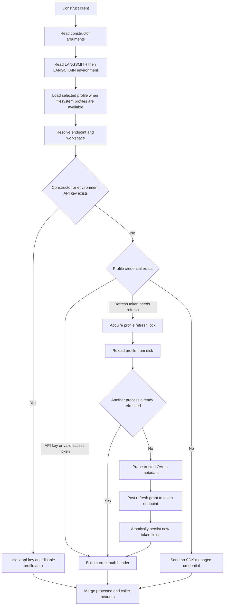

The Python `Client` and `AsyncClient`, and the JavaScript `Client`, reduce several configuration channels to an API base URL, workspace context, transport policy, and effective authentication mechanism. Higher-level operations in [Platform Client](./platform-client.md) use this layer, while [trace capture and ingestion](../workflows/trace-capture-and-ingestion.md) adds a specialized batch caller on top of it.

## Resolution order

Endpoint and workspace resolution follows the same effective precedence in both SDKs:

1. Constructor argument: `api_url` / `apiUrl`, `workspace_id` / `workspaceId`.
2. `LANGSMITH_ENDPOINT` or `LANGSMITH_WORKSPACE_ID`.
3. Legacy `LANGCHAIN_ENDPOINT` or `LANGCHAIN_WORKSPACE_ID`.
4. The selected profile's `api_url` or `workspace_id`.
5. For the API URL only, `https://api.smith.langchain.com`.

Python's environment helper ignores blank values and checks `LANGSMITH_` before `LANGCHAIN_`. JavaScript uses the first truthy namespaced value. Both constructors normalize stored values, including removing a trailing API URL slash; auth values are also trimmed. A constructor endpoint is therefore the most direct per-client override for a self-hosted deployment. [Python constructor resolution](repo://python/langsmith/client.py#L711-L731) [Python sync resolution](repo://python/langsmith/client.py#L1281-L1304) [Python async resolution](repo://python/langsmith/async_client.py#L215-L242) [JavaScript constructor resolution](repo://js/src/client.ts#L1421-L1445) [JavaScript defaults](repo://js/src/client.ts#L1551-L1587) [environment aliases](repo://js/src/utils/env.ts#L177-L196)

Authentication adds a separate gate. A constructor API key wins over an environment API key, and either disables profile-managed authentication. This does not prevent the profile from supplying its endpoint and workspace. Only when neither constructor nor environment supplies an API key can the selected profile authenticate the client. The workspace ID is not a credential: it is sent as `X-Tenant-Id` / `x-tenant-id`, and the JavaScript error mapper gives specific remediation when an organization-scoped key receives `org_scoped_key_requires_workspace`. [Python auth gate](repo://python/langsmith/client.py#L1283-L1335) [Python async auth gate](repo://python/langsmith/async_client.py#L218-L259) [JavaScript auth gate](repo://js/src/client.ts#L1421-L1440) [JavaScript profile defaults](repo://js/src/client.ts#L1551-L1587) [workspace failure](repo://js/src/utils/error.ts#L154-L183)

Profile-internal credential ordering differs by language when one profile contains both kinds:

- Python profile auth prefers `api_key` over an OAuth access token.
- JavaScript profile auth prefers the OAuth access token over `api_key`.

This ordering applies only inside a profile; explicit and environment API keys still win in both SDKs. [Python profile headers](repo://python/langsmith/_internal/_profiles.py#L456-L467) [JavaScript profile headers](repo://js/src/utils/profiles.ts#L485-L509)

```mermaid
flowchart TD
    Start["Construct client"] --> Args["Read constructor arguments"]
    Args --> Env["Read LANGSMITH then LANGCHAIN environment"]
    Env --> Profile["Load selected profile when filesystem profiles are available"]
    Profile --> Endpoint["Resolve endpoint and workspace"]
    Endpoint --> Key{"Constructor or environment API key exists"}
    Key -->|Yes| ApiKey["Use x-api-key and disable profile auth"]
    Key -->|No| ProfileCred{"Profile credential exists"}
    ProfileCred -->|API key or valid access token| Header["Build current auth header"]
    ProfileCred -->|Refresh token needs refresh| Lock["Acquire profile refresh lock"]
    Lock --> Reload["Reload profile from disk"]
    Reload --> Fresh{"Another process already refreshed"}
    Fresh -->|Yes| Header
    Fresh -->|No| Discover["Probe trusted OAuth metadata"]
    Discover --> Token["Post refresh grant to token endpoint"]
    Token --> Save["Atomically persist new token fields"]
    Save --> Header
    ProfileCred -->|No| Anonymous["Send no SDK-managed credential"]
    ApiKey --> Request["Merge protected and caller headers"]
    Header --> Request
    Anonymous --> Request
```

*Configuration and authentication resolution, including the coordinated OAuth refresh path used before a request.*

## Profiles and OAuth lifecycle

Profiles live at `LANGSMITH_CONFIG_FILE` when set, otherwise `~/.langsmith/config.json`. `LANGSMITH_PROFILE` selects a name; without it, loaders try `current_profile` and then `default`. A missing file, malformed JSON, or missing selected entry means “no profile,” not a constructor failure. JavaScript does not attempt profile filesystem access in browser or web-worker runtimes. [Python profile loading](repo://python/langsmith/_internal/_profiles.py#L71-L129) [JavaScript profile loading](repo://js/src/utils/profiles.ts#L52-L107)

A profile can contain `api_key`, `api_url`, `workspace_id`, and OAuth `access_token`, `refresh_token`, and `expires_at` fields. In JavaScript, refresh is due when a refresh token exists and the access token is absent or expires within one minute. Python uses the same token and expiry conditions but suppresses refresh when the profile also has an API key, consistent with Python's profile credential preference. Missing or malformed expiry data does not itself force refresh. [Python refresh predicate](repo://python/langsmith/_internal/_profiles.py#L238-L264) [JavaScript refresh predicate](repo://js/src/utils/profiles.ts#L117-L133)

Refresh is best effort. Discovery, transport, lock acquisition, non-success responses, malformed token responses, and persistence failures leave the available profile credential in use rather than failing client construction. A process-local lock or shared promise coalesces concurrent refreshes, while a filesystem lock serializes processes sharing one config file. Once it owns that lock, the refresher reloads the profile and avoids a duplicate network call if another process already wrote a fresh token. Python uses `flock` on POSIX and an atomic directory lock elsewhere; JavaScript uses the directory-lock form. Directory locks include stale-lock recovery and owner-checked release. Successful refresh writes only recognized token fields atomically; Python also applies restrictive file modes. [Python refresh](repo://python/langsmith/_internal/_profiles.py#L267-L324) [Python coordination](repo://python/langsmith/_internal/_profiles.py#L327-L454) [Python filesystem lock](repo://python/langsmith/_internal/_oauth_refresh_lock.py#L95-L160) [JavaScript refresh](repo://js/src/utils/profiles.ts#L363-L475) [JavaScript filesystem lock](repo://js/src/utils/profile-lock.ts#L64-L118)

### OAuth discovery security boundary

The SDKs probe the configured mount, self-hosted `/api`, and root issuer candidates, including the RFC 8414 path-inserted well-known form. If no usable metadata exists, refresh falls back to `<normalized-profile-api-url>/oauth/token`. Normalization removes `/api/v1` but intentionally preserves `/api`, because a self-hosted authorization server may be mounted there.

**Metadata is trusted only when its `issuer` exactly matches the issuer base being probed, ignoring trailing slashes, and both advertised device and token endpoints share that issuer's scheme and host.** Issuer mismatch, an off-origin endpoint, an HTML SPA response, invalid JSON, or a failed request is ignored. This is a credential-exfiltration boundary: the SDK must not post a refresh token to a location merely advertised by an untrusted document. [Python discovery and validation](repo://python/langsmith/_internal/_profiles.py#L132-L235) [JavaScript discovery and validation](repo://js/src/utils/profiles.ts#L135-L282) [rejection tests](repo://python/tests/unit_tests/test_profiles_oauth_discovery.py#L115-L160)

Refresh always uses the profile's `api_url`, not a constructor endpoint override. This keeps a refresh token bound to the deployment represented by its profile even when that client temporarily directs API traffic elsewhere. [JavaScript refresh target](repo://js/src/utils/profiles.ts#L418-L443) [behavior test](repo://js/src/tests/client.test.ts#L879-L930)

## Endpoint composition and self-hosting

The configured API URL is a base and may already end in `/api` or `/api/v1`. Generated OpenAPI clients strip an existing `/api` or `/api/v1` suffix before adding generated routes. Handwritten platform calls use `_getPlatformEndpointPath` in JavaScript and `_platform_path` in Python; each omits another `/v1` when the configured base already ends in `/v1`. [JavaScript generated base](repo://js/src/client.ts#L1751-L1800) [JavaScript platform helper](repo://js/src/client.ts#L1803-L1808) [Python generated base](repo://python/langsmith/client.py#L174-L180) [Python platform helper](repo://python/langsmith/client.py#L11894-L11906)

> **Repository invariant:** never hardcode a leading `/v1` for a new platform operation. Use the platform path helper or the generated resource route. Otherwise a self-hosted base such as `https://host/api/v1` can become an invalid `/api/v1/v1/platform/...` URL.

The web-app URL is separate from the API base. When `web_url` / `webUrl` is absent, the SDK infers it using localhost, hosted-region, and API-suffix conventions. Set it explicitly when a self-hosted API and UI do not follow those layouts. [JavaScript host inference](repo://js/src/client.ts#L1590-L1623) [Python host access](repo://python/langsmith/client.py#L1843-L1846)

## Header ownership and request overrides

Client-wide `headers` carry proxy, routing, and observability metadata. JavaScript also accepts `fetchOptions.headers`; collisions are normalized case-insensitively, and that channel is merged after `config.headers`. Caller headers are merged beneath SDK-controlled authentication and workspace headers, so they cannot replace credentials or tenant context selected by client configuration. Header-affecting setters recompute Python request state. JavaScript evaluates the mutable custom-header object and current profile auth when building requests, and rebuilds its generated client when the effective signature changes. [JavaScript header ownership](repo://js/src/client.ts#L1501-L1510) [JavaScript merge and rebuild](repo://js/src/client.ts#L1626-L1779) [Python merge](repo://python/langsmith/client.py#L1848-L1906)

Per-request headers intentionally have more authority when profile authentication is in use. Python merges `request_kwargs.headers` and direct `headers` after client defaults, then removes only stale values known to be profile-managed; a genuinely explicit `Authorization` or `x-api-key` remains. JavaScript similarly skips profile refresh over an explicit request auth header. In contrast, a configured JavaScript client API key remains SDK-owned: its wrapper removes `Authorization` and supplies the configured key. Per-request delegation is therefore supported only when constructor or environment API-key authentication has not claimed the request. [Python request merge](repo://python/langsmith/client.py#L1971-L2024) [Python profile ownership](repo://python/langsmith/_internal/_profiles.py#L368-L381) [JavaScript request auth ownership](repo://js/src/client.ts#L1161-L1334)

Malformed JavaScript header names fail eagerly at construction or assignment. Focused tests verify protected auth and workspace headers on both handwritten and generated routes, custom-header mutation, and consistent SDK user agents. [JavaScript header tests](repo://js/src/tests/client_headers.test.ts#L34-L178) [Python header tests](repo://python/tests/unit_tests/test_custom_headers.py#L20-L136)

## Retries, timeouts, and failures

JavaScript routes calls through `AsyncCaller`. Constructor option order is intentional:

- The ordinary caller spreads `callerOptions` first and then sets `maxRetries: 4`, so callers cannot override its four-retry policy through `callerOptions`.
- The batch-ingest caller sets the four-retry default first and spreads `callerOptions` afterward, so trace-ingest configuration can override it. The batch caller then fixes its rate-limit hook and debug option; it also receives trace concurrency and queue-byte limits before the spread.

`AsyncCaller` retries `408`, `425`, `429`, `500`, `502`, `503`, and `504` with randomized exponential backoff. It rejects ordinary non-retryable statuses and does not retry cancellation, timeout, abort, or `ECONNABORTED` failures. [caller construction](repo://js/src/client.ts#L1441-L1483) [retry statuses](repo://js/src/utils/async_caller.ts#L5-L13) [retry control flow](repo://js/src/utils/async_caller.ts#L119-L206)

Python's synchronous client mounts a urllib3 policy with three retries, the same status list, `Retry-After` support, and all HTTP methods on compatible urllib3 versions. Handwritten operations can additionally control `stop_after_attempt` and retry exception classes. `AsyncClient` defaults to three attempts for connection, timeout, and server API errors, while call sites may add exception types. [Python adapter policy](repo://python/langsmith/client.py#L669-L698) [Python handwritten retry entrypoint](repo://python/langsmith/client.py#L1971-L2040) [Python async retries](repo://python/langsmith/async_client.py#L455-L507)

Timeout configuration is transport-specific. JavaScript defaults `timeout_ms` to 90 seconds and passes it to the generated client. Python sync accepts one millisecond value or separate connect/read values, defaulting to 10 seconds connect and 60 seconds read. Python async accepts one value or an httpx four-part timeout tuple and defaults to 10 seconds. [JavaScript timeout](repo://js/src/client.ts#L1441-L1446) [JavaScript generated transport](repo://js/src/client.ts#L1792-L1800) [Python sync timeout](repo://python/langsmith/client.py#L1354-L1360) [Python async timeout](repo://python/langsmith/async_client.py#L272-L280)

Operationally, distinguish authentication and request failures from transient availability. A `401` is authentication failure; an organization-scoped-key `403` carries workspace remediation; `400`, `404`, and conflict responses are not generic transient failures. JavaScript tests establish retry on HTTP `408` and `429`, but no retry for a fetch timeout or `400`. [JavaScript retry tests](repo://js/src/tests/client_retry.test.ts#L76-L160)

## Runtime and transport boundaries

- Browser and web-worker JavaScript clients cannot discover local profiles. Pass `apiUrl`, credentials, workspace, and any custom `fetchImplementation` explicitly. Environment access is guarded because `process` may be absent and some Deno configurations throw on reads. [runtime detection](repo://js/src/utils/env.ts#L5-L50) [guarded reads](repo://js/src/utils/env.ts#L177-L196)
- Browser bundles replace filesystem operations with safe stubs, so profile refresh and on-disk token persistence are server-runtime features rather than browser credential storage. [browser filesystem shim](repo://js/src/utils/fs.browser.ts#L1-L66)
- Do not ship long-lived API keys or refresh tokens in browser code. If direct browser calls are required, use narrowly scoped explicit authorization and enforce CORS and authorization at the service boundary.
- A caller-supplied Python `requests.Session` configures handwritten calls. Generated v2 calls translate selected headers, cookies, TLS, proxy, and environment settings into an httpx client, but cannot inherit mounted adapters, `session.auth`, or hooks. Treat that generated client as a separate transport boundary. [Python session contract](repo://python/langsmith/client.py#L1103-L1111)

## Focused verification

When changing this layer, prefer tests that cross configuration channels rather than testing one field in isolation:

- constructor, `LANGSMITH_`, legacy `LANGCHAIN_`, profile, and built-in fallback precedence;
- explicit or environment API-key suppression of profile auth without suppressing profile endpoint/workspace values;
- trusted and rejected discovery documents, refresh coordination, refresh-target binding, and atomic persistence;
- protected client headers versus explicit per-request authorization on handwritten and generated paths;
- ordinary versus batch caller option ordering, retryable statuses, actual timeout/abort behavior, and non-retryable responses;
- hosted, bare self-hosted, `/api`, and `/api/v1` endpoint shapes, especially platform path helpers.

The representative suites are `js/src/tests/client.test.ts`, `js/src/tests/client_headers.test.ts`, `js/src/tests/client_retry.test.ts`, `js/src/tests/profile-oauth-discovery.test.ts`, `python/tests/unit_tests/test_client.py`, `python/tests/unit_tests/test_async_client.py`, `python/tests/unit_tests/test_custom_headers.py`, `python/tests/unit_tests/test_oauth_refresh_lock.py`, and `python/tests/unit_tests/test_profiles_oauth_discovery.py`.
