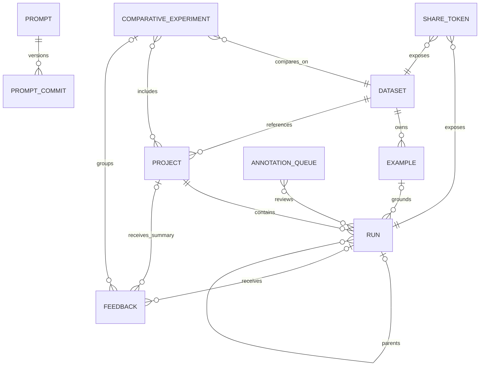
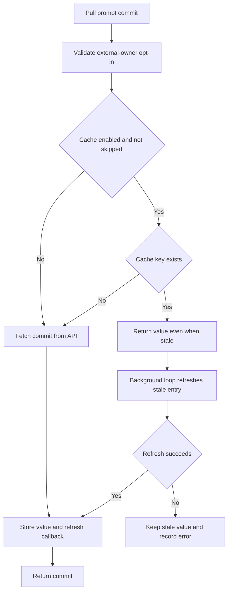

The Python `Client` and `AsyncClient` and the JavaScript `Client` are façades over a connected resource graph, not independent bags of CRUD methods. A safe change starts by identifying which resource owns the state, which IDs are foreign keys, and whether the operation belongs to a handwritten compatibility surface or a generated resource.

Configuration, authentication, endpoint normalization, retries, and headers are covered in [Client Configuration, Endpoints, and Authentication](./client-configuration-and-auth.md). Evaluation orchestration that consumes these resources is covered in [Evaluation and Experiments](../workflows/evaluation-and-experiments.md).

## Resource map

*The durable identifiers that connect platform domains; optional links reflect APIs that permit more than one feedback target or provenance path.*

The important ownership boundaries are:

| Domain | Owner and identifiers | What the client resolves or preserves |
| --- | --- | --- |
| Runs and projects | A project is the API's `session`; `Run.session_id` is its project ID. Runs form traces through `trace_id`, `parent_run_id`, and `dotted_order`. | Name-based project inputs are resolved to project UUIDs before run queries. Loading children is explicit and heavier: the client queries the trace, orders descendants, and rebuilds `child_runs`. |
| Datasets and examples | Every `Example` has a `dataset_id`; an example may record `source_run_id`. A run may point back through `reference_example_id`. | Dataset names are conveniences at the edge. Multipart create/update endpoints are dataset-scoped, so batches must retain one correct dataset ID; attachments travel with each example part. Dataset versions are selected by timestamp or tag. |
| Feedback | Feedback has its own ID and can target either a run (`run_id`, optionally `trace_id`) or a project (`session_id`) for summary feedback. It may also carry `comparative_experiment_id` and evaluator provenance. | Creation rejects providing neither or both run and project targets. Evaluator results are normalized into feedback records while preserving target run, source run, project, trace, and start time when known. |
| Experiments | An experiment is represented by a project whose `reference_dataset_id` identifies the evaluated dataset. A comparative experiment contains experiment/project IDs and one reference dataset ID. | If the comparative call omits the dataset ID, the client derives it from the first experiment project. Keep these IDs aligned; comparison feedback uses the comparative experiment ID, not a project ID. |
| Annotation queues | A queue owns review membership and rubric metadata; its members are runs. | Modern membership uses a `RunKey`: `run_id`, `session_id`, and `start_time`, with optional `source_proposed_example_id`. These partition fields avoid scanning for a bare run UUID. Legacy bare-ID insertion remains a deprecated route. |
| Prompts and Hub | A prompt repository is addressed as `owner/name`; a commit adds `:hash` or `:tag`, with `latest` as the default. An unqualified name uses owner `-` for the current tenant. | Metadata belongs to the repository; serialized prompt content belongs to commits. Push creates or patches the repo, then creates a commit and optional commit tags. Owner checks prevent mutating another tenant's repository. Agents and skills reuse the Hub identifier grammar but store directory/file commits rather than prompt manifests. |
| Sharing | Sharing creates a token attached to a run or dataset, while the underlying resource ID remains unchanged. | Public reads parse a token or public URL and use `/public/...` routes. Dataset sharing exposes the dataset and its examples; unsharing revokes the public link rather than deleting the dataset. Presigned feedback tokens are narrower capabilities tied to a run and feedback key, intended for clients that must not receive an API key. |
| Threads | A thread is a grouping over runs inside a project, keyed by `thread_id`, rather than an independently created handwritten-client object. | Thread reads require project context and translate to run filtering; grouped thread queries return aggregate count and representative run fields. New generated `threads` resources own the current query surface. |

These relationships are explicit in the schemas: projects are also called sessions, runs carry project/trace/example keys, examples carry dataset/source-run keys, and comparative feedback has a separate comparison identifier. [run and trace keys](repo://python/langsmith/schemas.py#L307-L354) [project and reference dataset](repo://python/langsmith/schemas.py#L704-L725) [dataset/example ownership](repo://python/langsmith/schemas.py#L82-L149) [feedback targets](repo://python/langsmith/schemas.py#L616-L650) [comparative experiment](repo://python/langsmith/schemas.py#L972-L998)

## Handwritten façade versus generated resources

The repository is in a migration period. The clients still implement broad handwritten methods for projects, examples, feedback, prompts, sharing, and compatibility, while current run, thread, public-run, dataset-v2, and annotation-queue APIs are exposed through generated resources. JavaScript getters such as `runs`, `datasets`, `threads`, and `annotationQueues` return the generated OpenAPI client after checking the backend version. Python does the same for async generated resources, even on `Client`, while retaining synchronous handwritten methods alongside them. [JavaScript resource getters](repo://js/src/client.ts#L1752-L1784) [Python generated resource boundary](repo://python/langsmith/client.py#L1596-L1685)

This boundary matters when extending the SDK:

- Put operations already represented in `openapi/openapi.yaml` into the generated resource layer and expose them through the façade; do not create a second handwritten transport path merely for naming symmetry.
- Preserve handwritten methods when they compose resources, normalize legacy signatures, process manifests, construct app URLs, or implement compatibility behavior not expressed by the wire schema.
- Follow deprecation pointers. For example, JavaScript `readRun` and `listRuns` delegate to internal warning-free helpers, while supported internal callers avoid emitting a warning for a deprecated method the user did not call. [run compatibility surface](repo://js/src/client.ts#L3173-L3204) [run query migration](repo://js/src/client.ts#L3298-L3399)

## Name resolution and cross-resource invariants

Most methods accepting `id` or `name` require exactly one. They resolve a name once, then issue the resource operation using its UUID. Projects use `/sessions`; datasets use `/datasets`. This makes UUIDs—not mutable display names—the stable join keys. A missing name produces a not-found failure, malformed UUIDs fail locally where validation is available, and ambiguous `id` plus `name` input is rejected before transport. [project resolution](repo://js/src/client.ts#L4251-L4339) [dataset resolution](repo://js/src/client.ts#L4579-L4611)

Example writes make the dataset boundary especially visible. A create resolves `dataset_name` to `dataset_id`, sends a dataset-scoped multipart request, and reads returned example IDs back as full objects. Updates without `dataset_id` first read the example to recover its owner. The multi-update helper assumes the first example's dataset applies to the entire batch, so callers and maintainers must not silently mix datasets. [example create and batch resolution](repo://js/src/client.ts#L4856-L5031) [example update ownership](repo://js/src/client.ts#L5268-L5309) [multipart endpoint](repo://js/src/client.ts#L7038-L7055)

Runs preserve three different notions that should not be substituted:

- `session_id`: project ownership and partition context;
- `trace_id`: all spans in one nested execution;
- `thread_id`: application-level grouping across traces, stored and queried as run metadata.

A run may additionally bind evaluation output to `reference_example_id`. Child hydration queries by project and trace, then uses `parent_run_id` and `dotted_order`; a child lacking a parent is treated as invalid data. [child hydration](repo://js/src/client.ts#L3257-L3295) [thread filtering](repo://js/src/client.ts#L3587-L3623)

Annotation queues strengthen the same rule. The preferred membership key includes the run UUID plus project/session and start-time partition keys. The generated queue resource should be used for new item/status workflows; the handwritten insertion method documents and implements the transition from bare IDs to `/runs/by-key`. [RunKey contract](repo://python/langsmith/schemas.py#L865-L881) [queue insertion routing](repo://js/src/client.ts#L6245-L6331)

## Iteration and pagination

List calls are lazy in both languages: Python yields iterators or async iterators, and JavaScript returns `AsyncIterable`s. Callers should consume only what they need rather than immediately materializing unbounded collections.

Two transport patterns recur:

1. **Offset pagination** for datasets, examples, projects, feedback, prompts, commits, and queues. The shared helper defaults to pages of 100, advances by the number returned, and stops on an empty or short page. A public `limit` may cap total yielded items independently of page size.
2. **Cursor pagination** for run queries and shared runs. The request body receives the server's `cursors.next`; iteration stops when the data key, cursor block, or next cursor is absent.

The JavaScript helpers yield pages internally and domain methods flatten them; Python's corresponding helpers yield records. Both route every page through the same authenticated retrying request machinery and status checks. [JavaScript pagination helpers](repo://js/src/client.ts#L1910-L2010) [Python pagination helpers](repo://python/langsmith/client.py#L2185-L2256) [example total-limit handling](repo://js/src/client.ts#L5084-L5185)

Do not assume every `limit` means “page size.” Some methods clamp a page to 100 and track a separate total count, while grouped thread queries use an explicit server `total`. Preserve the method's stopping condition when adding filters or changing response envelopes. [grouped thread iteration](repo://js/src/client.ts#L3513-L3584) [feedback-config limit](repo://js/src/client.ts#L5977-L6005)

## Prompt repositories, commits, trust, and secrets

`parseHubIdentifier` is the shared grammar: `name` becomes `-/name:latest`; `owner/name:version` preserves all three components and malformed slash/colon layouts fail locally. Pull fetches a `PromptCommit` containing the resolved owner, repository, commit hash, manifest, examples, and optional model configuration. The cache key includes the exact caller identifier and adds `:with_model` when model data was requested, preventing model-bearing and prompt-only responses from colliding. [identifier parsing](repo://js/src/utils/prompts.ts#L3-L35) [commit shape](repo://python/langsmith/schemas.py#L1008-L1028) [pull and cache key](repo://js/src/client.ts#L7254-L7301)

**Pulled manifests are executable configuration, not trusted text.** Both clients reject an explicit external `owner/name` pull before any network request unless the caller opts in with `dangerously_pull_public_prompt` / `dangerouslyPullPublicPrompt`. Trust the reviewed contents, not merely the publisher; pin a commit instead of following mutable `latest`, and avoid `include_model` for external prompts because model configuration can affect endpoints, headers, model names, and constructor behavior. [Python trust gate](repo://python/langsmith/client.py#L463-L473) [JavaScript trust gate](repo://js/src/client.ts#L124-L134) [focused no-request test](repo://python/tests/unit_tests/test_client.py#L4378-L4417)

Python adds a secret-resolution boundary during LangChain deserialization. Explicit serialized secret references use only the supplied `secrets` map by default; environment lookup requires `secrets_from_env=True`. If a manifest contains a secret marker and neither source is enabled, loading raises an explanatory error. This control does **not** prevent a deserialized model integration from independently using its normal environment credential defaults, so it is not a sandbox. Where supported, loading limits allowed objects to `core` unless `include_model=True`. [manifest processing safeguards](repo://python/langsmith/client.py#L476-L550) [public pull security contract](repo://python/langsmith/client.py#L10089-L10168)

## Prompt cache lifecycle

*Prompt pulls use stale-while-revalidate caching, but the trust gate runs before cache lookup.*

Caching is enabled by default and uses a process-global cache unless disabled for a client; the legacy custom `cache` constructor option remains for compatibility. Entries are LRU-evicted at the configured maximum. Reads update recency and the refresh callback, stale entries are served immediately, and a background thread (Python) or unref'ed timer (JavaScript) refreshes them. Refresh failures increment metrics and retain stale data. Set maximum size to zero to disable storage, use infinite TTL for offline/static behavior, and stop or shut down a custom cache during cleanup. [JavaScript client cache selection](repo://js/src/client.ts#L1469-L1497) [Python stale-while-revalidate core](repo://python/langsmith/prompt_cache.py#L117-L195) [background refresh behavior test](repo://python/tests/unit_tests/test_prompt_cache.py#L150-L199)

Caches can be dumped to JSON and loaded for offline use. Writes use a temporary file and rename; missing or malformed files load zero entries; loaded entries receive a fresh TTL and no refresh callback until a client next accesses them. These files contain complete prompt manifests and optional model configuration, so protect and review them as executable configuration and never treat cache persistence as a secret store. JavaScript browser builds replace filesystem calls with no-ops. [Python persistence](repo://python/langsmith/prompt_cache.py#L197-L292) [JavaScript persistence and browser boundary](repo://js/src/utils/prompt_cache/index.ts#L1-L10) [JavaScript dump/load](repo://js/src/utils/prompt_cache/index.ts#L238-L302)

## Sharing and capability boundaries

Sharing does not clone resources. A run share token resolves public run or trace views; a dataset share token resolves the existing dataset and shared examples. Public URLs are presentation forms of those tokens and are accepted by parsing helpers. Revocation deletes the share association. [run public access](repo://python/langsmith/client.py#L4935-L5041) [dataset sharing](repo://python/langsmith/client.py#L5043-L5162)

Presigned feedback tokens are deliberately separate from broad share links and API keys. They bind authorization to one run and feedback key, default to a short expiration, and allow browser feedback submission without exposing the workspace credential. Treat either token type as a bearer capability: avoid logging it and revoke or expire it when no longer needed. [feedback-token scope](repo://js/src/client.ts#L5668-L5724)

## Focused change checklist

When changing a platform operation:

1. Identify the owning resource and retain every foreign key through request mapping and response normalization.
2. Resolve names only at the façade boundary; pass UUIDs across internal calls.
3. Choose generated OpenAPI resource or handwritten composition deliberately, including the backend-version gate.
4. Preserve pagination envelope, page size, total-limit behavior, and cursor/offset stopping rules.
5. Keep public prompt trust validation before both network and cache access; keep `include_model` in cache identity.
6. Test no-request validation failures, exact route/body serialization, pagination across more than one page, and cross-resource IDs. For prompt caching, test LRU eviction, stale refresh success/failure, persistence, cache disabling, and global-cache sharing.

Representative tests enforce generated-resource wiring and transport configuration, reject public prompt pulls before transport, and verify stale values survive refresh failures. [generated-resource wiring](repo://python/tests/unit_tests/test_client.py#L933-L1036) [prompt trust test](repo://python/tests/unit_tests/test_client.py#L4378-L4417) [cache refresh tests](repo://python/tests/unit_tests/test_prompt_cache.py#L150-L220)
