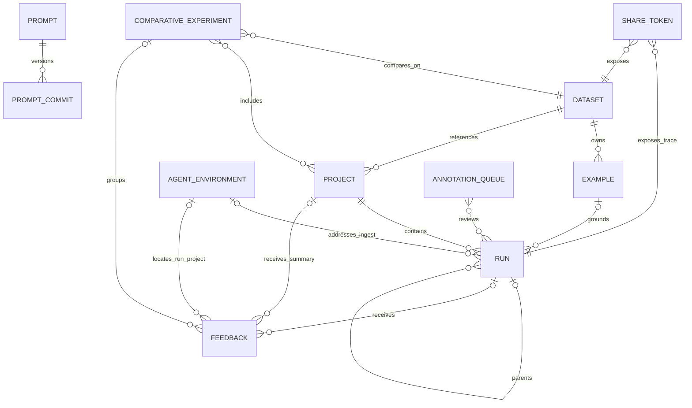
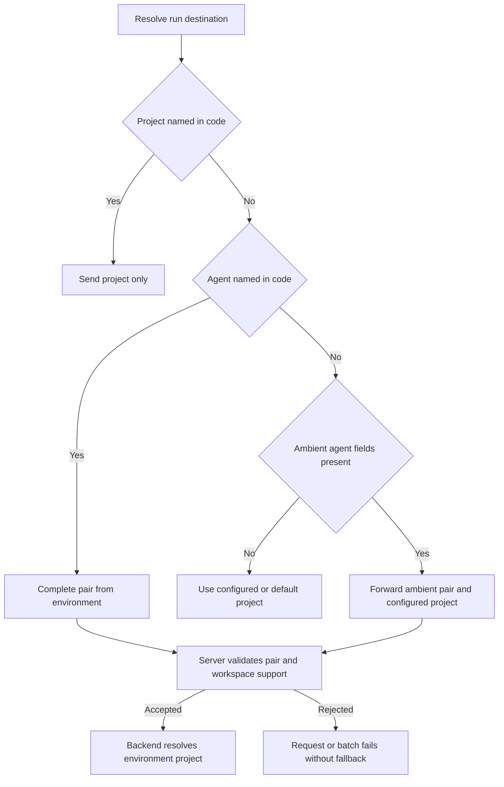
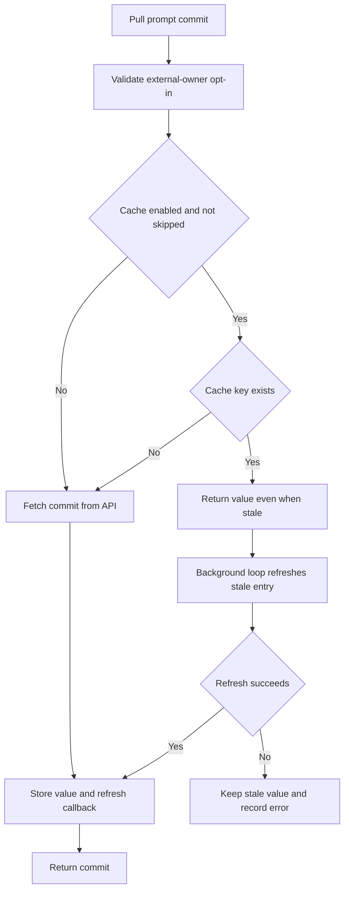

The Python `Client` and `AsyncClient` and the JavaScript `Client` are façades over a connected resource graph, not independent bags of CRUD methods. A safe change starts by identifying which resource owns the state, which IDs are foreign keys, and whether the operation belongs to a handwritten compatibility surface or a generated resource.

Configuration, authentication, endpoint normalization, retries, and headers are covered in [Client Configuration, Endpoints, and Authentication](./client-configuration-and-auth.md). Evaluation orchestration that consumes these resources is covered in [Evaluation and Experiments](../workflows/evaluation-and-experiments.md).

## Resource map

```mermaid
erDiagram
    PROJECT ||--o{ RUN : contains
    AGENT_ENVIRONMENT o|--o{ RUN : addresses_ingest
    DATASET ||--o{ EXAMPLE : owns
    DATASET ||--o{ PROJECT : references
    EXAMPLE o|--o{ RUN : grounds
    RUN o|--o{ RUN : parents
    RUN o|--o{ FEEDBACK : receives
    PROJECT o|--o{ FEEDBACK : receives_summary
    AGENT_ENVIRONMENT o|--o{ FEEDBACK : locates_run_project
    COMPARATIVE_EXPERIMENT }o--|| DATASET : compares_on
    COMPARATIVE_EXPERIMENT }o--o{ PROJECT : includes
    COMPARATIVE_EXPERIMENT o|--o{ FEEDBACK : groups
    ANNOTATION_QUEUE }o--o{ RUN : reviews
    PROMPT ||--o{ PROMPT_COMMIT : versions
    SHARE_TOKEN }o--|| RUN : exposes_trace
    SHARE_TOKEN }o--|| DATASET : exposes
```

*Current schema identifiers connect the domains. `AGENT_ENVIRONMENT` denotes the beta `agent_id` plus `agent_environment` addressing pair: it selects an ingestion destination, while the backend still resolves the stored run to a project.*

The important ownership boundaries are:

| Domain | Owner and identifiers | What the client resolves or preserves |
| --- | --- | --- |
| Runs, projects, and agents | A project is the API's `session`; a stored `Run.session_id` is its project ID. Runs form traces through `trace_id`, `parent_run_id`, and `dotted_order`. Beta ingestion can instead address the run with `agent_id` plus `agent_environment`; the backend resolves that pair to an environment project. | Project names resolve to UUIDs before queries. Agent addressing is an alternative destination, not a second owner: explicit project and explicit agent inputs are mutually exclusive, and incomplete or unsupported agent addressing fails rather than silently falling back. Loading children remains explicit and rebuilds `child_runs` from the trace. |
| Datasets and examples | Every `Example` has a `dataset_id`; an example may record `source_run_id`. A run may point back through `reference_example_id`. | Dataset names are conveniences at the edge. Multipart create/update endpoints are dataset-scoped, so batches must retain one correct dataset ID; attachments travel with each example part. Dataset versions are selected by timestamp or tag. |
| Feedback | Feedback has its own ID and targets either a run (`run_id`, optionally `trace_id`) or a project (`session_id`) for a summary metric. It may retain `comparative_experiment_id`, `feedback_group_id`, and evaluator provenance in `feedback_source.metadata.__run`. | Creation rejects providing neither a run/trace nor a project, and rejects a run/trace together with `project_id`. For an agent-addressed run, callers pass that run's `agent_id` and optional `agent_environment` instead of project context; the client never reads ambient agent variables for feedback. |
| Experiments | An experiment is represented by a project whose `reference_dataset_id` identifies the evaluated dataset. A comparative experiment contains experiment/project IDs and one reference dataset ID. | If the comparative call omits the dataset ID, the client derives it from the first experiment project. Keep these IDs aligned; comparison feedback uses the comparative experiment ID, not a project ID. |
| Annotation queues | A queue owns review membership and rubric metadata; its members are runs. | Modern membership uses a `RunKey`: `run_id`, `session_id`, and `start_time`, with optional `source_proposed_example_id`. These partition fields avoid scanning for a bare run UUID. Legacy bare-ID insertion remains a deprecated route. |
| Prompts and Hub | A prompt repository is addressed as `owner/name`; a commit adds `:hash` or `:tag`, with `latest` as the default. An unqualified name uses owner `-` for the current tenant. | Metadata belongs to the repository; serialized prompt content belongs to commits. Push creates or patches the repo, then creates a commit and optional commit tags. Owner checks prevent mutating another tenant's repository. Agents and skills reuse the Hub identifier grammar but store directory/file commits rather than prompt manifests. |
| Sharing | Sharing mints a bearer token over an existing trace or dataset; it does not clone the resource. Sharing a child run through the generated run resource shares its trace root. | Generated run sharing uses `runs.share.create` and `runs.share.delete`; public run reads use `public.runs`. Dataset sharing remains on handwritten `/datasets/{dataset_id}/share` and `/public/...` methods. Presigned feedback tokens are narrower capabilities tied to a run and feedback key. |
| Threads | A thread is a grouping over runs inside a project, keyed by `thread_id`, rather than an independently created handwritten-client object. | Thread reads require project context and translate to run filtering; grouped thread queries return aggregate count and representative run fields. New generated `threads` resources own the current query surface. |

These relationships are schema-level contracts: projects are also sessions; runs carry project, trace, example, and beta agent-addressing keys; examples carry dataset and source-run keys; and feedback has separate target, location, grouping, and provenance fields. In particular, `FeedbackBase.agent_id` is mutually exclusive with `session_id` and is documented as copied from the described run rather than ambient configuration. [run addressing keys](repo://python/langsmith/schemas.py#L540-L575) [feedback relationships](repo://python/langsmith/schemas.py#L625-L679)

## Handwritten façade versus generated resources

The repository is in a generated-resource migration. Handwritten methods still cover projects, examples, feedback, prompts, dataset sharing, composition, and compatibility, while generated resources expose current runs, traces, threads, public runs, dataset-v2 operations, and annotation-queue items. JavaScript getters (`runs`, `datasets`, `threads`, `traces`, `public`, `annotationQueues`) return generated resources after backend-version checks: most require `0.16.0`, while annotation-queue items require `0.16.14`. Python `Client` deliberately exposes asynchronous generated resources for these domains alongside its synchronous handwritten methods. [JavaScript resource getters](repo://js/src/client.ts#L1765-L1809) [Python generated resource boundary](repo://python/langsmith/client.py#L1607-L1709)

This boundary matters when extending or operating the SDK:

- Put an operation represented by the generated surface into that resource and expose it through the façade; do not add another handwritten transport path for naming symmetry. Keep handwritten code for cross-resource composition, legacy normalization, prompt manifests, and compatibility behavior.
- Migrate run reads, queries, and URLs to `runs.retrieve`, `runs.query`, and `runs.get_url` or `getURL`; migrate thread operations to `threads.list_traces` or `listTraces` and `threads.query`; migrate run sharing to `runs.share.create` / `delete`, share-link reads to `runs.retrieve` with `SHARE_URL`, and public reads to `public.runs`.
- The corresponding handwritten run, thread, sharing, and public-run methods warn now and state that they will be removed after **January 31, 2027**. Internal compositions call warning-free helpers so users do not receive warnings for deprecated methods they did not invoke. [run and thread migration](repo://js/src/client.ts#L3186-L3217) [query migration](repo://js/src/client.ts#L3311-L3412) [sharing migration](repo://js/src/client.ts#L3872-L3973)
- Annotation-queue `runs` membership methods and legacy queue status/count helpers have the same January 31, 2027 deadline. Use generated `annotationQueues.items` / `annotation_queues.items` routes: create under `/api/v1/platform/annotation-queues/{queue_id}/items`, update or inspect an item by its item ID, create status at `/api/v1/platform/annotation-queues/items/{queue_item_id}/status`, count at `/items/count`, and bulk-delete at `/items/delete`. [generated queue deprecations](repo://js/src/_openapi_client/resources/annotation-queues/runs.ts#L14-L81) [generated queue status and count migration](repo://python/langsmith/_openapi_client/resources/annotation_queues/annotation_queues.py#L274-L640)

## Name resolution and cross-resource invariants

Most methods accepting `id` or `name` require exactly one. They resolve a name once, then issue the resource operation using its UUID. Projects use `/sessions`; datasets use `/datasets`. This makes UUIDs—not mutable display names—the stable join keys. A missing name produces a not-found failure, malformed UUIDs fail locally where validation is available, and ambiguous `id` plus `name` input is rejected before transport. [project resolution](repo://js/src/client.ts#L4251-L4339) [dataset resolution](repo://js/src/client.ts#L4579-L4611)

Example writes make the dataset boundary especially visible. A create resolves `dataset_name` to `dataset_id`, sends a dataset-scoped multipart request, and reads returned example IDs back as full objects. Updates without `dataset_id` first read the example to recover its owner. The multi-update helper assumes the first example's dataset applies to the entire batch, so callers and maintainers must not silently mix datasets. [example create and batch resolution](repo://js/src/client.ts#L4856-L5031) [example update ownership](repo://js/src/client.ts#L5268-L5309) [multipart endpoint](repo://js/src/client.ts#L7038-L7055)

Runs preserve three different notions that should not be substituted:

- `session_id`: project ownership and partition context;
- `trace_id`: all spans in one nested execution;
- `thread_id`: application-level grouping across traces, stored and queried as run metadata.

A run may additionally bind evaluation output to `reference_example_id`. Child hydration queries by project and trace, then uses `parent_run_id` and `dotted_order`; a child lacking a parent is treated as invalid data. [child hydration](repo://js/src/client.ts#L3270-L3308) [thread filtering](repo://js/src/client.ts#L3600-L3636)

## Beta agent addressing

Python tracing supports `agent_id` plus `agent_environment` as a first-class alternative to project addressing. The pair can come from an explicit call or tracing context, a parent run, `langsmith.configure`, or `LANGSMITH_AGENT_ID` and `LANGSMITH_AGENT_ENVIRONMENT`. A code-level choice outranks environment configuration: an explicit project removes an ambient agent, while an explicit agent removes an ambient project. If code supplies only half of the agent pair, the other half may be completed from its environment variable. [central resolution](repo://python/langsmith/_internal/_agent_addressing.py#L18-L106)

```mermaid
flowchart TD
    Start["Resolve run destination"] --> Project{"Project named in code"}
    Project -->|Yes| UseProject["Send project only"]
    Project -->|No| Agent{"Agent named in code"}
    Agent -->|Yes| Complete["Complete pair from environment"]
    Agent -->|No| Ambient{"Ambient agent fields present"}
    Ambient -->|No| Default["Use configured or default project"]
    Ambient -->|Yes| Forward["Forward ambient pair and configured project"]
    Complete --> Validate["Server validates pair and workspace support"]
    Forward --> Validate
    Validate -->|Accepted| ResolveProject["Backend resolves environment project"]
    Validate -->|Rejected| Lost["Request or batch fails without fallback"]
```

*Run creation selects one addressing mode; malformed, conflicting, or unsupported agent addressing is surfaced rather than relocated to another project.*

The safety invariants are deliberate:

- **One explicit destination.** A call that explicitly names both project and agent is rejected locally. A project and agent both supplied through ambient configuration are forwarded so the endpoint reports the conflict; the SDK does not guess. Agent-addressed payloads omit `session_name` and `session_id`. [conflict handling](repo://python/langsmith/_internal/_agent_addressing.py#L180-L214) [payload transformation](repo://python/langsmith/_internal/_agent_addressing.py#L217-L274)
- **A valid pair is required.** A lone `agent_environment` still selects agent mode so it cannot fall through to `default`; incomplete pairs, unknown environment values, unsupported workspaces, and project conflicts fail at the API. Agent mode is beta, workspace-gated, and warns once when actually used. There is no silent project fallback, so failed ingestion means the trace is lost. [beta and failure contract](repo://python/langsmith/_internal/_agent_addressing.py#L35-L66) [environment diagnostics](repo://python/langsmith/_internal/_agent_addressing.py#L109-L153)
- **Create and update remain aligned.** Creates resolve explicit and ambient addressing. Updates do not consult ambient agent variables: an address-free patch inherits the destination established by its post, while a patch from an agent-addressed `RunTree` carries that tree's pair. This prevents a project-addressed post and its patch from landing in different destinations. [update behavior](repo://python/langsmith/_internal/_agent_addressing.py#L217-L248) [focused tests](repo://python/tests/unit_tests/test_client.py#L8595-L8670)
- **Feedback follows the run.** `create_feedback` never reads `LANGSMITH_AGENT_ID`. For an agent-addressed run, pass the run's `agent_id` and, when needed, `agent_environment`; this substitutes for `session_id` as location context but does not replace the required run or trace target. Feedback serialization preserves supplied agent fields and omits unset ones. Invalid agent/project combinations are forwarded for authoritative server validation rather than rerouted. [feedback API contract](repo://python/langsmith/client.py#L8313-L8397) [feedback construction](repo://python/langsmith/client.py#L8448-L8529) [serialization tests](repo://python/tests/unit_tests/test_client.py#L8750-L8861)
- **URL construction needs a resolved project.** There is no agent-shaped run URL. Before a run is read back, the SDK does not know which project the endpoint selected and refuses to construct a URL; after retrieval supplies `session_id`, normal project URL construction works. [URL guard](repo://python/langsmith/_internal/_agent_addressing.py#L156-L177) [URL tests](repo://python/tests/unit_tests/test_client.py#L8525-L8556)

Annotation queues strengthen the same rule. The preferred membership key includes the run UUID plus project/session and start-time partition keys. The generated queue resource should be used for new item/status workflows; the handwritten insertion method documents and implements the transition from bare IDs to `/runs/by-key`. [RunKey contract](repo://python/langsmith/schemas.py#L865-L881) [queue insertion routing](repo://js/src/client.ts#L6245-L6331)

## Iteration and pagination

List calls are lazy in both languages: Python yields iterators or async iterators, and JavaScript returns `AsyncIterable`s. Callers should consume only what they need rather than immediately materializing unbounded collections.

Two transport patterns recur:

1. **Offset pagination** for datasets, examples, projects, feedback, prompts, commits, and queues. The shared helper defaults to pages of 100, advances by the number returned, and stops on an empty or short page. A public `limit` may cap total yielded items independently of page size.
2. **Cursor pagination** for run queries and shared runs. The request body receives the server's `cursors.next`; iteration stops when the data key, cursor block, or next cursor is absent.

The JavaScript helpers yield pages internally and domain methods flatten them; Python's corresponding helpers yield records. Both route every page through the same authenticated retrying request machinery and status checks. [JavaScript pagination helpers](repo://js/src/client.ts#L1910-L2010) [Python pagination helpers](repo://python/langsmith/client.py#L2185-L2256) [example total-limit handling](repo://js/src/client.ts#L5084-L5185)

Do not assume every `limit` means “page size.” Some methods clamp a page to 100 and track a separate total count, while grouped thread queries use an explicit server `total`. Preserve the method's stopping condition when adding filters or changing response envelopes. [grouped thread iteration](repo://js/src/client.ts#L3513-L3584) [feedback-config limit](repo://js/src/client.ts#L5977-L6005)

## Prompt repositories, commits, trust, and secrets

`parseHubIdentifier` is the shared grammar: `name` becomes `-/name:latest`; `owner/name:version` preserves all three components and malformed slash/colon layouts fail locally. Pull fetches a `PromptCommit` containing the resolved owner, repository, commit hash, manifest, examples, and optional model configuration. The cache key includes the exact caller identifier and adds `:with_model` when model data was requested, preventing model-bearing and prompt-only responses from colliding. [identifier parsing](repo://js/src/utils/prompts.ts#L3-L35) [commit shape](repo://python/langsmith/schemas.py#L1008-L1028) [pull and cache key](repo://js/src/client.ts#L7254-L7301)

**Pulled manifests are executable configuration, not trusted text.** Both clients reject an explicit external `owner/name` pull before any network request unless the caller opts in with `dangerously_pull_public_prompt` / `dangerouslyPullPublicPrompt`. Trust the reviewed contents, not merely the publisher; pin a commit instead of following mutable `latest`, and avoid `include_model` for external prompts because model configuration can affect endpoints, headers, model names, and constructor behavior. [Python trust gate](repo://python/langsmith/client.py#L463-L473) [JavaScript trust gate](repo://js/src/client.ts#L124-L134) [focused no-request test](repo://python/tests/unit_tests/test_client.py#L4378-L4417)

Python adds a secret-resolution boundary during LangChain deserialization. Explicit serialized secret references use only the supplied `secrets` map by default; environment lookup requires `secrets_from_env=True`. If a manifest contains a secret marker and neither source is enabled, loading raises an explanatory error. This control does **not** prevent a deserialized model integration from independently using its normal environment credential defaults, so it is not a sandbox. Where supported, loading limits allowed objects to `core` unless `include_model=True`. [manifest processing safeguards](repo://python/langsmith/client.py#L476-L550) [public pull security contract](repo://python/langsmith/client.py#L10089-L10168)

## Prompt cache lifecycle

```mermaid
flowchart TD
    Pull["Pull prompt commit"] --> Trust["Validate external-owner opt-in"]
    Trust --> Skip{"Cache enabled and not skipped"}
    Skip -->|No| API["Fetch commit from API"]
    Skip -->|Yes| Hit{"Cache key exists"}
    Hit -->|Yes| Stale["Return value even when stale"]
    Hit -->|No| API
    API --> Store["Store value and refresh callback"]
    Store --> Return["Return commit"]
    Stale --> Refresh["Background loop refreshes stale entry"]
    Refresh --> Good{"Refresh succeeds"}
    Good -->|Yes| Store
    Good -->|No| Keep["Keep stale value and record error"]
```

*Prompt pulls use stale-while-revalidate caching, but the trust gate runs before cache lookup.*

Caching is enabled by default and uses a process-global cache unless disabled for a client; the legacy custom `cache` constructor option remains for compatibility. Entries are LRU-evicted at the configured maximum. Reads update recency and the refresh callback, stale entries are served immediately, and a background thread (Python) or unref'ed timer (JavaScript) refreshes them. Refresh failures increment metrics and retain stale data. Set maximum size to zero to disable storage, use infinite TTL for offline/static behavior, and stop or shut down a custom cache during cleanup. [JavaScript client cache selection](repo://js/src/client.ts#L1469-L1497) [Python stale-while-revalidate core](repo://python/langsmith/prompt_cache.py#L117-L195) [background refresh behavior test](repo://python/tests/unit_tests/test_prompt_cache.py#L150-L199)

Caches can be dumped to JSON and loaded for offline use. Writes use a temporary file and rename; missing or malformed files load zero entries; loaded entries receive a fresh TTL and no refresh callback until a client next accesses them. These files contain complete prompt manifests and optional model configuration, so protect and review them as executable configuration and never treat cache persistence as a secret store. JavaScript browser builds replace filesystem calls with no-ops. [Python persistence](repo://python/langsmith/prompt_cache.py#L197-L292) [JavaScript persistence and browser boundary](repo://js/src/utils/prompt_cache/index.ts#L1-L10) [JavaScript dump/load](repo://js/src/utils/prompt_cache/index.ts#L238-L302)

## Sharing and capability boundaries

Sharing does not clone resources. The generated `runs.share.create` posts to `/api/v2/runs/{run_id}/share`; if the input is a child run, the token shares the trace root. Deletion at `/api/v2/runs/{trace_id}/share` is idempotent and removes the token association. The generated response carries `share_token`; a public URL is only a presentation form built around that token. Public reads belong to `public.runs`, and `runs.retrieve` with `SHARE_URL` replaces the legacy shared-link read. [generated run sharing](repo://js/src/_openapi_client/resources/runs/share.ts#L10-L69) [legacy migration deadline](repo://python/langsmith/client.py#L4946-L5037)

Dataset sharing remains handwritten: `PUT /datasets/{dataset_id}/share` exposes the existing dataset, `DELETE` revokes it, and `/public/{token}/datasets` plus `/public/{token}/examples` read the shared dataset and examples. No dataset or example is copied. [dataset share lifecycle](repo://python/langsmith/client.py#L5126-L5275)

Presigned feedback tokens are deliberately separate from broad share links and API keys. They bind authorization to one run and feedback key, default to a short expiration, and allow browser feedback submission without exposing the workspace credential. Treat every share or feedback token as a bearer capability: avoid logging it and revoke or expire it when no longer needed. [feedback-token scope](repo://js/src/client.ts#L5668-L5724)

## Focused change checklist

When changing a platform operation:

1. Identify the owning resource and retain every foreign key through request mapping and response normalization.
2. Resolve names only at the façade boundary; pass UUIDs across internal calls.
3. Preserve exactly one run destination. Test project-only, complete and partial agent pairs, explicit-versus-ambient precedence, create/update consistency, server rejection without fallback, feedback location, and URL refusal before `session_id` is known.
4. Choose generated OpenAPI resource or handwritten composition deliberately, including the backend-version gate and the January 31, 2027 migration deadline.
5. Preserve pagination envelope, page size, total-limit behavior, and cursor/offset stopping rules.
6. Keep public prompt trust validation before both network and cache access; keep `include_model` in cache identity.
7. Test no-request validation failures, exact route/body serialization, pagination across more than one page, and cross-resource IDs. For prompt caching, test LRU eviction, stale refresh success/failure, persistence, cache disabling, and global-cache sharing.

Representative tests enforce generated-resource wiring and transport configuration, reject public prompt pulls before transport, and verify stale values survive refresh failures. [generated-resource wiring](repo://python/tests/unit_tests/test_client.py#L933-L1036) [prompt trust test](repo://python/tests/unit_tests/test_client.py#L4378-L4417) [cache refresh tests](repo://python/tests/unit_tests/test_prompt_cache.py#L150-L220)
