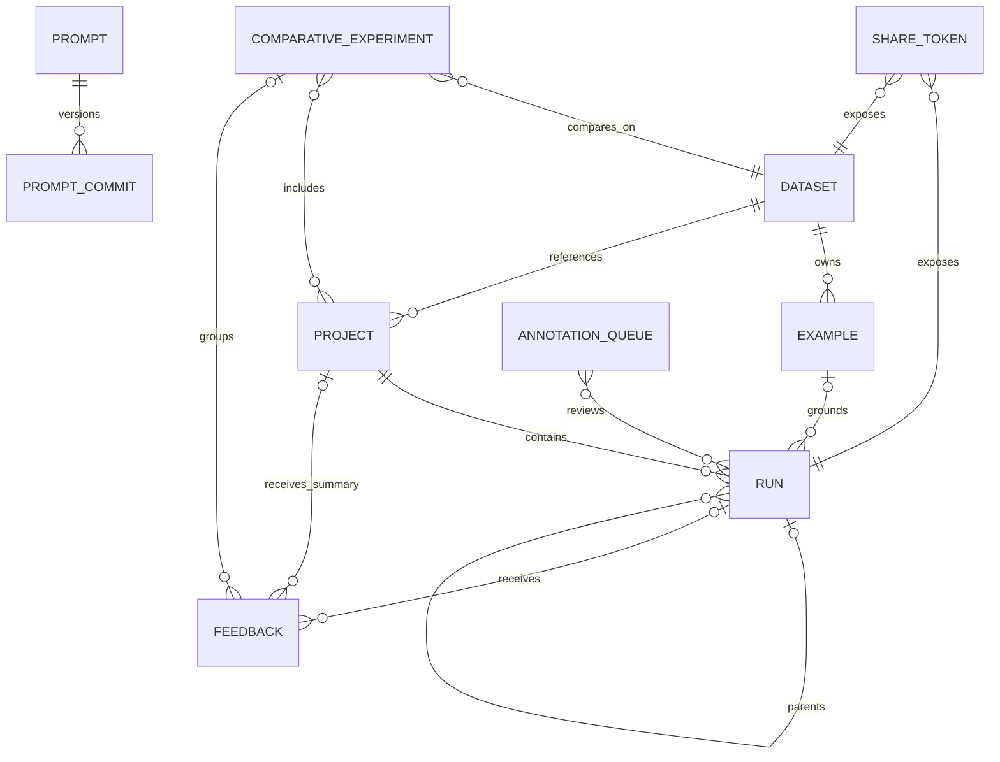
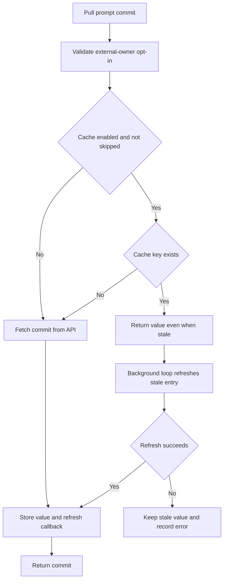

The Python `Client` and `AsyncClient` and the JavaScript `Client` are façades over a connected resource graph, not independent bags of CRUD methods. A safe change starts by identifying which resource owns the state, which IDs are foreign keys, and whether the operation belongs to a handwritten compatibility surface or a generated resource.

Configuration, authentication, endpoint normalization, retries, and headers are covered in [Client Configuration, Endpoints, and Authentication](./client-configuration-and-auth.md). Evaluation orchestration that consumes these resources is covered in [Evaluation and Experiments](../workflows/evaluation-and-experiments.md).

## Resource map

```mermaid
erDiagram
    PROJECT ||--o{ RUN : contains
    DATASET ||--o{ EXAMPLE : owns
    DATASET ||--o{ PROJECT : references
    EXAMPLE o|--o{ RUN : grounds
    RUN o|--o{ RUN : parents
    RUN o|--o{ FEEDBACK : receives
    PROJECT o|--o{ FEEDBACK : receives_summary
    COMPARATIVE_EXPERIMENT }o--|| DATASET : compares_on
    COMPARATIVE_EXPERIMENT }o--o{ PROJECT : includes
    COMPARATIVE_EXPERIMENT o|--o{ FEEDBACK : groups
    ANNOTATION_QUEUE }o--o{ RUN : reviews
    PROMPT ||--o{ PROMPT_COMMIT : versions
    SHARE_TOKEN }o--|| RUN : exposes
    SHARE_TOKEN }o--|| DATASET : exposes
```

*The durable identifiers that connect platform domains; optional links reflect APIs that permit more than one feedback target or provenance path.*

The important ownership boundaries are:

| Domain | Owner and identifiers | What the client resolves or preserves |
| --- | --- | --- |
| Runs and projects | A project is the API's `session`; `Run.session_id` is its project ID. Runs form traces through `trace_id`, `parent_run_id`, and `dotted_order`. | Name-based project inputs are resolved to project UUIDs before run queries. Loading children is explicit and heavier: the client queries the trace, orders descendants, and rebuilds `child_runs`. |
| Datasets and examples | Every `Example` has a `dataset_id`; an example may record `source_run_id`. A run may point back through `reference_example_id`. | Dataset names are conveniences at the edge. Multipart create/update endpoints are dataset-scoped, so batches must retain one correct dataset ID; attachments travel with each example part. Dataset versions are selected by timestamp or tag. |
| Feedback | Feedback has its own ID and targets either a run/trace or a project summary. For run feedback, `session_id` is the containing project partition, `trace_id` identifies the trace, and `start_time` is an optional lookup accelerator; `comparative_experiment_id`, `feedback_group_id`, and evaluator source-run provenance remain separate identities. | Creation rejects a missing target and rejects combining a run/trace target with `project_id`. Run feedback now requires project context (`session_id`) or a beta run `address`; compatibility overloads without either are gated by backend capability before feedback transport. |
| Experiments | An experiment is represented by a project whose `reference_dataset_id` identifies the evaluated dataset. A comparative experiment contains experiment/project IDs and one reference dataset ID. | If the comparative call omits the dataset ID, the client derives it from the first experiment project. Keep these IDs aligned; comparison feedback uses the comparative experiment ID, not a project ID. |
| Annotation queues | A queue owns review membership and rubric metadata; its members are runs. | Modern membership uses a `RunKey`: `run_id`, `session_id`, and `start_time`, with optional `source_proposed_example_id`. These partition fields avoid scanning for a bare run UUID. Legacy bare-ID insertion remains a deprecated route. |
| Prompts and Hub | A prompt repository is addressed as `owner/name`; a commit adds `:hash` or `:tag`, with `latest` as the default. An unqualified name uses owner `-` for the current tenant. | Metadata belongs to the repository; serialized prompt content belongs to commits. Push creates or patches the repo, then creates a commit and optional commit tags. Owner checks prevent mutating another tenant's repository. Agents and skills reuse the Hub identifier grammar but store directory/file commits rather than prompt manifests. |
| Sharing | Sharing creates a token attached to an existing run trace or dataset; it is distinct from explicitly cloning a public dataset into a tenant. | Modern run sharing is generated under `runs.share`: creation can carry run, trace, and project partition context, while deletion addresses the trace and project. Legacy Python public-run readers accept a token or public URL; generated public-run APIs and JavaScript legacy readers take the token. Dataset sharing exposes the dataset and examples, and unsharing deletes only the share association. Presigned feedback tokens are narrower capabilities tied to a run and feedback key. |
| Threads | A thread is a grouping over runs inside a project, keyed by `thread_id`, rather than an independently created handwritten-client object. | Thread reads require project context and translate to run filtering; grouped thread queries return aggregate count and representative run fields. New generated `threads` resources own the current query surface. |

These relationships are explicit in the schemas: projects are also called sessions, runs carry project/trace/example keys, examples carry dataset/source-run keys, and comparative feedback has a separate comparison identifier. [run and trace keys](repo://python/langsmith/schemas.py#L307-L354) [project and reference dataset](repo://python/langsmith/schemas.py#L704-L725) [dataset/example ownership](repo://python/langsmith/schemas.py#L82-L149) [feedback targets](repo://python/langsmith/schemas.py#L616-L650) [comparative experiment](repo://python/langsmith/schemas.py#L972-L998)

## Handwritten façade versus generated resources

The repository is in a migration period. The clients still implement broad handwritten methods for projects, examples, feedback, prompts, sharing, and compatibility, while current run, thread, public-run, dataset-v2, and annotation-queue APIs are exposed through generated resources. JavaScript getters such as `runs`, `datasets`, `threads`, and `annotationQueues` return the generated OpenAPI client after checking the backend version. Python does the same for async generated resources, even on `Client`, while retaining synchronous handwritten methods alongside them. [JavaScript resource getters](repo://js/src/client.ts#L1752-L1784) [Python generated resource boundary](repo://python/langsmith/client.py#L1596-L1685)

This boundary matters when extending the SDK:

- Put operations already represented in `openapi/openapi.yaml` into the generated resource layer and expose them through the façade; do not create a second handwritten transport path merely for naming symmetry.
- Preserve handwritten methods when they compose resources, normalize legacy signatures, process manifests, construct app URLs, or implement compatibility behavior not expressed by the wire schema.
- Follow deprecation pointers. For example, JavaScript `readRun` and `listRuns` delegate to internal warning-free helpers, while supported internal callers avoid emitting a warning for a deprecated method the user did not call. [run compatibility surface](repo://js/src/client.ts#L3173-L3204) [run query migration](repo://js/src/client.ts#L3298-L3399)

## Name resolution and cross-resource invariants

Most methods accepting `id` or `name` require exactly one. They resolve a name once, then issue the resource operation using its UUID. Projects use `/sessions`; datasets use `/datasets`. This makes UUIDs—not mutable display names—the stable join keys. A missing name produces a not-found failure, malformed UUIDs fail locally where validation is available, and ambiguous `id` plus `name` input is rejected before transport. [project resolution](repo://js/src/client.ts#L4251-L4339) [dataset resolution](repo://js/src/client.ts#L4579-L4611)

Example writes make the dataset boundary especially visible. A create resolves `dataset_name` to `dataset_id`, sends a dataset-scoped multipart request, and reads returned example IDs back as full objects. Updates without `dataset_id` first read the example to recover its owner. The multi-update helper assumes the first example's dataset applies to the entire batch, so callers and maintainers must not silently mix datasets. [example create and batch resolution](repo://js/src/client.ts#L4856-L5031) [example update ownership](repo://js/src/client.ts#L5268-L5309) [multipart endpoint](repo://js/src/client.ts#L7038-L7055)

Runs preserve three different notions that should not be substituted:

- `session_id`: project ownership and partition context;
- `trace_id`: all spans in one nested execution;
- `thread_id`: application-level grouping across traces, stored and queried as run metadata.

A run may additionally bind evaluation output to `reference_example_id`. Child hydration queries by project and trace, then uses `parent_run_id` and `dotted_order`; a child lacking a parent is treated as invalid data. [child hydration](repo://js/src/client.ts#L3257-L3295) [thread filtering](repo://js/src/client.ts#L3587-L3623)

### Feedback target and partition checks

The target choice and the lookup partition are related but not interchangeable. Python treats `trace_id` as the run target when `run_id` is absent; it rejects requests with none of `run_id`, `trace_id`, and `project_id`, while JavaScript requires `runId` or `projectId`. Both reject a run target together with `project_id`. Project-summary feedback serializes that project as `session_id` with no run. Run feedback serializes its containing project separately as `session_id`; `trace_id` does not replace that project partition. An experimental `address` can locate an addressed run instead, but it conflicts with project/session context and is not inferred from ambient configuration. [Python target normalization and checks](repo://python/langsmith/client.py#L8441-L8455) [JavaScript target checks and request mapping](repo://js/src/client.ts#L5579-L5627)

The params-object JavaScript overload makes `sessionId` mandatory for a normal run at the type boundary. Legacy JavaScript and both Python clients still accept run feedback without `session_id` for compatibility, but first inspect server info: a SmithDB-only deployment raises locally after `/info` and never sends `/feedback`; other deployments emit a deprecation warning and continue. Supplying `session_id` or an `address` skips that capability check. `start_time` remains optional, although providing it improves partition lookup performance. [JavaScript input union](repo://js/src/client.ts#L567-L629) [JavaScript capability gate](repo://js/src/client.ts#L2482-L2507) [Python capability gate](repo://python/langsmith/client.py#L778-L794) [focused transport test](repo://js/src/tests/client.test.ts#L324-L416)

Feedback provenance is another foreign-key axis: `source_run_id` is stored under `feedback_source.metadata.__run`, while `comparative_experiment_id` and `feedback_group_id` identify a comparison and a preference group. None of these is the target run, trace, or project. Keep them intact when normalizing evaluator results. [feedback schema](repo://python/langsmith/schemas.py#L619-L655) [Python source-run mapping](repo://python/langsmith/client.py#L8462-L8499)

Annotation queues strengthen the same rule. The preferred membership key includes the run UUID plus project/session and start-time partition keys. The generated queue resource should be used for new item/status workflows; the handwritten insertion method documents and implements the transition from bare IDs to `/runs/by-key`. [RunKey contract](repo://python/langsmith/schemas.py#L865-L881) [queue insertion routing](repo://js/src/client.ts#L6245-L6331)

## Iteration and pagination

List calls are lazy in both languages: Python yields iterators or async iterators, and JavaScript returns `AsyncIterable`s. Callers should consume only what they need rather than immediately materializing unbounded collections.

Two transport patterns recur:

1. **Offset pagination** for datasets, examples, projects, feedback, prompts, commits, and queues. The shared helper defaults to pages of 100, advances by the number returned, and stops on an empty or short page. A public `limit` may cap total yielded items independently of page size.
2. **Cursor pagination** for run queries and shared runs. The request body receives the server's `cursors.next`; iteration stops when the data key, cursor block, or next cursor is absent.

The JavaScript helpers yield pages internally and domain methods flatten them; Python's corresponding helpers yield records. Both route every page through the same authenticated retrying request machinery and status checks. [JavaScript pagination helpers](repo://js/src/client.ts#L1910-L2010) [Python pagination helpers](repo://python/langsmith/client.py#L2185-L2256) [example total-limit handling](repo://js/src/client.ts#L5084-L5185)

Do not assume every `limit` means “page size.” Some methods clamp a page to 100 and track a separate total count, while grouped thread queries use an explicit server `total`. Preserve the method's stopping condition when adding filters or changing response envelopes. [grouped thread iteration](repo://js/src/client.ts#L3513-L3584) [feedback-config limit](repo://js/src/client.ts#L5977-L6005)

## Prompt repositories, commits, trust, and secrets

`parseHubIdentifier` is the shared grammar: `name` becomes `-/name:latest`; `owner/name:version` preserves all three components and malformed slash/colon layouts fail locally. Pull fetches a `PromptCommit` containing the resolved owner, repository, commit hash, manifest, examples, and optional model configuration. The cache key includes the exact caller identifier and adds `:with_model` when model data was requested, preventing model-bearing and prompt-only responses from colliding. [identifier parsing](repo://js/src/utils/prompts.ts#L3-L35) [commit shape](repo://python/langsmith/schemas.py#L1008-L1028) [pull and cache key](repo://js/src/client.ts#L7254-L7301)

**Pulled manifests are executable configuration, not trusted text.** Both clients reject an explicit external `owner/name` pull before any network request unless the caller opts in with `dangerously_pull_public_prompt` / `dangerouslyPullPublicPrompt`. Trust the reviewed contents, not merely the publisher; pin a commit instead of following mutable `latest`, and avoid `include_model` for external prompts because model configuration can affect endpoints, headers, model names, and constructor behavior. [Python trust gate](repo://python/langsmith/client.py#L463-L473) [JavaScript trust gate](repo://js/src/client.ts#L124-L134) [focused no-request test](repo://python/tests/unit_tests/test_client.py#L4378-L4417)

Python adds a secret-resolution boundary during LangChain deserialization. Explicit serialized secret references use only the supplied `secrets` map by default; environment lookup requires `secrets_from_env=True`. If a manifest contains a secret marker and neither source is enabled, loading raises an explanatory error. This control does **not** prevent a deserialized model integration from independently using its normal environment credential defaults, so it is not a sandbox. Where supported, loading limits allowed objects to `core` unless `include_model=True`. [manifest processing safeguards](repo://python/langsmith/client.py#L476-L550) [public pull security contract](repo://python/langsmith/client.py#L10089-L10168)

## Prompt cache lifecycle

```mermaid
flowchart TD
    Pull["Pull prompt commit"] --> Trust["Validate external-owner opt-in"]
    Trust --> Skip{"Cache enabled and not skipped"}
    Skip -->|No| API["Fetch commit from API"]
    Skip -->|Yes| Hit{"Cache key exists"}
    Hit -->|Yes| Stale["Return value even when stale"]
    Hit -->|No| API
    API --> Store["Store value and refresh callback"]
    Store --> Return["Return commit"]
    Stale --> Refresh["Background loop refreshes stale entry"]
    Refresh --> Good{"Refresh succeeds"}
    Good -->|Yes| Store
    Good -->|No| Keep["Keep stale value and record error"]
```

*Prompt pulls use stale-while-revalidate caching, but the trust gate runs before cache lookup.*

Caching is enabled by default and uses a process-global cache unless disabled for a client; the legacy custom `cache` constructor option remains for compatibility. Entries are LRU-evicted at the configured maximum. Reads update recency and the refresh callback, stale entries are served immediately, and a background thread (Python) or unref'ed timer (JavaScript) refreshes them. Refresh failures increment metrics and retain stale data. Set maximum size to zero to disable storage, use infinite TTL for offline/static behavior, and stop or shut down a custom cache during cleanup. [JavaScript client cache selection](repo://js/src/client.ts#L1469-L1497) [Python stale-while-revalidate core](repo://python/langsmith/prompt_cache.py#L117-L195) [background refresh behavior test](repo://python/tests/unit_tests/test_prompt_cache.py#L150-L199)

Caches can be dumped to JSON and loaded for offline use. Writes use a temporary file and rename; missing or malformed files load zero entries; loaded entries receive a fresh TTL and no refresh callback until a client next accesses them. These files contain complete prompt manifests and optional model configuration, so protect and review them as executable configuration and never treat cache persistence as a secret store. JavaScript browser builds replace filesystem calls with no-ops. [Python persistence](repo://python/langsmith/prompt_cache.py#L197-L292) [JavaScript persistence and browser boundary](repo://js/src/utils/prompt_cache/index.ts#L1-L10) [JavaScript dump/load](repo://js/src/utils/prompt_cache/index.ts#L238-L302)

## Sharing and capability boundaries

Sharing does not clone resources. The handwritten run methods `shareRun` / `share_run`, `unshareRun` / `unshare_run`, shared-link reads, and public-run reads are deprecated in favor of generated `runs.share`, run `SHARE_URL` selection, and `public.runs`. The generated create operation mints or returns a share token for the run's trace root and accepts `session_id` plus `trace_id` so SmithDB can locate the partition; generated deletion uses the trace ID plus `session_id` and is idempotent. The legacy endpoint still associates a token directly through the run ID and DELETE removes that association. [generated JavaScript run sharing](repo://js/src/_openapi_client/resources/runs/share.ts#L10-L69) [legacy JavaScript sharing and revocation](repo://js/src/client.ts#L3924-L4007) [partitioned integration test](repo://js/src/tests/runs_share.int.test.ts#L42-L94)

A dataset share likewise PUTs the existing `dataset_id` and returns a public URL; DELETE revokes the share without deleting the dataset. Public dataset reads expose that dataset and its examples. This is different from `clonePublicDataset`, which reads the public dataset and examples and creates new tenant-owned resources. Python's legacy run and dataset readers parse either a UUID token or a public URL, including hosted UI-to-API host translation; generated public-run methods and JavaScript handwritten public readers expect an extracted token. Do not pass an arbitrary public URL where the selected surface requires a UUID. [dataset sharing and revocation](repo://python/langsmith/client.py#L5164-L5269) [token and URL parsing](repo://python/langsmith/client.py#L618-L644) [JavaScript clone flow](repo://js/src/client.ts#L7907-L7973)

Share tokens and public URLs are bearer capabilities even though the client may still send its ordinary headers to public routes. Presigned feedback tokens are a separate, narrower capability: token creation binds authorization to one run and feedback key, defaults to a three-hour expiry, and lets a browser submit feedback without receiving a workspace API key. The Python submission path accepts a token or URL but rejects a parsed source API URL different from the client's API URL before POSTing. Avoid logging either class of token; revoke a share or let feedback capabilities expire when no longer needed. [JavaScript feedback-token contract](repo://js/src/client.ts#L5741-L5797) [Python token submission and creation](repo://python/langsmith/client.py#L8730-L8815)

## Focused change checklist

When changing a platform operation:

1. Identify the owning resource and retain every foreign key through request mapping and response normalization.
2. Resolve names only at the façade boundary; pass UUIDs across internal calls.
3. Choose generated OpenAPI resource or handwritten composition deliberately, including the backend-version gate.
4. Preserve pagination envelope, page size, total-limit behavior, and cursor/offset stopping rules.
5. Keep public prompt trust validation before both network and cache access; keep `include_model` in cache identity.
6. Test no-request validation failures, exact route/body serialization, pagination across more than one page, and cross-resource IDs. For prompt caching, test LRU eviction, stale refresh success/failure, persistence, cache disabling, and global-cache sharing.

Representative tests enforce generated-resource wiring and transport configuration, reject public prompt pulls before transport, and verify stale values survive refresh failures. [generated-resource wiring](repo://python/tests/unit_tests/test_client.py#L933-L1036) [prompt trust test](repo://python/tests/unit_tests/test_client.py#L4378-L4417) [cache refresh tests](repo://python/tests/unit_tests/test_prompt_cache.py#L150-L220)
