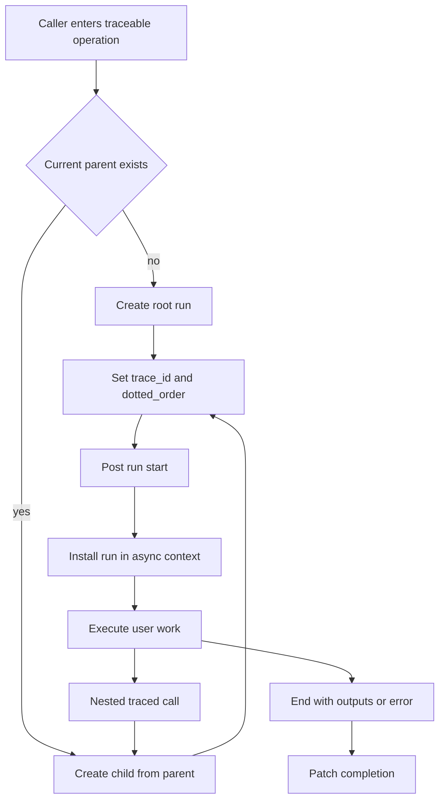

# Run Trees, Trace Identity, and Context Propagation

A **run** is the SDK's span-like record for one operation: a chain, model call, tool call, retriever, or another named unit of work. A root run represents a trace; descendants represent nested work. `RunTree` is the mutable, client-side form used while capturing that work. It owns the run payload, parent and child links, trace identity, ordering, completion fields, and routing instructions needed to post the start and patch the result.

The JavaScript and Python implementations share the same wire-level model, but their runtime context and stream wrappers differ. Code that produces runs manually should preserve the wire invariants described below rather than copying incidental wrapper behavior from one language.

## The run tree and its identities

The important fields have distinct jobs:

- `id` identifies exactly one run. When absent, both SDKs generate a UUID v7 from the run start time. Time-derived UUIDs improve temporal locality but do not replace `dotted_order`.
- `parent_run_id` is the direct structural edge to the parent. The in-memory `parent_run` reference and `child_runs` list are construction conveniences; posting normally serializes runs individually.
- `trace_id` identifies the whole trace. A root defaults it to its own `id`; a child inherits the root value from its parent.
- `dotted_order` is the complete ancestry and ordering key. Each segment combines a sortable timestamp prefix with that segment's run UUID, and child segments are appended to the parent's value with `.`.
- `start_time`, `end_time`, `inputs`, `outputs`, `error`, `events`, `extra.metadata`, `tags`, and `attachments` carry the run's lifecycle and observations.

For a tree `R -> C -> G`, the identity relation is:

```text
R.trace_id == R.id
C.trace_id == R.id
G.trace_id == R.id
C.parent_run_id == R.id
G.parent_run_id == C.id
G.dotted_order == R.segment + "." + C.segment + "." + G.segment
```

JavaScript adds an execution-order tie breaker to its millisecond clock when forming a segment and propagates the largest child execution order upward. Python has microsecond `datetime` values and clamps an explicitly supplied child `start_time` to the parent time if it is earlier. Both mechanisms protect the rule that ancestry and temporal ordering must not contradict each other.

### Batch-ingest invariants

`trace_id` and `dotted_order` are not optional conveniences on the batch path. JavaScript multipart ingestion rejects both creates and updates that omit either field. Python only admits a create to its tracing queue/compressed batch route when both are present; otherwise it falls back to the non-batched request path. Sampling also uses trace identity—first `trace_id`, then the root segment of `dotted_order`, then `id`—so every run in a trace receives a consistent sampling decision.

For safe producers and transformations:

1. Set root `trace_id` to the root `id`.
2. Preserve that exact `trace_id` on every descendant unless intentionally rerooting a replica.
3. Append one timestamp-plus-UUID segment per parent-child edge; never regenerate only the leaf segment.
4. Ensure the UUID suffix of each segment matches the corresponding run identity, including after replica remapping.
5. Include both fields on start and completion operations. A patch can race or be merged with its create in the batching queue.
6. When inputs are excluded from a patch, omit the key rather than sending `inputs: undefined` or `None`; merging an update containing the key can overwrite the create payload. Both SDKs default `LANGSMITH_EXCLUDE_INPUTS_ON_PATCH` to enabled, so inputs first added after posting require an explicit `excludeInputs: false` or `exclude_inputs=False`.

## Construction and context propagation

`createChild` / `create_child` is the direct construction entrypoint. It sets the parent link, project and client, generates or accepts the child's identity, extends `dotted_order`, and adds the child to the parent's in-memory list. Parent metadata is copied into the child and child keys win. Direct child construction does **not** universally imply tag inheritance: the tracing wrappers assemble inherited tags before calling it.

Most application code instead uses `traceable` or Python's `trace` context manager. A wrapper discovers the current parent, creates a child or a new root, posts the start, installs the child as current context while user code runs, and ends and patches it later. Nested calls therefore become children without explicitly passing a `RunTree`.



*The active async context turns nested traced work into children while preserving root trace identity and ordered ancestry.*

### JavaScript runtime context

JavaScript runs the wrapped operation through `AsyncLocalStorage`. The store contains the current `RunTree` (or a tracing-disabled placeholder), so promises, timers, and async iterators created within the scope can recover the parent. A snapshot is captured for async iterators and `ReadableStream` reads so each continuation executes under the same LangSmith and OpenTelemetry context. `withRunTree` and an explicit first `RunTree` argument are escape hatches when async-local storage is unavailable or unreliable.

The run also carries symbol-keyed LangChain context variables. `createChild` copies the context-variable object and updates copied LangChain callback state so LangChain and `traceable` nesting remain one tree. Child-completion promises let successful parents wait for nested runs before final output handling; error and cancelled iterator paths deliberately skip that wait to avoid hanging behind unfinished children.

### Python runtime context

Python uses `contextvars` for the active parent, project, tags, metadata, tracing mode, client, replicas, and distributed parent ID. The active parent is stored as a **weak reference**, preventing contexts captured by `asyncio.create_task`, `call_later`, and similar APIs from keeping completed trees alive indefinitely.

`_setup_run` takes a copied context and installs the new run there. On Python versions that support an explicit task context, async wrappers create a task with that context; older runtimes temporarily restore the tracing context around awaits. Generator iteration similarly runs each `next` or `anext` in the captured context, because generator bodies execute during iteration rather than construction.

`tracing_context` is the scoped configuration entrypoint. It can accept a `RunTree`, request headers, a dotted-order string, or `parent=False`; it merges parent tags and metadata with block-local values and restores the previous context on exit. `configure` supplies process-wide fallbacks, while context-local values take precedence during run setup.

## Metadata, tags, and distributed handoff

Metadata lives under `extra.metadata`. During direct child creation, parent metadata is merged first and explicit child metadata overwrites matching keys. Wrapper-level configuration combines invocation, active-context, and decorator metadata; tags are accumulated by the wrappers (with language-specific deduplication behavior). Treat metadata and tags as inherited annotations, not identity fields.

Across a service boundary, `toHeaders` / `to_headers` exports:

- `langsmith-trace`: the full current `dotted_order`;
- `baggage`: URL-encoded LangSmith metadata, tags, and project information.

`fromHeaders` / `from_headers` reconstructs a placeholder for the upstream run. The first dotted segment supplies `trace_id`, the last supplies `id`, and Python also recovers the immediate `parent_run_id` when one exists. The placeholder is not responsible for completing the upstream span; creating a child from it extends the same trace in the receiving process. Missing `langsmith-trace` produces no parent.

Replica routing received from baggage is treated as untrusted. Credentials and dedicated `client` objects are not propagated. JavaScript retains only header-safe routing fields. Python additionally fail-closes replica `updates` to an allow-list (defaulting to `reroot`, `metadata`, and `tags`, configurable with `LANGSMITH_BAGGAGE_ALLOWED_UPDATE_FIELDS`) and always retains `reroot`.

## Lifecycle and completion semantics

A normal run has two persistence phases:

1. `postRun()` / `post()` sends the start payload, normally excluding recursively embedded children.
2. `end()` records `end_time` and outputs or error in memory; `patchRun()` / `patch()` sends completion.

Python `patch()` calls `end()` if needed. JavaScript's `end()` is idempotent for outputs, error, and end time—the first non-null value wins—so a later cancellation marker does not overwrite an earlier stream error. Posting and patching clear or avoid recursively posting child lists on the normal independent-run path.

### Functions, generators, and streams

Completion is tied to the actual result shape, not merely function return:

| Path | Successful completion | Error or cancellation |
|---|---|---|
| JavaScript value or promise | Outputs are processed, child completion may be awaited, then the run is ended and patched. | Sync throws are converted to rejected promises; rejection is recorded as `String(error)`, completion is patched, and the original error is rethrown. Parents fail fast without waiting for unfinished children. |
| JavaScript async iterator | Yielded chunks are accumulated; exhaustion aggregates them and completes the run. LLM runs add `new_token` events. | Iterator errors are recorded and rethrown. Early consumer termination calls the source iterator's `return()`, records `Cancelled`, retains partial outputs, and skips waiting for children. |
| JavaScript `ReadableStream` | Reads are tapped under captured context; exhaustion completes with aggregated chunks. | `cancel(reason)` records `Cancelled`, completes with chunks seen so far, then cancels the source reader. |
| JavaScript sync generator | The current wrapper eagerly drains the iterator, aggregates the full output, and returns a replaying generator. | Consumer-side early termination does not cancel the already-drained producer; this differs from the async-iterator path. |
| Python sync or async function | Return output is normalized, then `end()` and `patch()` run. | Wrappers catch `BaseException`, finalize, and re-raise. Async cleanup is shielded so task cancellation does not cancel trace finalization. Configured `exceptions_to_handle` suppresses the recorded error text but does not suppress the exception. |
| Python generator or async generator | Chunks are accumulated during iteration and optionally reduced; exhaustion finalizes the run. Each iteration executes in captured context. | `BaseException` (including close/cancellation signals) finalizes with partial chunks and is re-raised; async finalization is shielded. |
| Python returned stream wrapper | `_TracedStream` / `_TracedAsyncStream` stays open until iterator exhaustion or context-manager exit and then finalizes accumulated chunks. Destruction makes a best-effort finalization. | Sync iteration passes the exception to trace finalization. The async stream wrapper currently finalizes on an iteration exception or `__aexit__`, but its `__aiter__` and `__aexit__` paths do not pass that exception into `_aend_trace`; callers must not assume every async-stream cancellation is labeled as an error. |

The practical rule is to consume or explicitly close streams. Merely obtaining an iterator is not completion. For JavaScript async iterators and readable streams, early close has an explicit `Cancelled` result; Python generator close is represented by the caught exception formatting rather than a standardized cancellation string.

## Attachments

Attachments are named binary sidecars, separate from JSON inputs and outputs. JavaScript accepts a MIME type plus `Uint8Array`/`ArrayBuffer` (tuple or description form). Python accepts `Attachment(mime_type, data)` and tuple forms; an argument annotated as `Attachment` is extracted from inputs automatically. `RunTree._get_dicts_safe` also moves `Attachment` values found in Python inputs into the attachment map before upload.

Python attachment data may name a filesystem path, but reading it is disabled unless `dangerously_allow_filesystem=True`. Without that opt-in the client accepts only inline bytes or a two-element content-type-and-bytes pair and raises on path-like or ambiguous values. This is a security boundary, not a serialization preference.

On multipart ingest, attachment parts are keyed to the run's trace operation while the JSON inputs omit the binary value. Python records an `uploaded_attachment` event after posting and filters already-uploaded tuple attachments from the patch to avoid duplicate upload.

## Replica routing and rerooting

A run can carry write replicas that choose a destination URL/client, project, authentication, whether IDs stay primary, payload updates, and optional `reroot` behavior. Children inherit replica configuration; JavaScript strips `reroot` during inheritance so it applies only where explicitly requested.

Primary replicas preserve original IDs. Secondary replicas deterministically derive UUID v7 IDs from the original run ID and destination project, and rewrite `id`, `parent_run_id`, `trace_id`, and every UUID suffix in `dotted_order` consistently. Determinism allows independently posted parent and child operations to meet at the same replica tree.

Rerooting intentionally changes the tree visible to one destination. At a distributed boundary, the reconstructed parent's ID is retained as the distributed parent marker. A rerooted descendant slices earlier segments from `dotted_order`, removes the matching `parent_run_id`, and sets `trace_id` to the new root. JavaScript also tracks the replica-specific reroot root in run context so later descendants use the same sliced hierarchy. Python groups replicas that produce byte-identical payloads so one serialization can be dispatched with several authentication destinations; a per-replica `client` can route that destination through a different tracing mode.

## Safe extension checklist

When adding a wrapper, scheduler handoff, or ingestion transform:

- Create children through the active `RunTree`; do not synthesize only `parent_run_id`.
- Carry `trace_id` and the full `dotted_order` through every queue item and patch.
- Capture context at work creation and restore it at execution/iteration, especially for generators and streams.
- Finalize exactly once on success, error, early close, and task cancellation; preserve partial stream outputs and rethrow user exceptions.
- Do not let error cleanup wait indefinitely for children.
- Keep binary data in attachments and preserve the Python filesystem opt-in.
- Remap all identity-bearing fields together for secondary replicas, and strip credentials from baggage.
- Test a three-level tree, equal timestamps, cross-service headers, early iterator close, stream error, async task cancellation, merged create/update batches, and replica reroot descendants.

Focused regression coverage lives in `js/src/tests/run_trees.test.ts`, `js/src/tests/traceable.test.ts`, `python/tests/unit_tests/test_run_trees.py`, and `python/tests/unit_tests/test_run_helpers.py`. These tests are most valuable when assertions inspect the resulting tree and payload fields—not just whether the wrapped function returned its value.
