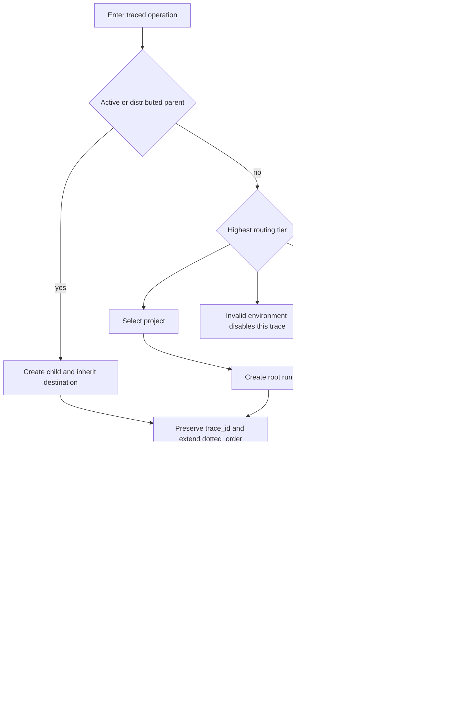

# Run Trees, Trace Identity, and Context Propagation

A **run** is the SDK's span-like record for one operation: a chain, model call, tool call, retriever, or another named unit of work. A root run represents a trace; descendants represent nested work. `RunTree` is the mutable capture-time form that owns identity, ordering, lifecycle fields, annotations, attachments, routing, and the client used to persist the run.

JavaScript and Python share the same ingestion model, but not every in-memory detail is identical. Code that creates runs manually or transports them between services should preserve the wire invariants below rather than copying incidental wrapper behavior from one runtime.

## Identity and ordering

The important identity fields have separate jobs:

- `id` identifies one run. If absent, both SDKs generate a UUID v7 from `start_time`.
- `parent_run_id` is the direct structural edge. JavaScript also retains `parent_run`; Python's validator converts an incoming parent object into `parent_run_id` and `parent_dotted_order` rather than retaining the object on the child. Both parents keep an in-memory `child_runs` list when `createChild` / `create_child` is used.
- `trace_id` identifies the whole trace. A root defaults it to its own `id`; every ordinary descendant inherits the root value.
- `dotted_order` is the full ancestry and ordering key. Each segment combines a sortable timestamp prefix with that run's UUID, and a child appends one segment to its parent's value.

For `R -> C -> G`:

```text
R.trace_id == R.id
C.trace_id == R.id
G.trace_id == R.id
C.parent_run_id == R.id
G.parent_run_id == C.id
G.dotted_order == R.segment + "." + C.segment + "." + G.segment
```

JavaScript adds an execution-order tie breaker to its millisecond clock and propagates the largest child execution order upward. Python has microsecond `datetime` values and clamps an explicitly supplied child `start_time` to the parent's time if it is earlier. These mechanisms prevent ancestry and temporal ordering from contradicting each other.

### Batch-ingest invariants

`trace_id` and `dotted_order` are required invariants on optimized ingestion paths. JavaScript multipart ingestion rejects creates or updates missing either field. Python admits a create to its tracing queue/compressed batch route only when both are present; otherwise it uses the non-batched request path. Sampling keys first on `trace_id`, then the root segment of `dotted_order`, then `id`, keeping one trace's decision consistent.

Safe producers and transformations must:

1. Set a root's `trace_id` to its `id`.
2. Preserve that exact value on descendants unless deliberately rerooting a replica.
3. Append one timestamp-plus-UUID segment at every edge; never replace the full order with only the leaf.
4. Keep each segment's UUID suffix aligned with the corresponding run ID, including after replica remapping.
5. Carry `trace_id` and `dotted_order` on both create and update operations because batching may merge or reorder them.
6. Omit excluded patch fields rather than treating an empty or null value as omission. In particular, both SDKs default `LANGSMITH_EXCLUDE_INPUTS_ON_PATCH` to enabled. Inputs added only after the start post require `excludeInputs: false` or `exclude_inputs=False` to be persisted.

## Choosing a destination: project or agent address

Routing mode is independent of trace identity. A run is sent to exactly one of:

- a project (`project_name` / wire `session_name`), or
- a beta agent address, `lrn:agents/{id}/environments/{environment}`, carried in the wire `address` field.

An address is **not** a project name. The backend resolves it to the project belonging to that agent environment. The agent ID must be a 1–63 character lowercase DNS label beginning with a letter and ending with a letter or digit. The environment is one of `local`, `development`, `staging`, or `production`; it is normalized to lowercase. Invalid explicit values fail at the SDK entrypoint. Address support is enabled per workspace: an unsupported workspace rejects the run, and the SDK does not silently fall back to a project.

At a single precedence level, naming both modes is an error. A higher-precedence address may outrank a lower project, or vice versa; routing does not merge halves from different levels.

- JavaScript `traceable` first compares per-call runtime config with decorator config. If there is an active parent, `createChild` then copies the parent's complete destination, so the child cannot switch projects or switch between project and address. A standalone `RunTree` uses its explicit destination, then `LANGSMITH_AGENT_ID` plus `LANGSMITH_AGENT_ENVIRONMENT`, then the configured project, and finally `default`.
- Python `@traceable` resolves roots in this order: `tracing_context`, active/distributed parent, call-time `langsmith_extra`, decorator arguments, `configure`, then environment and `default`. Children copy the parent's destination. This is why an evaluation's context project can override an ambient or decorator address without conflating the two.

`LANGSMITH_AGENT_ID` and `LANGSMITH_AGENT_ENVIRONMENT` must appear together. If the deciding environment level contains half or an invalid address, or contains both an address and project, ordinary traced wrappers warn or log once and leave that call untraced instead of breaking application code. Explicit malformed addresses and same-level code conflicts still raise. Creates may consult the environment for a missing destination; updates do not, because the original post or run ID already determines routing.

## Construction and runtime context

`createChild` / `create_child` is the direct tree entrypoint. It inherits `trace_id`, full destination, client, and replica configuration, extends `dotted_order`, merges parent metadata before child metadata, and appends the child to the parent's list. Direct child construction does not universally inherit tags; `traceable` wrappers assemble inherited tags before creating the child. JavaScript strips `reroot` from inherited replicas, while Python currently copies the replica sequence unchanged.

Most code uses `traceable` or Python's `trace` context manager. The wrapper discovers or imports a parent, creates a child or root, posts its start, installs it as current while user work executes, and ends and patches it after the true result lifecycle completes.


```mermaid
flowchart TD
    Caller["Enter traced operation"] --> Parent{"Active or distributed parent"}
    Parent -->|yes| Child["Create child and inherit destination"]
    Parent -->|no| Select{"Highest routing tier"}
    Select --> Project["Select project"]
    Select --> Address["Select validated agent address"]
    Select --> Bad["Invalid environment disables this trace"]
    Project --> Root["Create root run"]
    Address --> Root
    Child --> Identity["Preserve trace_id and extend dotted_order"]
    Root --> Identity
    Identity --> Start["Post start"]
    Start --> Context["Install async context"]
    Context --> Work["Execute and propagate nested work"]
    Work --> Finish["End with outputs or error"]
    Finish --> Patch["Patch completion"]
```

*The lifecycle selects one root destination, inherits it for children, and preserves trace identity through completion.*

### JavaScript

JavaScript installs the current `RunTree` or a tracing-disabled placeholder in `AsyncLocalStorage`. Promises, timers, and nested wrappers can therefore recover the parent. `AsyncLocalStorage.snapshot()` is captured for async iterators and `ReadableStream` reads, and those continuations also restore the captured OpenTelemetry context. `withRunTree`, `ROOT`, and an explicit leading `RunTree` are escape hatches where async-local propagation is unavailable or must be overridden.

A run also carries symbol-keyed LangChain context variables. Child creation copies this context and adjusts copied callback state so LangChain and `traceable` remain one tree. Child-completion promises let successful parents wait for nested traced work before final output handling; error and cancelled iterator paths skip that wait to avoid hanging behind unfinished children.

### Python

Python uses `contextvars` for parent, project/address, tags, metadata, tracing mode, client, replicas, and distributed parent ID. The active parent is stored as a **weak reference**, so contexts captured by `asyncio.create_task`, `call_later`, and similar APIs do not retain completed trees indefinitely.

`_setup_run` creates a copied context and installs the new run there. On runtimes supporting an explicit task context, async wrappers create a task with it; fallback paths temporarily restore the tracing context around awaits. Generator bodies execute during iteration, so each `next` or `anext` is likewise run in the captured context. `tracing_context` can import a `RunTree`, request headers, or a dotted-order string, or use `parent=False`; it restores the complete previous context in `finally`, including the previous destination and distributed-parent state.

## Distributed handoff and untrusted baggage

`toHeaders` / `to_headers` emits:

- `langsmith-trace`: the current full `dotted_order`;
- `baggage`: URL-encoded LangSmith metadata, tags, and the selected project or address.

The current serializers do not emit replica configuration in baggage, although both parsers still accept the `langsmith-replicas` key for compatibility. A dedicated replica `client` and credentials are never transportable context; every service must construct its own clients and authentication.

`fromHeaders` / `from_headers` creates a placeholder representing the upstream run. The first dotted segment supplies `trace_id`, the last supplies `id`, and Python additionally restores the preceding segment as `parent_run_id` when present. Receiving code creates a child from the placeholder; it must not post or complete the placeholder itself. Missing `langsmith-trace` means there is no imported parent.

Treat all baggage as untrusted:

- Invalid addresses are ignored without echoing the attacker-controlled value. A parent baggage entry naming both project and address is rejected entirely so a child cannot be filed into the wrong destination.
- A valid baggage destination outranks caller routing, ensuring the child joins its upstream parent.
- JavaScript retains only `projectName`, `address`, `primary`, `updates`, and `reroot` on parsed replicas and drops a non-boolean `primary`; credentials, endpoints, workspace IDs, and `client` objects are discarded.
- Python retains only project/address, `primary`, and `updates`; it also filters update keys to `reroot`, `metadata`, and `tags` by default. `LANGSMITH_BAGGAGE_ALLOWED_UPDATE_FIELDS` replaces the configurable portion of that allow-list, but `reroot` is always retained. Malformed header replicas are dropped rather than allowed to raise later.

## Lifecycle and completion

A normal run has two persistence phases:

1. `postRun()` / `post()` sends the start, normally without recursively embedded children.
2. `end()` updates the in-memory completion fields; `patchRun()` / `patch()` sends the update.

Python `patch()` calls `end()` if needed. JavaScript `end()` is first-value-wins for outputs, error, and end time, so a later cancellation marker cannot overwrite an earlier stream error. JavaScript logs persistence errors from ordinary post/patch paths and clears `child_runs`; Python wrapper code catches posting failures, while direct `RunTree.post()` / `patch()` can raise.

Patch omission is deliberate. JavaScript does not add the `inputs` key when excluded. Python passes `None` into its update builder, whose serialized request omits the field. Sending `{}`, `null`, or another empty value is not equivalent: the batching merge can overwrite inputs from the create.

### Values, iterators, streams, and cancellation

| Path | Successful completion | Error or early close |
|---|---|---|
| JavaScript value or promise | Process outputs, optionally await child completion, then end and patch. | Convert sync throws to rejection, record `String(error)`, patch, and rethrow without waiting for unfinished children. |
| JavaScript async iterator | Accumulate and optionally reduce chunks; exhaustion completes. LLM runs add `new_token` events. | Record and rethrow iterator errors. Early termination calls source `return()`, records `Cancelled`, preserves partial output, and skips the child wait. |
| JavaScript `ReadableStream` | Tap reads under captured contexts; reader exhaustion completes with accumulated chunks. | A read error records the error and partial chunks, then rethrows. `cancel(reason)` records `Cancelled` and partial chunks before forwarding cancellation to the source reader. |
| JavaScript sync generator | Eagerly drain the producer, complete the run, and return a replaying generator. | Consumer-side early close cannot cancel the already-drained producer. |
| Python function or coroutine | Normalize output, then `end()` and `patch()`. | Catch `BaseException`, finalize, and re-raise. Async cleanup is shielded from task cancellation. `exceptions_to_handle` can suppress recorded error text, not the exception. |
| Python generator or async generator | Accumulate and optionally reduce chunks; exhaustion finalizes. Iteration runs in captured context. | Finalize with partial chunks for `BaseException`, including close/cancellation signals, then re-raise; async finalization is shielded. |
| Python returned stream wrapper | `_TracedStream` / `_TracedAsyncStream` remains open until exhaustion or context-manager exit; destruction is best effort. | Sync paths pass the exception into finalization. Current async `__aiter__` and `__aexit__` paths finalize without passing the triggering exception to `_aend_trace`. |

Consume or explicitly close streams. Merely receiving an iterator is not run completion.

## Attachments

Attachments are named binary sidecars, separate from JSON inputs and outputs. JavaScript accepts a MIME type plus `Uint8Array` / `ArrayBuffer`. Python accepts `Attachment(mime_type, data)` and tuple forms; an argument annotated as `Attachment` is extracted automatically, and `RunTree._get_dicts_safe` moves `Attachment` values found in inputs to the attachment map.

Python filesystem paths are rejected unless `dangerously_allow_filesystem=True`. Without that opt-in, only inline bytes or an unambiguous content-type-and-bytes pair is accepted. This is a security boundary.

Multipart ingestion removes binary values from JSON inputs and keys attachment parts to the run operation. After Python posts attachments it records an `uploaded_attachment` event; patching filters already-uploaded tuple attachments to avoid uploading them twice.

## Replicas, deterministic IDs, and rerooting

Replicas select a destination URL/client, project or address, authentication, whether IDs remain primary, optional updates, and rerooting behavior. At most one replica may be `primary`. A replica naming neither project nor address inherits the run's whole destination; it does not combine a project from one level with an address from another.

A primary destination preserves identity. A secondary destination deterministically derives UUID v7 values from each original UUID and a seed identifying the project or address. It rewrites `id`, `parent_run_id`, `trace_id`, and every UUID suffix in `dotted_order` together. Independently posted parent and child operations therefore converge on the same replica tree.

Rerooting changes the ancestry visible to one destination:

- At a distributed boundary, both SDKs retain the imported run ID as the distributed-parent marker. Rerooting slices all segments through that marker, clears `parent_run_id` when it points to the removed parent, and sets `trace_id` from the first retained segment before deterministic remapping.
- JavaScript can also reroot without a distributed marker by making the current run a root. It records a replica-specific trace root on the current run and existing descendants so subsequently processed descendants keep the sliced hierarchy. Because `reroot` is stripped from child replica inheritance, the directive applies only to the run where it was explicitly configured.
- Python applies its current reroot update only when a distributed-parent marker exists. Python children inherit replica configuration unchanged. Replicas that share client, destination, updates, and primary/remapping behavior are grouped so one serialized payload can be dispatched with multiple authentication destinations; a replica-specific `client` may use a different tracing mode.

## Safe extension checklist

When adding a wrapper, scheduler handoff, or ingestion transform:

- Create descendants through the active `RunTree`; do not synthesize only `parent_run_id`.
- Keep project and address as mutually exclusive routing modes, and inherit the parent's selected mode.
- Carry the exact `trace_id` and full `dotted_order` through queues, headers, and patches.
- Capture context when work is created and restore it when work executes or iterates.
- Finalize once on success, error, early close, and cancellation; retain partial stream outputs and rethrow user exceptions.
- Omit excluded patch keys; do not substitute empty values.
- Keep binary data in attachments and preserve Python's filesystem opt-in.
- Treat baggage as hostile and never propagate credentials or client objects.
- Remap every identity-bearing field together, using the destination as a stable seed.

Focused regression coverage is in `js/src/tests/address.test.ts`, `js/src/tests/run_trees.test.ts`, `js/src/tests/traceable.test.ts`, `python/tests/unit_tests/test_address.py`, `python/tests/unit_tests/test_replica_endpoints.py`, `python/tests/unit_tests/test_run_trees.py`, and `python/tests/unit_tests/test_run_helpers.py`. High-value tests inspect final tree and payload fields for a three-level tree, equal timestamps, routing precedence, distributed baggage, merged create/update operations, cancellation with partial output, attachments, and rerooted descendants.
