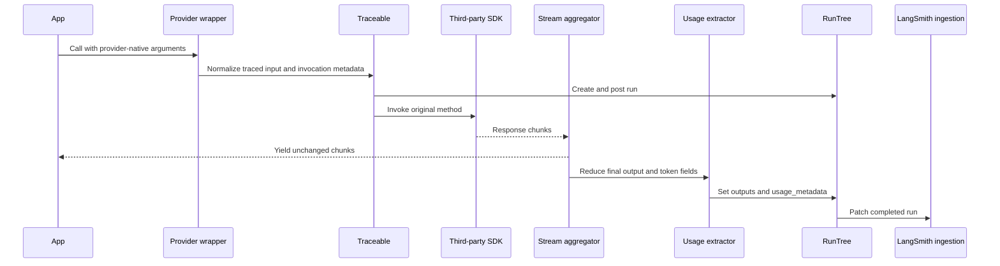

# Provider Wrappers, Agent Integrations, and OpenTelemetry

LangSmith integrations preserve the third-party API as much as possible while adapting its observability model to a common run model. A provider call becomes an `llm` run, a tool callback becomes a `tool` run, and agent orchestration becomes a hierarchy of `chain`, `tool`, and `llm` runs. The adaptation boundary is also where provider-specific messages, stream chunks, token accounting, lifecycle callbacks, and metadata become stable LangSmith inputs and outputs.

There are two transport families after adaptation:

- **Run transport** uses `traceable` and `RunTree`, then posts and patches runs through the LangSmith client.
- **OTLP transport** emits or rewrites OpenTelemetry spans and sends them through an exporter and processor. Native OTel instrumentation can therefore coexist with LangSmith tracing without requiring provider wrappers to imitate an OTel SDK.

## Adaptation patterns

### Call-bound provider wrappers

The OpenAI, Anthropic, and Gemini wrappers in JavaScript and Python patch only the model-facing methods that have useful semantics. They keep normal sync, async, parse, raw-response, and streaming behavior, but wrap the call with `traceable` and provider-specific configuration. In JavaScript, `wrapOpenAI` also rejects an already wrapped client so that one provider call cannot accidentally create duplicate runs. `wrapSDK` is the deliberately broader fallback: its recursive proxy traces every function it finds as an `llm` call, so it should be used only on the portion of an arbitrary SDK intended for model invocation.

A wrapper supplies four kinds of policy to the shared tracing layer:

1. **Input normalization.** Chat prompts become message-shaped inputs suitable for display and replay. Anthropic's JavaScript wrapper represents `system` as the first system message in the traced copy, masks transport secret fields, and redacts MCP server credentials without changing the request object sent to Anthropic.
2. **Invocation metadata.** Provider, model, model type, temperature, stop sequences, maximum tokens, and selected invocation parameters are recorded under stable `ls_*` keys. Wrapper-level metadata and per-call configuration are merged without duplicating `ls_invocation_params`.
3. **Output normalization.** Provider response objects are reduced to message- or completion-shaped outputs while retaining identifiers and normalized `usage_metadata` needed by LangSmith.
4. **Streaming reduction.** Chunks are yielded unchanged to the caller while an aggregator or `reduce_fn` accumulates a final output. JavaScript's OpenAI and Anthropic stream helpers ensure SDK methods such as `finalMessage`, `finalResponse`, and `finalChatCompletion` consume the stream first. Python's traced stream wrappers end the run on normal exhaustion, context-manager exit, or iteration error and re-raise the application error.

Usage normalization is semantic rather than a field rename. For example, Anthropic reports uncached input tokens separately from cache-read and cache-creation tokens; the normalized total adds all of them and preserves cache categories in `input_token_details`. Realtime OpenAI usage delegates to the same shared mapper used by ordinary OpenAI wrappers, including audio and cached-token details when present.

*Provider-wrapper flow from an unchanged SDK call through stream aggregation, usage extraction, `RunTree`, and ingestion.*

The run is not complete merely because the SDK returned a stream object. Completion is tied to consumption or cancellation: JavaScript's tracing tap records token events, aggregates consumed chunks, marks cancellation as an error, and then ends and patches the run. Consequently, applications should consume or explicitly close streams; relying on object finalization is weaker than completing the stream lifecycle.

### Composition wrappers for model, tool, and agent loops

The Vercel AI SDK integration wraps orchestration functions rather than one provider. `wrapAISDK` returns traced `generateText`, `streamText`, object-generation variants, and a wrapped `ToolLoopAgent` when available. Each outer operation gets a chain-like run, the language model is wrapped with `LangSmithMiddleware` to create a child `llm` run, and tool `execute` functions become child `tool` runs. Base configuration is merged with per-call `providerOptions.langsmith`; dedicated child-input and child-output processors prevent an outer redaction or formatter from being applied accidentally to model children.

For model streams, `LangSmithMiddleware` creates and posts a child `RunTree`, passes every chunk through a `TransformStream`, and reduces text, reasoning, tool calls, provider metadata, finish reason, and usage at flush. It rebuilds a message-shaped output, ends the child, and patches it. Raw HTTP request and response details are excluded by default and are included only when `traceRawHttp` is enabled.

Agent classification is contextual. Vercel-generated runs preserve an inherited non-root `ls_agent_type`; a run directly under a tool is classified as `subagent`, while a true top-level integration can default to `root`. This metadata supplements the run hierarchy rather than replacing parent-child relationships.

### Lifecycle processors for agent SDKs

Some agent SDKs expose trace and span callbacks instead of a function that can be decorated. `OpenAIAgentsTracingProcessor` adapts that lifecycle directly:

- trace start creates a root or nested `chain` `RunTree` and installs it as current context;
- span start maps agent, handoff, generation, response, function, and guardrail data to an appropriate child run type;
- response or generation completion supplies the first meaningful root input and latest root output;
- span and trace end set outputs or errors, post runs whose complete input was unavailable at start, patch already posted runs, and restore context;
- `forceFlush` and `shutdown` delegate completion to the LangSmith client.

The JavaScript processor installs the `RunTree` in `AsyncLocalStorage` synchronously because the Agents SDK's start/end callbacks are not one wrap-able function. This makes a nested `traceable()` call inside a tool attach to the active agent span. It also creates a lifecycle constraint: context restoration assumes the matching start and end callbacks occur on the same async task, as the Agents SDK does. Installing the processor is explicit tracing opt-in in JavaScript, so its root and inherited children post even if `LANGSMITH_TRACING` is unset.

Agent metadata is merged from processor defaults and per-trace metadata, then stamped with `ls_integration`. An OpenAI Agents `groupId` becomes `thread_id`; a user-supplied `ls_agent_type`, including an explicit null opt-out, is preserved. Structural classification marks guardrails as `middleware` and agents beneath a tool as `subagent`, while preserving existing middleware, subagent, or compaction tags.

Claude Agent SDK integration follows the same lifecycle principle with a different event source. Its wrapped async generator observes streamed messages and additive hooks for tool and subagent events, always calls `StreamManager.finish()` in `finally`, strips MCP connection details from traced options, and merges top-level message fragments for the final conversation output. The provider generator and its extra methods remain available to the caller.

### Realtime and voice sessions

Realtime integrations treat the connection or session as the lifecycle owner. The OpenAI Realtime proxy delegates ordinary connection methods and observes both async iteration and `recv`. A session context creates a conversation root, applies `thread_id`, and guarantees teardown. Meaningful events open spans; noisy delta events are generally folded into side state instead. A `response.done` event creates the model record with normalized output, model metadata, and usage, while transcript events build the conversation rollup. Teardown is best-effort and closes any active event span, records body errors on the root, and finalizes transcript and optional audio.

Frameworks such as LiveKit and Pipecat already emit native OTel spans. Their processors therefore use a **translate-then-forward** chain: `BaseLangSmithSpanProcessor` captures thread context at span start, creates a translated draft at span end, stamps static metadata and the cached `thread_id`, lets the framework subclass classify and rewrite it, rebuilds a fresh `ReadableSpan`, and only then forwards it downstream. Wrapping a downstream processor is intentional; making the translator a sibling exporter could race and export the unmodified span. Translation failures are isolated and the original span is exported untranslated where possible. Audio attachments are base64 encoded and size-capped by default.

## OpenTelemetry interoperability and ownership boundaries

### Optional dependencies

OpenTelemetry is optional. The JavaScript singleton in `js/src/singletons/otel.ts` deliberately imports no OTel packages and supplies no-op trace and context implementations until `initializeOTEL` provides real instances. If OTel tracing mode is selected but initialization was omitted, it warns once and still executes the wrapped function. The experimental initializer requires the OTel API, base trace SDK, OTLP protobuf exporter, and async-hooks context manager as peer dependencies.

Python exposes dependency-free helper imports lazily, while constructing `OtelExporter` or `OtelSpanProcessor` without the OTel packages raises an actionable `ImportError` recommending `pip install langsmith[otel]`. A Python `Client` in `otel` or `hybrid` mode uses the caller-supplied provider, an already initialized global provider, or creates an internal OTLP provider when none exists. If the packages are absent, it warns and falls back to LangSmith-only tracing.

### Do not replace an application's global provider

A global tracer provider and global context manager are process-wide resources and normally can be installed only once.

- Python's `langsmith.integrations.otel.configure()` is for a fresh, LangSmith-only OTel setup. It checks for the default proxy/no-op provider, installs a real provider only in that state, and returns `False` rather than replacing an existing provider. If another observability system already owns the provider, construct `OtelSpanProcessor` and add it with `provider.add_span_processor(...)`.
- JavaScript's deprecated `initializeOTEL()` creates an `AsyncHooksContextManager` unless a manager is supplied or setup is skipped. It catches failure when another library already owns global context. Without `globalTracerProvider`, it creates a `BasicTracerProvider` containing the LangSmith processor and attempts to register it globally; registration can fail if a provider already exists. Passing `globalTracerProvider` avoids provider replacement, but the function only returns and records the LangSmith processor—it does not attach it to that provider. The application must attach or construct the provider with the returned processor using the API appropriate to its OTel SDK version.

This boundary is operationally important: use a **processor addition** when OTel already exists, and use a **global initializer** only when LangSmith owns OTel bootstrap. Likewise, set `skipGlobalContextManagerSetup: true` when a JavaScript runtime or instrumentation package already manages context.

### Export and translation paths

The public Python `OtelExporter` is an `OTLPSpanExporter` configured for `{LANGSMITH_ENDPOINT}/otel/v1/traces`, `x-api-key`, and `Langsmith-Project`. `OtelSpanProcessor` combines that exporter with `BatchSpanProcessor` by default, accepts a different processor class, and can stamp OTel-safe `langsmith.metadata.*` values on every span. JavaScript's `LangSmithOTLPTraceExporter` applies equivalent endpoint, auth, and project defaults while honoring standard `OTEL_EXPORTER_OTLP_ENDPOINT` and `OTEL_EXPORTER_OTLP_HEADERS` overrides. Its `transformExportedSpan` hook can add or remove attributes before export, and it translates AI SDK telemetry attributes into LangSmith and GenAI conventions, including run kind and usage.

The opposite direction is used by LangSmith tracing mode: Python's internal `OTELExporter` converts batched run post/update operations into OTel spans with deterministic trace/span IDs, GenAI attributes, LangSmith metadata, serialized inputs and outputs, status, and token usage. Posts open spans and updates end them; a thread-safe in-flight store associates both operations. Orphaned spans are periodically ended and removed after `LANGSMITH_OTEL_SPAN_TTL_SECONDS` (default 3600 seconds), preventing incomplete traces from accumulating indefinitely.

Native OTel span rewriting must not mutate `ReadableSpan`, whose attributes and events are treated as read-only. Shared translation helpers rebuild a new span while copying identity, parent, resource, status, timing, links, and instrumentation scope. This is the extension point used by voice and agent-framework processors that need provider-specific attribute translation.

## Configuration and safe extension

Use the narrowest integration boundary available:

- choose a provider wrapper when calls originate from a normal model client;
- choose a composition wrapper when one framework owns model and tool loops;
- register a lifecycle processor when an agent SDK exposes trace/span callbacks;
- proxy a realtime session when events, turns, and teardown define correctness;
- chain a translating span processor in front of an exporter when a framework already emits OTel.

Input/output processors and exporter transforms are privacy boundaries. They should return new values instead of mutating provider arguments or OTel spans. Enabling raw HTTP capture or audio attachment materially increases trace volume and may expose sensitive data, so it should be explicit. On shutdown, flush the owning processor/client: JavaScript's LangSmith OTel span processor first waits for pending `RunTree` batches, while OTel processors and realtime contexts need their normal shutdown/exit lifecycle to release final buffered data.

## Focused verification

The highest-value tests assert behavior rather than wrapper existence:

- `js/src/tests/wrapped_openai.test.ts` verifies that only creation calls are traced, response retrieval remains untouched, and normalized model metadata and usage reach the run.
- `js/src/tests/anthropic_usage.test.ts` locks down additive cache-token accounting and the canonical cache detail names.
- `js/src/tests/openai_agents_sdk.test.ts` exercises delayed post/patch ordering, nested context, `groupId` to `thread_id`, agent-type defaults and opt-outs, usage, errors, and lifecycle cleanup.
- Vercel wrapper and telemetry integration tests verify parent/child model runs, stream usage, and that usage belongs on the model span rather than being spuriously copied to orchestration roots.
- `python/tests/unit_tests/test_otel_exporter.py` verifies optional configuration, exporter defaults without environment mutation, OTel-safe metadata, TTL cleanup, and concurrent mutation of the in-flight span store.
- `python/tests/unit_tests/test_span_utils.py` verifies translated spans copy all untouched fields and never mutate the original `ReadableSpan`.

When extending an integration, add tests for both non-streaming and partial/failed streaming, sync and async variants where supported, usage detail fields, parent context restoration, explicit metadata override precedence, and flush or teardown. Those are the boundaries where an API-compatible wrapper can otherwise produce an incomplete or incorrectly nested trace.
