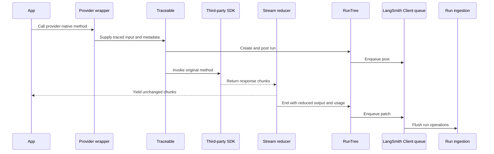
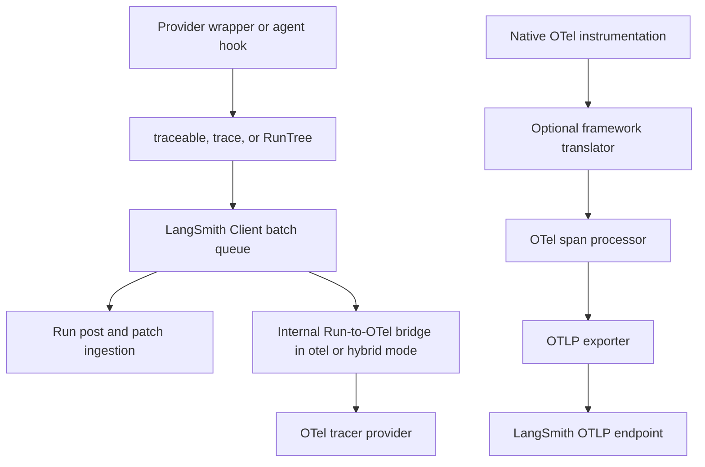

# Provider Wrappers, Agent Integrations, and OpenTelemetry

LangSmith integrations preserve a third-party API while adapting its observability model. A model call becomes an `llm` run, a tool callback becomes a `tool` run, and agent orchestration becomes a hierarchy of `chain`, `tool`, and `llm` runs. Provider-specific messages, stream chunks, usage, callbacks, and metadata are normalized at that boundary.

The most important distinction is the transport after adaptation:

- **RunTree integrations**—provider wrappers, composition wrappers, agent lifecycle hooks, and session proxies—call `traceable`, `trace`, or `RunTree` operations. Their post and patch operations go through the LangSmith `Client` and its batching lifecycle.
- **Native OTel integrations**—`OtelSpanProcessor`, the JavaScript experimental OTel processor, and voice-framework translators—receive or create OTel spans. Their OTel processor/exporter chain owns batching and sends OTLP directly; it does **not** enqueue runs in the `Client` batch queue. The public Python and JavaScript exporters default to `{LANGSMITH_ENDPOINT}/otel/v1/traces`.
- **Run-to-OTel tracing mode** is a bridge between those families, not native span processing. Python `Client(tracing_mode="otel")` still accepts serialized RunTree post/update operations through the Client queue, converts them to spans internally, and hands those spans to an OTel provider. `hybrid` sends the same run operations through both paths.

## Integration taxonomy

| Boundary | Representative entrypoint | Emits | Lifecycle owner |
|---|---|---|---|
| Model client method | `wrapOpenAI`, `wrapAnthropic`, `wrapGemini`, `wrapSDK` | `RunTree` operations | traced call or consumed stream |
| Framework model/tool loop | `wrapAISDK` and `LangSmithMiddleware` | parent and child `RunTree` operations | wrapped framework operation |
| Agent callbacks | OpenAI Agents tracing processors, Claude Agent SDK hooks | hierarchical `RunTree` operations | SDK trace/span callbacks or response generator |
| Realtime connection | OpenAI Realtime proxy | session and event `RunTree` operations | connection/session context |
| Framework-native OTel | `LiveKitLangSmithSpanProcessor`, Pipecat processor | translated OTel spans | translating processor and downstream processor |
| General native OTel | `OtelSpanProcessor`, `LangSmithOTLPSpanProcessor` | OTel spans | tracer provider and span processor |
| Run-to-OTel mode | Python internal `OTELExporter` | spans derived from serialized run operations | `Client` queue plus OTel provider |

Choose the narrowest boundary available. A provider wrapper is preferable for ordinary model clients; a composition wrapper belongs around a framework that owns the model/tool loop; callback SDKs need lifecycle processors; realtime APIs need a session proxy; and frameworks that already emit OTel need a translating processor in front of an OTLP exporter.

## Provider wrappers and streams

The OpenAI, Anthropic, and Gemini wrappers in JavaScript and Python patch only model-facing methods with useful semantics. They retain normal sync, async, parse, raw-response, and streaming behavior while supplying provider policy to the shared tracing layer:

1. **Input normalization** converts provider prompts into replayable message-shaped inputs. The JavaScript Anthropic wrapper places `system` first in the traced copy and redacts secret and MCP credential fields without changing the provider request.
2. **Invocation metadata** records provider, model, model type, temperature, stop sequences, maximum tokens, and selected parameters under stable `ls_*` keys. Wrapper and per-call metadata are merged.
3. **Output normalization** reduces provider objects to message- or completion-shaped outputs while retaining IDs and normalized `usage_metadata`.
4. **Streaming reduction** yields chunks unchanged while an aggregator builds the final traced output. SDK helpers such as `finalMessage`, `finalResponse`, and `finalChatCompletion` still consume the underlying stream before returning.

`wrapOpenAI` rejects an already wrapped JavaScript client to prevent duplicate runs. `wrapSDK` is intentionally broader: its recursive proxy traces every discovered function as an `llm` call, so callers should apply it only to the model-invocation portion of an arbitrary SDK.

Usage normalization is semantic rather than a field rename. Anthropic cache-read and cache-creation input tokens contribute to normalized totals and remain visible in `input_token_details`; OpenAI Realtime delegates to the same usage mapper as ordinary OpenAI wrappers, including cached and audio token details.

```mermaid
sequenceDiagram
    participant App
    participant Wrapper as Provider wrapper
    participant Traceable
    participant Provider as Third-party SDK
    participant Stream as Stream reducer
    participant RunTree
    participant Client as LangSmith Client queue
    participant Ingest as Run ingestion

    App->>Wrapper: Call provider-native method
    Wrapper->>Traceable: Supply traced input and metadata
    Traceable->>RunTree: Create and post run
    RunTree->>Client: Enqueue post
    Traceable->>Provider: Invoke original method
    Provider-->>Stream: Return response chunks
    Stream-->>App: Yield unchanged chunks
    Stream->>RunTree: End with reduced output and usage
    RunTree->>Client: Enqueue patch
    Client->>Ingest: Flush run operations
```

*Provider calls and chunks remain provider-native while the wrapper owns RunTree creation and completion.*

Returning a stream object does not complete the run. Completion follows normal exhaustion, explicit cancellation/close, context-manager exit, or iteration failure. JavaScript records token events and marks cancellation as an error; Python ends the traced stream and re-raises application errors. Applications should consume or explicitly close streams rather than rely on finalization.

## Agent and orchestration integrations

### Composition wrappers

`wrapAISDK` traces orchestration calls such as text, stream, and object generation and wraps `ToolLoopAgent` when available. The outer operation is chain-like, `LangSmithMiddleware` creates child `llm` runs, and tool `execute` functions create child `tool` runs. Base configuration is merged with per-call `providerOptions.langsmith`; separate child input/output processors prevent an outer formatter or redactor from accidentally being reused for model children.

For a model stream, middleware posts the child run, forwards each chunk through a `TransformStream`, and at flush reduces text, reasoning, tool calls, provider metadata, finish reason, and usage. Raw HTTP request/response capture remains opt-in through `traceRawHttp`.

### OpenAI Agents lifecycle processors

OpenAI Agents exposes trace and span callbacks rather than a single decoratable function. The processor maps trace start to a root or nested `chain` run and maps agent, handoff, generation, response, function, and guardrail spans to child run types. Some spans cannot be posted until meaningful input arrives; end callbacks therefore either post then patch or patch an already posted run. Response/generation data supplies root input and the latest root output.

The JavaScript processor installs the active run synchronously in `AsyncLocalStorage` so a nested `traceable()` call inside a tool becomes a child of the active agent span. Matching start and end callbacks must execute on the same async task for restoration to return to the right prior context. Explicit processor installation is tracing opt-in, even when `LANGSMITH_TRACING` is unset. Processor metadata is merged with trace metadata, `groupId` becomes `thread_id`, and explicit `ls_agent_type` values—including null opt-out—are preserved. `forceFlush()` and `shutdown()` delegate to the owning LangSmith client.

### Claude Agent SDK hooks

The Claude integration wraps the SDK response generator and injects additive `PreToolUse`, `PostToolUse`, `PostToolUseFailure`, `SubagentStart`, and `SubagentStop` hooks. Tool runs are keyed by tool-use ID. An Agent tool owns its subagent `chain`, and tools invoked by that subagent nest beneath it. Per-client `SessionState` is bound through a `ContextVar`, preventing concurrent clients from sharing hook-correlation maps.

Assistant fragments with the same message ID accumulate into one `llm` run. Patches are deferred until transcript reconciliation can apply final usage and fill model turns missing from the live stream. In `finally`, the integration closes and patches pending model runs, reconciles transcripts, ends outstanding tools/subagents, unregisters session state, and restores caller tracing context. Consumer cancellation and SDK errors therefore do not strand the hierarchy; errors still propagate to the caller.

### Realtime sessions

The OpenAI Realtime proxy observes async iteration and `recv` while delegating ordinary connection methods. A session context owns a conversation root and `thread_id`. Meaningful events become child runs while noisy deltas are folded into side state; `response.done` records normalized model output, model metadata, and usage. Exit is best-effort: active event runs are closed, body errors are recorded on the root, and transcript and optional audio are finalized.

## Native OpenTelemetry processing and translation

Native OTel processing is independent of the `Client` run queue. In Python, `OtelExporter` subclasses the HTTP `OTLPSpanExporter`, defaults to `{LANGSMITH_ENDPOINT}/otel/v1/traces`, and adds `x-api-key` and `Langsmith-Project`. `OtelSpanProcessor` wraps that exporter in `BatchSpanProcessor` by default, can accept another processor class, and stamps OTel-safe `langsmith.metadata.*` attributes at span start. Its `force_flush()` and `shutdown()` delegate to the inner processor; the tracer provider or application that installed it must invoke them.

JavaScript's `LangSmithOTLPTraceExporter` has equivalent endpoint, authentication, project, and standard `OTEL_EXPORTER_OTLP_*` override behavior. It can transform spans before export and translates AI SDK telemetry attributes into LangSmith and GenAI attributes. `LangSmithOTLPSpanProcessor` exports only LangSmith-marked or AI SDK spans, skips non-traceable ancestors while recording the nearest traceable parent, and frees per-trace bookkeeping after every observed span ends. Its `shutdown()` first waits for shared-client RunTree batches—important when an application mixes both transport families—then shuts down OTel batching.

```mermaid
flowchart TD
    RunAPI["Provider wrapper or agent hook"] --> RunTree["traceable, trace, or RunTree"]
    RunTree --> ClientQueue["LangSmith Client batch queue"]
    ClientQueue --> RunIngest["Run post and patch ingestion"]
    ClientQueue --> InternalBridge["Internal Run-to-OTel bridge in otel or hybrid mode"]
    InternalBridge --> OTelProvider["OTel tracer provider"]

    NativeInstrumentation["Native OTel instrumentation"] --> Translator["Optional framework translator"]
    Translator --> SpanProcessor["OTel span processor"]
    SpanProcessor --> OTLPExporter["OTLP exporter"]
    OTLPExporter --> OTelIngest["LangSmith OTLP endpoint"]
```

*RunTree operations use the Client queue; native OTel spans bypass it and are owned by the OTel processor/exporter chain.*

### Translate before export

LiveKit and Pipecat already emit OTel spans. `BaseLangSmithSpanProcessor` therefore wraps a downstream processor rather than sitting beside it. At start it caches context-derived `thread_id` by trace. At end it creates a `TranslatedSpan` draft, adds static metadata and the cached thread, lets the framework subclass classify and rewrite attributes, finalizes a fresh `ReadableSpan`, and only then calls downstream `on_end`. A sibling processor could race and export the original span before translation. Translation failures are isolated and export the original data where possible.

The default downstream is `BatchSpanProcessor(OtelExporter(...))`; supplying a downstream transfers forwarding, flush, and shutdown into that chain. Audio is base64 encoded and limited to 150 MB of raw bytes by default; oversize data is skipped.

LiveKit adds a session-level state machine around translation. It keeps per-conversation state in bounded TTL caches, holds the root until the `agent_session` ends and required session report or egress recording arrives, and releases with available data after a configurable timeout. Realtime transcripts arriving outside spans are FIFO-paired with `user_speaking` spans. `force_flush()` drains only downstream exported spans and deliberately leaves an in-progress root deferred. `shutdown()` is terminal: it cancels timers, force-exports held roots and untranscribed speaking spans, clears state, and then shuts down downstream processing.

## Python RunTree-to-OTel tracing mode

The internal `OTELExporter` serves `Client(tracing_mode="otel" | "hybrid")`; despite its name, it is not the public native OTLP exporter. Client background workers first drain serialized run operations. The bridge then:

- derives deterministic OTel trace and span IDs from RunTree UUIDs and uses an in-flight parent span when available, otherwise the captured OTel context;
- maps run kind/name, project, metadata, tags, serialized descriptors, prompt/completion payloads, request fields, provider/model, status, token usage, finish reasons, tool definitions, tool name, and tool-call ID to LangSmith and GenAI attributes;
- creates a span on `post`; a post carrying `end_time` is ended immediately, while a later update mutates the span and ends/removes it when `end_time` arrives;
- stores in-flight entries behind a lock because control and autoscaled background workers can export concurrently;
- checks for stale spans before batches, no more often than every ten seconds, and atomically removes and ends recording orphans older than `LANGSMITH_OTEL_SPAN_TTL_SECONDS` or legacy `LANGCHAIN_OTEL_SPAN_TTL_SECONDS` (default 3600 seconds).

When the Client must create its own provider, the internal provider uses an OTLP HTTP exporter with default `{LANGSMITH_ENDPOINT}/otel`, standard OTel endpoint/header overrides, and a `langsmith.internal_provider` resource marker. This internal bootstrap default is distinct from the public native `OtelExporter` default `/otel/v1/traces`.

## Global provider and optional dependency boundaries

OpenTelemetry remains optional. JavaScript's OTel singleton imports no OTel package and supplies no-op trace/context implementations until `initializeOTEL()` provides real instances. If OTel tracing is selected without initialization it warns once while still executing application code. The deprecated experimental initializer requires the OTel API, base trace SDK, protobuf exporter, and async-hooks context manager as peers.

Python lazily exposes dependency-free helpers. Constructing processors without OTel packages raises an actionable `ImportError`; a Client requesting OTel mode warns and falls back to LangSmith-only tracing when dependencies are unavailable.

Global providers and context managers are process resources:

- Python `configure()` is only for a fresh LangSmith-only OTel setup. It installs a provider only when the global provider is still the proxy/no-op and returns `False` rather than replacing an existing provider. Add `OtelSpanProcessor` to an existing provider instead.
- JavaScript `initializeOTEL()` may create and register an `AsyncHooksContextManager` and a `BasicTracerProvider`. If `globalTracerProvider` is supplied, the returned LangSmith processor is **not** automatically attached; the application must add or construct the provider with it. Use `skipGlobalContextManagerSetup: true` when another runtime owns context.

## Ownership, privacy, and failure invariants

- Input/output processors and exporter transforms are privacy boundaries. Prefer returned copies over mutating provider arguments or original `ReadableSpan` objects.
- Raw HTTP and audio capture are explicit because they can expose sensitive data and substantially increase payload size.
- Provider chunks must reach callers unchanged even though the trace reducer observes them.
- Integration failures should not replace provider errors. Stream and lifecycle wrappers finalize what they can, restore context, and re-raise application failures.
- Flush the component that owns buffering: the `Client` for RunTree operations, the OTel processor/provider for native spans, and the session context or specialized voice processor for deferred conversation state. Mid-session flush is not equivalent to terminal shutdown.

## Focused verification

The most useful tests protect behavior at boundaries:

- `js/src/tests/wrapped_openai.test.ts` verifies that creation is traced, retrieval remains untouched, and normalized metadata and usage reach the run.
- `js/src/tests/openai_agents_sdk.test.ts` covers delayed post/patch ordering, nested context, `groupId` to `thread_id`, agent classifications and opt-outs, usage, errors, and cleanup.
- `python/tests/unit_tests/wrappers/test_claude_agent_sdk_hooks.py` covers tool/subagent nesting, per-session isolation, deferred finalization, and transcript gap filling.
- `python/tests/unit_tests/wrappers/test_livekit.py` covers translation without mutation, deferred roots, out-of-band transcripts, recording races/timeouts, `force_flush()` versus `shutdown()`, and concurrent state/export ownership.
- `python/tests/unit_tests/test_otel_exporter.py` covers metadata safety, tool and finish attributes, provider defaults, TTL cleanup, and concurrent mutation of the in-flight span store.

When extending an integration, test non-streaming and partial/failed streaming, sync and async variants where supported, usage details, parent restoration, metadata precedence, and both flush and terminal teardown. Those are the points where an API-compatible wrapper can still produce incomplete, duplicated, or incorrectly nested traces.
