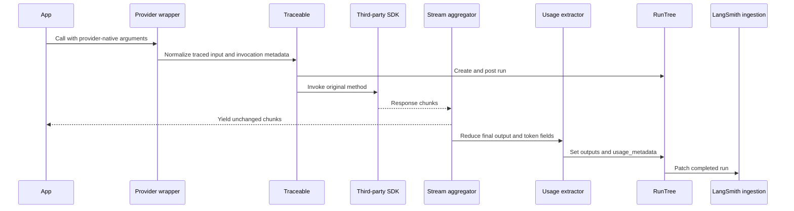
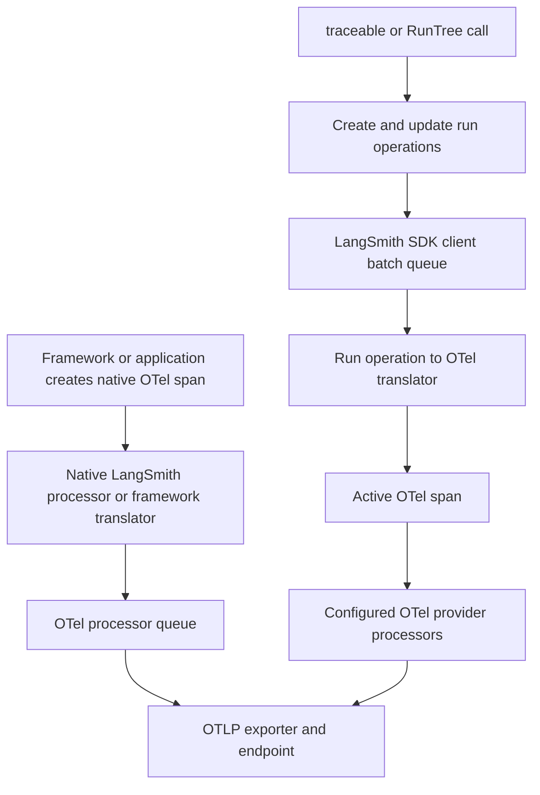

# Provider Wrappers, Agent Integrations, and OpenTelemetry

LangSmith integrations preserve the third-party API as much as possible while adapting its observability model to a common run model. A provider call becomes an `llm` run, a tool callback becomes a `tool` run, and agent orchestration becomes a hierarchy of `chain`, `tool`, and `llm` runs. The adaptation boundary is also where provider-specific messages, stream chunks, token accounting, lifecycle callbacks, and metadata become stable LangSmith inputs and outputs.

There are two distinct directions of OpenTelemetry interoperability:

- **Native spans to LangSmith OTLP ingest.** Existing OTel instrumentation sends `ReadableSpan` objects through a LangSmith exporter or a framework-specific translating processor. These spans enter the OTel processor/exporter pipeline directly and do **not** traverse the LangSmith client's run batch queue.
- **LangSmith run operations to OTel spans.** `traceable` and `RunTree` still produce create/update operations. In OTel tracing mode those operations first traverse the SDK client's queue, then an internal translator updates the active OTel spans. The configured OTel provider and its processors/exporters own final OTLP delivery.

Keeping these paths separate is essential when reasoning about batching, filtering, flush, and shutdown.

## Adaptation patterns

### Call-bound provider wrappers

The OpenAI, Anthropic, and Gemini wrappers in JavaScript and Python patch only model-facing methods with useful semantics. They retain normal sync, async, parse, raw-response, and streaming behavior while wrapping calls with `traceable` and provider-specific configuration. JavaScript `wrapOpenAI` rejects an already wrapped client, preventing one provider call from creating duplicate runs. `wrapSDK` is the deliberately broader fallback: its recursive proxy traces every function it finds as an `llm` call, so it should be applied only to the portion of an arbitrary SDK intended for model invocation.

A wrapper supplies four kinds of policy to the shared tracing layer:

1. **Input normalization.** Chat prompts become message-shaped inputs suitable for display and replay. Anthropic's JavaScript wrapper represents `system` as the first system message in the traced copy, masks transport secret fields, and redacts MCP server credentials without changing the request object sent to Anthropic.
2. **Invocation metadata.** Provider, model, model type, temperature, stop sequences, maximum tokens, and selected invocation parameters are recorded under stable `ls_*` keys. Wrapper-level metadata and per-call configuration are merged without duplicating `ls_invocation_params`.
3. **Output normalization.** Provider response objects are reduced to message- or completion-shaped outputs while retaining identifiers and normalized `usage_metadata`.
4. **Streaming reduction.** Chunks are yielded unchanged while an aggregator or `reduce_fn` accumulates a final output. JavaScript OpenAI and Anthropic helpers ensure SDK methods such as `finalMessage`, `finalResponse`, and `finalChatCompletion` consume the stream first. Python traced stream wrappers end the run on normal exhaustion, context-manager exit, or iteration error and re-raise application errors.

Usage normalization is semantic rather than a field rename. For example, Anthropic reports uncached input tokens separately from cache-read and cache-creation tokens; normalized totals include all categories and preserve cache details in `input_token_details`. Realtime OpenAI usage delegates to the same shared mapper used by ordinary OpenAI wrappers, including audio and cached-token details when present.

```mermaid
sequenceDiagram
    participant App
    participant Wrapper as Provider wrapper
    participant Traceable
    participant Provider as Third-party SDK
    participant Stream as Stream aggregator
    participant Usage as Usage extractor
    participant RunTree
    participant Ingest as LangSmith ingestion

    App->>Wrapper: Call with provider-native arguments
    Wrapper->>Traceable: Normalize traced input and invocation metadata
    Traceable->>RunTree: Create and post run
    Traceable->>Provider: Invoke original method
    Provider-->>Stream: Response chunks
    Stream-->>App: Yield unchanged chunks
    Stream->>Usage: Reduce final output and token fields
    Usage->>RunTree: Set outputs and usage_metadata
    RunTree->>Ingest: Patch completed run
```

*Provider-wrapper flow from an unchanged SDK call through stream aggregation, usage extraction, `RunTree`, and ingestion.*

The run is not complete merely because the SDK returned a stream object. Completion is tied to consumption, close, or cancellation. JavaScript's tracing tap records token events, aggregates consumed chunks, marks cancellation as an error, then ends and patches the run. Applications should therefore consume or explicitly close streams; object finalization is not a reliable completion boundary.

### Composition wrappers for model, tool, and agent loops

The Vercel AI SDK integration wraps orchestration functions rather than one provider. `wrapAISDK` returns traced `generateText`, `streamText`, object-generation variants, and a wrapped `ToolLoopAgent` when available. Each outer operation gets a chain-like run, the language model is wrapped with `LangSmithMiddleware` to create a child `llm` run, and tool `execute` functions become child `tool` runs. Base configuration is merged with per-call `providerOptions.langsmith`; dedicated child-input and child-output processors prevent an outer redaction or formatter from being applied accidentally to model children.

For model streams, `LangSmithMiddleware` creates and posts a child `RunTree`, passes every chunk through a `TransformStream`, and reduces text, reasoning, tool calls, provider metadata, finish reason, and usage at flush. It rebuilds a message-shaped output, ends the child, and patches it. Raw HTTP request and response details are excluded by default and included only when `traceRawHttp` is enabled.

Agent classification is contextual. Vercel-generated runs preserve an inherited non-root `ls_agent_type`; a run under a tool is classified as `subagent`, while a true top-level integration can default to `root`. This metadata supplements the run hierarchy rather than replacing parent-child relationships.

### Lifecycle processors for agent SDKs

Some agent SDKs expose trace and span callbacks rather than a function that can be decorated. The Python and JavaScript `OpenAIAgentsTracingProcessor` implementations adapt that lifecycle directly:

- trace start creates a root or nested `chain` `RunTree` and installs it as current context;
- span start maps agent, handoff, generation, response, function, custom, and guardrail data to child run names and types;
- response or generation completion supplies the first meaningful root input and latest root output;
- inputs that are unavailable at start delay the initial post, avoiding a create followed immediately by an input-repair update;
- span and trace end set outputs or errors, post previously unposted runs, patch already posted runs, and restore parent context;
- `forceFlush` and `shutdown` delegate pending completion to the LangSmith client.

The JavaScript processor installs the `RunTree` in `AsyncLocalStorage` synchronously because the Agents SDK's start/end callbacks do not surround one wrappable function. This lets nested `traceable()` calls inside tools attach to the active agent span. Context restoration assumes matching start and end callbacks run on the same async task, as the Agents SDK lifecycle does. The processor's local `TracingProcessor` compatibility interface also treats `start` as optional, preserving compatibility across provider API versions.

Agent metadata merges processor defaults with per-trace metadata and stamps `ls_integration`. An OpenAI Agents `groupId` becomes `thread_id`; a user-supplied `ls_agent_type`, including an explicit null opt-out, is preserved. Structural classification marks guardrails as `middleware` and agents beneath a tool as `subagent`, while preserving existing middleware, subagent, or compaction tags.

Claude Agent SDK integration follows the same lifecycle principle with a different event source. Its wrapped async generator observes streamed messages and additive hooks for tool and subagent events, always calls `StreamManager.finish()` in `finally`, strips MCP connection details from traced options, and merges top-level message fragments into the final conversation output. The provider generator and its extra methods remain available to the caller.

### Realtime, voice, and framework-owned spans

Realtime integrations treat the connection or session as the lifecycle owner. The OpenAI Realtime proxy delegates ordinary connection methods and observes both async iteration and `recv`. A session context creates a conversation root, applies `thread_id`, and guarantees teardown. Meaningful events open spans while noisy delta events are generally folded into side state. A `response.done` event creates the model record with normalized output, model metadata, and usage, and transcript events build the conversation rollup. Teardown is best-effort: it closes any active event span, records body errors on the root, and finalizes transcript and optional audio.

Frameworks such as LiveKit and Pipecat already emit native OTel spans. Their processors use a **translate-then-forward** chain: `BaseLangSmithSpanProcessor` captures thread context at span start, creates a translated draft at span end, stamps static metadata and cached `thread_id`, lets the framework subclass classify and rewrite it, rebuilds a fresh `ReadableSpan`, and only then forwards it downstream. Wrapping the downstream processor is intentional; a sibling translator could race the exporter and allow the unmodified span to escape. Translation failures are isolated and the original span is forwarded where possible. Audio attachments are base64 encoded and size-capped by default.

## OpenTelemetry ownership boundaries

### Native-span export versus run-operation translation

```mermaid
flowchart TD
    Native["Framework or application creates native OTel span"] --> NativeProcessor["Native LangSmith processor or framework translator"]
    NativeProcessor --> OTelBatch["OTel processor queue"]
    OTelBatch --> OTLP["OTLP exporter and endpoint"]

    Call["traceable or RunTree call"] --> CreatePatch["Create and update run operations"]
    CreatePatch --> SDKQueue["LangSmith SDK client batch queue"]
    SDKQueue --> Translator["Run operation to OTel translator"]
    Translator --> ActiveSpan["Active OTel span"]
    ActiveSpan --> Provider["Configured OTel provider processors"]
    Provider --> OTLP
```

*The two OTel paths have different queues and ownership: native spans bypass the LangSmith client queue, while translated runs do not.*

In JavaScript `tracingMode: "otel"`, `traceable` opens an active span marked `langsmith.traceable`, and the client captures the OTel context with queued create/update operations. The batch handler applies metadata masking, converts creates to `post` and updates to `patch`, and sends them to `LangSmithToOTELTranslator` instead of LangSmith HTTP ingest. A post enriches the active span and retains an unfinished span by run ID; a patch updates and ends it when `end_time` appears. If there is no active span in the captured context, creation is skipped rather than synthesizing an unrelated span.

Python supports `langsmith`, `otel`, and `hybrid` tracing modes. `otel` sends the queued run operations only to the internal `OTELExporter`; `hybrid` combines the batch once, sends the same operations to LangSmith HTTP ingest and then to the OTel translator, and isolates errors in either leg. Python builds deterministic OTel trace and span IDs from LangSmith UUIDs, uses an in-flight store to join post and patch operations, and can attach roots to the captured external OTel context. The thread-safe store is shared by background workers. Every batch opportunistically cleans orphaned spans older than `LANGSMITH_OTEL_SPAN_TTL_SECONDS` (default 3600 seconds), with cleanup rate-limited to once per ten seconds; stale spans are atomically removed and ended.

Both translators map the run model into LangSmith and GenAI attributes: run kind and name, project/session, operation name, inferred provider system, request and response model, invocation parameters, tools and tool-call identity, tags and metadata, serialized inputs and outputs, streaming/request details, finish reasons, token totals and detail maps, status, and recorded exceptions. Common operation names map `llm` and `prompt` to `chat`, `tool` to `execute_tool`, and retriever/embedding runs to `embeddings`; unknown run types remain their own operation name. Output `usage_metadata` is preferred when it can provide more complete usage than earlier metadata. Attribute conversion is defensive: structured values are serialized to OTel-safe strings, and one malformed operation is logged without aborting the remainder of the batch.

`RunTree` itself remains a create-then-update lifecycle. `postRun()` normalizes and creates the initial run. `patchRun()` sends completion fields and, by default, omits `inputs`; including an `inputs` key could overwrite create-time inputs when the queue merges both operations. `excludeInputs: false` is the explicit opt-in when inputs added after the post must be persisted.

### Optional dependencies and global-provider ownership

OpenTelemetry remains optional. JavaScript's singleton imports no OTel packages and supplies no-op trace and context implementations until `initializeOTEL` provides real instances. If OTel tracing mode is selected without initialization, tracing degrades without blocking the wrapped function. The deprecated experimental initializer requires the OTel API, base trace SDK, OTLP protobuf exporter, and async-hooks context manager as peer dependencies.

Python exposes dependency-free helpers lazily. Constructing `OtelExporter` or `OtelSpanProcessor` without the optional packages raises an actionable `ImportError` recommending `pip install langsmith[otel]`. A `Client` in `otel` or `hybrid` mode uses the caller-supplied provider, then an already initialized global provider, or creates and installs an internal OTLP provider when the global provider is still the default proxy. If dependencies are absent, it warns and falls back to LangSmith-only tracing.

A global tracer provider and global context manager are process-wide resources and normally can be installed only once:

- Python `langsmith.integrations.otel.configure()` is for a fresh, LangSmith-only setup. It installs a provider only while OTel is still using its default proxy/no-op state and returns `False` instead of replacing an existing provider. When another observability system owns OTel, construct `OtelSpanProcessor` and call `provider.add_span_processor(...)`.
- JavaScript `initializeOTEL()` creates and enables an `AsyncHooksContextManager` unless a manager is supplied or setup is skipped. It catches the failure expected when another library already owns global context. Without `globalTracerProvider`, it creates a `BasicTracerProvider` containing the LangSmith processor and attempts global registration. With `globalTracerProvider`, it records and returns that provider plus the newly created LangSmith processor and exporter, but does **not** attach the processor to the supplied provider; the application must do so using the API for its OTel SDK version.

Use a processor addition when OTel already exists, and a global initializer only when LangSmith owns bootstrap. In JavaScript, set `skipGlobalContextManagerSetup: true` when the runtime or another instrumentation package already owns context.

## OTLP endpoint, authentication, and project resolution

Current LangSmith defaults resolve to **`{LANGSMITH_ENDPOINT}/otel/v1/traces` in both SDKs**. The default hosted endpoint is therefore `https://api.smith.langchain.com/otel/v1/traces`.

For JavaScript `LangSmithOTLPTraceExporter`, endpoint precedence is:

1. explicit exporter `config.url`;
2. `OTEL_EXPORTER_OTLP_TRACES_ENDPOINT`, treated as a complete traces URL;
3. `OTEL_EXPORTER_OTLP_ENDPOINT`, treated as a base URL and suffixed with `/v1/traces`;
4. `{LANGSMITH_ENDPOINT}/otel`, or the hosted LangSmith base, then `/v1/traces`.

For Python's internally created run-to-OTel provider, `OTEL_EXPORTER_OTLP_TRACES_ENDPOINT` likewise wins as a complete URL, then `OTEL_EXPORTER_OTLP_ENDPOINT` is treated as a base, then `{LANGSMITH_ENDPOINT}/otel` is used. Resolved values are passed to the exporter constructor without mutating the process environment. `OTEL_EXPORTER_OTLP_HEADERS` replaces derived authentication/project headers in both internal bootstrap paths. Otherwise they derive `x-api-key` from `LANGSMITH_API_KEY`; Python also adds `Langsmith-Project` when configured, while JavaScript stamps the project on spans as `langsmith.trace.session_name`.

A base value that already ends in `/traces` is temporarily preserved unchanged for compatibility and emits a once-only warning. This is legacy behavior scheduled for removal in the SDK v1 release. Full trace URLs belong in `OTEL_EXPORTER_OTLP_TRACES_ENDPOINT`; base collector URLs belong in `OTEL_EXPORTER_OTLP_ENDPOINT`.

The public Python native-span API has a separate explicit-argument contract. `OtelExporter(url=...)` treats `url` as the complete trace endpoint and otherwise defaults to `{LANGSMITH_ENDPOINT}/otel/v1/traces`. `OtelSpanProcessor(url=...)` treats its `url` argument as a LangSmith API base and appends `/otel/v1/traces` before constructing that exporter. It derives API key and project defaults, allows custom headers, uses `BatchSpanProcessor` unless another processor class is supplied, and `set_metadata()` stamps OTel-safe `langsmith.metadata.*` attributes on every span at start. JavaScript's native `LangSmithOTLPTraceExporter` additionally offers `transformExportedSpan`, an async-capable last-mile privacy/attribute hook, and translates Vercel AI SDK telemetry attributes into LangSmith and GenAI conventions before export.

## Privacy, filtering, and extension points

Choose the narrowest boundary available:

- a provider wrapper for ordinary model-client calls;
- a composition wrapper when one framework owns model and tool loops;
- a lifecycle processor when an agent SDK exposes trace/span callbacks;
- a realtime/session proxy when events, turns, and teardown define correctness;
- a translating span processor in front of an exporter when a framework already emits OTel.

Input/output processors, metadata masking, and exporter transforms are privacy boundaries. They should return new values rather than mutate provider arguments. Native `ReadableSpan` translation also rebuilds a span while copying identity, parent, resource, status, timing, links, events, and instrumentation scope because exported span data is treated as read-only. Enabling raw HTTP capture or audio attachment materially increases trace volume and can expose sensitive data, so it must be explicit.

`LangSmithOTLPSpanProcessor` filters JavaScript native spans to those marked `langsmith.traceable` or carrying an AI SDK `ai.operationId`. It tracks all spans in a trace only to find the nearest traceable ancestor, marks traceable roots, and rewrites parent identity so non-exported instrumentation spans do not leave gaps in the LangSmith hierarchy. Its trace bookkeeping is removed when all spans finish.

## Flush and shutdown ownership

Flush the component that owns each queue:

- JavaScript `client.awaitPendingTraceBatches()` waits for in-flight SDK drains and queued run operations, then force-flushes the default LangSmith OTel processor when one was registered. In manual flush mode the application must call the client flush API explicitly.
- `LangSmithOTLPSpanProcessor.shutdown()` first waits for the shared `RunTree` client's pending batches, then shuts down its inherited OTel batch processor.
- Python `Client.flush(timeout=...)` drains buffered run operations and the client tracing queue. This covers run-to-OTel translation work, but provider-level export remains owned by the OTel provider or processor. The application that created or supplied that provider must call its normal `force_flush()` or `shutdown()` when final OTLP delivery matters.
- Public Python `OtelSpanProcessor.force_flush()` and `shutdown()` delegate to the inner processor. Realtime contexts and agent lifecycle processors similarly need their documented exit or shutdown callback to finalize active work.

Do not assume flushing the LangSmith client flushes an independently owned native OTel processor, or that shutting down an OTel exporter drains create/update operations that have not yet left the LangSmith SDK queue.

## Focused verification

The highest-value tests assert behavior rather than wrapper existence:

- `js/src/tests/wrapped_openai.test.ts` verifies that only creation calls are traced, retrieval APIs remain untouched, and normalized model metadata and usage reach the run.
- `js/src/tests/openai_agents_sdk.test.ts` exercises delayed post/patch ordering, nested async context, response replay shapes, `groupId` to `thread_id`, agent-type defaults and opt-outs, usage, errors, and cleanup.
- `js/src/tests/otel_exporter.test.ts` verifies endpoint precedence, the `/otel/v1/traces` default, no environment mutation, and the legacy ends-in-`/traces` warning.
- `js/src/tests/otel_translator.vitesttest.ts` locks down post/patch span lifecycle, missing-context behavior, status and exception mapping, metadata, tool attributes, and output usage precedence.
- `python/tests/unit_tests/test_otel_exporter.py` verifies OTel-safe metadata, deterministic operation attributes, optional configuration, `/otel/v1/traces` resolution, no environment mutation, legacy warning behavior, TTL cleanup, and concurrent in-flight-store mutation.
- Framework span utility tests verify that translated spans preserve untouched fields and do not mutate the original `ReadableSpan`.

When extending an integration, test non-streaming and partial or failed streaming; sync and async variants where supported; usage detail fields; provider API return types and auxiliary methods; parent context restoration; explicit metadata and endpoint precedence; privacy transforms; and both client-queue and provider-queue flush. Those are the boundaries where an API-compatible wrapper can still produce an incomplete, leaked, or incorrectly nested trace.
