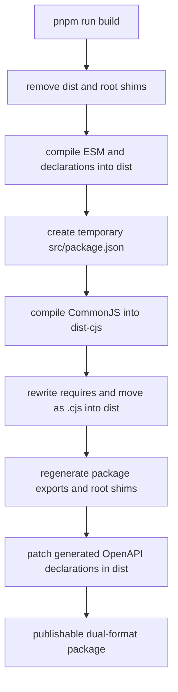
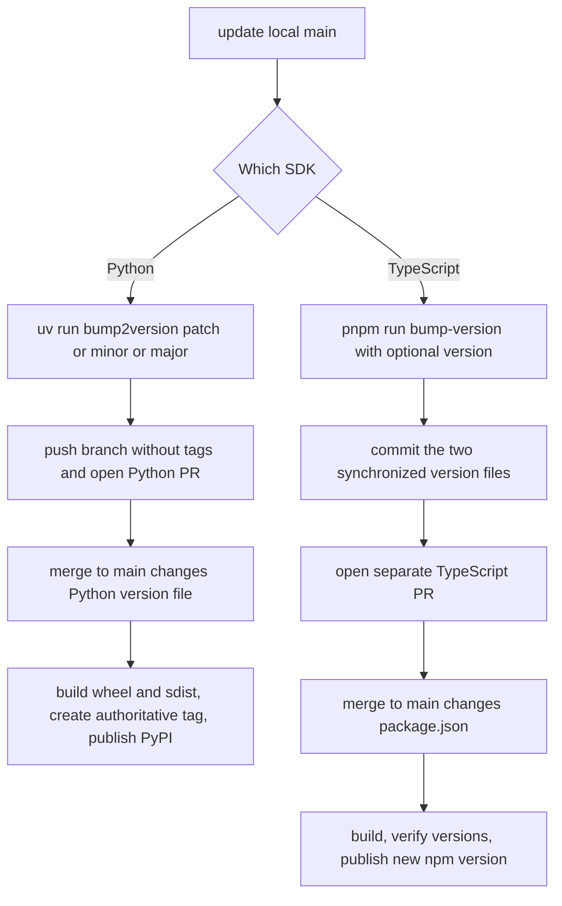

# Development, Generated Code, Builds, and Releases

This repository publishes two independently built SDK distributions. Work from the language directory, use the repository's wrapper commands rather than invoking tools ad hoc, and validate the same packaging boundaries that consumers use. For component boundaries and public API structure, see [Dual-SDK Architecture and Public Surfaces](../architecture/sdk-architecture.md); for test-suite scope, see [Repository Test Strategy](../testing/repository-test-strategy.md).

## Non-negotiable ownership boundaries

The trees `python/langsmith/_openapi_client/` and `js/src/_openapi_client/` are generated by Stainless. **Never edit either `_openapi_client` tree manually.** A later synchronization would overwrite the edit, and the `Protect OpenAPI Client` workflow runs on pull requests that touch either tree. It accepts only a PR whose head branch is `sync/langsmith-api` and whose author is `langtions-bot[bot]`; every other source fails with instructions to remove the changes.

Generated API changes arrive through the external `stlc_sync_python_and_js_sdks` workflow in `langchain-ai/langchainplus`. Put handwritten adaptation or compatibility behavior outside the generated trees. If the generated contract itself must change, use the upstream generation and synchronization process referenced by `CONTRIBUTING.md`, rather than patching generated output here.

There are other generated **build outputs**, but they have a different lifecycle. TypeScript's root entrypoint shims and `dist/` contents are recreated by the build scripts and are not the source of truth. The entrypoint registry in `js/scripts/create-entrypoints.js` is the extension point for adding a public package subpath; it regenerates `package.json` exports and file inclusion, TypeDoc entrypoints, root `.js`/`.cjs`/declaration shims, and the corresponding `.gitignore` section.

## Local contributor loop

### Python

Use `uv` from `python/`. A fresh CI-equivalent development environment installs the development and lint groups:

```bash
cd python
uv sync --group dev --group lint
make format
make lint
make tests
```

`make format` runs Ruff formatting and Ruff autofixes. `make lint` runs Ruff checks and MyPy. `make tests` runs unit tests in parallel with Python development and asyncio debug modes enabled, removes tracing credentials/configuration from the environment, and disables network sockets except Unix sockets. That isolation is intentional; a unit test that unexpectedly needs network access should not silently weaken the suite.

Focus a run with `TEST`, including any pytest arguments:

```bash
TEST=tests/unit_tests/test_client.py make tests
TEST='tests/unit_tests/test_client.py -k create_run -x' make tests
```

Build the source distribution and wheel with:

```bash
make build
# equivalent to: uv build
```

Before changing dependencies or generated-client packaging, run the strict wheel check:

```bash
make test-wheel-imports
```

That target builds without workspace sources, installs the wheel with `--no-deps` into a clean virtual environment, installs only dependencies declared in `pyproject.toml`, and imports/constructs both generated and handwritten clients. It catches the important failure mode where the source checkout passes because a transitive or development dependency is present but the published wheel cannot import. The package uses Hatchling, reads its dynamic version from `langsmith/__init__.py`, supports Python 3.10 and later, and packages the `langsmith` tree.

### TypeScript / JavaScript

Use the pinned pnpm major from `js/package.json` and work from `js/`:

```bash
cd js
pnpm install --frozen-lockfile
pnpm format
pnpm lint
pnpm test
pnpm run test:vitest
pnpm run build
```

`pnpm format` writes `oxfmt` formatting and `pnpm lint` runs `oxlint`; lint explicitly ignores the generated OpenAPI tree. `pnpm test` runs the Jest unit suite while excluding `*.int.test.*`, and `pnpm run test:vitest` covers the Vitest-facing surface. To focus a Jest file, use the documented VM-modules setup:

```bash
NODE_OPTIONS=--experimental-vm-modules npx jest src/tests/context.test.ts
```

A successful `pnpm run build` is also a type and package-surface check. CI separately installs with `--frozen-lockfile`, runs formatting and lint checks, builds, runs Jest and Vitest across supported Node/OS combinations, and exercises the installed package through ESM, CJS, Cloudflare, Vite, Webpack, esbuild, and Metro environments. These export tests matter whenever an entrypoint, module format, declaration, package export, or dependency boundary changes.

The repository-level pre-commit configuration can autoformat, autofix lint, and run type checks for changed Python and TypeScript files. It is a convenience, not a substitute for the complete language-specific commands above.

## How the TypeScript package build works



*The TypeScript build creates ESM and CJS implementations, then regenerates the public package boundary and applies declaration-only compatibility fixes.*

The build first cleans `dist/` and generated root shims. `build:esm` removes any stale temporary `src/package.json`, compiles NodeNext ESM plus declarations into `dist/`, and removes compiled tests. `build:cjs` writes `{}` to `src/package.json`, compiles to `dist-cjs/`, rewrites relative `require` targets from `.js` to `.cjs`, copies them into `dist/`, and removes the temporary directory and package marker. `create-entrypoints.js` then creates matching import, require, and declaration shims for every registered subpath and synchronizes `package.json`.

Finally, `fix-openapi-client-declarations.js` patches known declaration incompatibilities in the **built** `dist/_openapi_client` output. This does not authorize source edits to `js/src/_openapi_client/`. The patcher deliberately throws if an expected generated declaration snippet is absent, so generated-code drift becomes a visible build failure rather than a silently incorrect package. If a CJS compilation is interrupted, check for and remove a leftover `js/src/package.json` before diagnosing surprising module behavior; a subsequent full build's ESM phase also removes it.

When adding or removing a public TypeScript subpath, update the `entrypoints` map in `js/scripts/create-entrypoints.js`, run the full build, and review the synchronized `package.json` and `tsconfig.json` changes. Do not hand-maintain one module format: each public subpath must retain aligned ESM, CJS, `.d.ts`, and `.d.cts` routes.

## CI selection and failure semantics

The main `CI` workflow runs for pushes to `main`, pull requests targeting `main`, a nightly schedule at 03:17 UTC, and manual dispatch. Runs with the same workflow, event type, and ref share a concurrency group, and a newer run cancels the older one.

For ordinary lint, build, unit, compatibility, and export jobs, path detection selects Python for changes under `python/**` and JavaScript for changes under `js/**`; a change under `.github/**` selects both. Nightly runs opt both languages in regardless of changed paths. The final `CI Success` gate waits for all listed jobs: skipped jobs are acceptable, but any failure or cancellation fails the gate.

Integration selection is intentionally different:

- On a pull request, Python integration jobs run for changed `python/**/*.py`, JavaScript integration/eval jobs run for changed JS/TS-family source files, and a `release` label opts both languages in.
- A push runs both integration families against the default beta environment.
- Manual dispatch can enable each language independently, choose one supported environment or all environments, and control fail-fast behavior.
- The nightly runs every suite across beta, ClickHouse-only, dual, and SmithDB-only environments, applies environment-specific test-marker exclusions, and posts to Slack only if the nightly success gate fails.
- Python integration tests use six shards per environment plus evals; doctests run once against beta. JavaScript integration and Vitest eval jobs are unsharded. The Bun integration smoke test is unconditional within this workflow.

See [Repository Test Strategy](../testing/repository-test-strategy.md) for which local or integration suite to extend for a behavior change.

## Release authority and invariants

The **“Cutting a release” section of `CONTRIBUTING.md` is the exclusive release process**. Do not infer an alternative procedure from workflow implementation details, old tags, package-manager commands, or prior automation. Python and TypeScript workflows are independent and must use **separate, narrowly scoped version-bump PRs** against `main`. Never combine both SDK bumps in one release PR, publish directly from a workstation, or push a release tag.



*Each SDK has its own version-bump PR and merge-triggered publication workflow.*

### Python release PR

Start from current `main`, make a dedicated branch, and run the bump tool from `python/`:

```bash
git checkout main && git pull
git checkout -b release-py-X.Y.Z
cd python
uv run bump2version patch   # or minor/major
```

**Do not hand-edit `python/.bumpversion.cfg` or `python/langsmith/__init__.py`.** The bump configuration keeps those versions synchronized, commits the change, and creates a local `vX.Y.Z` tag. That local tag is not authoritative: **do not push it**, and do not use `--tags` or `--follow-tags`.

```bash
git push origin release-py-X.Y.Z
gh pr create --title "release(py): X.Y.Z"
```

Keep the PR to `.bumpversion.cfg` and `langsmith/__init__.py`. After merge, the Python release workflow is triggered by the `python/langsmith/__init__.py` change on `main`. It reads the version, rejects an already-existing `vX.Y.Z` tag, runs `uv build`, creates the authoritative GitHub release/tag at the merged commit, and publishes `python/dist` to PyPI using trusted publishing.

### TypeScript release PR

Start from current `main`, make a different dedicated branch, and invoke the repository script from `js/`:

```bash
git checkout main && git pull
git checkout -b release-js-X.Y.Z
cd js
pnpm run bump-version   # or: pnpm run bump-version X.Y.Z
```

With no argument the script increments the patch component; with an argument it uses that version. It synchronizes `js/package.json` and the exported `__version__` in `js/src/index.ts`, but it does not commit. **Do not hand-edit either version file, use another bump mechanism, or push a tag.** Commit only the synchronized version files:

```bash
git add package.json src/index.ts
git commit -m "release(js): X.Y.Z"
git push origin release-js-X.Y.Z
gh pr create --title "release(js): X.Y.Z"
```

After merge, the `js/package.json` change triggers the JavaScript release workflow. It installs from the lockfile, performs a full build, fails if `package.json` and `src/index.ts` disagree, and queries npm. `npm publish` runs only when the repository version is greater than the currently published `langsmith` version; an existing or non-greater version is not republished. This workflow does not require contributors to create or push a tag.

Both release workflows expose `workflow_dispatch` with `dangerous-non-main-release=true`. The name is an operational warning, not a routine release path; use it only under the exceptional process authorized by maintainers. The normal and exclusive contributor path remains the separate version-bump PRs documented above.

## Troubleshooting checklist

- **A PR fails `Protect OpenAPI Client`:** restore both generated trees and move the change to handwritten code, or obtain it through the authorized upstream sync PR.
- **Python source tests pass but wheel imports fail:** add genuinely imported runtime requirements to `pyproject.toml`; do not rely on dev or transitive dependencies.
- **TypeScript import works in one runtime only:** run the full build and the matching Docker export test; inspect the generated `exports`, root shim, declaration, and ESM/CJS target as one unit.
- **`check-version` fails:** rerun `pnpm run bump-version`; do not repair `package.json` or `src/index.ts` by hand.
- **A release trigger ran but nothing should be republished:** do not retry by changing tags. Confirm the merged version files and registry/tag state, then follow `CONTRIBUTING.md` and maintainer guidance.
