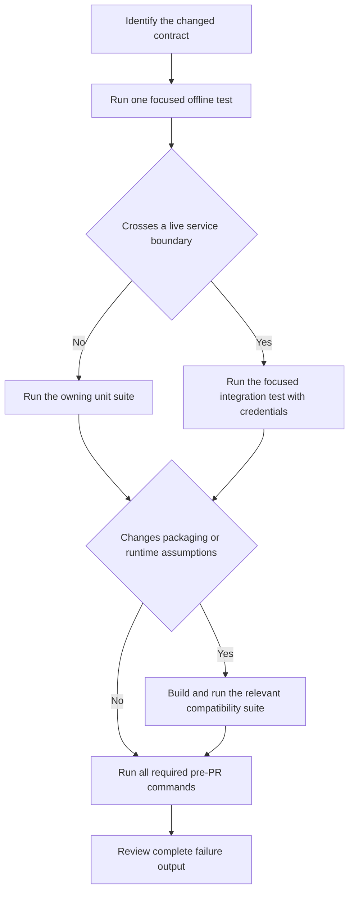

# Repository Test Strategy and Safe Validation

Validate the behavior that changed first, without hiding later failures, and only then widen the test surface. A focused test is the fastest diagnostic loop; it is not a substitute for the full pre-PR commands at the end of this page.



*The validation ladder starts with the smallest behavioral contract and escalates at real integration boundaries.*

## Choose the narrowest meaningful check

A test is meaningful when it exercises the changed contract, not merely the edited file. Keep all failures visible: do not add `-x`, `--maxfail=1`, or `--bail` to ordinary validation. If a focused invocation contains several cases, let all of them finish.

### Python

Run from `python/` so the Makefile supplies the repository's `uv` environment and test safeguards.

```bash
# One file, with full names and output
TEST="tests/unit_tests/test_client.py -vv" make tests

# One test node
TEST="tests/unit_tests/test_run_helpers.py::test_name -vv" make tests

# One offline subsystem
TEST="tests/unit_tests/sandbox -vv" make tests
```

`make tests` defaults to `tests/unit_tests`, unsets tracing/API configuration that could leak in from the shell, enables Python and asyncio debug modes, uses the HTTPX compatibility alias, disables network sockets while permitting Unix sockets, and runs pytest workers automatically. Prefer `TEST=... make tests` over a bare `pytest` command because a bare command silently drops those invariants.

A live integration test is a deliberate escalation. Supply the appropriate LangSmith endpoint/key and any provider key the test needs, then clear the Makefile's default fail-fast setting so the selected set reports every failure:

```bash
INT_TEST="tests/integration_tests/test_runs.py" PYTEST_EXIT_FIRST= make integration_tests
PYTEST_EXIT_FIRST= make evals
```

Use `make integration_tests_fast` only when parallel execution is safe for the selected resources. Integration tests create, poll, and clean up remote state and can be sensitive to eventual consistency; unit tests should remain the default for request construction, retry policy, serialization, batching, and error mapping.

Slow pytest cases are skipped unless `--runslow` is present. Pass it through `TEST` for unit tests, or through the relevant integration invocation, only when the change requires those cases.

### TypeScript

Run from `js/`. Jest is the main unit/integration runner; Vitest has a separate filename convention and configuration.

```bash
# One Jest unit file
NODE_OPTIONS=--experimental-vm-modules npx jest src/tests/context.test.ts --runInBand

# One integration file; omit --bail so every selected case reports
pnpm test:integration src/tests/client.int.test.ts

# One Vitest-specific file
pnpm test:vitest src/tests/guard.vitesttest.ts
```

The normal `pnpm test` script excludes `*.int.test.ts`; `pnpm test:integration` selects that suffix. Jest runs TypeScript as ESM in a Node environment and ignores Vitest-specific files. Vitest selects `*.vitesttest.*` files. Choose the runner from the test filename rather than assuming the two suites are interchangeable.

## What each suite proves

| Suite | Boundary and intended evidence | Typical failure meaning |
|---|---|---|
| Python/JS unit | Local behavior with mocks, fake transports, or disabled sockets | Logic, serialization, concurrency, retry, or error-contract regression |
| Python/JS integration | A credentialed SDK talks to a deployed LangSmith environment and, for wrapper cases, possibly a model provider | API contract, authentication, backend capability, ingestion visibility, or provider compatibility failure |
| Evaluation | Experiment/evaluator orchestration and test-framework reporting | Result association, evaluator execution, attachment handling, or reporter lifecycle regression |
| JS environment/export | The built local package installs and resolves in a real consumer toolchain | Missing entry point, wrong ESM/CJS declaration, browser/edge-incompatible dependency, or bundler failure |
| External compatibility | The local SDK can coexist with a downstream package such as `deepagents` | Dependency range, import, or package-resolution regression |
| Performance | A stable workload records latency/throughput rather than asserting only functional output | Serialization, batching, or event-loop regression; investigate variance before treating one local run as conclusive |

CI runs Python unit tests on Python 3.10–3.13. JavaScript unit tests cover Node 22 and 24 on Linux, plus Node 24 on Windows and macOS, and CI also builds and type-checks the package. A local focused pass therefore does not establish version or operating-system compatibility.

### Environment-aware integration

The integration matrix targets `beta`, ClickHouse-only, dual, and SmithDB-only deployments. Python integration tests are split deterministically into six shards by hashing pytest node IDs; capability markers remove tests unsupported by a target backend. The JS suite uses `LANGSMITH_TEST_EXCLUDE_MARKERS` and the `requiresV2`, `requiresClickhouse`, and `requiresBetaDataset` helpers for the same purpose. Do not “fix” an environment-specific failure by globally skipping a test: attach the narrow capability marker only when the endpoint truly does not exist there.

Normal PR/push Python integration runs retain `-x`, while JS integration and Vitest evaluation default to complete failure output. Nightly CI runs every environment and clears Python fail-fast. For manual debugging, prefer a narrow selection with fail-fast disabled; this preserves useful failure context without paying for the entire matrix.

## Network isolation, fixtures, and cassettes

Offline tests must fail if production code unexpectedly opens a network socket. Python's `make tests` enforces this with `--disable-socket --allow-unix-socket`; use a fake transport or mock server rather than relaxing the suite globally.

The root Python `conftest.py` installs an automatic VCR fixture. It records/replays only OpenAI and Anthropic traffic, filters authentication-related headers and likely secrets in bodies, and names cassettes from the module and test function. Integration configuration extends this to Gemini. The default `--vcr-mode=once` replays an existing cassette and allows an initial recording; `none` is the strict replay-only choice. Cassette matching normally includes the request body, while doctests and selected provider adapters use more tolerant matching for unstable payload shapes.

Treat cassettes as reviewable fixtures, not opaque snapshots:

- never commit credentials, bearer tokens, signed URLs, or unrelated service traffic;
- re-record only the smallest affected test and inspect the YAML diff;
- keep deterministic request fields stable so replay mismatches reveal contract changes;
- do not use a cassette to replace a LangSmith integration test—the VCR filters intentionally omit non-provider requests.

In JS tests, inject `fetchImplementation`, use the existing mock clients/MSW patterns, or stand up an explicit local fake. Integration polling helpers tolerate eventual consistency and throw a timeout with context; they should not be copied into unit tests to mask nondeterminism.

## Focused change map

Start with the listed seam, then add adjacent tests when a change spans contracts.

| Changed area | Python focus | TypeScript focus | Escalate when |
|---|---|---|---|
| Trace creation, context, batching, ingestion | `tests/unit_tests/test_run_helpers.py`, `test_run_trees.py`, `test_background_thread.py`, `test_hybrid_tracing.py` | `src/tests/traceable.test.ts`, `run_trees.test.ts`, `context.test.ts`, `batch_client.test.ts`, `failed_traces.test.ts` | Run `test_runs.py`, `run_trees.int.test.ts`, `traces.int.test.ts`, or context integration after changing remote visibility or propagation |
| Core client, retries, headers, replicas, attachments | `test_client.py`, `test_async_client.py`, `test_custom_headers.py`, multipart/replica tests | `client.test.ts`, `client_retry.test.ts`, `client_headers.test.ts`, `replica_endpoints.test.ts` | Use client integration tests for endpoint and backend behavior; use wheel/export tests for dependency/import changes |
| Evaluation and test-framework adapters | `tests/unit_tests/evaluation/`, then `tests/evaluation/` | `evaluate_runner.test.ts`, `src/tests/jestlike/`, `vitest_reporter.vitesttest.ts` | Run Python `make evals` or `pnpm test:eval:vitest` when result upload/reporting crosses LangSmith |
| Provider and agent wrappers | `tests/unit_tests/wrappers/` | the matching `wrapped_*.test.ts`, agent SDK, or Vercel test | Run the matching wrapper integration file when provider request/response translation changes; use sanitized cassettes where supported |
<!-- openwiki: broken internal link [/openwiki/workflows/sandbox-lifecycle-and-execution] file "/openwiki/workflows/sandbox-lifecycle-and-execution" does not exist. Fix the href or restore the target, then delete this comment. -->
| Sandbox lifecycle, command transport, WebSocket/Yamux | `tests/unit_tests/sandbox/`, especially command retry, transport, tunnel, and sync/async conversion | `sandbox.test.ts` plus handshake, reconnect acknowledgment, command-ID retry, and error tests | Use live sandbox validation only for server-owned lifecycle or protocol behavior; see [Sandbox Lifecycle and Execution](/openwiki/workflows/sandbox-lifecycle-and-execution) |
| Public exports, generated entry points, runtime compatibility | Build first, then `make test-wheel-imports` for Python runtime dependencies | Build first, then the one `js/internal/environment_tests` Docker service matching ESM, CJS, Cloudflare, Vite, Webpack, esbuild, or Metro | Run all environment jobs when changing `package.json` exports, entrypoint generation, declarations, or shared runtime dependencies |
| Performance-sensitive tracing/serialization | `make benchmark-fast`; use `make benchmark-codspeed` or `make benchmark-datadog` for the pytest benchmark cases | opt in to `src/tests/perf.int.test.ts` with `LANGSMITH_RUN_PERF_BENCH=true` | Compare against a baseline on the same machine/CI; the JS benchmark uses a fake fetch and emits machine-readable results |

For a JS export check, build the package before starting the isolated consumer:

```bash
cd js
pnpm build
cd ..
docker compose -f js/internal/environment_tests/docker-compose.yml run test-exports-esm
```

Replace the service with `test-exports-cjs`, `test-exports-cf`, `test-exports-vite`, `test-exports-webpack`, `test-exports-esbuild`, or `test-exports-metro` as appropriate. These projects install `langsmith` from the repository and exercise consumer compilation/bundling, which an in-repository import cannot prove.

Generated OpenAPI client directories are a special ownership boundary: do not hand-edit `python/langsmith/_openapi_client/` or `js/src/_openapi_client/`. Pull requests touching them are accepted only from the authorized SDK synchronization workflow. Validate changes at the generator/sync source rather than trying to bypass the protection check.

## Required full pre-PR validation

After focused tests pass, run the complete commands required for every SDK you changed. Do not replace them with the narrower examples above.

From `python/`:

```bash
make format
make lint
make tests
```

From `js/`:

```bash
pnpm format
pnpm lint
pnpm test
```

For TypeScript changes that affect types, packaging, Vitest adapters, or exports, also run the corresponding `pnpm build`, `pnpm test:vitest`, and environment test even though the three commands above are the repository's mandatory pre-PR baseline. For integration-boundary changes, run the focused live suite with credentials and no fail-fast, then rely on CI's environment matrix for full backend coverage.

CI path detection runs SDK jobs when that SDK or `.github/**` changes and the final `CI Success` job fails if any required job failed or was cancelled while allowing legitimately skipped jobs. Related operational context is in [Development and Release](/openwiki/operations/development-and-release.md); assertion/reporting behavior is covered by [Test Tracking and Assertions](/openwiki/testing/test-tracking-and-assertions.md), and tracing integration behavior by [Trace Capture and Ingestion](/openwiki/workflows/trace-capture-and-ingestion.md).
