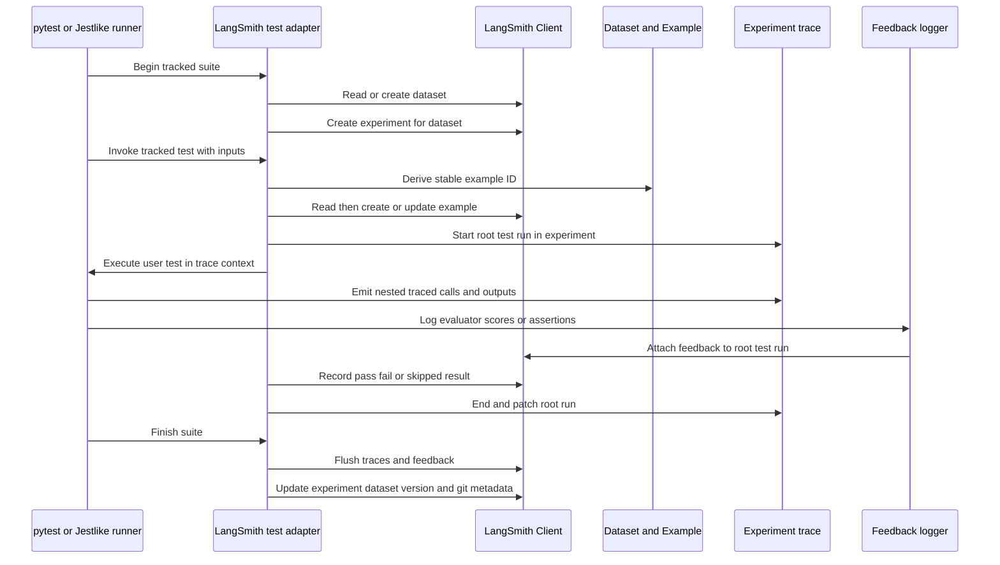

# LangSmith Test Tracking and Evaluation Assertions

LangSmith test tracking is a user-facing SDK feature for treating ordinary test-runner cases as repeatable evaluations. A test suite becomes a LangSmith dataset, each test case becomes or updates an example, and each invocation becomes a traced experiment run with pass/fail and optional quality feedback. This is distinct from the repository's own unit, integration, compatibility, and CI validation practices; see [Repository Test Strategy and Safe Validation](repository-test-strategy.md) for how maintainers validate this SDK itself.

The Python and JavaScript APIs share that model, but they integrate differently:

- **pytest:** `@pytest.mark.langsmith` is intercepted by the plugin and wrapped with `langsmith.testing.test`. The decorator can also be used directly, including outside pytest.
- **Jest and Vitest:** import the wrapped `describe`, `test`/`it`, and `expect` from `langsmith/jest` or `langsmith/vitest`. `ls.describe` owns one dataset/experiment scope and must contain the `ls.test` calls. `wrapJest` and `wrapVitest` support installations that need to wrap a particular runner instance.

## User-facing shape

A minimal pytest case can separate arguments that are reference outputs from the example inputs and can explicitly log the application output and a metric:

```python
import pytest
from langsmith import expect
from langsmith import testing as t

@pytest.mark.langsmith(output_keys=["expected"], split="regression")
def test_answer(question: str, expected: str):
    actual = answer(question)
    t.log_outputs({"answer": actual})
    expect.edit_distance(actual, expected).to_be_less_than(0.2)
```

The plugin passes marker options to `test`, captures fixture and parameter values from the function signature, removes `output_keys` from inputs into reference outputs, and supports `id`, `test_suite_name`, `metadata`, `experiment_metadata`, `repetitions`, `split`, `cache`, and `cached_hosts`. `log_inputs`, `log_outputs`, `log_reference_outputs`, `log_feedback`, and `trace_feedback` are valid only in the active tracked-test context (except that they become no-ops when tracking is explicitly disabled).

The corresponding Jest/Vitest contract makes the example data explicit:

```ts
import * as ls from "langsmith/vitest";

ls.describe("answer-regressions", () => {
  ls.test(
    "answers a question",
    {
      inputs: { question: "What is 2 + 2?" },
      referenceOutputs: { answer: "4" },
      split: "regression",
      config: { repetitions: 2 },
    },
    async ({ inputs, referenceOutputs }) => {
      const actual = await answer(inputs.question);
      ls.logFeedback({ key: "exact", score: actual === referenceOutputs.answer });
      return { answer: actual };
    },
  );
});
```

`test.each`, `test.concurrent`, `only`, and `skip` variants mirror the runner APIs. A non-null return is recorded as output; a primitive is normalized to `{ result: value }`. A return value overrides an earlier `logOutputs` value, while repeated `logOutputs` calls replace the preceding value and warn.

## Lifecycle and control flow



*Tracked-suite lifecycle from setup and example synchronization through nested execution, feedback, and teardown.*

### Suite setup

Python lazily creates one `_LangSmithTestSuite` singleton per suite name in the process. The name comes from `LANGSMITH_TEST_SUITE` when set, otherwise from repository and module information, unless the marker/decorator supplied it. The client reads or creates the dataset and creates an experiment project referencing it. Experiment names use `LANGSMITH_EXPERIMENT` or the tracer project as a prefix; pytest-xdist workers derive the same suffix from `PYTEST_XDIST_TESTRUNUID`, while a normal run uses a random suffix. User experiment metadata is merged with system-owned `revision_id` and `__ls_runner` keys taking precedence.

Jest/Vitest setup runs in `beforeAll`. It reads or creates the dataset named by `ls.describe` (or `testSuiteName`), then creates a uniquely named project referencing that dataset. An `AsyncLocalStorage` value carries the suite, client, setup promise, current example, root run, and output/feedback callbacks. Tests explicitly wait for setup because concurrent Jest execution is not guaranteed to wait for `beforeAll`. Nested `ls.describe` blocks are rejected because each such block represents a dataset; use the native runner's `describe` for grouping inside it.

### Stable example identity and synchronization

Both implementations use deterministic UUIDv5 IDs and the same namespace, but callers should not infer that differently serialized Python and JavaScript values necessarily produce identical IDs.

- Modern Python identity hashes the serialized inputs and outputs with SHA-256, combines those hashes with the dataset ID, and produces UUIDv5. If `log_inputs` replaces fixture-derived inputs, those logged inputs become the identity source. For datasets without runtime SDK metadata at least `0.4.33`, Python preserves the legacy file/module plus function-name scheme, adding inputs for parametrized tests. An explicit `id` wins.
- JavaScript sorts object keys recursively, hashes inputs and reference outputs, combines those hashes with the dataset ID, and produces UUIDv5. Arrays retain order, `null` and `undefined` are intentionally equivalent in primitive hashing, and structures deeper than 50 levels are rejected. An explicit `id` wins.

Synchronization is an upsert rather than an append. Existing examples are updated when relevant inputs, outputs, metadata, split, or dataset ownership differ; missing examples are created. Python handles a concurrent create conflict by reading the winner, which matters under pytest-xdist. JavaScript memoizes synchronization promises by example ID within the suite, awaits synchronization before starting the traced test, and waits for all such promises at teardown.

### Traced execution and context propagation

The root test run belongs to the experiment project and references the synchronized example. In Python, `rh.trace` establishes the run and `tracing_context` adds the experiment metadata around synchronous and asynchronous wrappers. In JavaScript, `traceable` creates the root and a nested `AsyncLocalStorage.run` records that root in the test context. Consequently, ordinary `@traceable`, wrapped OpenAI/Anthropic clients, and other tracing-aware calls made by the test become children of the test run; feedback still targets the root trace rather than whichever nested run happens to be current.

A successful test logs `pass=1` or `true`; a failure logs `0` or `false` and is rethrown to the test runner. Python gives skipped tests a `None` pass score and records a skipped reason as output. Python's root run is ended asynchronously only after the example is synchronized, assigned `reference_example_id`, and patched. JavaScript preserves the runner's original error after stripping ANSI only for the trace-friendly copy.

### Outputs, reference outputs, and feedback

In Python, function arguments are initial inputs and `output_keys` identify reference outputs. The function return is the default run output, while `testing.log_outputs` adds explicit root-run output and `testing.log_reference_outputs` changes the dataset example's expected output. Non-dict returns are normalized under `output`. `log_feedback` accepts either one feedback object/list or the `key` plus `score`/`value` form, not both, and attaches it to the root trace with experiment ID and run start time.

`trace_feedback` isolates expensive grading work in the `evaluators` project with `reference_run_id` metadata. Feedback logged inside that context is redirected to the application test run and records the evaluator run as `source_run_id`. JavaScript's `wrapEvaluator` has the same architectural separation: it traces the evaluator as a root in the `evaluators` project, associates it with the current example, and logs any returned `{ key, score }` feedback against the test root with evaluator provenance. `expect(actual).evaluatedBy(evaluator)` feeds the current inputs, reference outputs, and actual outputs to that evaluator, then exposes the returned score to normal Jest/Vitest matchers.

Feedback and trace writes are deliberately buffered. Python uses context-propagating thread-pool executors and shuts them down at process exit. JavaScript retains evaluator feedback promises, waits for them and pending trace batches in `afterAll`, then updates experiment metadata with the dataset version and available Git state. Do not force-exit a runner before teardown if complete remote results matter.

## Approximate assertions

### Python `expect`

`langsmith.expect` computes or accepts a score, logs metric feedback asynchronously, and returns a matcher. Available constructors are:

- `expect.embedding_distance(prediction, reference, config=...)`: embedding distance with a custom encoder or the default OpenAI encoder and cosine, Euclidean, Manhattan, Chebyshev, or Hamming distance.
- `expect.edit_distance(prediction, reference, config=...)`: string distance through `rapidfuzz`, configurable among Damerau-Levenshtein, Levenshtein, Jaro, Jaro-Winkler, Hamming, and Indel, normalized by default.
- `expect.score(value, key=...)`: log an existing numeric or Boolean metric.
- `expect(value)` or `expect.value(value)`: assert directly without first computing a metric.

Matchers include strict less/greater comparisons, an exclusive range, rounded approximate equality, exact equality, `None`, containment, and `against(callable)`. Every matcher assertion logs separate `expectation` feedback with score 1 or 0; failure still raises `AssertionError`. Therefore a distance call followed by a matcher normally creates both the metric feedback and the pass/fail expectation feedback. With `LANGSMITH_TEST_TRACKING=false`, assertions still execute but remote feedback is suppressed.

### Jest/Vitest matchers

The wrapped `expect` adds three asynchronous string matchers:

- `toBeAbsoluteCloseTo`: Levenshtein edit distance no greater than `threshold` (default 3).
- `toBeRelativeCloseTo`: edit distance divided by the longer string length no greater than `threshold` (default 0.1); the threshold must be between 0 and 1.
- `toBeSemanticCloseTo`: cosine or dot-product similarity from a supplied `embeddings.embedQuery`; it passes when similarity is at least `1 - threshold` (default threshold 0.2).

These are approximate runner assertions, not automatically evaluator feedback. Use `logFeedback`, `wrapEvaluator`, or `evaluatedBy` when the score must also appear on the LangSmith experiment.

## Caching external calls in pytest

Caching is currently implemented by the Python test decorator. Set `LANGSMITH_TEST_CACHE` or pass `cache` to select a cache directory; each suite uses `<dataset-id>.yaml`. It requires `langsmith[vcr]`. The VCR cassette replays existing calls and records new episodes, matching URI, method, path, and body, and strips authorization/cookie headers.

LangSmith's own API URL is excluded so dataset, trace, and feedback operations remain live. `cached_hosts` restricts recording to selected hostnames or URL prefixes; using it without a configured cache raises `ValueError`. Without `cached_hosts`, eligible non-LangSmith HTTP calls are cached. Commit only reviewed cassettes: request bodies may contain user data even though selected headers are removed.

## Configuration and failure boundaries

- `LANGSMITH_TEST_TRACKING=false` bypasses Python wrapping/remote log helpers and disables JavaScript remote tracking. In JavaScript, explicit `enableTestTracking` at suite or test config takes precedence; otherwise tracking follows tracing enablement.
- Python tracing must be enabled for `log_inputs`, `log_outputs`, `log_feedback`, and `trace_feedback` to find an active run. Calling context-bound helpers outside a tracked test raises a targeted `ValueError`; JavaScript similarly rejects calls outside `ls.describe`/`ls.test`.
- Python `LANGSMITH_EXPERIMENT_METADATA` must contain valid JSON when no explicit metadata is supplied. Marker metadata from the session fixture is used only when the marker did not explicitly set it.
- `--langsmith-output` enables an optional Rich live table for pytest. It requires the `rich` extra, rejects pytest-xdist and disabled tracking, groups marked tests by suite, and displays inputs, reference outputs, outputs, feedback, status, duration, and experiment URL.
- Jest and Vitest offer custom reporters that consume per-test temporary JSON files written even on failure. They display local test results and quality feedback; reporter rendering is presentation only and does not drive remote synchronization.

## Safe extension points

Keep runner-specific imports and type augmentation in `jest` or `vitest`, and put shared lifecycle changes in the Jest-like utility. Preserve the ordering invariant that the example is synchronized before the trace/feedback that references it. New feedback mechanisms should target the root test trace and preserve evaluator `source_run_id`; otherwise nested application calls or grading traces become the accidental evaluation target. Changes to identity serialization are migration-sensitive because they can duplicate examples rather than update them.

For broader experiment concepts, see [Evaluation and Experiments](../workflows/evaluation-and-experiments.md). For trace parenting and context behavior, see [Run Trees and Context](../concepts/run-tree-and-context.md). The client operations used at the integration boundary are covered by [Platform Client](../concepts/platform-client.md).
