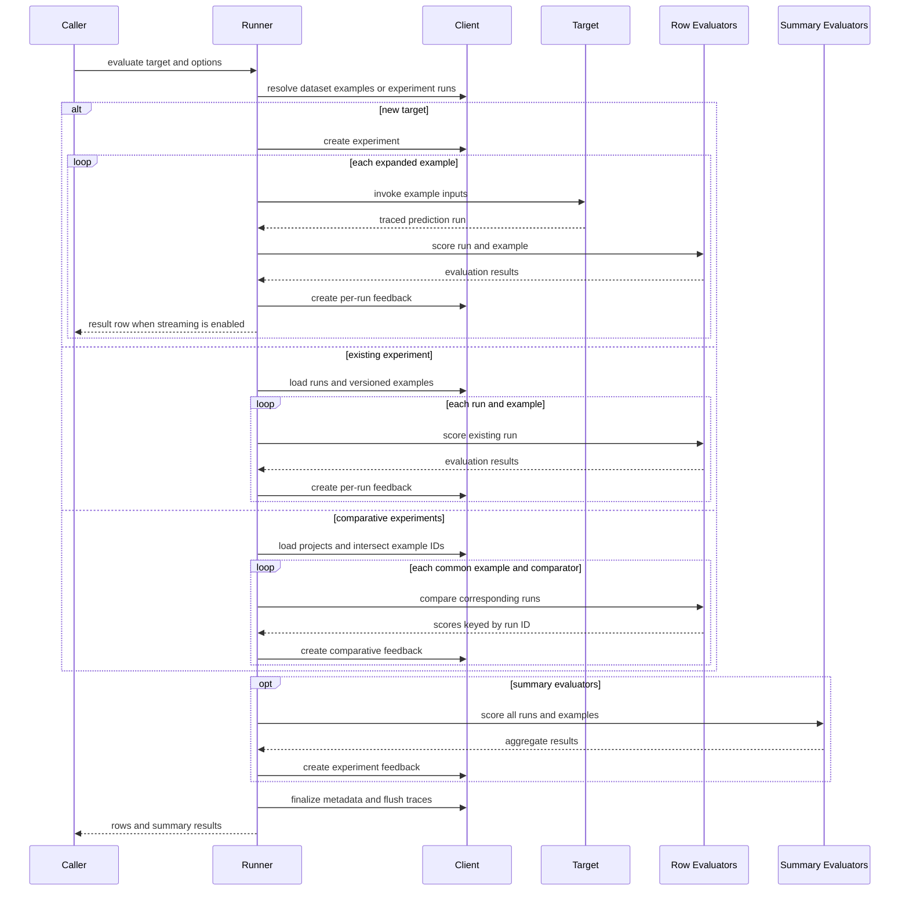

# Evaluation and Experiment Workflows

Evaluation is an orchestration layer around traces. It resolves examples, creates or reuses an experiment (a tracing project), runs a target when necessary, associates each root run with its reference example, executes evaluators, and records their outputs as feedback. Python exposes synchronous `evaluate`, asynchronous `aevaluate`, and explicit existing-experiment helpers; JavaScript exports `evaluate`, which dispatches callable targets and arrays of experiments, plus the deprecated direct `evaluateComparative` entrypoint.

The important distinction is what creates the runs:

| Path | Input | Prediction phase | Result destination |
| --- | --- | --- | --- |
| New target | Callable or LangChain `Runnable`, plus dataset data | Runs the target once per expanded example and traces each call into a newly created experiment, or into the advanced `experiment` supplied in Python | Per-run feedback is attached to target runs; summary feedback is attached to the experiment |
| Existing experiment | One experiment name, ID, or `TracerSession` (public in Python) | None; loads existing root runs by default, reconstructs their examples at the experiment's recorded dataset version, then scores them | Adds feedback to the existing experiment and runs |
| Comparative | Two existing experiments in Python, or at least two experiment names/results in JavaScript | None; loads runs from each experiment, intersects them by `reference_example_id`, and compares corresponding outputs | Creates a comparative experiment and feedback linked to it |

An “existing experiment” is therefore not another dataset selector: its recorded runs and `reference_dataset_id` define what is evaluated. `load_nested` / `loadNested` controls whether child traces are reconstructed under roots for evaluator inspection; scoring is still grouped by reference example.

*Caption: The three evaluation paths share feedback normalization, but only a new-target evaluation invokes predictions and only a comparative evaluation creates run-to-run scores.*

## Data and experiment lifecycle

For a new target, `data` may be a dataset name, dataset UUID, an iterable/list of `Example` values, or the corresponding async form. The client fetches attachments only when the target or evaluators declare that they consume them. The manager materializes or tees the example stream as needed, and `num_repetitions` expands it in repetition-major order: every source example appears once per pass. The experiment records the source example count, repetition count, and best-effort evaluator keys for progress reporting.

Starting the manager requires at least one example. It chooses a generated name or appends a random suffix to `experiment_prefix`, creates a project tied to the first example's dataset, and retries naming conflicts up to ten times. User metadata is augmented with revision and Git information. At prediction completion, the runner updates experiment metadata with the newest example modification time as `dataset_version` and the encountered dataset splits. This version is later used to reload the same reference state when an existing or comparative experiment is evaluated.

<!-- openwiki: broken internal link [/openwiki/concepts/run-tree-and-context] file "/openwiki/concepts/run-tree-and-context" does not exist. Fix the href or restore the target, then delete this comment. -->
<!-- openwiki: broken internal link [/openwiki/concepts/platform-client] file "/openwiki/concepts/platform-client" does not exist. Fix the href or restore the target, then delete this comment. -->
Each prediction is wrapped as a traceable call under the experiment project. The wrapper passes example inputs, optionally attachments, and tags the root run with `reference_example_id` and `example_version`. This is the join key that lets later workflows recover the correct example. For the relationship between that wrapper and tracing context, see [Run Tree and Context](/openwiki/concepts/run-tree-and-context); client project, run, and feedback operations are covered by [Platform Client](/openwiki/concepts/platform-client).

Python supports `upload_results=False` for a new-target run. In that mode it does not create or update a remote experiment and skips row and summary feedback uploads while still returning rows and scores; the synchronous runner explicitly uses local tracing context. It is deliberately invalid for existing and comparative targets, whose identity and destination are remote experiments. JavaScript's evaluation runner always uses the client-backed experiment and feedback path.

## Prediction and evaluation scheduling

`num_repetitions` controls work quantity, while concurrency controls how much of that work may be active:

- In both SDKs, zero means sequential execution. Python uses `None` for no explicit limit; JavaScript queue limits use positive numbers.
- Python's synchronous runner uses a context-propagating thread pool. Its async runner pipelines prediction and all row evaluators for one example as a task, so `max_concurrency` bounds the number of whole per-example pipelines active at once.
- JavaScript permits `targetConcurrency` and `evaluationConcurrency`. If both are explicitly supplied, prediction and evaluation use separate queues. Otherwise a positive `maxConcurrency` creates one shared queue, bounding the combined pipeline; each more-specific value falls back to `maxConcurrency` and then zero.
- Concurrent workers emit internally as they complete rather than in dataset order. JavaScript retains each example index and restores dataset order before publishing final rows and before invoking summary evaluators. Python's streaming iterators expose completion order.

Prediction and row evaluation are intentionally interleaved. A fast prediction can be evaluated while a slower example is still in flight; the runner does not require all predictions to finish before row scoring begins. Within one row, evaluators are invoked in the configured sequence.

## Evaluator contracts and feedback

A row evaluator receives the prediction `Run` and reference `Example`. Function adapters additionally support object/unpacked views such as `inputs`, `outputs`, `reference_outputs` / `referenceOutputs`, and attachments. A result names a feedback `key` and may contain a numeric/boolean `score`, categorical or structured `value`, `comment`, correction, feedback configuration, and source/target run IDs. An evaluator may return one result, a list, or an `EvaluationResults` batch; dynamic evaluator adapters normalize these forms and trace the evaluator itself in the `evaluators` project. The evaluator trace ID becomes `source_run_id`, linking feedback to the computation that produced it.

`RunEvaluator` is the principal extension boundary. Plain functions are wrapped into it, while custom classes can implement `evaluate_run` / `aevaluate_run` (Python) or `evaluateRun` (JavaScript). Python's `LLMEvaluator` is also a `RunEvaluator` and maps run/example values into a structured-output judge, but it is deprecated in favor of `openevals`.

Row feedback targets a run and is also associated with the experiment. Summary evaluators run only after all rows are available. They receive the complete aligned runs/examples collections, or object-style arrays of inputs, outputs, and reference outputs. Their normalized feedback uses `run_id=None` / `null` and the project ID, making it experiment-level rather than run-level. Failure of one row or summary evaluator is logged and does not stop later evaluators. Python additionally synthesizes error feedback—with `extra.error` and the exception in `comment`—when the evaluator's feedback keys can be inferred; JavaScript logs the evaluator failure and leaves that evaluator's row result absent.

## Existing and comparative selection

Python's `evaluate(existing_experiment, ...)` delegates to `evaluate_existing`; `aevaluate` similarly delegates to `aevaluate_existing`. The helper loads root runs unless `load_nested=True`, loads examples from the project's reference dataset at its stored `dataset_version`, aligns each run through `reference_example_id`, and applies ordinary row and summary evaluators. No new predictions or repetitions occur.

Comparative evaluation has stricter invariants. The experiments must use the same reference dataset, there must be at least two experiments and at least one comparator, and only example IDs present in every experiment are considered. JavaScript also rejects an empty intersection and warns when stored dataset versions differ. For every common example, a comparative evaluator receives the corresponding runs (optionally shuffled to reduce positional bias) and returns one key plus a score map keyed by run ID. JavaScript validates that every returned ID belongs to the supplied run set. Scores are uploaded once per run with the comparative experiment ID and evaluator source trace.

The comparative call creates a separate comparative-experiment record containing the source experiment IDs, metadata, and reference dataset, and returns both that record and a comparison URL when one can be built. This is not a summary evaluator: it produces per-example, per-run preference feedback.

### Invalid combinations

Validate the path before starting expensive work:

- A new callable requires `data`. Python rejects unsupported extra keyword arguments, async callables passed to synchronous `evaluate`, and specifying both `experiment` and `experiment_prefix`.
- For a single existing experiment, Python rejects `data`, `num_repetitions > 1`, `experiment`, `experiment_prefix`, and `upload_results=False`.
- For a comparative tuple, Python requires exactly two experiment identifiers and rejects `data`, repetitions, `experiment`, `summary_evaluators`, and `upload_results=False`. Asynchronous comparative evaluation is not supported by `aevaluate`; use synchronous `evaluate` and synchronous comparators.
- Direct comparative runners reject too few experiments, no evaluators, negative concurrency, different reference datasets, and (in JavaScript) no common examples. JavaScript's top-level `evaluate` requires evaluators whenever its target is an experiment array.

These are configuration errors and fail the whole call. Comparative evaluator failures also fail the aggregate comparison (`Promise.all` in JavaScript and future result propagation in Python), unlike ordinary row evaluator failures.

## Per-item target errors and result consumption

Target exceptions are caught and logged so other examples can continue. In Python, `error_handling="log"` assigns the example ID before invocation, so a failed traced run remains counted in the experiment; `"ignore"` assigns it only on success, so failed runs are not counted as experiment examples. An unrecognized mode is rejected. JavaScript likewise logs a target exception, but then requires the tracing wrapper to have created a run; absent tracing produces a hard “Run not created” error. Project finalization is attempted even when JavaScript prediction processing fails.

Python's `blocking=True` consumes all rows before `evaluate` returns. With `blocking=False`, `ExperimentResults` processes in a background thread and its iterator yields queued rows as they arrive; `wait()` joins and rethrows processing errors. `AsyncExperimentResults` always owns a processing task, supports `async for`, and `await results.wait()` waits for completion. Summary results become available after row consumption.

JavaScript currently resolves the `evaluate` promise only after `processData` has consumed all rows, restored their input order, computed summaries, and awaited pending trace batches. Its returned `ExperimentResults` implements `AsyncIterable`, but iteration reads the already collected rows rather than providing caller-visible live streaming. Comparative JavaScript similarly waits for all evaluator/feedback promises and pending trace batches.

## Focused verification

The tests that protect this workflow emphasize behavior rather than just return types:

- Python runner tests cover synchronous and asynchronous targets, local versus uploaded execution, blocking versus streaming consumption, repetitions, evaluator result normalization, interleaving, summary scores, and rescoring an uploaded experiment.
- Python argument tests pin the invalid combinations for existing and comparative targets, while integration tests verify that evaluator exceptions become keyed error feedback without dropping result rows.
- JavaScript runner tests measure independent target/evaluator concurrency and prove that fast rows are scored before a slow prediction completes. Integration tests verify summary evaluator signatures and that concurrent completion is reordered before summaries and returned rows.

When changing the manager pipeline, preserve the three central invariants: each row keeps the correct run/example pairing, summary collections remain aligned, and feedback is attached to the intended run or experiment even when work completes out of order.
