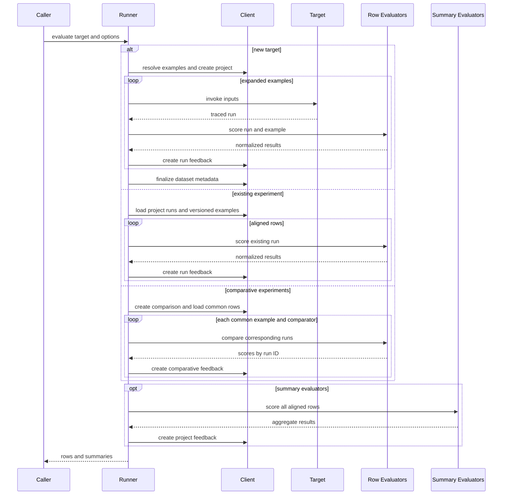

# Evaluation and Experiment Workflows

Evaluation is orchestration around traces: resolve examples or prior runs, establish the experiment destination, run predictions when needed, align each root run with its reference example, invoke evaluators, and persist normalized feedback. Python exposes synchronous `evaluate`, asynchronous `aevaluate`, and explicit existing/comparative helpers. JavaScript exposes `evaluate` for callable targets and experiment arrays; direct `evaluateComparative` remains as a deprecated entrypoint.

## Choose the run-selection path

| Path | SDK entrypoint and input | Predictions | Destination |
| --- | --- | --- | --- |
| New target | Python `evaluate` or `aevaluate`; JavaScript `evaluate`; callable or `Runnable` plus `data` | One traced call per expanded example | A new project, or Python's advanced supplied `experiment`; Python alone can remain local with `upload_results=False` |
| Existing experiment | Public Python `evaluate(existing_experiment, ...)`, `evaluate_existing`, `aevaluate_existing` | None | Feedback is added to the loaded runs and their project |
| Comparative | Python synchronous `evaluate((experiment_a, experiment_b), ...)` or `evaluate_comparative`; JavaScript `evaluate([experiment_a, experiment_b, ...], ...)` | None | A separate comparative experiment and per-run comparative feedback |

An existing experiment is not a dataset selector. Its root runs and `reference_dataset_id` define the rows. `load_nested` / `loadNested` reconstructs child-run trees under their roots for evaluator inspection, but the roots remain the scored rows. Python reloads examples from the reference dataset at the project's stored `dataset_version`; comparative JavaScript does the same using the first project's recorded version.

*Caption: New-target, existing-experiment, and comparative evaluation share scoring concepts but differ in run creation and feedback destination.*

## New-target lifecycle

`data` can identify a dataset by name or ID or supply example collections/iterators; Python also accepts `Dataset`, UUID, and async iterable forms on the applicable runner. Attachments are fetched only when target/evaluator signatures indicate they are consumed. Both SDKs expand `num_repetitions` in repetition-major order: a complete pass over the source examples is followed by the next pass.

For uploaded work the manager reads the first example, chooses a generated experiment name or suffixes `experiment_prefix`, and creates a project tied to that example's dataset. Name conflicts are retried up to ten times. The project receives metadata, best-effort example/repetition counts, and evaluator keys for progress reporting. When the prediction stream is exhausted, the project is updated with the latest example modification time as `dataset_version` and the encountered dataset splits. That recorded version is what later rescoring uses.

Each prediction runs in an explicitly enabled tracing context under the experiment project. The root run records `reference_example_id` and `example_version`; that association is the join between traces and examples. See [Run Tree and Context](/openwiki/concepts/run-tree-and-context.md) for tracing context and [Platform Client](/openwiki/concepts/platform-client.md) for project, run, and feedback operations.

### Python local mode

`upload_results=False` exists only for Python new-target evaluation. It skips remote project creation/finalization and both row and summary feedback uploads, while target and evaluator traces use local tracing and result rows still contain scores. Existing and comparative paths reject the option because they require remote experiment identities. JavaScript has no equivalent evaluation option.

Result properties that require a remote project, such as Python `experiment_id` or project URLs, are not meaningful in local mode.

## Scheduling, concurrency, and ordering

The runners pipeline work rather than imposing a global “predict everything, then score everything” barrier. In Python's synchronous generator, consuming one prediction feeds row scoring before the next rows must finish; concurrent prediction and scoring pools emit completed work. Python `aevaluate` uses one task per example when a target and evaluators are both present: prediction and that row's evaluators run sequentially inside the task, while `max_concurrency` bounds active per-example tasks.

Concurrency semantics are intentionally language-specific:

- `0` means sequential execution in both SDKs. Python `None` means no explicit concurrency limit.
- Python synchronous evaluation uses context-propagating thread pools. Its row evaluators execute in configured order within a row. Async row evaluators are also awaited in configured order within each per-example task.
- JavaScript has `targetConcurrency` and `evaluationConcurrency`. Supplying both creates independent queues, which allows fast predictions to be evaluated while a slow prediction remains active. Otherwise, a positive `maxConcurrency` supplies one shared queue; each specific limit falls back to `maxConcurrency`, then `0`.
- Concurrent Python result iterators preserve completion order, not dataset order. JavaScript keeps an `exampleIndex`, collects every row, then restores expanded dataset order before exposing `results` and before summary evaluation.

This ordering difference is operationally important: JavaScript's returned object is async-iterable, but `evaluate` has already consumed, ordered, summarized, and awaited pending trace batches before its promise resolves. Python `blocking=False` starts background processing and exposes rows as they arrive; `wait()` joins and rethrows processing failures. `AsyncExperimentResults` owns a task, supports `async for`, and `await results.wait()` propagates task failure. Summaries become available only after all rows have been consumed.

## Evaluator contracts and feedback

`RunEvaluator` is the row-level extension boundary. Plain functions are adapted to `evaluate_run` / `aevaluate_run` in Python or `evaluateRun` in JavaScript. Adapters support run/example signatures and object or unpacked inputs, outputs, reference outputs, and attachments. They normalize one result, result lists, and `EvaluationResults` batches. A result has a feedback `key` and can carry `score`, `value`, `comment`, correction/configuration data, and source/target run IDs.

Row evaluators operate on one aligned run/example and upload feedback against the target run and project. Summary evaluators run only after all aligned runs/examples are collected; they receive the complete collections (or the object-style input/output arrays) and create project feedback with `run_id=None` / `null`. Summary results are not comparative preferences.

### Evaluator tracing controls

For ordinary row and summary evaluation, Python accepts `disable_evaluator_tracing` and JavaScript accepts `disableEvaluatorTracing`:

- When `true`, evaluator functions still run, rows and summaries still contain their scores, and uploaded feedback is still created.
- Evaluator invocations do not create traces in the `evaluators` project. Generated `source_run_id` / `sourceRunId` links are removed, including Python's synthesized error feedback links. Target tracing is unaffected.
- The options do not apply uniformly to comparison workflows: Python rejects `disable_evaluator_tracing=True` for a comparative tuple, and JavaScript comparative options do not expose `disableEvaluatorTracing`.

The omitted/default flag is not itself a portable “force tracing” switch. In JavaScript summary evaluation, omission deliberately leaves `tracingEnabled` unset so an environment-level tracing disable remains authoritative; only `true` installs a `false` override. JavaScript row evaluation currently passes an explicit enabled value when the flag is not set, while uploaded Python evaluation resolves the enabled mode to `True`; callers that require evaluator tracing to stay off across row and summary paths should therefore pass the disable option explicitly. Python local evaluation uses `"local"` evaluator tracing unless disabled.

When tracing is active, evaluator adapters assign the evaluator trace ID as the feedback source-run ID. That makes the feedback traceable to the computation that produced it. See [Trace Capture and Ingestion](/openwiki/workflows/trace-capture-and-ingestion.md) for the downstream trace path.

## Existing and comparative evaluation

Python existing-experiment helpers load the project, its root runs by default, and versioned examples, then align each run through `reference_example_id`. No prediction, repetition, or new ordinary project is created. `load_nested=True` loads all traces, sorts children by dotted order, attaches them to parents, and returns roots for evaluation.

Comparative evaluation requires at least two experiments in JavaScript and exactly two through Python's top-level tuple dispatch, at least one comparator, and a shared reference dataset. It intersects runs by non-null `reference_example_id`; JavaScript rejects an empty intersection and warns when project dataset versions differ. Python's direct helper currently permits an empty intersection and simply returns no comparison rows.

For each common example, a comparator receives the corresponding runs and example, optionally after run-order randomization. It returns one feedback key and a score map keyed by run ID. JavaScript validates that returned IDs belong to the supplied runs; Python does not perform that equivalent validation before upload. Each score becomes feedback linked to the new comparative experiment. Comparator failures propagate out of the aggregate call rather than being isolated.

## Validation and failure boundaries

Validate path-specific options before expensive work:

- A new Python callable requires `data`; synchronous `evaluate` rejects async callables, unsupported keywords, and simultaneous `experiment` plus `experiment_prefix`.
- A Python existing target rejects `data`, repetitions greater than one, `experiment`, `experiment_prefix`, and `upload_results=False`.
- A Python comparative tuple must contain exactly two experiment identifiers and rejects `data`, repetitions, `experiment`, summary evaluators, `upload_results=False`, and enabled evaluator-tracing suppression. `aevaluate` does not support comparative tuples.
- Direct comparison helpers reject too few experiments, no comparators, negative concurrency, and different reference datasets. JavaScript additionally rejects no common examples; top-level JavaScript `evaluate` requires comparators for an experiment array.

Ordinary row and summary evaluator exceptions are isolated: both SDKs log and continue with later evaluators. JavaScript omits the failed evaluator's result. Python attempts to infer feedback keys and, when successful, returns and optionally uploads keyed error feedback whose comment contains the exception and whose `extra.error` is true.

Target exceptions are also logged per item. Python `error_handling="log"` assigns the example ID before invocation, so failed traces count in the experiment; `"ignore"` assigns it only on success. Unknown values fail validation. JavaScript catches the target exception but then requires the trace wrapper to have produced a run; if none exists it raises `Run not created by target function`. JavaScript attempts project finalization in `finally`; if prediction already failed, a finalization failure is logged instead of replacing the prediction error.

## Focused verification

The highest-value tests exercise behavior across integration boundaries:

- Python runner tests cover sync/async and blocking/background consumption, uploaded versus local execution, repetitions, evaluator normalization, interleaving, summaries, existing-experiment rescoring, and tracing suppression. Integration tests verify inferred keyed error feedback.
- JavaScript runner tests verify independent queues, evaluation of fast predictions before a slow prediction completes, ordered final rows, and evaluator tracing/source-link suppression. Integration tests verify that concurrent completion is reordered before summaries and returned rows.
- Comparative tests should preserve common-example alignment, dataset/version behavior, per-run feedback routing, and aggregate failure propagation.

When changing this pipeline, preserve three invariants: every row retains its run/example pairing, summary arrays remain aligned after concurrency, and feedback targets the intended run or project even when work completes out of order. Repository-wide test placement and commands are described in [Repository Test Strategy](/openwiki/testing/repository-test-strategy.md).
