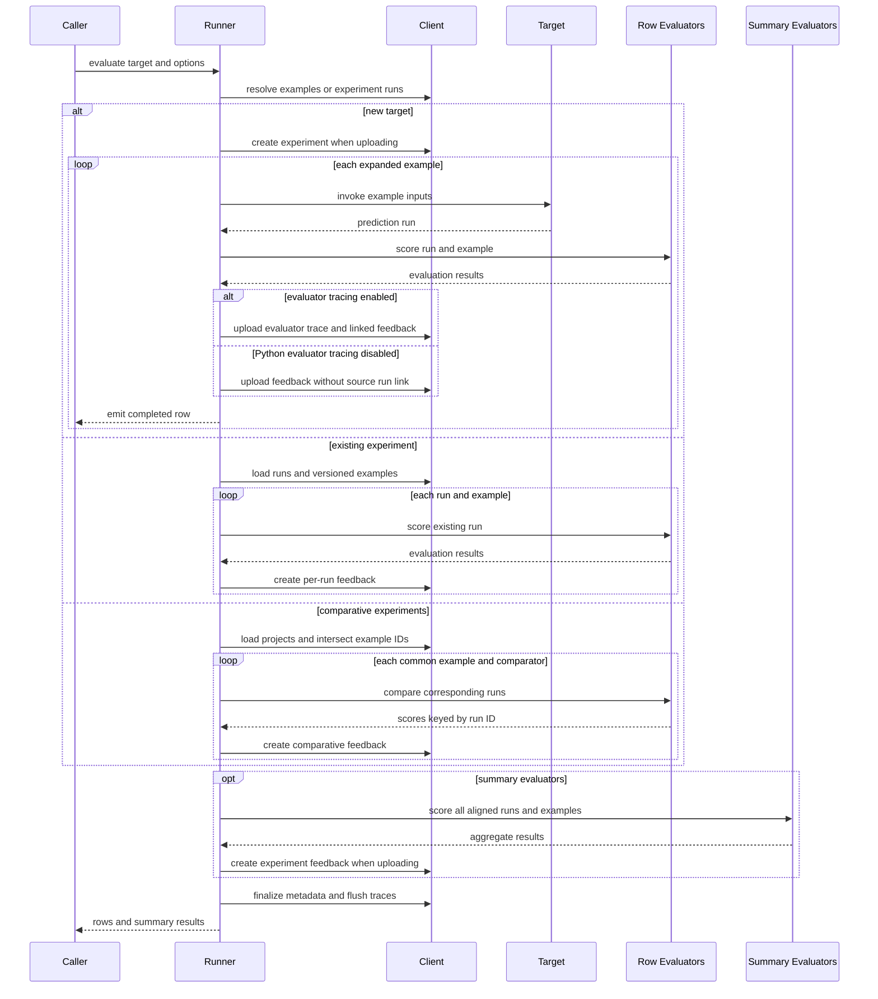

# Evaluation and Experiment Workflows

Evaluation is orchestration around traces. It resolves examples, creates or reuses an experiment (a tracing project), invokes a target when predictions are needed, keeps each root run aligned with its reference example, executes row and summary evaluators, and records normalized evaluator output as feedback. Python exposes synchronous `evaluate`, asynchronous `aevaluate`, and explicit existing-experiment helpers. JavaScript exports `evaluate`, which dispatches callable targets and arrays of experiments, plus the deprecated direct `evaluateComparative` entrypoint.

The target shape selects one of three workflows:

| Path | Input | Prediction phase | Result destination |
| --- | --- | --- | --- |
| New target | Callable or LangChain `Runnable`, plus `data` | Invokes the target once for each expanded example and traces each call into a new experiment, or the advanced Python `experiment` supplied by the caller | Row feedback targets prediction runs; summary feedback targets the experiment |
| Existing experiment | One experiment name, ID, or `TracerSession` (public in Python) | No prediction; loads existing runs and examples from the experiment's recorded dataset version | Adds row and summary feedback to the existing experiment |
| Comparative | Two existing experiments in Python, or at least two experiment names/results in JavaScript | No prediction; intersects runs by `reference_example_id` and compares corresponding outputs | Creates a comparative experiment and per-run preference feedback |

An existing experiment is not another dataset selector: its runs and `reference_dataset_id` determine the evaluation set. `load_nested` / `loadNested` reconstructs child traces under their roots for evaluator inspection; root runs remain the scoring units.

*Caption: Evaluation shares run/example alignment and feedback normalization across paths; Python can suppress evaluator traces without suppressing target traces or uploaded feedback.*

## Data and experiment lifecycle

For a new target, `data` may be a dataset name, dataset UUID, an iterable/list of `Example` values, or the corresponding async form. Attachments are fetched only when the target or evaluators declare that they consume them. The manager materializes or tees examples when reuse is necessary. `num_repetitions` expands examples in repetition-major order: all source examples occur once in each pass. Progress metadata records the source example count, repetition count, and best-effort evaluator keys.

Starting a manager requires at least one example. It chooses a generated name or appends a random suffix to `experiment_prefix`, creates a project tied to the first example's dataset, and retries naming conflicts. User metadata is augmented with revision and Git information. When prediction finishes, the runner updates experiment metadata with the newest example modification time as `dataset_version` and the encountered dataset splits. Existing-experiment loading uses that version to recover the corresponding reference state.

Each prediction is wrapped as a traceable call in the experiment project. The wrapper supplies example inputs, optional attachments, and the `reference_example_id` plus example-version metadata. That reference ID is the join key for later rescoring and comparison. See [Run Tree and Context](/openwiki/concepts/run-tree-and-context.md) for tracing context, [Platform Client](/openwiki/concepts/platform-client.md) for project/run/feedback operations, and [Trace Capture and Ingestion](/openwiki/workflows/trace-capture-and-ingestion.md) for the upload boundary.

Python supports `upload_results=False` only for new-target evaluation. It skips remote experiment creation and finalization and skips row and summary feedback uploads, but still returns local runs and scores. Target calls and evaluators use local tracing by default in this mode. Setting `disable_evaluator_tracing=True` is the explicit way to turn off the evaluator side as well; it does not disable local target tracing. Existing and comparative targets require uploaded results because their identity and destination are remote experiments. JavaScript's runner always follows the client-backed experiment and feedback path.

## Python evaluator tracing and feedback links

`disable_evaluator_tracing` is a Python runner control, accepted by both `evaluate` and `aevaluate` for a new callable target and for one existing experiment. Public dispatch forwards it into `_evaluate` / `_aevaluate`; `evaluate_existing` and `aevaluate_existing` forward it after loading runs and versioned examples. Every manager copy retains the flag, so adding prediction, row-evaluator, or summary-evaluator stages does not lose the setting.

The manager chooses evaluator tracing mode independently from target tracing:

| `upload_results` | `disable_evaluator_tracing` | Evaluator invocation context | Feedback upload |
| --- | --- | --- | --- |
| `True` | `False` | Remote tracing enabled in the `evaluators` project | Yes, with evaluator source-run links where produced |
| `True` | `True` | Tracing disabled | Yes, but evaluator `source_run_id` links are cleared |
| `False` | `False` | Local tracing | No |
| `False` | `True` | Tracing disabled | No |

This yields the key invariant: **disabling evaluator tracing suppresses evaluator runs and clears feedback `source_run_id` links, while feedback uploads and target tracing continue.** The same rule applies to normal row results and Python's synthesized keyed error results. The latter use `source_run_id=None` when tracing is disabled instead of retaining the generated evaluator-run UUID. Summary evaluators execute under the same tracing-mode decision; uploaded summary feedback still targets the project with no target run ID.

The control is not a general tracing-off switch. Target prediction remains wrapped in its ordinary experiment tracing context, and local no-upload evaluation still uses local evaluator tracing unless the caller explicitly disables it. Focused sync and async tests exercise successful row feedback, synthesized error feedback, summary evaluation, uploaded feedback count, source-link presence/absence, and the fact that only the target run is uploaded when evaluator tracing is disabled.

Comparative dispatch is a deliberate parity boundary. Synchronous `evaluate((experiment_a, experiment_b), ...)` rejects `disable_evaluator_tracing=True` as path-incompatible rather than forwarding it to comparative scoring. `aevaluate` does not support comparative targets at all, regardless of this flag; callers must use synchronous `evaluate` with synchronous comparators. JavaScript does not expose the Python control.

## Prediction and evaluation scheduling

`num_repetitions` controls work quantity; concurrency controls active work:

- In both SDKs, `0` means sequential execution. Python documents `None` as no explicit limit. JavaScript constructs queues only for positive limits and otherwise uses a single-worker fallback.
- Python sync prediction uses a context-propagating thread pool and emits prediction futures as they complete. Row scoring has its own pool and begins consuming that prediction stream immediately. Therefore prediction and scoring for different rows can overlap; the same `max_concurrency` value limits each stage, not one combined sync pipeline.
- Python async new-target evaluation with row evaluators creates one task per example containing prediction followed by all row evaluators. `max_concurrency` bounds the number of these whole row pipelines active at once. Existing-run async scoring uses the same concurrency iterator around per-row evaluator work.
- JavaScript supports `targetConcurrency` and `evaluationConcurrency`. If both are explicitly set, separate queues enforce independent limits. Otherwise a positive `maxConcurrency` creates one shared queue for target and evaluator stages; each stage-specific value falls back to `maxConcurrency` and then `0`.

Pipeline interleaving must not be confused with evaluator order. Across rows, completed predictions can enter scoring while slower target calls remain active, and concurrent rows emerge in completion order internally. Within one row, Python sync, Python async, and JavaScript all invoke evaluators in configured sequence; they do not run a row's evaluator list in parallel.

Result publication differs by SDK. Python's nonblocking sync iterator and async iterator expose rows as processing completes, so concurrency can change row order. JavaScript also processes internally by completion order, but retains an `exampleIndex`, sorts completed rows back into dataset order, uses the ordered run array for summary evaluation, and only then resolves `evaluate`. Its returned `AsyncIterable` therefore iterates already-collected ordered rows rather than providing caller-visible live streaming.

## Evaluator contracts and failure isolation

A row evaluator receives a prediction `Run` and reference `Example`. Function adapters also support object or unpacked views such as `inputs`, `outputs`, `reference_outputs` / `referenceOutputs`, and attachments. A result names a feedback `key` and may contain a numeric/boolean `score`, categorical or structured `value`, `comment`, correction, feedback configuration, and source/target run IDs. Evaluators may return one result, a list, or an `EvaluationResults` batch; adapters normalize those forms.

`RunEvaluator` is the primary extension boundary. Plain functions are wrapped into it, while custom classes implement `evaluate_run` / `aevaluate_run` in Python or `evaluateRun` in JavaScript. Python's `LLMEvaluator` is also a `RunEvaluator`, but is deprecated in favor of `openevals`.

Row feedback targets the scored run and is associated with its experiment. Summary evaluators run after all aligned rows are available and receive complete run/example collections or normalized arrays of inputs, outputs, and reference outputs. Their feedback uses `run_id=None` / `null` plus the project ID, making it experiment-level.

Ordinary row and summary evaluator failures are isolated: the runner logs the exception and continues with later evaluators. Python additionally synthesizes error feedback with `extra.error=True` and the exception representation in `comment` when feedback keys can be inferred. JavaScript leaves a failed evaluator's result absent. Comparative evaluation is different: comparator failures propagate and fail the aggregate comparison.

## Existing and comparative selection

Python `evaluate(existing_experiment, ...)` delegates to `evaluate_existing`; `aevaluate` delegates to `aevaluate_existing`. Each helper loads roots unless `load_nested=True`, reloads examples from the project's reference dataset at stored `dataset_version`, aligns each run through `reference_example_id`, and applies ordinary row and summary evaluators. It does not create predictions or apply repetitions.

Comparative evaluation requires experiments over the same reference dataset, at least two experiments, and at least one comparator. Only example IDs found in every experiment are included. JavaScript also rejects an empty intersection and warns when stored dataset versions differ. For each common example, a comparative evaluator receives corresponding runs, optionally shuffled to reduce positional bias, and returns a key plus scores keyed by run ID. JavaScript validates that returned IDs belong to the supplied runs. Each score is uploaded against its run with the comparative-experiment ID and evaluator source trace.

The runner creates a separate comparative-experiment record containing source experiment IDs, metadata, and reference dataset, then returns that record and a comparison URL when one can be constructed. This is not summary evaluation: it creates per-example, per-run preference feedback.

### Dispatch validation

Validation occurs before expensive work:

- A new callable requires `data`. Python rejects unsupported extra keyword arguments, an async callable passed to synchronous `evaluate`, and simultaneous `experiment` plus `experiment_prefix`.
- For one existing experiment, Python rejects `data`, `num_repetitions > 1`, `experiment`, `experiment_prefix`, and `upload_results=False`; it accepts `disable_evaluator_tracing` and forwards it to rescoring.
- For a comparative tuple, synchronous Python requires exactly two experiment identifiers and rejects `data`, repetitions, `experiment`, `summary_evaluators`, `upload_results=False`, and `disable_evaluator_tracing=True`. Asynchronous comparative evaluation remains unsupported.
- Direct comparative runners reject too few experiments, missing evaluators, negative concurrency, and different reference datasets. JavaScript additionally rejects no common examples, and top-level `evaluate` requires evaluators for an experiment array.

These configuration errors fail the whole call. They are distinct from ordinary per-row evaluator failures, which are isolated as described above.

## Target errors and result consumption

Target exceptions are logged so other examples can continue. In Python, `error_handling="log"` assigns the example ID before invocation, so a failed traced run remains counted in the experiment; `"ignore"` assigns it only after success, so failed runs are not counted as experiment examples. Unknown modes are rejected. JavaScript also logs target errors but requires its tracing wrapper to have produced a run; without one it raises “Run not created.” Project finalization is attempted even when JavaScript prediction processing fails.

Python `blocking=True` consumes all rows before `evaluate` returns. With `blocking=False`, `ExperimentResults` processes in a background thread; iteration yields queued rows, while `wait()` joins and rethrows processing errors. `AsyncExperimentResults` owns a processing task, supports `async for`, and exposes `await results.wait()`. Summary results become available after row consumption.

JavaScript resolves `evaluate` only after `processData` has consumed rows, restored dataset order, computed summaries, and awaited pending trace batches. Comparative JavaScript similarly waits for comparator/feedback promises and pending trace batches.

## Focused verification

The tests protect behavior rather than only return types:

- Python runner tests cover sync and async targets, uploaded versus local execution, blocking versus streaming consumption, repetitions, normalization, row-pipeline interleaving, summary scores, and rescoring an uploaded experiment.
- Parameterized Python tests run `disable_evaluator_tracing` in both sync and async workflows and verify evaluator-run suppression, successful and synthesized-error source links, continued feedback uploads, summary execution, and unaffected target-run upload.
- Python dispatch tests pin invalid combinations, including acceptance for an existing experiment through the normal path and rejection for synchronous comparative dispatch; `aevaluate` rejects comparative targets as unsupported.
- JavaScript runner tests prove completion-order queue behavior, independent target/evaluator limits, early scoring of fast predictions, and final result reordering.

When changing this pipeline, preserve four invariants: every row retains the correct run/example pairing, evaluators remain sequential within one row even when row pipelines interleave, summary collections stay aligned, and feedback targets the intended run or experiment with a source-run link only when the evaluator run actually exists.
