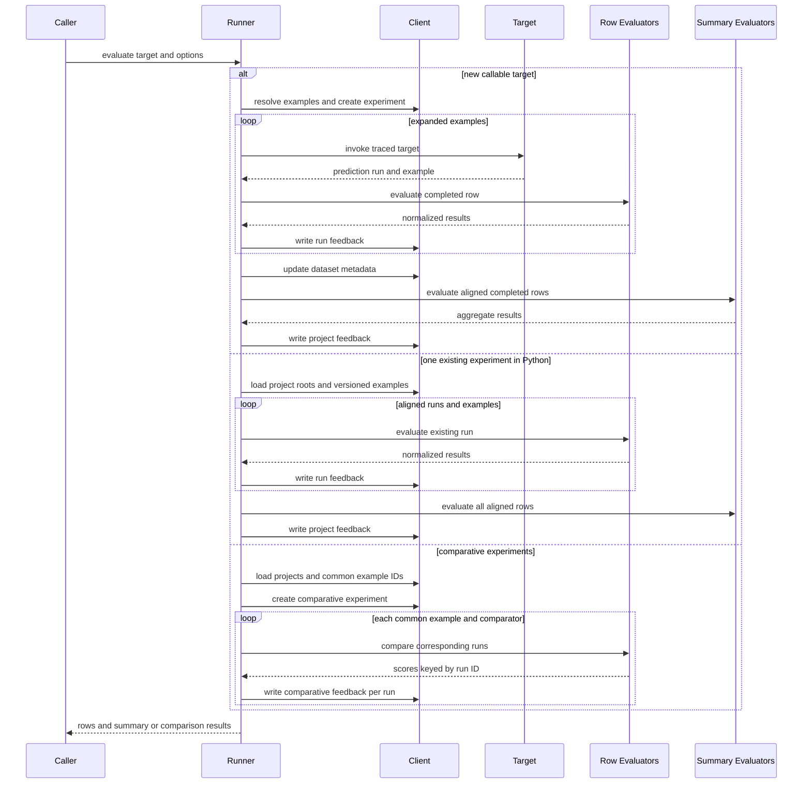

# Evaluation and Experiment Workflows

Evaluation is orchestration around traced runs. It selects examples and runs, creates or reuses an experiment (a tracing project), invokes a target when required, evaluates each run against its reference example, runs optional aggregate evaluators, and writes feedback. The important first decision is where the runs come from.

| Path | Public entrypoint and input | Prediction work | Destination |
| --- | --- | --- | --- |
| New target | JavaScript `evaluate(callable, options)`; Python `evaluate` or `aevaluate` with a callable and `data` | Invokes the target for every expanded example and traces a root run | A new experiment, or the advanced supplied `experiment`; Python can instead keep evaluation results local with `upload_results=False` |
| Existing experiment | Python `evaluate(existing_experiment, ...)`, `aevaluate(existing_experiment, ...)`, `evaluate_existing`, or `aevaluate_existing` | None | Adds row and summary feedback to the existing experiment |
| Comparative | JavaScript `evaluate(experiments[], options)` or deprecated `evaluateComparative`; Python `evaluate((experiment_a, experiment_b), ...)` or `evaluate_comparative` | None | Creates a comparative-experiment record and attaches comparison feedback to the source runs |

JavaScript also accepts an async generator of already loaded runs as an advanced standard-evaluation target. It resolves the project from the first run's `session_id`; unlike Python's existing-experiment helpers, this form requires the caller to supply the corresponding `data`.

```mermaid
sequenceDiagram
    participant Caller
    participant Runner
    participant Client
    participant Target
    participant RowEval as Row Evaluators
    participant SummaryEval as Summary Evaluators

    Caller->>Runner: evaluate target and options
    alt new callable target
        Runner->>Client: resolve examples and create experiment
        loop expanded examples
            Runner->>Target: invoke traced target
            Target-->>Runner: prediction run and example
            Runner->>RowEval: evaluate completed row
            RowEval-->>Runner: normalized results
            Runner->>Client: write run feedback
        end
        Runner->>Client: update dataset metadata
        Runner->>SummaryEval: evaluate aligned completed rows
        SummaryEval-->>Runner: aggregate results
        Runner->>Client: write project feedback
    else one existing experiment in Python
        Runner->>Client: load project roots and versioned examples
        loop aligned runs and examples
            Runner->>RowEval: evaluate existing run
            RowEval-->>Runner: normalized results
            Runner->>Client: write run feedback
        end
        Runner->>SummaryEval: evaluate all aligned rows
        Runner->>Client: write project feedback
    else comparative experiments
        Runner->>Client: load projects and common example IDs
        Runner->>Client: create comparative experiment
        loop each common example and comparator
            Runner->>RowEval: compare corresponding runs
            RowEval-->>Runner: scores keyed by run ID
            Runner->>Client: write comparative feedback per run
        end
    end
    Runner-->>Caller: rows and summary or comparison results
```

*Caption: New-target evaluation creates predictions, existing-experiment evaluation only rescores runs, and comparative evaluation produces per-run preference feedback rather than summary feedback.*

## New-target lifecycle

`data` may resolve to a dataset name, dataset UUID, dataset object in Python, or supplied example iterable; asynchronous Python additionally accepts an async iterable. Attachments are fetched only when target or evaluator signatures indicate they consume them. `num_repetitions` materializes the source examples when necessary and expands them in repetition-major order: one complete pass through the examples for each repetition.

Starting requires at least one example. The manager generates a name or adds a random suffix to `experiment_prefix`, associates the project with the first example's dataset, and retries naming conflicts up to ten times. Project metadata includes best-effort source example count, repetition count, evaluator keys, revision information, and Git information. A supplied experiment bypasses creation.

Each prediction is a traceable call addressed to the experiment project. Its root receives `reference_example_id` and `example_version`; this is the durable join from a run back to the dataset example. See [Run Tree and Context](/openwiki/concepts/run-tree-and-context.md) for tracing context and [Platform Client](/openwiki/concepts/platform-client.md) for project, run, and feedback operations.

After prediction iteration completes, new-target runners update project metadata with the latest example modification time as `dataset_version` and the encountered dataset splits. JavaScript performs this update in a `finally` path and logs a finalization failure if prediction processing is already failing. Python sync and async update after their prediction streams are exhausted, but do not place finalization in an equivalent `finally`. Existing-experiment rescoring does not run this prediction finalizer.

Python's `upload_results=False` is limited to new targets. It skips remote experiment creation/update and row or summary feedback upload while preserving local rows and evaluator scores. The synchronous target runs under local tracing; evaluator tracing also uses local mode unless explicitly disabled. Existing and comparative targets reject this option because they require remote experiment identities. JavaScript evaluation always uses a client-backed experiment.

## Scheduling, concurrency, and ordering

Zero means sequential execution in both SDKs, while Python `None` means no explicit prediction/async-task limit. Beyond that common rule, the schedulers differ.

### JavaScript

Prediction and scoring each use a `PQueue`, and work is yielded on completion rather than input order.

- If **both** `targetConcurrency` and `evaluationConcurrency` are present, the runner constructs independent queues for the two phases when their values are positive. A zero value makes that phase construct its own sequential queue.
- Otherwise, a positive `maxConcurrency` creates one shared queue used by both prediction and evaluation, bounding their combined activity.
- If no shared queue is created, each phase constructs its own queue from its effective value: the phase-specific option, then `maxConcurrency`, then zero. Consequently, supplying only one phase-specific option does not create the split-queue mode.

The prediction stream and scoring stream are connected lazily, so a fast prediction can be scored before a slow prediction finishes. Each row's evaluators still run in configured order. Every row retains its original example index; after all work completes, JavaScript sorts rows and runs by that index **before** summary evaluation and before returning results.

### Python synchronous

`evaluate` uses context-propagating thread pools. At zero it predicts and scores directly and sequentially. At a positive value, prediction and row scoring use separate pools with that worker count; predictions are yielded via `as_completed`, and scoring submits rows as that prediction stream advances. With `None`, prediction uses the executor default while the scoring executor is created with one worker. Rows therefore remain correctly paired but concurrent results are retained and streamed in completion order, not restored to dataset order.

### Python asynchronous

For a new async target with row evaluators, `aevaluate` creates one task per example. A task awaits the prediction and then invokes that row's evaluators sequentially; `max_concurrency` bounds whole per-example pipelines. Prediction-only and existing-run scoring use the same async concurrency helper around their respective stage. Completed rows are retained in completion order. Summary evaluators receive the completed runs and examples in the same aligned order.

## Evaluator tracing, attribution, and feedback

`RunEvaluator` is the row-evaluator extension boundary. Plain functions are adapted to it and may consume run/example objects or normalized `inputs`, `outputs`, `reference_outputs` / `referenceOutputs`, and attachments. Adapters normalize a single result, a list, or an `EvaluationResults` batch. A result can carry a key, score or value, comment, correction, feedback configuration, and source or target run IDs.

By default a dynamic row evaluator is itself traced in the `evaluators` project. Its evaluator run ID becomes the result's `source_run_id` / `sourceRunId`; feedback targets the prediction run and is also associated with the experiment. This separates **what was scored** (the target run) from **what produced the score** (the evaluator run).

`disable_evaluator_tracing=True` / `disableEvaluatorTracing: true` applies to ordinary row and summary evaluation, including existing-experiment rescoring. It prevents evaluator traces and strips source-run IDs so feedback never points to a nonexistent evaluator run; target tracing and feedback creation remain enabled. JavaScript leaves summary tracing unspecified by default so environment configuration still controls it, and forces it off only when requested. Comparative runners do not expose this control; Python's top-level comparative path rejects it.

Summary evaluators run only after all row results have been collected. They receive aligned arrays of runs and examples, or normalized arrays of inputs, outputs, and reference outputs. Their feedback is written with no target run ID and with the experiment project ID, making it project-level feedback. Summary failures are logged per evaluator and later summary evaluators continue.

## Existing-experiment selection

Python loads the named/identified project, then loads root runs by default and reloads examples from `reference_dataset_id` using the project's stored `dataset_version`. Each run is aligned through `reference_example_id`; no prediction or repetition occurs. With `load_nested=True`, all runs are loaded, children are sorted by `dotted_order` and attached to their parents, and only roots are returned for scoring.

The JavaScript trace loader used by comparative evaluation follows the same root-versus-nested rule and reconstructs child trees. Both SDKs can select their newer trace-query backend where supported without changing evaluator-facing run trees.

## Comparative evaluation

The top-level Python dispatcher accepts exactly two experiments; its direct `evaluate_comparative` implementation and JavaScript require at least two. Every source experiment must reference the same dataset, and at least one comparator is required. The runners intersect runs by non-null `reference_example_id`, load those examples at the first project's recorded dataset version, and optionally shuffle run order before evaluation to reduce positional bias. JavaScript warns when source dataset versions differ and rejects an empty intersection; Python can return an empty comparison when there are no common examples.

A comparator returns one feedback key and scores keyed by run ID. JavaScript rejects IDs outside the supplied run set. Python normalizes comparator functions through `DynamicComparisonRunEvaluator`; both SDKs trace comparators in the `evaluators` project and use that trace as `source_run_id`. Feedback is written once per scored run with the comparative experiment ID. The result includes the comparative-experiment record and a comparison URL when one can be constructed.

Comparative work is concurrent across example/comparator pairs (`AsyncCaller` in JavaScript, a context-aware thread pool in Python). It is an aggregate fail-fast boundary: evaluator, result validation, or future errors propagate from `Promise.all` / `future.result()` and fail the call rather than becoming an empty per-row result.

## Failure boundaries

Distinguish option/configuration failures, target failures, ordinary evaluator failures, and comparative failures:

- **Whole-call configuration:** a new callable requires `data`. Python rejects unsupported keyword arguments, async callables passed to synchronous `evaluate`, and simultaneous `experiment` plus `experiment_prefix`. Existing targets reject data, repetitions, another experiment/prefix, and local-only upload. Python comparative dispatch rejects non-pairs, summary evaluators, local-only upload, and evaluator-tracing disablement; `aevaluate` rejects comparative targets entirely. Direct comparative runners also reject too few experiments, no comparators, negative concurrency, and different reference datasets.
- **One target invocation:** both SDKs catch and log the target exception so other examples can continue. Python `error_handling="log"` associates the trace with the example before invocation, while `"ignore"` adds that association only after success; an unknown mode fails. JavaScript then requires the trace wrapper to have created a run, so missing tracing becomes a hard `Run not created by target function` error.
- **One ordinary row evaluator:** sync and async Python and JavaScript catch, log, and continue to later evaluators. Python emits a keyed error result and uploads it when feedback keys can be inferred, with `extra.error=True` and the exception in the comment; if keys cannot be inferred it only logs. JavaScript omits the failed evaluator's result.
- **One summary evaluator:** both SDKs log it, omit its result, and continue.
- **One comparator:** failures propagate and fail the comparative call.

Hard failures in manager setup, data loading, project creation, feedback normalization outside a protected evaluator call, or result processing are workflow failures. They are surfaced by the returned promise or result object's wait/iteration mechanism rather than converted into per-item feedback.

## Result consumption and delivery

Python `blocking=True` consumes rows and summaries before `evaluate` returns. With `blocking=False`, synchronous `ExperimentResults` processes in a background thread and iteration exposes rows as they arrive; `wait()` joins and rethrows a stored processing error. `AsyncExperimentResults` always starts a processing task, supports `async for`, and rethrows task errors from iteration or `await wait()`. Summary results become available only after row collection.

JavaScript's `evaluate` does not currently expose live streaming to its caller: it consumes every manager row, restores input order, computes summaries, and calls `client.awaitPendingTraceBatches()` before its promise resolves. The returned object is async-iterable over that already collected array. Comparative JavaScript similarly awaits all evaluator/feedback promises and pending trace batches.

Python has no equivalent runner-level `client.flush()` at return. Its feedback executor context waits for submitted feedback calls, but batched trace ingestion may still be asynchronous; tests that require immediate backend visibility explicitly call `client.flush()`. See [Trace Capture and Ingestion](/openwiki/workflows/trace-capture-and-ingestion.md) for batching and flush semantics.

## Focused verification

The highest-value regression tests are behavioral:

- `js/src/tests/evaluate_runner.test.ts` checks split target/evaluation limits, interleaving, stable order restoration, feedback routing, evaluator-tracing disablement, and source-run link removal.
- JavaScript integration tests verify that concurrent completion is reordered before summary evaluators and returned rows.
- `python/tests/unit_tests/evaluation/test_runner.py` covers uploaded versus local execution, blocking and streaming consumption, repetitions, interleaving, summary normalization, feedback routing, evaluator-tracing disablement, keyed error feedback, and rescoring an existing experiment.
- Python sync and async result-object tests cover repeatable iteration and processing error propagation.

When changing these pipelines, preserve three invariants: every row keeps its run/example pairing, summary run/example arrays remain aligned even when completion is out of order, and feedback is routed to the intended target run or project with a valid evaluator source link only when that evaluator trace exists.
