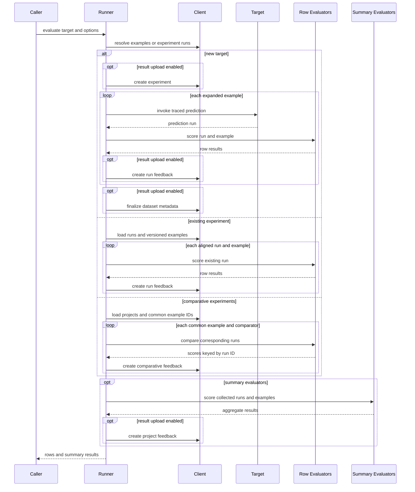

# Evaluation and Experiment Workflows

Evaluation is orchestration around traces. The runners resolve examples or prior runs, create or reuse an experiment, invoke a target only when predictions are needed, align each root run with its reference example, execute evaluators, and retain or upload normalized feedback. Python exposes synchronous `evaluate`, asynchronous `aevaluate`, and existing-experiment helpers. JavaScript exports `evaluate`; an experiment array selects comparison, while the direct `evaluateComparative` export is deprecated in favor of that dispatch.

## Choose the run source first

The target shape selects one of three workflows:

| Path | Run source | Prediction phase | Destination |
| --- | --- | --- | --- |
| New target | Callable or LangChain `Runnable`, plus `data` | Invokes the target once per expanded example and traces a root run | A new experiment, an advanced pre-created experiment in Python, or Python local results when `upload_results=False` |
| Existing experiment | One name, ID, or `TracerSession` in Python | None; loads prior runs and their reference examples | Adds row and summary feedback to that experiment |
| Comparative | Two existing experiments through Python `evaluate`, or at least two experiment names/results through JavaScript | None; intersects runs by `reference_example_id` and compares corresponding outputs | A new comparative-experiment record and per-run comparative feedback |

An existing experiment is not a dataset selector. Its recorded runs, `reference_dataset_id`, and stored dataset version define the evaluation input. `load_nested` / `loadNested` controls whether child traces are reconstructed beneath roots for evaluator inspection; roots remain the rows being scored.

```mermaid
sequenceDiagram
    participant Caller
    participant Runner
    participant Client
    participant Target
    participant RowEval as Row Evaluators
    participant SummaryEval as Summary Evaluators

    Caller->>Runner: evaluate target and options
    Runner->>Client: resolve examples or experiment runs
    alt new target
        opt result upload enabled
            Runner->>Client: create experiment
        end
        loop each expanded example
            Runner->>Target: invoke traced prediction
            Target-->>Runner: prediction run
            Runner->>RowEval: score run and example
            RowEval-->>Runner: row results
            opt result upload enabled
                Runner->>Client: create run feedback
            end
        end
        opt result upload enabled
            Runner->>Client: finalize dataset metadata
        end
    else existing experiment
        Runner->>Client: load runs and versioned examples
        loop each aligned run and example
            Runner->>RowEval: score existing run
            RowEval-->>Runner: row results
            Runner->>Client: create run feedback
        end
    else comparative experiments
        Runner->>Client: load projects and common example IDs
        loop each common example and comparator
            Runner->>RowEval: compare corresponding runs
            RowEval-->>Runner: scores keyed by run ID
            Runner->>Client: create comparative feedback
        end
    end
    opt summary evaluators
        Runner->>SummaryEval: score collected runs and examples
        SummaryEval-->>Runner: aggregate results
        opt result upload enabled
            Runner->>Client: create project feedback
        end
    end
    Runner-->>Caller: rows and summary results
```

*Caption: The three evaluation paths share feedback normalization, but only a new-target evaluation invokes predictions and only a comparative evaluation creates run-to-run scores.*

## New-target lifecycle

`data` can resolve from a dataset name, dataset UUID, a dataset object in Python, or supplied example iterables; asynchronous Python also accepts an async iterable. Attachments are fetched only when the target or evaluators declare that they consume them. When one attachment must serve several consumers or repetitions, Python retains its bytes and recreates readers.

`num_repetitions` expands data in repetition-major order: one complete pass over the source examples is followed by the next. Starting a manager takes the first example, chooses a generated experiment name or appends a random suffix to `experiment_prefix`, and ties the project to that example's dataset. Name conflicts are retried up to ten times. The project receives source-count, repetition-count, evaluator-key, revision, and Git metadata when available.

Each target call is wrapped as a trace under the experiment project. The root is associated with `reference_example_id`, and `example_version` records the example timestamp. That reference ID is the durable join used by later rescoring and comparison. See [Run Tree and Context](/openwiki/concepts/run-tree-and-context.md) for trace context and [Platform Client](/openwiki/concepts/platform-client.md) for project, run, and feedback operations.

Finalization belongs to prediction consumption, not to summary evaluation. After the prediction generator is exhausted, the runner updates the experiment with the newest example modification time as `dataset_version` and the observed dataset splits. JavaScript attempts this update even when prediction processing fails; if both prediction and finalization fail, it preserves the prediction failure and logs the finalization failure. Existing-experiment scoring does not finalize the source project as a new prediction run would.

## Scheduling, ordering, and concurrency

`num_repetitions` changes work quantity. Concurrency changes how much work can be active:

- **Python synchronous:** `max_concurrency=0` is sequential. Other values use context-propagating thread pools for prediction and row scoring; `None` lets the executor choose its worker count. Prediction futures and scoring futures are yielded as they complete.
- **Python asynchronous:** for a new async target with evaluators, one task owns prediction followed by all evaluators for one example. `max_concurrency` therefore bounds complete per-example pipelines, rather than creating independent prediction and evaluator limits. Existing runs use the async scoring pipeline without prediction.
- **JavaScript shared queue:** unless both specific options are present, a positive `maxConcurrency` creates one queue shared by prediction and evaluation. This caps combined in-flight work. Zero means sequential behavior.
- **JavaScript separate queues:** only when both `targetConcurrency` and `evaluationConcurrency` are explicitly supplied does the runner create independent queues. Each specific limit falls back to `maxConcurrency`, then zero, for execution behavior; a queue is allocated only for a positive limit.

Prediction and row scoring are intentionally interleaved. A fast prediction can be evaluated before a slower prediction finishes. Evaluators within one row still run in configured order in both SDKs.

Concurrent internal completion is not the same as final presentation order:

- Python sync and async result streams expose completion order. The managers preserve run/example/result alignment with `zip`-style streams but do not restore original dataset order.
- JavaScript carries an `exampleIndex`, collects all rows, then sorts rows and runs back into source-example order before summary evaluation and before returning the final `.results` array. Thus summary inputs are aligned and ordered even though internal work completed out of order.

## Evaluator contracts and attribution

A row evaluator receives a `Run` and `Example`. Function adapters can also expose object or unpacked views such as `inputs`, `outputs`, `reference_outputs` / `referenceOutputs`, and attachments. `RunEvaluator` is the main extension boundary: functions are wrapped into it, while custom implementations provide `evaluate_run` / `aevaluate_run` in Python or `evaluateRun` in JavaScript.

An evaluator may return one result, several results, or an `EvaluationResults` batch. Normalization produces feedback fields including `key`, numeric or boolean `score`, categorical or structured `value`, `comment`, correction, configuration, and optional run IDs. Ordinarily evaluator invocations are traced in the `evaluators` project. The evaluator trace ID becomes `source_run_id` / `sourceRunId`, which attributes feedback to the computation that generated it.

Row feedback targets the prediction or existing run and is associated with its experiment. Summary evaluators wait until all aligned rows are collected, receive complete runs/examples or arrays of inputs, outputs, and reference outputs, and create project-level feedback with `run_id=None` / `null`. They are aggregate evaluators, not comparative evaluators.

### Disabling evaluator traces

`disable_evaluator_tracing=True` in Python and `disableEvaluatorTracing: true` in JavaScript disable tracing for both row and summary evaluator invocations. Evaluation itself still runs and uploaded row and summary feedback is still created. Because no evaluator trace exists, the runner removes evaluator `source_run_id` links rather than uploading dangling references. Python does the same for synthesized error feedback.

The default is nuanced in JavaScript: row evaluators are invoked with tracing enabled unless explicitly disabled, while summary wrappers receive no forced `true` override when the option is omitted, so ambient tracing configuration can still turn summary tracing off. Passing `true` explicitly forces both forms off.

These flags apply to ordinary new-target or existing-experiment evaluators. Python rejects `disable_evaluator_tracing=True` on its comparative tuple path, and JavaScript comparative options do not expose `disableEvaluatorTracing`; comparative evaluators are traced and their IDs attribute comparative feedback.

### Python local mode with `upload_results=False`

Python supports `upload_results=False` only for a new callable target. It skips remote experiment creation and finalization and skips all row and summary feedback uploads, but still returns runs, local evaluator results, and summary scores. Existing and comparative targets reject the option because their identity and feedback destination are remote experiments.

Evaluator tracing uses local mode when upload is disabled, unless `disable_evaluator_tracing=True`, which turns it off entirely. Consequently local evaluation can retain evaluator provenance without uploading evaluator traces or feedback. The synchronous target wrapper also switches prediction tracing to local mode. The asynchronous target wrapper currently hard-enables its prediction tracing context and does not receive `upload_results`; this differs from the synchronous target's explicit local switch even though the async manager still omits experiment creation and feedback upload.

Local result objects have an experiment name for labeling, but no backing remote project; project-dependent properties such as an experiment ID or URL require an uploaded experiment.

## Existing-experiment rescoring

Python `evaluate(existing_experiment, ...)` delegates to `evaluate_existing`; `aevaluate` delegates to `aevaluate_existing`. The helper:

1. Resolves the project by name or UUID.
2. Loads root runs by default, or reconstructs sorted child trees when `load_nested=True`.
3. Reloads examples from the project's reference dataset at `metadata.dataset_version`.
4. Aligns each run through `reference_example_id`.
5. Applies ordinary row and summary evaluators without predictions or repetitions.

JavaScript does not expose the same single-experiment selector through top-level `evaluate`; its non-callable internal path accepts a run stream plus data, while its public experiment-array dispatch is comparative.

## Comparative evaluation

Comparison requires at least two source experiments in the direct runners, at least one comparator, and one shared reference dataset. Python top-level `evaluate` deliberately restricts its tuple form to exactly two experiments. Only reference example IDs present in every experiment are scored. JavaScript rejects an empty intersection and warns when source experiments recorded different dataset versions; Python uses the first project's stored version to load the common examples.

For each common example, a comparator receives corresponding runs and the example. `randomize_order` / `randomizeOrder` can reduce positional bias. The result contains one feedback key and a score map keyed by run ID. JavaScript validates that every returned ID belongs to the compared run set. Each score is uploaded against its run with the comparative experiment ID, evaluator source trace, and routing metadata.

The runner creates a separate comparative-experiment record containing source experiment IDs, metadata, description, and reference dataset. Returned result containers expose that record and a comparison URL when one can be derived. Comparative scores are per-example, per-run preferences; they are not project summary feedback.

### Invalid combinations

Validation occurs before expensive work where possible:

- A new callable requires `data`. Python rejects unsupported extra keywords, an async callable passed to synchronous `evaluate`, and simultaneous `experiment` and `experiment_prefix`.
- For one existing Python experiment, `data`, repetitions greater than one, `experiment`, `experiment_prefix`, and `upload_results=False` are invalid.
- For a Python comparison tuple, the target must contain exactly two experiment identifiers; `data`, repetitions, `experiment`, summary evaluators, `upload_results=False`, and `disable_evaluator_tracing=True` are invalid. `aevaluate` does not support comparison.
- Direct comparative runners reject too few experiments, no evaluators, negative concurrency, and different reference datasets. JavaScript also rejects no common examples and top-level JavaScript `evaluate` requires evaluators for an experiment array.

Configuration errors fail the whole call. Comparative evaluator or feedback failures also reject the aggregate comparison: JavaScript awaits `Promise.all`, and Python propagates each future's exception when collecting it. This differs deliberately from ordinary evaluator isolation.

## Failure boundaries

A failure in one ordinary row or summary evaluator is logged and does not stop later evaluators or rows. JavaScript omits the failed evaluator's result. Python attempts to infer the evaluator's feedback keys; when it can, it adds and, when uploading, submits keyed error results containing `extra.error=True` and the exception text. If keys cannot be inferred, Python logs without adding that evaluator result.

Target exceptions are also caught per example so other examples can continue. In Python, `error_handling="log"` assigns `reference_example_id` before invocation, so the failed trace remains counted against the example. `"ignore"` assigns it only after success. Unknown modes are rejected. JavaScript logs the target exception but requires the trace wrapper to have produced a run; otherwise the row fails with “Run not created.”

Infrastructure and orchestration failures remain fatal: data resolution, project creation, impossible run/example alignment, invalid comparative score IDs, or result-processing failures surface to the caller rather than being converted into evaluator feedback.

## Consuming results

Python offers actual caller-visible streaming:

- Synchronous `evaluate(..., blocking=True)` consumes every row before returning. With `blocking=False`, `ExperimentResults` processes in a background thread; iteration waits on a queue and yields rows as they are appended. `wait()` joins the worker and rethrows its processing error.
- `AsyncExperimentResults` always starts a processing task. `async for` waits on a condition and yields each appended row; `await results.wait()` waits for the task. `blocking=True` merely awaits that task before `aevaluate` returns.
- Summary results appear only after all rows have been consumed. Python result objects retain rows, so later iteration can replay them.

JavaScript has no caller-visible live stream in the current implementation. `evaluate` awaits `processData`, which drains all rows, restores source order, computes summaries, and then awaits pending trace batches before resolving. Rows are consumed from the `.results` array. Although the result implements `AsyncIterableIterator`, `processData` advances its processed cursor to the collected length before return, so it is not a live result channel. Comparative JavaScript likewise awaits every evaluator/feedback promise and pending trace batch.

## Focused verification

The most useful tests pin behavior, not just types:

- Python runner tests cover uploaded and local execution, sync and async targets, blocking and streaming consumption, repetitions, interleaving, evaluator normalization, source-run attribution, disabled evaluator tracing, summary scores, and rescoring an existing experiment.
- Python argument tests protect new, existing, and comparative dispatch constraints; evaluator integration tests verify keyed error feedback without dropping the row.
- JavaScript runner tests distinguish shared and independent queue behavior, prove that fast rows can finish while slow work remains, verify disabled evaluator tracing and source-link removal, and unit-test stable index reordering.
- JavaScript integration tests verify summary signatures and prove that concurrent completion is restored to dataset order before summaries and final rows.

When changing these pipelines, preserve three invariants: each result keeps the correct run/example pair, summary runs and examples remain aligned, and feedback is attributed to the intended run or experiment even when work completes out of order. Related trace ingestion behavior is described in [Trace Capture and Ingestion](/openwiki/workflows/trace-capture-and-ingestion.md); test-result feedback is covered by [Test Tracking and Assertions](/openwiki/testing/test-tracking-and-assertions.md).
