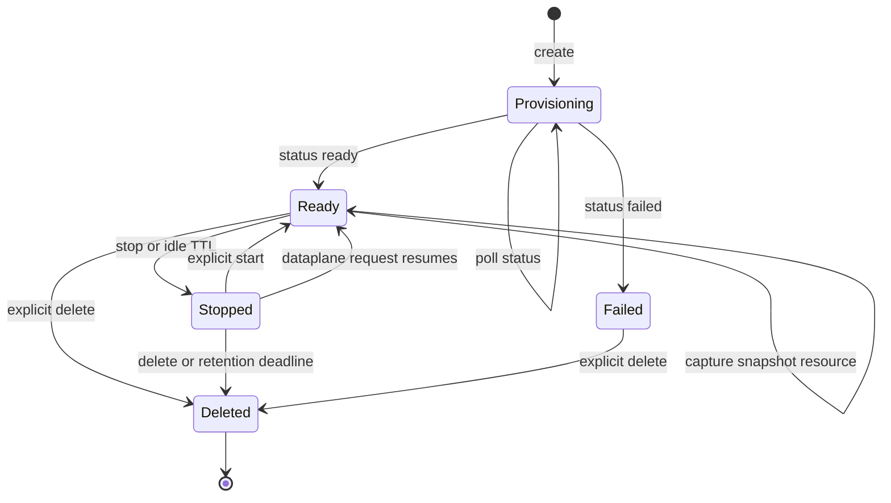
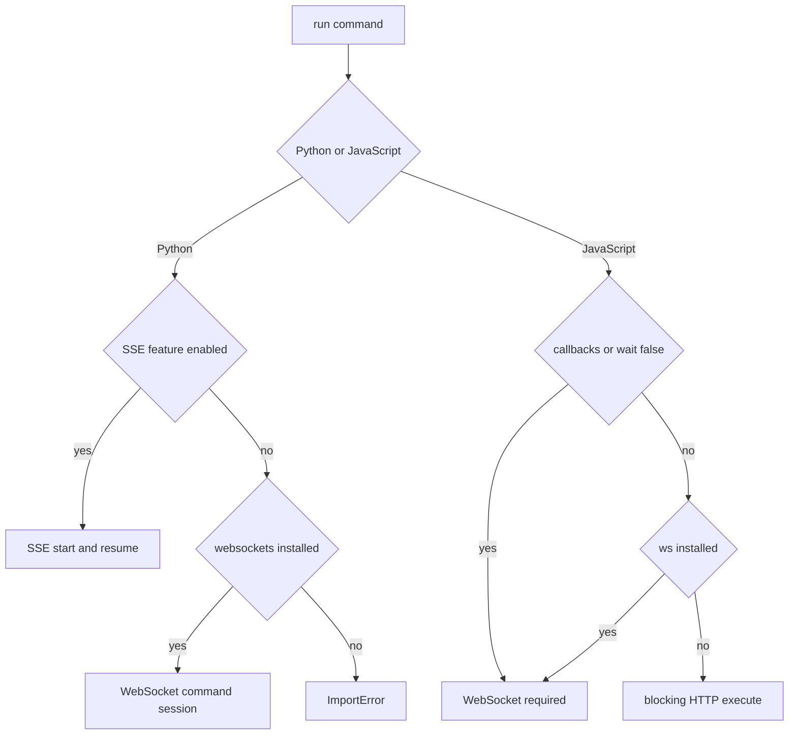
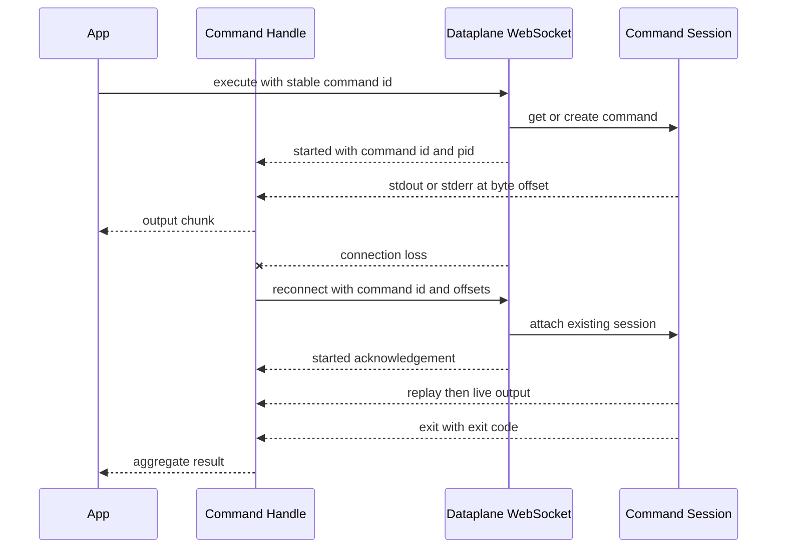
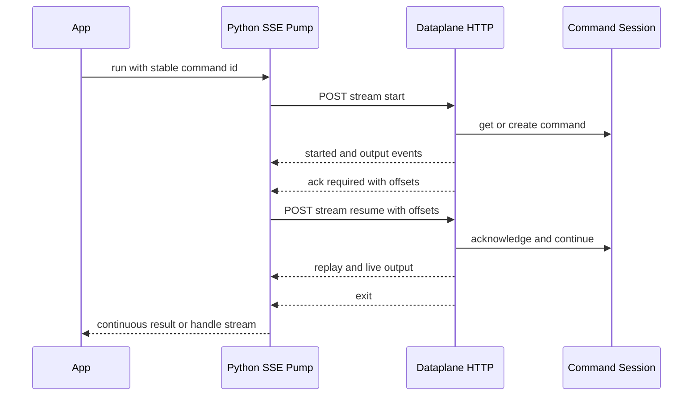

# Sandbox Lifecycle, Access, Files, Services, and Command Execution

The sandbox SDKs separate resource management from runtime traffic. `SandboxClient` in JavaScript and `SandboxClient` / `AsyncSandboxClient` in Python send lifecycle, service-link, download-link, and snapshot requests under the `/v2/sandboxes` control plane. A returned `Sandbox` or `AsyncSandbox` retains resource metadata and uses its `dataplane_url` for commands and file operations. Python also exposes local TCP tunnels.

Authentication and endpoint defaults follow the wider [client configuration model](/openwiki/concepts/client-configuration-and-auth.md). `LANGSMITH_API_KEY` is sent as `X-Api-Key`; constructor headers accompany control-plane and dataplane requests and WebSocket upgrades, while Python additionally supports per-operation header overrides. JavaScript's `AsyncCaller` and Python's HTTP transports own ordinary HTTP/network retry policy.

## Creation and lifecycle

Creation posts to `/boxes`. It can boot the default runtime or a snapshot and configure name, CPU, memory, filesystem capacity, mounts, proxy policy, `run_config`, access delegation, and retention. `idle_ttl_seconds` / `idleTtlSeconds` stops an inactive sandbox. `delete_after_stop_seconds` / `deleteAfterStopSeconds` permanently removes a stopped sandbox and its filesystem clone after the interval. Nonzero values use 60-second resolution; `0` disables that action; omission leaves the server default in control.

Creation normally asks the server to wait. With `wait_for_ready=False` or `waitForReady: false`, it may return a provisioning object immediately. `wait_for_sandbox()` / `waitForSandbox()` polls the lightweight `/status` endpoint, fetches the full sandbox only after `ready`, raises a creation error on `failed`, and includes the last observed status in a timeout error.

*Sandbox lifecycle; snapshot capture creates and polls a separate resource without making snapshot building a sandbox state.*

The key runtime invariant is that **cached `status` is not the dataplane gate**. `stop()` preserves `dataplane_url` and marks only local status as `stopped`; a later dataplane request can resume the runtime. Run, file, and Python tunnel methods therefore require a URL rather than `status == "ready"`. A missing URL raises `DataplaneNotConfiguredError` / `LangSmithDataplaneNotConfiguredError`; genuine provisioning or connection failures come from the server. Explicit `start()` posts to `/start`, waits for readiness, and refreshes local status and URL.

### Ownership and cleanup

Cleanup differs by SDK and entrypoint:

- Python `client.sandbox()` and `await async_client.sandbox()` mark the returned object for deletion on context exit. Cleanup exceptions are suppressed so they do not replace the body exception. `create_sandbox()` is manually managed. Sync/async conversions refer to the same server resource and disable auto-delete on the converted object.
- JavaScript has no auto-deleting `Sandbox` context manager. Wrap work in `try` / `finally` and call `await sandbox.delete()`.
- Closing a Python client closes HTTP pools; it does not delete manually managed sandboxes.
- `stop()` is not cleanup. It preserves files and is reversible through `start()` or dataplane access. Deletion is terminal.

## Configuration at creation

### Layered `run_config`

`run_config` / `runConfig` contains `user`, `work_dir`, and `env_vars`. It can be stored on a snapshot, overridden when creating or updating a sandbox, and overridden again for one command. At each layer, user and working directory replace the lower value while environment variables merge by key. The older per-command `env` and `cwd` options still work alone, but both SDKs reject combining either with `run_config` because the precedence would be ambiguous.

For non-PTY commands, `close_input` / `closeInput` defaults to true so programs reading stdin see EOF instead of waiting for command timeout. Set it to false before requesting a WebSocket handle that will receive `send_input()` calls. `close_input()` / `closeInput()` is idempotent and sends the half-close once; later input raises an operation error. Under a PTY it is a no-op because input and output share a terminal descriptor; send EOT (`0x04`) instead. Python SSE always starts with stdin closed and rejects `close_input=False`.

### Delegated LangSmith access

`access_delegation` / `accessDelegation` lets code inside a sandbox call LangSmith as the creator without receiving the creator's API key. `INHERIT` follows all permissions the creator currently has. `EXPLICIT` requires a nonempty permission list and caps the grant to those permissions. The ceiling is rechecked rather than snapshotted, so permissions later lost by the creator are also lost by the sandbox.

Both SDKs validate the mutually exclusive shapes before creation: `INHERIT` cannot carry permissions, while `EXPLICIT` must carry them. The grant belongs to the sandbox, so anyone able to execute code there can use it; omit the field when guest code does not need LangSmith access.

### Mounts and outbound proxy authentication

Mount helpers cover S3, GCS, public Git, and read-only Context Hub inputs. Bucket mounts support read-only and cache settings. Git requires an absolute credential-free HTTPS URL and may select a branch or tag. Context Hub synchronization is one-way; unless `initial_pull_only` is enabled, a later sync can overwrite guest changes.

Provider credentials belong in top-level mount auth, never inside a mount spec. S3 authentication can come from either:

1. `mount_config.auth` / `mountConfig.auth`, using static secrets or a role ARN; or
2. an **enabled** AWS rule in the same `proxy_config` / `proxyConfig`, passed both to the mount builder and sandbox creation.

The second form remains general proxy authorization and is not copied into mount-scoped auth. A disabled AWS rule does not satisfy the mount. Supplying AWS auth in both locations is rejected. GCS still requires explicit GCP mount auth; a GCP proxy rule does not substitute for it. Role descriptors are role-only—callers do not supply session credentials or External IDs—and mount-scoped roles are restricted by the backend to configured S3 scopes.

## Service access and dataplane networking

### Service URLs

The control plane can expose an HTTP service listening on a sandbox port in two distinct modes:

- **Token mode** is selected by omitting `access`. It returns `ServiceURL` / `AsyncServiceURL` in Python or `ServiceUrl` in JavaScript with a base URL, browser URL, token, and expiry. HTTP helpers inject `X-Langsmith-Sandbox-Service-Token`; accessors refresh a near-expiry token. Python defaults the requested token TTL to 600 seconds, while JavaScript omits `expires_in_seconds` unless supplied.
- **LangSmith-login mode** uses `access="restricted"` or `"workspace"`. It returns `ServiceLoginURL` / `ServiceLoginUrl`, carries no token or expiry, and is intended for an already signed-in browser. `restricted` requires sandbox read access; `workspace` admits workspace members. Because this durable mode has no programmatic token, it has no auth-injecting fetch helper.

A durable login grant and token mode are not interchangeable; the server refuses token minting while a login grant is active. Python ignores the token TTL in login mode and omits it from the payload, whereas JavaScript rejects explicitly combining `expiresInSeconds` with login mode.

### Files and download links

`write()` sends strings as UTF-8 bytes or accepts bytes directly, using multipart `/upload?path=...`. `read()` returns raw bytes from `/download?path=...`. Current SDKs also provide:

- `stat()` through `HEAD /download`, returning size and validators;
- `read_range()` / `readRange()` with HTTP byte ranges and `If-Range` / `If-None-Match`, distinguishing partial `206`, unchanged `304`, and a full `200` that means a ranged file changed;
- `glob()` and `ls()` through `/glob`; and
- literal-content `grep()` through `/grep`, with optional file glob and truncation reporting.

The control-plane `generate_download_url()` / `generateDownloadURL()` instead mints a path-bound bearer link. Anyone holding it can fetch that file without LangSmith credentials, and fetching can wake a stopped sandbox. It is bound to a path, not an immutable content version, so write a new path and mint a new link when contents change.

### Python TCP tunnels

TCP tunneling is exposed by the inspected Python sync and async APIs, not by JavaScript `Sandbox`. It opens a loopback listener and connects to the dataplane `/tunnel` WebSocket. Each local connection receives a yamux stream, a protocol/remote-port header, and a bidirectional bridge after the daemon status byte. A dead yamux session is re-established under a lock with bounded backoff (`max_reconnects`, default `3`). `AsyncTunnel` delegates the same threaded implementation through an executor.

## Command transport selection

The two SDKs intentionally differ:

| SDK | Selection |
| --- | --- |
| Python | If `LANGSMITH_EXPERIMENTAL_FEATURES` enables `sandbox_sse_exec`, use SSE. Otherwise use WebSocket when the optional `websockets` dependency is installed. If neither is available, raise `ImportError`. There is no simple `POST /execute` fallback. |
| JavaScript | A blocking call with no callbacks prefers WebSocket when optional `ws` is available and otherwise uses blocking `POST /execute`. Streaming callbacks or `wait: false` require WebSocket. |

Both return an aggregate `ExecutionResult` by default. A nonblocking call returns a command handle. Python rejects `wait=False` with callbacks; JavaScript can attach callbacks to the returned nonblocking handle. The JavaScript HTTP fallback carries command, timeout, shell, deprecated `env` / `cwd`, and `run_config`, with an HTTP deadline slightly beyond command timeout, but does not provide streaming, reattachment, or a control channel.

*Transport selection is SDK-specific: feature-gated SSE or WebSocket in Python, and WebSocket or limited HTTP in JavaScript.*

## WebSocket execution and reconnects

WebSocket start converts `dataplane_url` to `/execute/ws`, authenticates the upgrade, and sends an `execute` frame with options and a client-generated `command_id`. The stable ID makes the uncertain pre-start phase idempotent: connection or pre-`started` closure retries reuse the same ID so the daemon can get or create one command rather than spawn duplicates.

Retryable upgrade responses include `429`, `500`, `502`, `503`, and `504`; numeric `Retry-After` overrides jittered exponential delay. Other rejected upgrades are permanent. Per-open attempts are clamped by a whole-connect budget. Python also exposes WebSocket ping, ping timeout, and close-timeout environment settings.

A valid stream progresses from `started` through interleaved `stdout` / `stderr` to `exit`. Handles aggregate text into `ExecutionResult`, expose PID and command ID, and provide kill, stdin control, callbacks, iteration, and manual reconnect. Command timeout, missing or expired session, malformed first-frame ordering, typed server errors, and a stream ending without `exit` are failures rather than successful completion.

After `started`, the command and socket have separate lifetimes. Unless `kill_on_disconnect` is true, losing the attachment does not imply the process stopped. WebSocket handles reattach with command ID and separate stdout/stderr **byte offsets**. UTF-8 byte length—not character count—advances each cursor.

*WebSocket execution and reattachment; the handle resumes each output stream from its last consumed byte.*

A WebSocket handle allows five consecutive automatic reconnect failures, delaying from 0.5 seconds up to 8 seconds. Server reload reconnects immediately. Output resets the budget; a quiet reattached command also resets it when `started.command_id` matches the handle. A mismatched acknowledgement is ignored. After `kill()`, connection failure propagates instead of reattaching. `ttl_seconds` controls how long a finished session remains reconnectable, while `idle_timeout` controls a command left with no clients.

Control calls remain language-specific: JavaScript sends `kill()`, `sendInput()`, and `closeInput()` synchronously to its socket control object; Python sync uses `kill()`, `send_input()`, and `close_input()`, while Python async awaits them. Reading `.result` drains unread output and requires terminal `exit`.

## Python SSE start, acknowledgement, and resume

SSE is a feature-gated, one-way HTTP transport over `POST /execute/stream/start` and `POST /execute/stream/resume`. It adapts SSE events into the same `started`, output, and `exit` messages consumed by Python command handles, but transport recovery belongs to the SSE iterator itself—not the command handle's WebSocket reconnect loop.

The start body carries a client-generated command ID. Before `started`, a recoverable break re-sends `/start` with that same ID. After start, an `ack_required` event ends the bounded response and reports stdout/stderr offsets; the next `/resume` body sends the command ID and both offsets. Those offsets simultaneously acknowledge buffered data and select the replay cursor. A protocol-requested acknowledgement resumes immediately and does **not** spend the failure budget.

SSE output payloads are base64 bytes. Separate decoders preserve partial multibyte UTF-8 characters across event boundaries while offsets continue to count raw bytes. An incomplete final character is emitted as the replacement character instead of silently disappearing.

*Python SSE hides acknowledgement round trips and presents one continuous command stream to the caller.*

Broken responses, read/connect faults, and `ServerShuttingDown` trigger resume with jittered backoff. Five consecutive recovery failures are allowed; only output cursor progress resets that budget. A `started` event alone does not reset it, preventing an empty response loop from retrying forever. Fatal command errors and missing sessions propagate. Because SSE owns resumption and marks its control object `resumes_itself`, Python's outer handle does not run the WebSocket reattachment policy on top of it.

SSE has no bidirectional control channel. It rejects PTY, `close_input=False`, and `kill_on_disconnect=True`; handle `kill()` and live input are unavailable. This is not WebSocket reconnect behavior even though both transports feed the same handle model.

The opt-in live test `python/tests/integration_tests/test_sandbox_sse_exec.py` runs only with `LANGSMITH_SANDBOX_E2E=1`. It uses a real sandbox and verifies command results, callbacks, manual offset resume, multibyte output, and exactly-once delivery across repeated acknowledgements forced by output larger than the daemon buffer. It accepts API-key auth or an OAuth bearer plus `LANGSMITH_WORKSPACE_ID`, and explicitly deletes the live sandbox.

## Snapshots

Snapshots are reusable boot sources with a separate `building` to `ready` / `failed` polling lifecycle. Both clients build from Docker images, capture running sandboxes, list/get/delete snapshots, and wait for completion.

Snapshot references are not identical across SDKs. Python creation accepts `snapshot` as UUID, `name:tag`, or bare name, with the older `snapshot_id` and `snapshot_name` alternatives retained; `get_snapshot()` also resolves those references, and Python exposes snapshot tags. JavaScript creation distinguishes a positional `snapshotId` from `options.snapshotName`, while `getSnapshot()` is documented and typed as an ID lookup. Do not assume Python's Docker-style reference forms are portable to JavaScript.

Dockerfile helpers orchestrate client-side work: create a temporary builder sandbox, tar and upload the local context, run BuildKit on the capacity-backed root filesystem, capture the built image, and delete the builder through a Python context manager or JavaScript `finally`. A failed build becomes a snapshot creation error and still triggers deletion.

## Failure model and focused tests

Both SDKs distinguish authentication/API, validation/quota, resource not found/name conflict/timeout/creation, dataplane not configured/not ready, operation, command timeout, and connection failures. Structured exceptions preserve fields such as resource type, last status, operation, machine-readable error type, and server error IDs.

High-value focused tests include:

- `sandbox_access_delegation.test.ts` and `test_access_delegation.py` for grant validation, request shape, and parsed responses;
- `sandbox_aws_role_auth.test.ts` and `test_aws_role_auth.py` for static/role alternatives and S3 mount versus proxy ownership;
- `sandbox_service_url.test.ts` and `test_service_access.py` for token and LangSmith-login service modes;
- `sandbox_run_config_and_files.test.ts` and `test_run_config_and_files.py` for layering payloads, stdin close semantics, file search, and ranged reads;
- JavaScript handshake, command-ID retry, and reconnect-ack tests for WebSocket budgets and idempotence; and
- `test_sse_execute.py` for SSE parsing, acknowledgement flow, byte/UTF-8 correctness, unsupported controls, retry ownership, and sync/async parity.

These tests complement the broader [repository test strategy](/openwiki/testing/repository-test-strategy.md) and preserve the boundaries described by the [SDK architecture](/openwiki/architecture/sdk-architecture.md).
