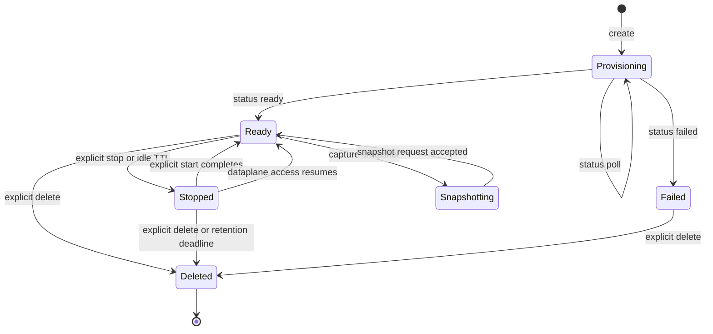
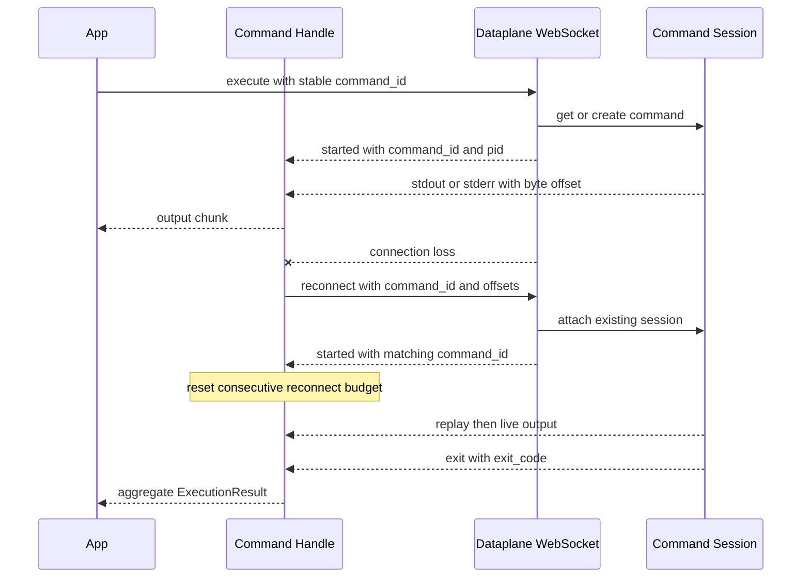

# Sandbox Lifecycle, Files, Tunnels, and Command Execution

The sandbox SDK has a deliberate control-plane/dataplane split. `SandboxClient` (TypeScript) and `SandboxClient` / `AsyncSandboxClient` (Python) create, inspect, update, start, stop, delete, and snapshot resources under `/v2/sandboxes`. A returned `Sandbox` or `AsyncSandbox` retains the resource metadata and sends command and file traffic to its `dataplane_url`. In Python, it can also open a local TCP tunnel or request a service URL.

Authentication and endpoint defaults follow the wider [client configuration model](/openwiki/concepts/client-configuration-and-auth.md): the sandbox endpoint is derived by appending `/v2/sandboxes` to `LANGSMITH_ENDPOINT`, and `LANGSMITH_API_KEY` becomes `X-Api-Key`. Constructor-supplied headers are carried to control-plane HTTP, dataplane HTTP, and WebSocket upgrades; Python additionally supports per-operation header overrides. The TypeScript control-plane fetcher and Python HTTP transports retry transient HTTP/network failures according to the client's retry configuration.

## Creation and lifecycle

Creation posts to `/boxes`. It can boot the default runtime or a snapshot and can set name, CPU, memory, filesystem capacity, mounts, proxy policy, and two retention clocks. `idle_ttl_seconds` / `idleTtlSeconds` stops an idle sandbox; `delete_after_stop_seconds` / `deleteAfterStopSeconds` permanently removes a stopped sandbox and its filesystem clone after the configured interval. Both values use minute resolution, and `0` disables the corresponding automatic action. If omitted, server defaults apply.

By default creation asks the server to wait for readiness. With `wait_for_ready=False` (Python) or `waitForReady: false` (TypeScript), the caller receives a provisioning object and should use `wait_for_sandbox()` / `waitForSandbox()`. Polling uses the lightweight `/status` endpoint, fetches the full object only after `ready`, raises a typed creation error on `failed`, and includes the last observed status in a timeout error.

*Sandbox lifecycle as exposed by the SDK; snapshot building is a separate polled resource even though capture starts from a running sandbox.*

The most important runtime invariant is that **local `status` is not the dataplane gate**. `stop()` preserves `dataplane_url`, marks only the local status as `stopped`, and the platform may resume the sandbox when a dataplane request arrives. Every run, read, write, or Python tunnel therefore checks only that the URL exists. A missing URL raises `DataplaneNotConfiguredError` / `LangSmithDataplaneNotConfiguredError`; a genuinely unavailable or not-ready runtime is reported by the server as the typed not-ready or connection failure. Explicit `start()` posts to `/start`, waits for `ready`, and refreshes local `status` and `dataplane_url`.

### Ownership and cleanup

Cleanup semantics differ by entrypoint:

- Python `client.sandbox()` and `await async_client.sandbox()` return auto-deleting context-manager objects. `with sandbox:` or `async with sandbox:` suppresses cleanup errors so it does not mask the body exception. `create_sandbox()` is manual-lifecycle and must be deleted explicitly. Sync/async conversion points refer to the same server resource but disable auto-delete on the converted sandbox.
- TypeScript has no auto-deleting `Sandbox` context manager. Use `try` / `finally` and `await sandbox.delete()`.
- Closing a Python client (`close()`, `aclose()`, or its context manager) closes its HTTP pools; it does not substitute for deleting manually managed sandboxes.
- A stop is not cleanup: it preserves files and can be reversed by `start()` or dataplane access. Deletion is the terminal resource operation.

## Mounts and persistent inputs

Both SDKs expose builders for S3, GCS, public Git, and read-only Context Hub mounts. Bucket mounts may be read-only and carry cache settings; Git accepts only absolute credential-free HTTPS repository URLs and optional branch/tag refresh settings. Context Hub synchronization is one-way, and later synchronization may overwrite guest writes unless configured as initial-pull-only.

`mount_config` / `mountConfig` is validated before creation. S3 requires one AWS auth block and GCS requires one GCP auth block; credentials belong in the top-level mount auth section, never an individual mount spec. Supplying the same provider's auth in both mount configuration and explicit proxy rules is rejected. This boundary matters because the backend expands mount auth into runtime proxy behavior rather than exposing provider credentials as ordinary mount fields.

## Dataplane file and network operations

`write()` uploads UTF-8 encoded strings or bytes as multipart data to `/upload?path=...`; `read()` downloads raw bytes from `/download?path=...`. Errors are interpreted as dataplane operation failures, including a typed file-not-found result. The control-plane `generate_download_url()` / `generateDownloadURL()` instead mints a path-bound bearer link. Anyone holding that URL can fetch the selected file without LangSmith credentials, and fetching can wake a stopped sandbox. The link is bound to a path, not an immutable content snapshot, so callers should write a new path and mint a new link when contents change.

TCP tunneling is **Python-only in the inspected APIs**. `Sandbox.tunnel()` and `AsyncSandbox.tunnel()` open a loopback listener and connect to `wss://.../tunnel` (or `ws://`) with API/default headers. Each local TCP connection gets a yamux stream, a three-byte protocol-version/remote-port header, and then a bidirectional bridge after the daemon's status byte. A dead yamux session is re-established under a lock with bounded exponential backoff (`max_reconnects`, default `3`). `Tunnel` is a sync context manager; `AsyncTunnel` is an async wrapper that starts and closes the same threaded implementation through an executor. TypeScript does not expose this tunnel facility.

## Command execution selection

`run()` defaults to a blocking `ExecutionResult` containing `stdout`, `stderr`, and `exit_code`:

1. If WebSocket support is installed, the default blocking call uses `/execute/ws` and drains a command handle.
2. If the optional WebSocket library is unavailable, only the simple blocking case falls back to `POST /execute`. HTTP sends `command`, `timeout`, `shell`, and optional `env` / `cwd`, with an HTTP deadline slightly longer than the command timeout.
3. Streaming callbacks and `wait=False` require WebSocket execution. Python rejects `wait=False` combined with callbacks. TypeScript accepts callbacks on the non-blocking handle, so do not infer exact option parity.

Python's optional dependency is `websockets`; TypeScript uses the optional `ws` package. Python exposes separate sync and async clients, sandboxes, streams, and command handles. TypeScript is promise/async-iterator based. Python also accepts per-call headers and offers TCP tunnels and service URLs; those facilities are not present on the inspected TypeScript `Sandbox`.

## WebSocket protocol and command handles

The client converts `dataplane_url` to `/execute/ws`, authenticates the upgrade, and sends an `execute` frame containing execution options and a client-generated `command_id`. The server's frame order is `started`, zero or more interleaved `stdout` / `stderr` frames, then `exit`; an `error` frame maps to a typed exception. `started` supplies the command ID and PID. A `CommandHandle` / `AsyncCommandHandle` exposes streamed `OutputChunk`s, the aggregate result, process identity, byte offsets, `kill`, stdin input, and manual reconnect.

The client-generated ID makes the uncertain pre-start phase idempotent: if connection establishment fails or the stream closes before `started`, `run()` reissues the **same** ID so the daemon can get-or-create the command rather than spawn a duplicate. Transient upgrade statuses `429`, `500`, `502`, `503`, and `504` are retryable; a numeric `Retry-After` wins over jittered exponential backoff. Other rejected upgrades are permanent. The per-open timeout defaults to 30 seconds and is clamped by a default 120-second whole-connect budget; non-positive `LANGSMITH_SANDBOX_WS_TIMEOUT_OPEN` or `LANGSMITH_SANDBOX_WS_TIMEOUT_CONNECT_BUDGET` disables that bound. Python additionally configures WebSocket ping, ping timeout, and close timeout through sandbox timeout environment variables.

After `started`, the command session and its socket are independent. Unless `kill_on_disconnect` is set, a lost attachment does not mean the command stopped. Handles reconnect by command ID with the last consumed stdout and stderr **byte** offsets; UTF-8 byte length, not character count, advances each cursor. The server replays from its ring buffer from the requested offsets, or from its earliest retained data when an offset is too old. `ttl_seconds` controls how long a finished session remains reconnectable, while `idle_timeout` controls a command with no attached clients.

*WebSocket execution and reattachment; reconnect is successful only when `started.command_id` matches the handle's command.*

A handle permits five consecutive automatic reconnect failures, with delays starting at 0.5 seconds and capped at 8 seconds. Close code `1001` is treated as server reload and reconnects immediately. Output proves progress and resets the failure counter. Crucially, a quiet command also resets the counter when the reconnect stream emits a `started` frame whose `command_id` matches the attached command. A `started` frame for another command is ignored, does not move offsets, and does not restore the budget. After `kill()`, connection errors are propagated rather than triggering reattachment. `CommandNotFound`, `SessionExpired`, command timeout, malformed frame ordering, and a stream ending without `exit` are command/reconnect operation failures rather than successful completion.

Control-call details are language-specific: TypeScript `kill()` and `sendInput()` are synchronous socket sends, Python sync uses `kill()` / `send_input()`, and Python async requires `await handle.kill()` / `await handle.send_input(...)`. In all variants, requesting `.result` drains any unread stream and requires a terminal `exit` frame.

## Snapshots

Snapshots are reusable boot sources and have their own `building` to `ready` / `failed` polling lifecycle. Clients can build from a Docker image (optionally through a private registry), capture a running sandbox, list/get/delete snapshots, and wait for completion. Python supports `snapshot` references as UUID, `name:tag`, or bare name and exposes snapshot tags; the TypeScript creation overload inspected here distinguishes snapshot ID from `snapshotName` and should not be assumed to support every Python reference form.

Dockerfile snapshot helpers are orchestration, not a separate server-side build primitive: they create a temporary builder sandbox, tar and upload the local context, run BuildKit on the capacity-backed root filesystem, capture the built image, then delete the builder in a context manager or `finally`. A failed build becomes a typed snapshot creation error, and builder deletion still runs.

## Failure model and operational checks

All module-specific failures share a base (`SandboxClientError` in Python, `LangSmithSandboxError` in TypeScript), then distinguish authentication, API, validation, quota, resource not found/timeout/creation, dataplane not configured, not ready, operation, command timeout, and connection failures. Resource and operation errors preserve useful fields such as `resource_type` / `resourceType`, `last_status` / `lastStatus`, `operation`, and machine-readable `error_type` / `errorType`. Standard server `error_id` values are retained in messages for support correlation.

When changing this workflow, focus tests on boundaries rather than only happy-path output:

- `sandbox_error_handling.test.ts` checks structured `422` validation versus runtime creation failures and preservation of server error IDs.
- `sandbox_ws_handshake.test.ts` verifies retryable upgrade statuses, `Retry-After`, and permanent `4xx` handling.
- `sandbox_command_id_retry.test.ts` verifies reuse of one command ID before `started`, retry budgets, and whole-connect deadline clamping.
- `sandbox_reconnect_ack.test.ts` proves that a matching `started` acknowledgement keeps silent commands alive across more socket losses than the consecutive-failure budget, while a mismatched acknowledgement does not.

These focused tests complement the broader [repository test strategy](/openwiki/testing/repository-test-strategy.md) and preserve the SDK boundary described in the [SDK architecture](/openwiki/architecture/sdk-architecture.md).
