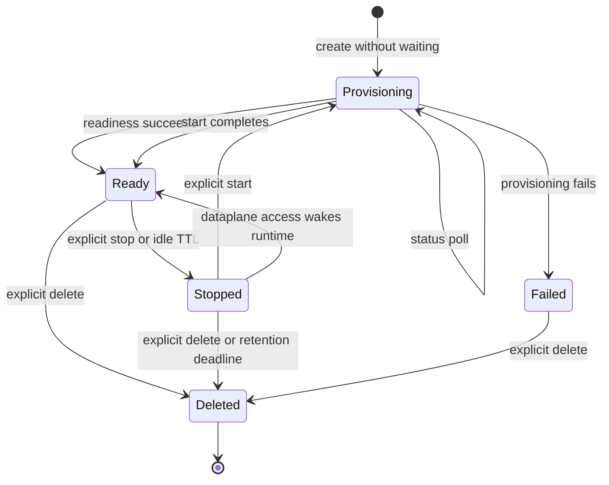
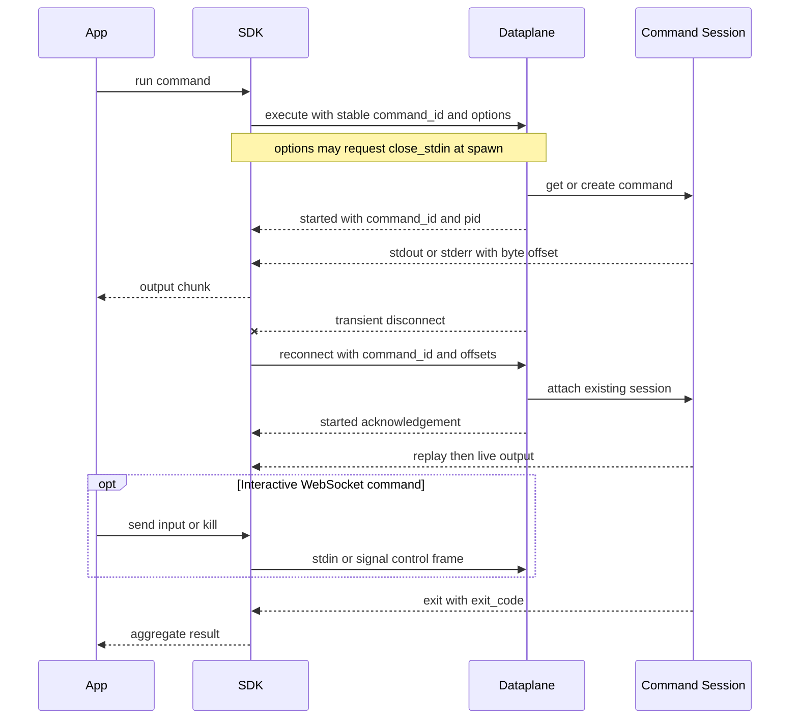

# Sandbox Lifecycle, Access, Services, and Command Execution

The sandbox SDK separates resource management from runtime traffic. `SandboxClient` in TypeScript and `SandboxClient` / `AsyncSandboxClient` in Python send lifecycle, service-link, download-link, and snapshot requests to the `/v2/sandboxes` control plane. Returned `Sandbox` objects keep the resource metadata and use `dataplane_url` for commands, files, and, in Python, TCP tunnels. Authentication and endpoint defaults follow the wider [client configuration model](/openwiki/concepts/client-configuration-and-auth.md); constructor headers reach control-plane HTTP, dataplane HTTP, and WebSocket upgrades, while Python also supports per-operation header overrides.

## Creation, readiness, and retention

Creation posts to `/boxes` and can select the default runtime or a snapshot, name and size the VM, configure mounts and outbound proxying, set command defaults, and optionally delegate LangSmith access. By default the server waits for readiness. `wait_for_ready=False` in Python or `waitForReady: false` in TypeScript instead returns a `provisioning` object. `wait_for_sandbox()` / `waitForSandbox()` then polls the lightweight `/status` endpoint, fetches the full object only on `ready`, raises a typed creation failure on `failed`, and reports the last observed status on timeout.

Two clocks govern retention. `idle_ttl_seconds` / `idleTtlSeconds` stops an inactive sandbox. `delete_after_stop_seconds` / `deleteAfterStopSeconds` permanently deletes a stopped sandbox and its filesystem clone. Nonzero client values use 60-second resolution, `0` disables that action, and omission leaves the server default in force.

```mermaid
stateDiagram-v2
    [*] --> Provisioning: create without waiting
    Provisioning --> Ready: readiness succeeds
    Provisioning --> Failed: provisioning fails
    Provisioning --> Provisioning: status poll
    Ready --> Stopped: explicit stop or idle TTL
    Stopped --> Provisioning: explicit start
    Provisioning --> Ready: start completes
    Stopped --> Ready: dataplane access wakes runtime
    Ready --> Deleted: explicit delete
    Stopped --> Deleted: explicit delete or retention deadline
    Failed --> Deleted: explicit delete
    Deleted --> [*]
```

*Sandbox resource states visible to SDK callers; snapshot builds have a separate polled lifecycle and do not add a sandbox state.*

A cached `status` is deliberately **not** the dataplane gate. `stop()` leaves the stable `dataplane_url` in place and updates only local status because a later runtime request may wake the sandbox. Commands, file operations, and Python tunnels therefore require only that the URL exists. Its absence raises `DataplaneNotConfiguredError` / `LangSmithDataplaneNotConfiguredError`; server-side unavailability becomes a typed not-ready or connection failure. Explicit `start()` posts to `/start`, waits for `ready`, and refreshes local status and URL.

### Cleanup ownership

- Python `client.sandbox()` and `await async_client.sandbox()` produce auto-deleting context-manager objects. Context exit suppresses deletion failures so cleanup cannot mask the body exception. `create_sandbox()` is manually owned, and sync/async conversion disables auto-delete on the converted view of the same resource.
- TypeScript has no auto-deleting `Sandbox`; use `try` / `finally` and `await sandbox.delete()`.
- Closing a Python client releases HTTP pools but does not delete manually owned sandboxes. `stop()` is also not cleanup: it preserves storage and can be reversed by start or wake-on-access.

## Runtime identity with `run_config`

`RunConfig` has `user`, `work_dir`, and `env_vars`. It is layered in order from Docker image to snapshot to sandbox to one command. At each layer, `user` and `work_dir` replace the value below, while environment variables merge by key. Snapshot creation can override image defaults, sandbox creation and update can add the sandbox layer, snapshot capture can apply another override, and `run()` can add a command-only layer.

For per-command migration, `env` and `cwd` are deprecated spellings. Both SDKs reject a request that combines either one with `run_config` / `runConfig` instead of choosing a silent winner; use `env_vars` and `work_dir`. Python accepts either `RunConfig` or a plain dictionary, while TypeScript uses the `RunConfig` object shape.

## Mounts, proxy rules, and delegated access

Mount builders cover S3, GCS, public credential-free HTTPS Git, and read-only Context Hub. Provider credentials belong in top-level mount auth, never in an individual mount. GCS mounts require GCP mount auth. An S3 mount can use AWS mount auth **or an enabled AWS rule in the supplied proxy configuration**; only enabled proxy rules satisfy that requirement. Supplying mount auth and a same-provider AWS/GCP proxy rule together is rejected, because mount auth is itself expanded into runtime proxy behavior. Keep outbound `allow_list` / `deny_list` policy and provider-signing rules in the same proxy configuration passed at creation.

`access_delegation` / `accessDelegation` lets code inside the sandbox call LangSmith without carrying a separate API key:

- `INHERIT` follows everything the creator may do and does not accept a permissions list.
- `EXPLICIT` requires a nonempty permissions list and is the safer least-privilege choice.
- The grant is a live ceiling, not a snapshot: delegated requests are rechecked, so permissions later lost by the creator are also lost by the sandbox.
- The grant belongs to the sandbox. Anyone able to execute code there can use it, so do not combine broad delegation with untrusted workloads.

Both manual creation APIs accept delegation. In Python, the convenience `sandbox()` context-manager entrypoint does not expose `access_delegation`; use `create_sandbox()` and explicitly own cleanup when delegation is required.

## Service URLs and file access

`service()` in Python and `serviceUrl()` in TypeScript expose an HTTP port through one of two security models:

| Mode | Returned object | Access and lifetime |
| --- | --- | --- |
| Token, by omitting `access` | `ServiceURL` / `AsyncServiceURL` or `ServiceUrl` | Short-lived token plus browser and direct service URLs. Helpers inject `X-Langsmith-Sandbox-Service-Token` and refresh before expiry. |
| Login-gated, `access="restricted"` or `"workspace"` | `ServiceLoginURL` / `ServiceLoginUrl` | Durable browser-only URL with no token or expiry. `restricted` requires `sandboxes:read`; `workspace` admits members of the owning workspace. |

Token accessors refresh the complete URL/token set when near expiry: Python uses a 30-second margin and TypeScript 60 seconds. Python async synchronous properties do not refresh; use `get_token()`, `get_service_url()`, `get_browser_url()`, or `get_expires_at()` when freshness matters. Login-gated mode has no programmatic fetch helper and no token TTL. TypeScript rejects `expiresInSeconds` in this mode; Python accepts its defaulted `expires_in_seconds` argument but omits it from the request. A durable login grant also causes token-mode minting to be refused with `409` while the grant exists.

Dataplane file APIs upload strings or bytes as multipart content and return raw bytes for ordinary reads. The current APIs also expose metadata, RFC 9110 byte-range reads, directory/glob listing, and literal content grep. Range responses retain validators so callers can detect unchanged content. Control-plane `generate_download_url()` / `generateDownloadURL()` instead mints a path-bound bearer link that needs no LangSmith credential and can wake a stopped sandbox. It is bound to the path rather than immutable contents, so write a new path and mint a new link after changing a file.

Python alone exposes `tunnel()`. It listens on loopback, opens yamux streams over the dataplane `/tunnel` WebSocket, and bridges each local TCP connection to a sandbox port. Dead sessions reconnect under a lock with bounded retries (default three); `AsyncTunnel` delegates the threaded implementation through an executor. The inspected TypeScript `Sandbox` has no TCP tunnel API.

## Command transport selection

Transport selection now differs materially by SDK:

- **Python defaults to WebSocket** `/execute/ws` for blocking, streaming, and non-blocking execution. `websockets>=15.0` is a core package dependency; the old `langsmith[sandbox]` extra remains empty only for compatibility. There is no ordinary HTTP `/execute` fallback.
- **Python SSE is opt-in** with `LANGSMITH_EXPERIMENTAL_FEATURES=sandbox_sse_exec`. It uses `POST /execute/stream/start` and `/execute/stream/resume`. SSE is one-way: it supports output and byte-offset resume, but rejects PTY, `close_input=False`, and `kill_on_disconnect=True`; handle calls that need the control channel, such as kill or input, raise typed operation failures.
- **TypeScript defaults to WebSocket** when its optional `ws` peer is installed. Only a blocking call without callbacks can fall back to `POST /execute` when `ws` is absent. Streaming callbacks and `wait: false` require WebSocket. TypeScript may attach callbacks to a non-blocking handle, whereas Python rejects `wait=False` with callbacks.

Both WebSocket implementations generate `command_id` before connecting and send it in `execute`. They require `started` before returning the handle. A transient upgrade/connect failure or pre-`started` close reuses that same ID, allowing daemon get-or-create semantics instead of duplicate processes. Upgrade status `429` and transient `5xx` statuses are retryable, numeric `Retry-After` is honored, and each open timeout is clamped by a whole-connect budget. Python SSE likewise starts with a client-generated stable ID.

## Stdin, PTY, handles, and reconnect

Non-PTY execution defaults `close_input` / `closeInput` to `true`, half-closing stdin at spawn so readers see EOF instead of hanging. Set it to `false` to use `send_input()` / `sendInput()` on a returned WebSocket handle, then call `close_input()` / `closeInput()` when finished. Sending after closure raises a typed operation error, while closure is idempotent.

With `pty=True` / `pty: true`, stdout and stderr represent a terminal stream and there is no independent stdin write end. The close-input flag is therefore forced off and handle closure is a no-op; send EOT (`0x04`) through input when terminal EOF is needed. WebSocket handles also expose process identity, `kill`, streaming iteration, aggregate `result`, and manual reconnect. Python sync controls are methods, Python async controls are awaited, and TypeScript socket controls are synchronous methods on the async handle.

```mermaid
sequenceDiagram
    participant App
    participant SDK
    participant DP as Dataplane
    participant Cmd as Command Session
    App->>SDK: run command
    SDK->>DP: execute with stable command_id and options
    Note over SDK,DP: options may request close_stdin at spawn
    DP->>Cmd: get or create command
    DP-->>SDK: started with command_id and pid
    Cmd-->>SDK: stdout or stderr with byte offset
    SDK-->>App: output chunk
    DP--xSDK: transient disconnect
    SDK->>DP: reconnect with command_id and offsets
    DP->>Cmd: attach existing session
    DP-->>SDK: started acknowledgement
    Cmd-->>SDK: replay then live output
    opt Interactive WebSocket command
        App->>SDK: send input or kill
        SDK->>DP: stdin or signal control frame
    end
    Cmd-->>SDK: exit with exit_code
    SDK-->>App: aggregate result
```

*WebSocket command start, optional stdin control, and byte-offset reattachment; Python SSE presents the same output messages but resumes through HTTP and has no control frames.*

Handles maintain separate UTF-8 **byte** offsets for stdout and stderr. Automatic WebSocket reconnect passes the command ID and both consumed offsets, allows five consecutive failures, retries server reload immediately, and uses exponential backoff otherwise. Output resets the budget; for a silent command, a `started` acknowledgement resets it only when its command ID matches the attached command. A mismatched acknowledgement is ignored. Calling kill disables automatic reattachment.

SSE hides its start/resume loop behind the same Python handle model. An `ack_required` event means the bounded server buffer needs room; the client resumes with both offsets, which simultaneously acknowledge consumption and select the next bytes. Protocol-requested resumes do not spend the five-attempt network-failure budget, while broken-connection resumes do. Both transports preserve split UTF-8 characters while keeping byte offsets exact.

The expected terminal sequence is `started`, zero or more output messages, then `exit`. Accessing `result` drains unread output and requires `exit`. Command timeout, missing or expired sessions, malformed ordering, an `error` event, or a stream ending without exit becomes a typed command/connection failure rather than a successful result.

## Snapshots

Snapshots are reusable boot sources with their own `building` to `ready` or `failed` polling lifecycle. Clients can build from a Docker image, capture a running sandbox, list/get/delete snapshots, and wait for completion. Python resolves UUID, `name:tag`, and bare-name references and exposes tags; TypeScript creation distinguishes snapshot ID and `snapshotName`.

Dockerfile helpers orchestrate rather than call a special build endpoint: they create a temporary builder sandbox, tar and upload local context, run BuildKit on the capacity-backed root filesystem, capture the resulting image, and always delete the builder through a context manager or `finally`. A nonzero build exit becomes a typed snapshot creation error.

## Failure and verification boundaries

The language-specific error hierarchies distinguish authentication/API and validation/quota errors from resource not-found, provisioning, timeout, dataplane-not-configured, not-ready, operation, command-timeout, and connection failures. Structured fields retain resource type, last status, operation, machine-readable error type, and server error IDs where available.

Focused regression coverage should preserve these boundaries:

- access-delegation tests validate mode/permission rules and exact creation payloads;
- service URL tests cover token refresh, auth-header injection, login-only objects, and invalid TTL/access combinations;
- run-config and file tests cover layering payloads, deprecated-option conflicts, range validators, glob, and grep;
- WebSocket handshake, command-ID retry, and reconnect-ack tests cover retry statuses, budgets, stable IDs, and silent-command acknowledgement;
- Python SSE unit and integration tests cover transport selection, `ack_required` resume, network retry budgets, UTF-8 boundaries, and unsupported controls;
- PTY and command-handle tests cover the non-PTY close-input default, interactive input, idempotent close, and EOT semantics.

These focused tests complement the [repository test strategy](/openwiki/testing/repository-test-strategy.md) and the ownership boundaries in [SDK architecture](/openwiki/architecture/sdk-architecture.md).
