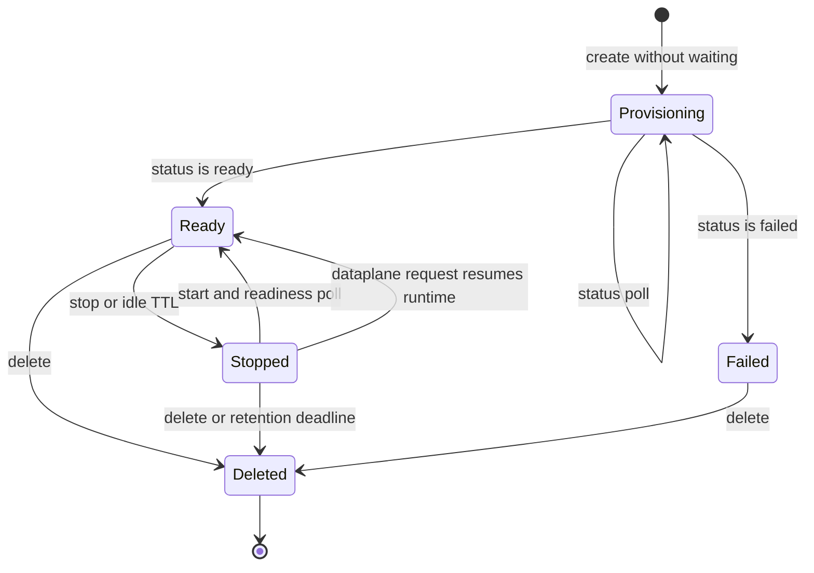
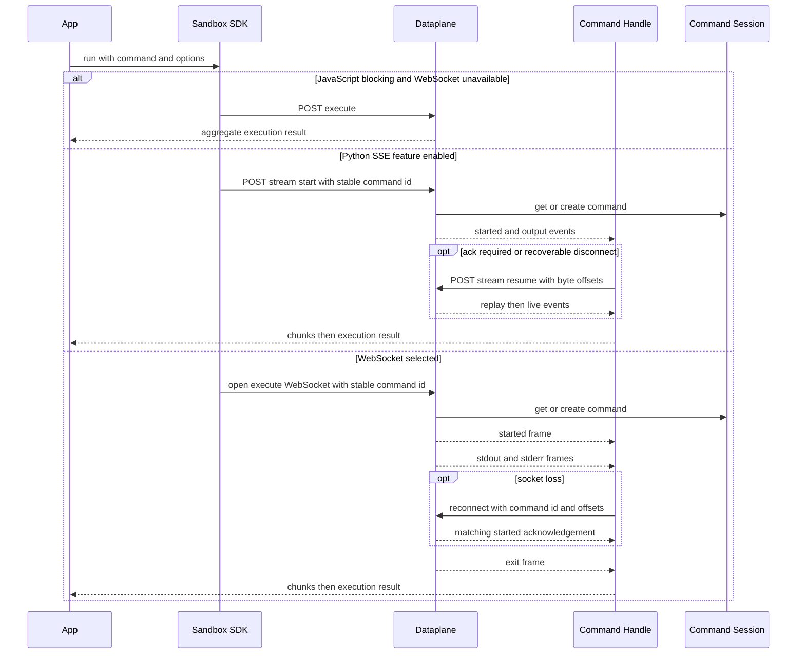

# Sandbox Lifecycle, Files, Services, and Command Execution

The sandbox APIs divide work between two boundaries:

- `SandboxClient` in JavaScript and `SandboxClient` / `AsyncSandboxClient` in Python manage resources below the `/v2/sandboxes` control-plane root: sandboxes under `/boxes`, snapshots, service and download URL grants, and start, stop, update, and delete operations.
- A returned `Sandbox` or `AsyncSandbox` carries `dataplane_url`. Commands, uploads, downloads, file searches, ranged reads, and Python TCP tunnels go to that URL.

The SDK does not use cached lifecycle `status` as a dataplane gate. It requires only a non-empty `dataplane_url`: the platform can resume a stopped sandbox when dataplane traffic arrives. A missing URL raises `LangSmithDataplaneNotConfiguredError` in JavaScript or `DataplaneNotConfiguredError` in Python; a runtime that is genuinely unavailable reports a server-side not-ready or connection error.

Authentication follows the broader [client configuration model](/openwiki/concepts/client-configuration-and-auth.md). The default sandbox endpoint is derived from `LANGSMITH_ENDPOINT`, and `LANGSMITH_API_KEY` is sent as `X-Api-Key`. Constructor headers reach control-plane and dataplane HTTP plus WebSocket upgrades. Python also supports per-operation header overrides.

## Control-plane lifecycle and ownership

`createSandbox()` / `create_sandbox()` posts creation parameters including snapshot selection, resource capacity, retention, mounts, proxy policy, run configuration, and optional access delegation. Creation normally waits server-side. With `waitForReady: false` or `wait_for_ready=False`, it returns the provisioning representation immediately.

`waitForSandbox()` / `wait_for_sandbox()` polls the lightweight `/status` endpoint. It fetches the complete object only after `ready`, turns `failed` into a resource-creation error, and reports the last observed status on timeout. `start()` posts `/start`, uses the same readiness polling, and updates the existing object's `status` and `dataplane_url`. `stop()` posts `/stop`, sets local status to `stopped`, and intentionally retains `dataplane_url` because files persist and later start or dataplane access can resume the runtime.

```mermaid
stateDiagram-v2
    [*] --> Provisioning: create without waiting
    Provisioning --> Provisioning: status poll
    Provisioning --> Ready: status is ready
    Provisioning --> Failed: status is failed
    Ready --> Stopped: stop or idle TTL
    Stopped --> Ready: start and readiness poll
    Stopped --> Ready: dataplane request resumes runtime
    Ready --> Deleted: delete
    Stopped --> Deleted: delete or retention deadline
    Failed --> Deleted: delete
    Deleted --> [*]
```

*SDK-visible sandbox states and verified transitions; snapshot build status is a separate resource, not a sandbox state.*

Two retention settings are independent. `idle_ttl_seconds` / `idleTtlSeconds` stops an inactive runtime. `delete_after_stop_seconds` / `deleteAfterStopSeconds` permanently removes a stopped sandbox and its filesystem clone after the stop-anchored interval. Nonzero client-supplied values must be multiples of 60; `0` disables that action, while omission leaves the server default in control.

Ownership differs by language:

- Python `client.sandbox()` and the async equivalent mark the returned object for deletion on context exit and suppress deletion errors so cleanup cannot mask a body exception. `create_sandbox()` is manually managed.
- Python `to_async()` / `to_sync()` conversions preserve the server identity, resource fields, client configuration, and headers but disable auto-delete on the converted object. The original owner remains responsible for cleanup.
- JavaScript has no auto-deleting sandbox context manager. Use `try` / `finally` and `await sandbox.delete()`.
- Stopping is not cleanup. Client closure releases HTTP pools but does not delete manually managed sandboxes.

Snapshots have their own `building` to `ready` or `failed` polling lifecycle. Dockerfile helpers create a temporary builder sandbox, upload the build context, run the build, capture the result, and delete the builder in a Python context manager or JavaScript `finally`, including on failure.

## Run configuration and delegated access

`RunConfig` / `runConfig` models the command user, absolute working directory, and environment. Configuration is layered in this order:

1. Docker image or snapshot configuration.
2. Sandbox configuration supplied at creation or update.
3. Per-command configuration supplied to `run()`.

`user` and `work_dir` replace the lower layer; `env_vars` merges by key. Updating a sandbox affects subsequent commands, not processes already running. The older per-command `env` and `cwd` fields still work alone, but both SDKs reject combining either with `run_config` / `runConfig`.

Creation may also carry `access_delegation` / `accessDelegation`, allowing code inside the sandbox to call LangSmith without embedding the creator's API key:

- `INHERIT` follows everything the creator can currently do and must not include permissions.
- `EXPLICIT` requires a non-empty permission list and caps the grant to permissions the creator holds.

The creator's permissions are rechecked on each request rather than copied permanently. The grant belongs to the sandbox, so anyone able to execute code in it can exercise that grant; omission means no delegated LangSmith access.

## Mount and outbound proxy authentication

Both SDKs provide builders for S3, GCS, public Git, and read-only Context Hub mounts. Git remotes must be absolute credential-free HTTPS URLs. Context Hub synchronization is one-way; unless `initial_pull_only` is selected, a later sync can overwrite guest writes. S3 and GCS mounts optionally expose read-only and cache settings.

Credentials never belong inside an individual mount specification. `mount_config.auth` / `mountConfig.auth` accepts one provider block per provider, using `workspace_secret` / `workspaceSecret` references or write-only `opaque` values. AWS auth supports either a `role_arn` alone or both static key secrets; clients reject role descriptors mixed with static credentials. GCS requires top-level GCP auth. S3 can instead use an enabled AWS rule from the same `proxy_config`, but the same provider must not be configured in both mount auth and proxy rules.

An AWS role in general proxy configuration retains its effective IAM permissions. In mount auth, backend enforcement scopes it to configured S3 mounts. Role auth is creation-time configuration; the backend supplies the workspace External ID and renews temporary credentials. Client code must not provide an External ID or temporary session credentials.

Proxy rules keep provider credentials outside the guest and inject or sign supported HTTPS requests. AWS uses SigV4; GCP injects OAuth bearer tokens. Optional `env_vars` are only compatibility markers for tools that insist on credential-like variables—the actual secret remains at the proxy. Access control can allow or deny outbound host patterns. The old `no_proxy` / `noProxy` input is ignored because egress interception is transparent.

## Dataplane files and download grants

The basic path is common to both SDKs:

- `write()` UTF-8 encodes strings and multipart-posts bytes to `/upload?path=...`.
- `read()` gets raw bytes from `/download?path=...`; missing files become resource-not-found errors.
- `stat()` sends `HEAD` and returns size plus validators such as `ETag`.
- `read_range()` / `readRange()` sends `Range` and optional `If-Range` or `If-None-Match`. A `206` is a partial chunk, a stale `If-Range` can return a full `200` that must replace rather than append, `304` means unchanged, and `416` is an invalid/past-EOF operation.
- `glob()` searches names, `ls()` is the nonrecursive `*` case, and `grep()` performs literal content search. Search results expose `truncated`; callers must not treat a truncated response as complete.

`generate_download_url()` / `generateDownloadURL()` is a control-plane operation. It mints a bearer URL bound to the sandbox, exact path, and response headers. A holder needs no LangSmith credential, and fetching can wake a stopped sandbox. The grant binds a path, not immutable contents, so publish changed contents under a new path and mint a new link.

## Service URLs and verification

`client.service()` in Python and `client.serviceUrl()` in JavaScript expose an HTTP service listening on a guest port. Python sandbox objects currently offer the token form directly; the client-level APIs in both languages also support login-gated service URLs.

| Mode | Result | Intended use |
| --- | --- | --- |
| Token, no `access` | `ServiceURL` / `AsyncServiceURL` / `ServiceUrl` with a short-lived token | Programmatic HTTP. Helpers inject `X-Langsmith-Sandbox-Service-Token` and refresh near expiry. |
| `access: "restricted"` | `ServiceLoginURL` / `ServiceLoginUrl` | Browser login for callers with `sandboxes:read` on the sandbox. |
| `access: "workspace"` | `ServiceLoginURL` / `ServiceLoginUrl` | Browser login for members of the owning workspace. |

Login grants are durable, have no token or expiry, and intentionally expose no programmatic fetch helper. Therefore `expires_in_seconds` / `expiresInSeconds` does not apply. A durable login grant conflicts with later token mode until the grant is changed server-side.

Apps behind login-gated URLs receive `X-Langsmith-User-Token`. `SandboxTokenVerifier` fetches Ed25519 keys from `/.well-known/jwks.json`, caches and refreshes them, and verifies signature, key ID, time claims, audience (the service host), optional issuer, and that the subject is a user. Python verification requires the `sandbox-auth` extra; JavaScript requires Web Crypto Ed25519 support.

Outbound proxy callbacks use `X-LangSmith-Signature-JWT`. Verification checks the callback subject, optional exact or predicate audience, optional issuer, and a constant-time comparison of the JWT's `body_sha256` against the raw request body before parsing sandbox identity and optional full-request data. JWKS URLs require HTTPS except loopback HTTP unless the caller explicitly accepts an insecure network path.

## Command transport selection

The languages do **not** have transport parity:

| SDK | Default `run()` | Alternative | Constraints |
| --- | --- | --- | --- |
| JavaScript | WebSocket `/execute/ws` when optional `ws` is importable | Blocking HTTP `POST /execute` only when `wait: true`, no callbacks, and `ws` is unavailable | Streaming callbacks and `wait: false` require WebSocket. A nonblocking handle may also have callbacks. |
| Python sync and async | WebSocket `/execute/ws` when `websockets` is installed | Experimental SSE `/execute/stream/start` and `/resume` when `LANGSMITH_EXPERIMENTAL_FEATURES=sandbox_sse_exec` | There is no current Python blocking `/execute` fallback. Without WebSocket support and without SSE enabled, `run()` raises `ImportError`. Python rejects callbacks with `wait=False`. |

HTTP execution is one request and returns aggregate `stdout`, `stderr`, and `exit_code`; it has no handle, streaming offsets, stdin channel, or reattachment. WebSocket and SSE adapt their messages to the same Python command-handle model, but their controls differ materially.

```mermaid
sequenceDiagram
    participant App
    participant SB as Sandbox SDK
    participant DP as Dataplane
    participant Handle as Command Handle
    participant Cmd as Command Session
    App->>SB: run with command and options
    alt JavaScript blocking and WebSocket unavailable
        SB->>DP: POST execute
        DP-->>App: aggregate execution result
    else Python SSE feature enabled
        SB->>DP: POST stream start with stable command id
        DP->>Cmd: get or create command
        DP-->>Handle: started and output events
        opt ack required or recoverable disconnect
            Handle->>DP: POST stream resume with byte offsets
            DP-->>Handle: replay then live events
        end
        Handle-->>App: chunks then execution result
    else WebSocket selected
        SB->>DP: open execute WebSocket with stable command id
        DP->>Cmd: get or create command
        DP-->>Handle: started frame
        DP-->>Handle: stdout and stderr frames
        opt socket loss
            Handle->>DP: reconnect with command id and offsets
            DP-->>Handle: matching started acknowledgement
        end
        DP-->>Handle: exit frame
        Handle-->>App: chunks then execution result
    end
```

*Verified command paths: JavaScript-only blocking HTTP fallback, Python feature-gated SSE, and WebSocket execution in both SDKs.*

## WebSocket start, handles, and reattachment

A WebSocket start sends a client-generated `command_id`. The daemon treats it as get-or-create, so transient connection failure or closure before `started` can retry with the same ID without intentionally spawning a duplicate. Retryable upgrade responses include `429` and selected `5xx` statuses; numeric `Retry-After` overrides jittered backoff, and each open timeout is clamped by the whole-connect budget.

The expected frame progression is `started`, zero or more interleaved `stdout` / `stderr` frames, then `exit`; `error` frames map to typed failures. Handles aggregate an `ExecutionResult`, expose command ID and PID, and drain unread output when `.result` is requested. Malformed ordering, command timeout, missing or expired sessions, and a stream ending without `exit` are failures, not successful empty results.

Handles maintain independent stdout and stderr **UTF-8 byte offsets**. On a transient loss they reconnect with command ID and those offsets. The automatic loop permits five consecutive failures, reconnects immediately for server reload, and stops after `kill()`. Output resets the failure budget; for a quiet command, a `started` acknowledgement resets it only when its command ID matches the attached command.

Non-PTY commands close stdin by default so readers receive EOF. Set `close_input=False` / `closeInput: false` before requesting a handle if input will be streamed. `close_input()` / `closeInput()` is idempotent and queues across lazy socket binding. Under a PTY there is no separate write end to half-close, so close is a no-op and callers send EOT (`0x04`) instead. JavaScript control sends are synchronous; Python async handle controls must be awaited.

## Python SSE start and resume

SSE is off by default and selected ahead of WebSocket only when `LANGSMITH_EXPERIMENTAL_FEATURES` includes `sandbox_sse_exec`. Sync and async sandboxes use the same protocol and return their corresponding `CommandHandle` types; converting a Python sandbox between sync and async preserves the resource but each side uses its own HTTP client and stream implementation.

`POST /execute/stream/start` carries a stable command ID and execution settings. Events contain base64 output with byte offsets. The decoder preserves multibyte UTF-8 characters split across events and emits a replacement character only for an incomplete final sequence. `stream_end` closes an individual output stream and `exit` completes the handle.

SSE is one-way, so it cannot acknowledge buffered output within an open response. When the server emits `ack_required`, the transport closes that response and immediately posts `/execute/stream/resume` with the reported stdout and stderr offsets; those offsets are both acknowledgement and continuation cursor. This protocol-driven resume does not spend the retry budget. Recoverable HTTP failures, daemon shutdown, or a response ending without a terminal event resume with jittered exponential backoff and at most five consecutive attempts. Only output progress resets that budget—a repeated `started` event without output cannot retry forever. A missing command on resume is terminal and is not restarted.

SSE always spawns with stdin closed and has no signal/input control channel. It rejects `pty=True`, `close_input=False`, and `kill_on_disconnect=True`; `kill()` and input operations on its handle fail rather than silently doing nothing. Cancelling async consumption or closing the client stream only stops the HTTP consumer; it is not a command kill signal. Use WebSocket execution when cancellation must signal the process, interactive stdin, PTY semantics, or kill-on-disconnect are required.

## Language-specific capabilities and focused tests

Python additionally exposes `Sandbox.tunnel()` / `AsyncSandbox.tunnel()`: a loopback TCP listener multiplexed over yamux streams on `/tunnel`, with bounded session reconnection. The async wrapper delegates the threaded tunnel through an executor. The inspected JavaScript `Sandbox` API does not expose TCP tunneling. Conversely, only JavaScript currently retains the simple blocking HTTP command fallback.

High-value regression coverage includes:

- JavaScript `sandbox_run_config_and_files.test.ts` and Python `test_run_config_and_files.py` for configuration layering payloads, stdin close and PTY identity, search truncation, validators, and ranged-read restart semantics.
- JavaScript and Python access-delegation tests for client-side grant validation and response parsing.
- WebSocket handshake, stable command-ID retry, and reconnect-ack tests for bounded retries and offset continuity.
- Python `test_sse_execute.py` for feature selection, ack/resume offsets, UTF-8 boundaries, retry exhaustion, unsupported controls, and sync/async behavior; the opt-in integration test forces output larger than the server buffer and verifies every byte arrives exactly once across repeated resumes.
- Service URL and verifier tests for refresh boundaries, login modes, audience/issuer checks, body hashes, JWKS caching, and unknown-key refresh behavior.

These boundaries complement the [repository test strategy](/openwiki/testing/repository-test-strategy.md) and the ownership layers described in [SDK architecture](/openwiki/architecture/sdk-architecture.md).
