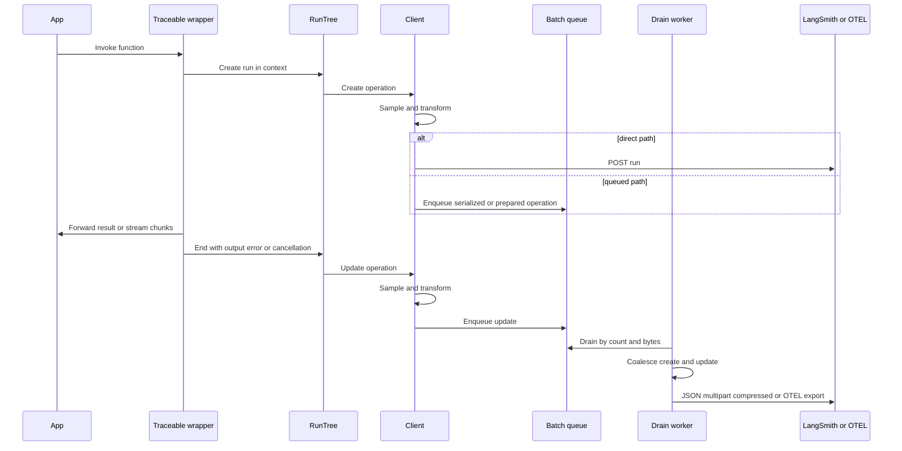
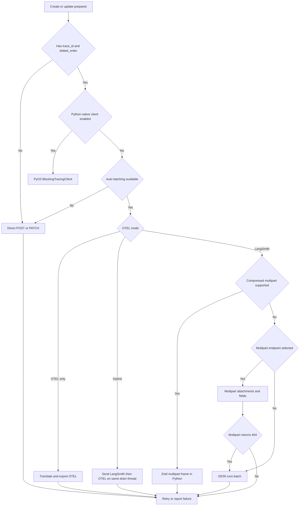

# Trace Capture, Transformation, and Ingestion

A trace write is not a single HTTP call. The SDK first captures a run lifecycle, makes a trace-stable sampling decision, prepares data for privacy and runtime attribution, and then chooses among direct, queued, multipart, compressed, native, replica, and OpenTelemetry (OTEL) paths. Most queued writes are intentionally backgrounded: application success is therefore distinct from trace-delivery success.

## Capture and lifecycle

`traceable` in JavaScript and `@traceable` in Python construct a `RunTree` in the current tracing context. A run is posted near function entry and patched after the return value, stream, generator, cancellation, or exception is known. Streaming wrappers collect chunks and record `new_token` events while preserving the caller's stream and tracing context. Before ingestion, both clients remove token payloads from those events, preventing streamed output from being uploaded a second time through event metadata.

Direct `RunTree` use exposes the same two-phase contract: JavaScript `postRun()` / `patchRun()` and Python `post()` / `patch()`. Patching ends a Python run if necessary. Inputs are omitted from patches by default in both implementations so that a coalesced update does not overwrite the create's original inputs; callers can explicitly opt back in. Run-tree posting and patching generally keep tracing failures off the application path: JavaScript catches and logs these failures, while Python's normal auto-batch path queues work for background reporting.

*Caption: Capture-to-ingest sequence shared by wrapper-created and manually created run trees; direct writes bypass the queue, while trace-aware writes normally batch.*

## Sampling, runtime data, and privacy

Sampling is deterministic across the two SDKs. Both lowercase a trace identifier, hash its UTF-8 bytes with XXH3-128, reduce modulo 1,000,000, and compare the bucket with the configured rate. The key preference is `trace_id`, then the root encoded in `dotted_order`, then run `id`. Consequently, a create and patch—and normally all children of a trace—make the same decision. A missing identifier is retained, rates at least `1` retain everything, and rates at or below `0` retain nothing.

After admission, clients add runtime information under `extra.runtime` and LangSmith environment metadata under `extra.metadata`; the configured sample rate is reported as `ls_tracing_sample_rate`. `omitTracedRuntimeInfo` / `omit_traced_runtime_info` suppresses this insertion. Existing run runtime/metadata values take precedence where the merge is designed to preserve caller data.

Privacy processing happens client-side before serialization and upload:

- `hideInputs`, `hideOutputs`, and `hideMetadata` (or their Python snake-case forms) can erase a field or call a custom transform.
- A configured anonymizer processes inputs, outputs, metadata, and error text. Error strings are wrapped in an object for dictionary-shaped anonymizers and then unwrapped.
- The supplied anonymizer builders deep-clone JSON-shaped values and replace matching string nodes up to a depth limit. The secret preset is deliberately high precision rather than exhaustive.
- Runtime-derived metadata is also passed through metadata hiding/anonymization. This matters because privacy is not limited to user-provided payload fields.

The Python ordering is explicit: `_run_transform` applies field privacy, `_insert_runtime_env` adds runtime data and privacy-processes added metadata, and only then is the operation serialized. JavaScript prepares user fields first and merges runtime information before queueing or direct serialization; OTEL batches additionally mask metadata before translation.

## Coalescing and serialization

A queued create followed by an update for the same run can become one create. JavaScript performs this merge in both JSON batch and multipart assembly; Python's `combine_serialized_queue_operations` does it after queue draining. Update values replace create values, but Python ignores `None` in the main update object and only replaces separately serialized fields when they are present. Updates without a matching create remain patches. Attachments are merged in Python rather than discarded.

This is why omission differs from an empty value: an omitted patch field preserves the create, whereas an explicitly present empty object may overwrite it. The default exclusion of patch inputs protects that invariant.

Python serializes hot fields separately into `SerializedRunOperation`: the main run object plus optional `inputs`, `outputs`, `events`, `extra`, `error`, `serialized`, and `attachments`. Multipart conversion gives each field its own named part and supports byte or explicitly permitted filesystem attachments. Attachment names containing `.` are skipped; missing files are warned about and skipped. `RewindableMultipartBody` rewinds file parts and rebuilds its encoder so urllib3 and outer retries resend a complete body rather than an exhausted stream.

JavaScript keeps prepared objects in `AutoBatchQueue` and serializes when a batch is assembled. Large-string-dominated payloads may use one process-wide Node `worker_threads` serializer; manual-flush mode, unsupported runtimes, structural payloads, clone errors, and worker failures fall back to synchronous serialization with equivalent bytes. The worker is `unref()`'d and is shared across clients, so serialization does not create one worker per client or keep the process alive.

## Queueing and transport selection

*Caption: Transport selection across supported SDK paths. PyO3 and zstd compression are Python-only; JavaScript can gzip a multipart body; OTEL-only and hybrid modes use the queue.*

### JavaScript

With `autoBatchTracing` enabled, only operations carrying both `trace_id` and `dotted_order` enter `AutoBatchQueue`; otherwise `createRun` and `updateRun` use direct JSON `POST /runs` and `PATCH /runs/{id}`. The queue drains after a 250 ms aggregation delay or when server/configured count or byte limits are crossed. It splits work by API URL, API key, and workspace so credentials never share a request.

The server `/info` response selects multipart by default and supplies batch limits. Multipart sends the main run, large fields, and attachments as named parts. If `gzip_body_enabled` is advertised and compression is not disabled, JavaScript wraps a streaming multipart body in `CompressionStream("gzip")`. A multipart `404` permanently disables that endpoint for the client and retries via JSON `POST /runs/batch`. On a self-hosted endpoint, a streamed multipart `422` triggers one buffered retry and disables future streaming.

### Python

With `auto_batch_tracing=True`, Python creates a bounded `PriorityQueue` and a control thread. It drains up to the server count/byte limits, groups items by endpoint and full auth tuple, and can scale drain subthreads with backlog. Each replica destination gets a queue item sharing serialized bytes but carrying independent authorization.

If the backend advertises zstd multipart support, tracing mode is LangSmith-only, zstandard is installed, and compression is not disabled, operations are written directly into a locked `CompressedTraces` frame. Frames are committed to one immutable destination set, close on count/byte threshold or a 0.5-second interval, and are dispatched through a shared thread pool. A different destination set falls back to the uncompressed queue rather than contaminating the frame. `RUN_COMPRESSION_THREADS` defaults to one zstd worker to bound memory.

Setting `LANGSMITH_USE_PYO3_CLIENT` requests the optional `langsmith_pyo3.BlockingTracingClient`; valid trace-aware creates and updates go to it when initialization succeeds, otherwise the client warns and uses Python ingestion. If batching/native requirements are not met, Python uses direct JSON writes. Multipart `404` disables multipart and falls back to JSON batch for run operations; feedback cannot use that fallback.

OTEL-only mode translates the coalesced serialized run operations and exports them with captured OTEL contexts. Hybrid mode coalesces once, sends exactly the same operation set to LangSmith and OTEL sequentially on the existing drain thread, and marks queue tasks complete once. It intentionally starts **no thread per batch**; batch parallelism comes only from the bounded drain-thread pool. Compression is disabled in OTEL and hybrid modes.

## Replicas

Run-tree replicas can change project, credentials, endpoint/workspace, selected fields, and whether a run is rerooted. A non-primary replica deterministically remaps run, trace, parent, and every `dotted_order` UUID by project, preserving consistent create/update identity and hierarchy. A primary replica retains original IDs. JavaScript dispatches each replica through its configured or original client; Python groups replicas that produce byte-identical payloads so serialization is reused, then fans that payload out with per-destination auth.

Client-level write endpoints also fan direct and batched requests out to configured destinations. Failure is per destination: one replica can ingest successfully while another logs or reports an error. It is not an all-or-nothing transaction.

## Reliability and failure semantics

### Backpressure and drops

- **JavaScript prepared queue:** `maxIngestMemoryBytes` is a soft estimated-byte ceiling. If the queue is non-empty and a new operation would exceed it, that operation is dropped with a warning and its completion promise is resolved immediately. A single oversized operation is admitted when the queue is empty.
- **JavaScript request queue:** the same memory setting limits queued batch calls. Overflow rejects that batch; `_processBatch` catches and logs export errors. Background `createRun`/`updateRun` calls attach `console.error`, so awaiting the initial API call usually confirms enqueueing, not delivery.
- **Python uncompressed queue:** `TRACING_QUEUE_MAX_SIZE` bounds item count. `put_nowait` drops a new item on `Full` and emits a rate-limited tracing-drop warning.
- **Python compressed frame:** `MAX_INGEST_MEMORY_BYTES` defaults to 1 GiB of uncompressed data. A new operation that would overflow a non-empty frame is dropped and logged; the first oversized operation remains admissible.

Neither implementation requeues an exhausted batch indefinitely. This prevents telemetry congestion from blocking or destabilizing the traced application.

### Retries and terminal failure

Both HTTP stacks retry `408`, `425`, `429`, `500`, `502`, `503`, and `504`; ordinary client errors are terminal. JavaScript `AsyncCaller` uses randomized exponential backoff, honors its failed-response hook for `429`, and does not retry abort/timeout cancellation errors. Python's urllib3 adapter has three retries with backoff and `Retry-After`; tracing batch/multipart layers add bounded attempts and rebuild or rewind multipart bodies. Conflicts on create/batch are treated as duplicate success.

Terminal background failures are logged and swallowed to protect application runtime. Python additionally invokes `tracing_error_callback`; exceptions thrown by the callback are themselves logged rather than propagated. When `LANGSMITH_FAILED_TRACES_DIR` is configured, terminal multipart/compressed failures can write a replay envelope containing endpoint, replay headers, and base64 body. Files are written atomically (Python also uses owner-only permissions), and new dumps are dropped once `LANGSMITH_FAILED_TRACES_MAX_MB` is already exceeded. Failure to write the fallback file is also swallowed. The JavaScript fallback is currently wired to multipart failure, not arbitrary direct JSON failure.

## Flush and shutdown

Flush APIs have deliberately different contracts:

- JavaScript `flush()` drains the **current `AutoBatchQueue`** and awaits the resulting batch processing. In `manualFlushMode`, no timer drains the queue, so callers must use `await client.flush()`.
- JavaScript `awaitPendingTraceBatches()` first lets traceable finalizers enqueue, waits for in-flight drain/worker serialization, queued-item completion promises, and request-queue idleness, then force-flushes the OTEL span processor. In manual mode it only warns and returns; it does not substitute for `flush()`.
- Python `flush(timeout)` first submits any buffered `process_buffered_run_ops` work, waits for the tracing queue's unfinished task count, drains compressed data, and waits for tracked send futures within the remaining timeout. A finite timeout may therefore return with work still outstanding; `None` waits indefinitely.
- Python `cleanup()` calls `flush()` before closing resources. Control threads also drain on exit, and the compression thread performs a final synchronous fallback if its shared executor has already shut down.

A flush completing means the relevant queues and tracked sends reached their completion points; it does not turn swallowed terminal upload failures into application exceptions. Use logs, `tracing_error_callback` in Python, and failed-trace envelopes for operational detection.

## Safe extension points and focused tests

Changes to this workflow should preserve these boundaries:

1. Privacy transforms must run before any serializer or OTEL translator sees the operation.
2. Sampling must remain trace-stable and cross-SDK compatible.
3. Coalescing must distinguish omitted fields from explicit empty values.
4. Destination/auth grouping must happen before dispatch, including compressed-frame ownership.
5. Every dequeue path must complete its item/task exactly once, even on failure.
6. Retryable multipart bodies must remain replayable.
7. Hybrid export must not reintroduce helper threads per batch.

High-value regression coverage includes JavaScript `batch_client.test.ts` for create/update coalescing, multipart selection, gzip, retries, queue limits, and waiting; `failed_traces.test.ts` for replay envelopes; and `replica_endpoints.test.ts` for fan-out failure isolation. Python `test_operations.py` locks down serialized merge and attachment behavior, `test_background_thread.py` enforces hybrid's no-thread-per-batch and exactly-once task completion, while anonymizer and replica tests cover pre-upload privacy and destination remapping.
