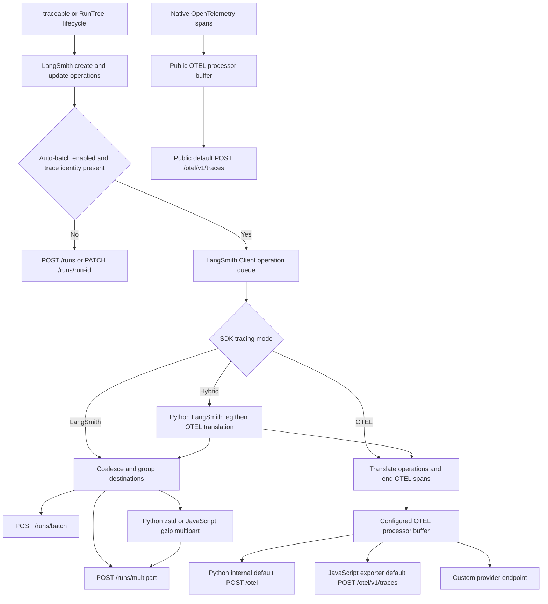
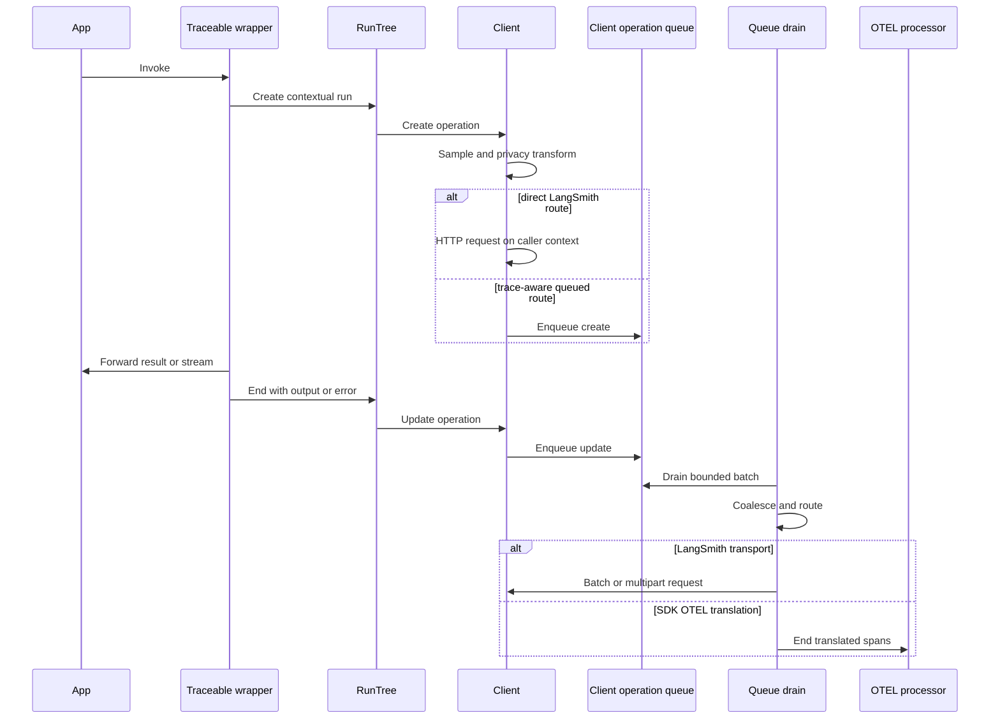

# Trace Capture, Transformation, and Ingestion

Trace capture and trace transport are separate concerns. `traceable` / `@traceable` and `RunTree` produce create and update operations. Those operations may be sent directly, pass through the LangSmith Client batch queue, or be translated into OpenTelemetry spans. A different family of integrations receives **native OpenTelemetry spans** and never enters the Client run-operation queue.

This distinction matters operationally: Client batching, multipart fallback, failed-trace replay files, and Client HTTP retries apply only to the LangSmith run-ingestion routes. OpenTelemetry span processors use their own buffering, exporter, retry, failure, force-flush, and shutdown behavior.

> **Empirical companion:** [Trace Ingestion Measured](/openwiki/workflows/trace-ingestion-measured.md) is the durable measured view of these same peer routes. This page explains implementation and ownership; the companion records observed call counts, timing, bytes, coalescing, and thread handoffs from the trace lab.

## Route comparison

Endpoints below are relative to the configured API base. The hosted default base is `https://api.smith.langchain.com`.

| Route and selection | Transformation and batching | Default endpoint | Network I/O context | Retry, failure, and flush boundary |
|---|---|---|---|---|
| Python direct create/update: no usable auto-batch queue, or missing `trace_id` / `dotted_order` | Privacy/runtime transform, JSON per operation; no coalescing | `POST /runs`, `PATCH /runs/{id}` | Calling/application thread | Python Client HTTP retries; exceptions are synchronous. `flush()` has nothing to drain for completed direct calls. |
| JavaScript direct create/update: auto-batching disabled, or missing trace identity | Privacy/runtime transform, JSON per operation | `POST /runs`, `PATCH /runs/{id}` | JavaScript event loop executing `fetch` | `AsyncCaller` retries; the returned promise represents the request. `flush()` does not govern an already-issued direct call. |
| Queued JSON in either SDK | Trace-aware create/update queue, destination grouping, create/update coalescing, JSON `{post, patch}` batch | `POST /runs/batch` | Python tracing control or scaled drain subthread; JavaScript event loop | Client retries and background error handling. Python `flush()` waits queue tasks; JS `flush()` drains the current queue. |
| Queued multipart in either SDK | Main run and large fields become named JSON parts; attachments become binary parts | `POST /runs/multipart` | Python tracing control or scaled drain subthread; JavaScript event loop | Replayable Client retries. A `404` disables multipart and retries run operations through `/runs/batch`; feedback has no JSON fallback. |
| Python zstd multipart | Operations are appended to a locked compressed frame and sent at count, byte, or time threshold | `POST /runs/multipart` with `Content-Encoding: zstd` | Shared `LANGSMITH_CLIENT_THREAD_POOL` worker; compression-thread synchronous fallback if the pool is shut down | Three outer attempts with rewind; terminal failures may be persisted. `flush()` drains the frame and waits tracked futures within its timeout. |
| JavaScript gzip multipart | Multipart stream is piped through `CompressionStream("gzip")` when advertised and enabled | `POST /runs/multipart` with `Content-Encoding: gzip` | JavaScript event loop | Same multipart request queue and failure handling; this is not the Python zstd frame path. |
| Python `tracing_mode="otel"` | **First** queues serialized run operations, coalesces them, translates create/patch into spans, then ends spans into an OTEL processor | The configured OTLP HTTP exporter endpoint; the internal provider passes the complete default `https://api.smith.langchain.com/otel`, so its request is exactly `POST /otel` | Queue translation on Python drain thread; OTLP network I/O on OpenTelemetry `BatchSpanProcessor` worker thread | No `/runs` call. Client queue completion covers translation, while OTLP delivery belongs to the processor and requires provider force-flush/shutdown. |
| Python `tracing_mode="hybrid"` | One coalesced operation set feeds the LangSmith leg and then the OTEL translator | LangSmith `/runs/multipart` or `/runs/batch`, plus OTLP trace endpoint | LangSmith I/O on the current drain thread; OTLP I/O on the OpenTelemetry batch worker after translated spans end | Each leg isolates errors. No helper thread per batch; every queue item is completed exactly once. Compression is disabled. |
| JavaScript `tracingMode: "otel"` | Trace-aware operations still traverse `AutoBatchQueue`; the translator updates/ends active OTEL spans rather than calling run ingestion | Exporter default `https://api.smith.langchain.com/otel/v1/traces` | Queue and processor/exporter callbacks run on the JavaScript event loop; no LangSmith queue thread | OTLP exporter behavior, not Client multipart/replay behavior. `awaitPendingTraceBatches()` also force-flushes the default OTEL processor. |
| Public Python `OtelSpanProcessor` | Receives native spans and wraps an OpenTelemetry `BatchSpanProcessor`; bypasses `Client.tracing_queue` | `https://api.smith.langchain.com/otel/v1/traces` | OpenTelemetry `BatchSpanProcessor` worker thread | Processor/exporter policy only. `force_flush()` and `shutdown()` delegate to the inner processor. |
| Public JS `LangSmithOTLPSpanProcessor` | Receives native spans, filters for LangSmith-related spans, and uses its inherited OTEL batch buffer; bypasses `AutoBatchQueue` | `https://api.smith.langchain.com/otel/v1/traces` | OpenTelemetry callbacks, timers, exporter promises, and `fetch` on the JavaScript event loop | OTEL processor/exporter policy only. `shutdown()` waits the shared Client's pending batches, then the inherited processor shutdown. |

Explicit `batchIngestRuns` / `batch_ingest_runs` and `multipartIngestRuns` / `multipart_ingest` calls perform the same preparation and endpoint-specific assembly without waiting for automatic queue selection. Python versions are synchronous and do I/O on the caller thread; JavaScript versions return promises and perform I/O on the event loop.

### How the measured lab maps to production routes

The bulk trace-lab capture uses a fake backend and 60 runs, producing 120 create/update operations. Its route named `/otel` targets the **complete lab URL** ending in `/otel`, so the observed request is `POST /otel`. That is also the internal Python provider's hosted default path. It is not shorthand for the public native-span integrations: public Python `OtelSpanProcessor` and JavaScript `LangSmithOTLPTraceExporter` default to the distinct `POST /otel/v1/traces` endpoint.

The lab's `hybrid` result is correspondingly two LangSmith multipart calls plus one `POST /otel`: coalescing and the LangSmith request occur on tracing drain execution, while ending translated spans transfers delivery ownership to the OTEL processor. The capture explicitly shows `Client.flush()` returning with spans still owned by OTEL, which is why application shutdown must flush or shut down that processor separately. See [Trace Ingestion Measured](/openwiki/workflows/trace-ingestion-measured.md) for the maintained measurements rather than treating one capture's timings as a performance guarantee.

## Routing boundaries

*Caption: Client-created OTEL spans cross the operation queue and use the configured provider, while native-span processors bypass that queue and default to `/otel/v1/traces`.*

## Capture: one run, two operations

JavaScript `traceable` and Python `@traceable` establish a `RunTree` in tracing context. A create is emitted near invocation; an update is emitted after return, exception, cancellation, generator completion, or stream completion. Streaming wrappers preserve the caller's stream and record `new_token` events, but clients remove token payloads before upload to avoid duplicating streamed output in event metadata.

Direct `RunTree` users have the same contract through JavaScript `postRun()` / `patchRun()` and Python `post()` / `patch()`. Python patching ends a run when needed. Patch inputs are omitted by default, so later coalescing does not replace the create's inputs unless the caller explicitly includes them.

*Caption: Capture is always a create/update lifecycle, but only trace-aware queued operations can reach SDK OTEL translation.*

## Admission, privacy, and attribution

### Sampling

Sampling is trace-stable across Python and JavaScript. Both lowercase the preferred identifier, hash UTF-8 bytes with XXH3-128, reduce modulo 1,000,000, and compare with the configured rate. Identifier preference is `trace_id`, then the root in `dotted_order`, then run `id`. Creates, updates, and normally all children therefore share a decision. A missing identifier is retained; rates `>= 1` retain all and rates `<= 0` retain none.

Sampling applies to operations produced by LangSmith capture. A public OTEL processor receives spans chosen by the application's OpenTelemetry sampling configuration instead; it does not inherit Client trace sampling merely because it exports to LangSmith.

### Privacy and runtime metadata

Before Client serialization or SDK OTEL translation:

- `hideInputs`, `hideOutputs`, and `hideMetadata` and their Python snake-case equivalents can erase values or run a custom transform.
- An anonymizer can process inputs, outputs, metadata, and error text. Runtime-added metadata is privacy-processed too.
- Runtime information is merged under `extra.runtime`, environment metadata under `extra.metadata`, and `ls_tracing_sample_rate` records the rate unless `omitTracedRuntimeInfo` / `omit_traced_runtime_info` is enabled.
- Stream token payloads are removed from events before transport.

Python's order is `_run_transform`, `_insert_runtime_env`, then operation serialization. JavaScript prepares user fields and merges runtime data before queuing; an OTEL-mode batch masks metadata before translation. Public native-span processors do not retroactively apply Client `hide_*` settings. Their extension points are span attributes, OpenTelemetry sampling/processors, and the JavaScript exporter's `transformExportedSpan` callback.

## The LangSmith Client transport family

### Coalescing and serialization

A queued create followed by an update for the same run can become one create; unmatched updates remain patches. Update values replace create values, so omission differs from an explicit empty value. Python ignores `None` in the main update object, replaces separately serialized fields only when present, and merges attachments.

Python `SerializedRunOperation` keeps the main object and hot fields such as `inputs`, `outputs`, `events`, `extra`, `error`, `serialized`, and `attachments` separately. Multipart gives these values named parts. Byte attachments are supported, and filesystem attachments require explicit permission; names containing `.` and unavailable files are skipped. `RewindableMultipartBody` rebuilds and rewinds file-backed encoders for complete retries.

JavaScript keeps prepared objects in `AutoBatchQueue` and serializes during assembly. A process-wide, `unref()`'d Node worker may serialize payloads dominated by large strings. It is **CPU-only and never performs network I/O**. Manual flush mode, unsupported runtimes, structural payloads, clone failures, and worker failures use synchronous serialization instead.

### Queue ownership and destination grouping

JavaScript drains after its aggregation delay or count/estimated-byte thresholds. It groups by API URL, API key, and workspace before requests. Both direct and queued `fetch` calls execute on the event loop.

Python creates a bounded priority queue and tracing control thread when `auto_batch_tracing=True`. The control thread may add bounded drain subthreads under backlog. Ordinary uncompressed `/runs/batch` and `/runs/multipart` requests run synchronously on whichever control/drain thread owns the batch. Groups are keyed by endpoint and the complete auth tuple. Replica destinations can share serialized bytes but receive separate requests and credentials; failures are per destination, not transactional.

The optional Python `langsmith_pyo3.BlockingTracingClient`, requested by `LANGSMITH_USE_PYO3_CLIENT`, can accept valid trace-aware create/update operations. Import or construction failure warns and falls back to Python ingestion. It is an optimization route, not a change to the lifecycle contract.

### Multipart and compression variants

The server `/info` response selects multipart and limits. Both SDKs permanently disable multipart after `404` and retry run operations through JSON batch. JavaScript also retries a self-hosted streamed multipart `422` once with a buffered body and disables future streaming.

Python zstd is selected only when multipart and backend `zstd_compression_enabled` are available, `zstandard` is installed, compression is not disabled, and tracing mode is LangSmith-only. A locked frame commits to one immutable destination set. An operation for another destination falls back to the normal queue. Frames close at count/byte thresholds or after 0.5 seconds; a shared thread-pool worker sends them. If executor submission fails during shutdown, the compression thread sends synchronously. This path does not create a send thread per frame.

JavaScript gzip is a request-body variant, not a persistent compressed frame. If `/info` advertises `gzip_body_enabled`, compression is not disabled, and the body is streaming, the event loop pipes multipart through `CompressionStream("gzip")` before `fetch`.

## SDK tracing modes: queue first, OTEL second

### Python `otel` and `hybrid`

Mode resolution is explicit `tracing_mode`, deprecated `otel_enabled`, `LANGSMITH_TRACING_MODE`, legacy OTEL variables, then `"langsmith"`. OTEL packages are optional; failure to import them warns and downgrades to LangSmith mode.

The internal translator is reachable from the automatic tracing queue. In `"otel"`, the drain combines serialized operations, restores captured OTEL context, creates or updates spans with deterministic IDs and LangSmith/GenAI attributes, and ends spans when `end_time` arrives. Ending a span hands it to the provider's processors. Thus translation happens on the tracing drain thread, but the default Python `BatchSpanProcessor` performs OTLP network export on its worker thread. With auto-batching disabled, direct run calls do not take this translator route.

The internal provider chooses the LangSmith API plus `/otel` when `OTEL_EXPORTER_OTLP_ENDPOINT` is unset and passes that value as the OTLP HTTP trace exporter's complete `endpoint`; the resulting hosted request is exactly `POST /otel`. `OTEL_EXPORTER_OTLP_ENDPOINT` and `OTEL_EXPORTER_OTLP_HEADERS` replace these defaults and may point at any compatible collector—not every custom target is LangSmith. A supplied `otel_tracer_provider` or an already installed global provider can likewise export elsewhere. This internal SDK route must not be conflated with the public native-span processor default of `/otel/v1/traces`.

In `"hybrid"`, compression is disabled. The current drain thread coalesces once, synchronously sends the LangSmith leg to `/runs/multipart` or `/runs/batch`, then feeds the same operations to OTEL translation. The translated span's eventual OTLP request belongs to the processor worker. Each leg catches its own errors; the implementation starts no helper thread per batch and calls queue `task_done()` exactly once per original item.

### JavaScript `otel`

`tracingMode: "otel"` creates a `LangSmithToOTELTranslator`, but eligible create/update operations still enter `AutoBatchQueue`. Traceable capture creates active OTEL spans and associates their contexts with queued operations. At drain, metadata is masked and the translator applies run data as LangSmith and GenAI span attributes, status, exception, inputs/outputs, model, token use, tags, and metadata; update/end operations close the span.

The resulting `onEnd`, batch scheduling, exporter callback, and `fetch` execute through JavaScript's event loop and OpenTelemetry implementation. There is no dedicated LangSmith tracing thread, and the serialization worker is unrelated to OTLP I/O.

## Public native OpenTelemetry integrations

These are peer ingestion routes, not branches beneath `/runs/batch`.

### Python `OtelSpanProcessor`

`langsmith.integrations.otel.processor.OtelSpanProcessor` combines `OtelExporter` with an OpenTelemetry `BatchSpanProcessor` by default and can be attached to an existing `TracerProvider`. It receives native spans directly, can add configured LangSmith metadata at `on_start`, and delegates `on_start`, `on_end`, `force_flush`, and `shutdown` to the inner processor.

`OtelExporter` defaults to `{LANGSMITH_ENDPOINT}/otel/v1/traces`, requires an API key, and adds `Langsmith-Project` (default project `default`). `OtelExporter(url=...)` treats `url` as the complete trace endpoint. `OtelSpanProcessor(url=...)` treats it as a base and appends `/otel/v1/traces`. These constructor overrides may intentionally target another compatible service; Client queue retry, multipart fallback, replicas, and failed-trace persistence do not follow the span.

### JavaScript `LangSmithOTLPSpanProcessor`

`initializeOTEL()` constructs `LangSmithOTLPTraceExporter` and `LangSmithOTLPSpanProcessor` or attaches the processor to a supplied provider. The processor tracks native span ancestry, exports only spans marked LangSmith-traceable or carrying recognized AI SDK operation attributes, and annotates the nearest traceable parent relationship. These spans never enter `AutoBatchQueue`.

The exporter defaults to `${LANGSMITH_ENDPOINT}/otel/v1/traces`; otherwise the hosted URL above is used. `OTEL_EXPORTER_OTLP_ENDPOINT` or `exporterConfig.url` supplies a complete exporter URL, while `OTEL_EXPORTER_OTLP_HEADERS`, constructor headers, API key, and project options control headers and project attribution. The exporter also normalizes selected AI SDK attributes before delegating to `OTLPTraceExporter`. A custom endpoint can be an arbitrary OTLP collector and should not be described as LangSmith unless it is one.

## Backpressure, retries, and terminal failure

Backpressure belongs to each buffer:

- JavaScript's prepared-operation queue has a soft estimated-byte ceiling. If non-empty and the new item would exceed it, the new operation is dropped and its completion promise is resolved; one oversized first item is admitted. The request queue can also reject overflow.
- Python `TRACING_QUEUE_MAX_SIZE` bounds queued item count; `put_nowait` drops and rate-limited warnings report overflow.
- Python `MAX_INGEST_MEMORY_BYTES` bounds uncompressed data in a non-empty zstd frame while admitting one oversized first operation.
- OTEL span processors have their own OpenTelemetry queue/export limits. Client queue limits do not constrain native OTEL spans or the processor's post-translation span buffer.

Client HTTP stacks retry `408`, `425`, `429`, `500`, `502`, `503`, and `504` with bounded backoff. Python regenerates or rewinds multipart bodies; JavaScript recreates a body for queued attempts. Conflicts on run creation/batch are duplicate success. Exhausted background batches are logged and swallowed rather than requeued forever.

Python additionally invokes `tracing_error_callback`. For terminal multipart and zstd failures, `LANGSMITH_FAILED_TRACES_DIR` can persist an atomic replay envelope with endpoint, replay headers, and base64 body, bounded by `LANGSMITH_FAILED_TRACES_MAX_MB`. JavaScript has corresponding multipart fallback-file support. These mechanisms do **not** capture public OTLP exporter failures or grant OTLP requests Client retry semantics.

## Flush and shutdown

- **JavaScript `flush()`** drains the current `AutoBatchQueue` and awaits its batch processing. In `manualFlushMode`, callers must invoke it; timers do not drain automatically.
- **JavaScript `awaitPendingTraceBatches()`** allows traceable finalizers to enqueue, waits in-flight drains (including CPU serialization), queued item promises, and request-queue idleness, then force-flushes the default OTEL processor when Client OTEL translation is active. In manual mode it warns and returns rather than replacing `flush()`.
- **Python `Client.flush(timeout)`** submits buffered run transforms, waits unfinished queue tasks, drains zstd data, and waits tracked compression-send futures within the remaining timeout. `None` waits indefinitely; a finite timeout may leave work outstanding.
- **Public Python OTEL** requires `OtelSpanProcessor.force_flush()` or `shutdown()` for its own batch buffer. A completed `Client.flush()` is not a substitute for a custom provider's processor flush.
- **Public JavaScript OTEL** uses processor `forceFlush()` / `shutdown()`. `LangSmithOTLPSpanProcessor.shutdown()` first waits shared Client trace batches and then invokes inherited shutdown; that sequencing coordinates two independent buffers and does not make Client flush the owner of native spans.

Flush completion means the relevant queue reached its completion boundary. It does not convert swallowed terminal background delivery errors into application exceptions.

## Invariants and focused tests

Safe changes preserve these boundaries:

1. Privacy transforms precede Client serialization and SDK OTEL translation.
2. Sampling remains stable for all operations in a trace.
3. Coalescing distinguishes omitted values from explicit empty values.
4. Destination/auth grouping precedes dispatch; compressed frames never mix destination sets.
5. Every dequeued Python item is completed exactly once, including hybrid failures.
6. Multipart retries remain replayable.
7. Hybrid sends both legs on the existing drain thread without a helper thread per batch.
8. Native OTEL processors remain independent of Client queue, multipart, and replay-file behavior.

Focused coverage includes `js/src/tests/batch_client.test.ts` for coalescing, endpoint selection, gzip, retries, limits, and waiting; `js/src/tests/otel_translator.vitesttest.ts` for operation-to-span attributes and end behavior; `python/tests/unit_tests/test_operations.py` for serialized merge and attachments; `python/tests/unit_tests/test_background_thread.py` for no per-batch hybrid threads and exactly-once completion; and `python/tests/unit_tests/test_otel_exporter.py` for translator concurrency, internal provider endpoint/header overrides, TTL cleanup, and public processor metadata.
